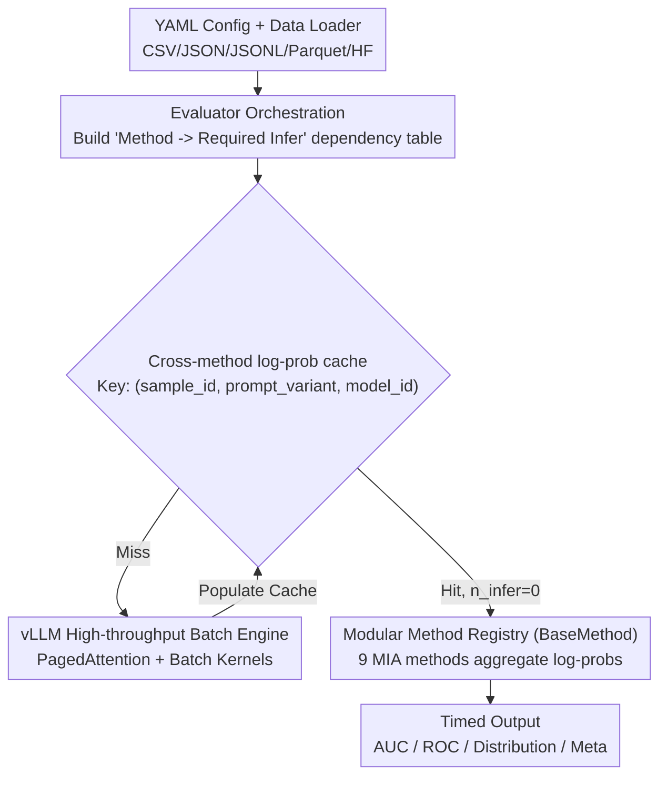

# Fast-MIA: Efficient and Scalable Membership Inference for LLMs

**Conference**: ACL 2026  
**arXiv**: [2510.23074](https://arxiv.org/abs/2510.23074)  
**Code**: https://github.com/Nikkei/fast-mia (Available)  
**Area**: LLM Security / Privacy / Membership Inference Attacks / Evaluation Tools  
**Keywords**: Membership Inference, vLLM, Cross-method Caching, WikiMIA, MIMIR

## TL;DR
Fast-MIA integrates 9 mainstream LLM Membership Inference Attack (MIA) methods into a single vLLM batch inference engine with a cross-method log-prob cache layer. This setup accelerates evaluation by approximately $5\times$ overall (with SaMIA alone achieving $19.5\times$) on LLaMA-30B / WikiMIA while maintaining nearly identical AUC, making large-scale MIA auditing computationally feasible for the first time.

## Background & Motivation
**Background**: LLMs memorizing training data poses risks regarding privacy leaks, copyright infringement, and benchmark contamination. MIA (Membership Inference Attack) is the standard auditing tool for these risks: given a model $f$ and a sample $x$, determine if $x$ was in the training set. Various methods exist, including LOSS, Min-K% Prob, DC-PDD, ReCaLL, Con-ReCaLL, PAC, and SaMIA.

**Limitations of Prior Work**: 1) New methods are increasingly "heavy"—text-perturbation methods (ReCaLL/Con-ReCaLL) require multiple prefix passes per sample, while black-box methods (SaMIA) require multiple sampling generations. Puerto et al. demonstrated that MIA is truly useful only when scaled to dataset-level aggregation, raising the computational barrier. 2) Existing implementations are independent; methods like LOSS, Min-K%, and DC-PDD share the same log-probs but redundantly recalculate them. 3) Existing toolkits (e.g., LLM-Sanitize) are either unmaintained or lack caching.

**Key Challenge**: MIA evaluation is the triple product of "heavy computation $\times$ multiple methods $\times$ large-scale datasets." Existing implementations process the last two dimensions linearly, making them inefficient. A unified framework is needed to share intermediate results at the system layer and utilize vLLM for full-throughput inference.

**Goal**: Develop an open-source Python library where a common sweep of "same model $\times$ same data $\times$ multiple MIA methods" requires only a single pass of inference.

**Key Insight**: The authors noted a "shared substrate" in MIA methods—most token-distribution/text-alternation methods essentially perform different aggregations or comparisons on $\log p(c_t \mid c_{1..t-1})$. By caching token-level log-probs per sample once, the "first inference pass" becomes free for almost all methods.

**Core Idea**: vLLM high-throughput batch inference + cross-method log-prob caching + modular method registration. Users can run 9 types of MIA via unified YAML configurations.

## Method

### Overall Architecture
Fast-MIA is a YAML-config-driven evaluation library comprising six components: (1) Data Loader supporting CSV, JSON, JSONL, Parquet, and HF formats; (2) Model Loader for HF models or LoRA adapters via vLLM (supporting quantization); (3) Evaluator to trigger on-demand inference, maintain cache, and call methods; (4) MIA Method Registry using a `BaseMethod` base class; (5) YAML Config Interface for declarative model/data/method/sampling definitions; (6) Output generator for timestamped directories containing metrics, ROC, score distributions, and metadata. The Evaluator checks the cache based on the "inference type required" by a method; if missed, it executes via the vLLM backend and populates the cache; finally, methods aggregate cached log-probs into scores.

### Key Designs

**1. vLLM High-throughput Batch Backend: Replacing serial inference with industrial-grade batch kernels**
Original MIA implementations typically use HF Transformers to process samples one-by-one, where `generate` offers little throughput benefit beyond batching. Fast-MIA adopts vLLM: its PagedAttention stores KV cache in pages and uses dynamic batching, allowing prompts from hundreds of samples to be processed in a shared pool. Two adaptations were made: for methods like LOSS/Min-K/DC-PDD requiring only prompt log-probs, `max_tokens=1, prompt_logprobs=0` is used to calculate all token-level log-probs at once. For multi-generation methods like SaMIA, the original "per-sample loop + multiple generations" is rewritten as vLLM batched multi-output generation. This yields an overall $5\times$ speedup, and $19.5\times$ for generation-heavy SaMIA.

**2. Cross-method log-prob caching: Single inference for all methods sharing log-probs**
The authors identified a redundancy missed by older toolkits: PPL/zlib, various Min-K% variants, and DC-PDD mathematically share the same $\log p(c_t \mid c_{1..t-1})$. Running Min-K% for $K \in \{0.1, 0.2, 0.3, 0.5, 0.8, 1.0\}$ usually involves six redundant inference passes. Fast-MIA builds a dependency table in the Evaluator, caching I/O using the $(\text{sample\_id}, \text{prompt\_variant}, \text{model\_id})$ triplet. LOSS, PPL/zlib, all Min-K%-$K$, and DC-PDD share the original text log-prob. Lowercase triggers a new key, while ReCaLL/Con-ReCaLL trigger prefix-version keys. Upon a cache hit, $n_\text{infer}=0$. This reduces complexity from $O(\text{methods} \times \text{samples})$ to $O(\text{unique prompt variants} \times \text{samples})$.

**3. Modular Method Registration + Multilingual Support: Enabling rapid community contributions**
MIA is evolving rapidly. Fast-MIA abstracts inference calls, cache usage, and scoring into a `BaseMethod` base class. New methods only need to implement `process_output` and `run` and register in `factory.py`. Additionally, a `space_delimited_language` flag is provided for languages like Chinese or Japanese that do not use space-based tokenization, acknowledging that MIA trends in such languages differ from English.

### Loss & Training
No training is required; all methods are inference-only. Evaluation metrics include AUC, FPR@95 (FPR at 95% TPR), and TPR@5 (TPR at 5% FPR), with the latter two focusing on low-FPR performance as suggested by Carlini (2022).

## Key Experimental Results

### Main Results
LLaMA-30B, WikiMIA, token length=32, NVIDIA A100 80GB, Left = Fast-MIA / Right = HF Transformers:

| Method | AUC (FM / Tr) | Time (FM / Tr) | Gain | FPR@95 |
|------|---------------|----------------|------|--------|
| LOSS | 69.4 / 69.4 | 12s / 57s | ×4.75 | 84.3 / 84.3 |
| Min-K% Prob (K=0.2) | 69.3 / 69.3 | 12s / 57s | ×4.75 | 82.3 / 82.3 |
| DC-PDD | 67.4 / 67.4 | 12s / 57s | ×4.75 | 84.8 / 84.8 |
| Lowercase | 64.1 / 64.1 | 25s / 1m59s | ×4.76 | 83.5 / 83.8 |
| PAC | 73.3 / 73.4 | 1m17s / 6m24s | ×4.99 | 82.3 / 77.9 |
| ReCaLL | 90.7 / 90.3 | 55s / 2m10s | ×2.36 | 28.5 / 34.7 |
| Con-ReCaLL | 96.8 / 96.1 | 1m53s / 3m30s | ×1.86 | 10.8 / 12.9 |
| SaMIA | 65.5 / 64.5 | 2h3m / 40h10m | **×19.5** | 90.5 / 90.7 |

AUC remains nearly identical (zero difference for baseline/distribution types; $<1$ point fluctuation for sampling types due to randomness).

### Ablation Study
vLLM-only acceleration vs. Full Cache vs. HF baseline (excluding SaMIA):

| Config | Total Time | Total Inferences | Description |
|------|--------|------------|------|
| Fast-MIA w/ cache | **3m54s** | **10** | Full solution |
| Fast-MIA w/o cache | 5m18s | 17 | vLLM acceleration only |
| Transformers (per-paper impl) | 17m51s | 17 | Original baseline |

The breakdown shows: vLLM batching reduces 17m51s to 5m18s ($\approx 3.4\times$ system-level speedup), and cross-method caching reduces 17 inferences to 10, shortening 5m18s to 3m54s ($\approx 1.4\times$ algorithm-level speedup). The end-to-end gain is $\approx 4.6\times$.

### Key Findings
- **PPL/zlib, Min-K% (0.1..1.0), and DC-PDD take 0 seconds upon cache hit** — these five major methods share the same original log-probs as LOSS, flattening both hyperparameter and method sweep dimensions.
- **SaMIA shows the highest acceleration (19.5x)** by replacing serial loops of "5 generations per sample" with vLLM batched multi-output—generation-heavy methods benefit far more than prompt-only methods.
- **AUC loss is negligible**, proving speedups stem from system/caching optimizations rather than numerical approximations.

## Highlights & Insights
- The "cross-method cache" concept reduces MIA evaluation from $O(\text{methods} \times \text{samples})$ to $O(\text{unique prompt variants} \times \text{samples})$. This gain is amplified during hyperparameter sweeps, providing a transferable trick for all evaluation libraries.
- Using vLLM instead of HF Transformers for evaluation is an engineering reality often ignored; Fast-MIA proves this step is a "free lunch."
- Single YAML files provide a blueprint for experiments, including automated timestamped outputs and metadata, offering a reasonable baseline tool for an area prone to reproducibility crises.

## Limitations & Future Work
- Method coverage is currently 9 types; dataset-level MIA (e.g., Maini, Puerto) is not yet integrated.
- Model support depends on the vLLM backend, excluding encoder-only or encoder-decoder models; closed-source APIs are theoretically feasible only for black-box methods.
- Evaluation was limited to 1 model $\times$ 1 dataset $\times$ 1 length; acceleration results might fluctuate across different model scales, context lengths, or hardware configurations.
- Custom metrics and reports still require main loop code modifications, which will be migrated to YAML in the future.

## Related Work & Insights
- **vs LLM-Sanitize (Ravaut 2025)**: Also a multi-method toolkit, but locked to vLLM 0.3.3 and unmaintained since 2024; Fast-MIA uses vLLM 0.15.1 and explicit cross-method caching.
- **vs MIMIR (Duan 2024) / Privacy Meter (Murakonda 2020)**: These are research projects with batch implementations but lack vLLM and cache integration; Fast-MIA incorporates them as reference implementations.
- **vs Chen 2025 Survey**: That paper provided the most comprehensive comparison but lacked open-source code; Fast-MIA makes that comparison matrix actionable.

## Rating
- Novelty: ⭐⭐⭐ Primarily engineering integration without new attacks or metrics, but cross-method caching is a novel contribution.
- Experimental Thoroughness: ⭐⭐⭐ Sufficient to prove speedup, but lacks scaling curves across diverse backbones/datasets.
- Writing Quality: ⭐⭐⭐⭐ Table 1 clearly contrasts toolkit capabilities; YAML examples are copy-paste ready.
- Value: ⭐⭐⭐⭐⭐ A rare "5x faster out of the box" utility that provides immediate benefits to the MIA and data contamination auditing community.

<!-- RELATED:START -->

## Related Papers

- [\[ICLR 2026\] Tab-MIA: A Benchmark Dataset for Membership Inference Attacks on Tabular Data in LLMs](../../ICLR2026/llm_safety/tab-mia_a_benchmark_dataset_for_membership_inference_attacks_on_tabular_data_in_.md)
- [\[ACL 2026\] Membership Inference Attacks on In-Context Learning Recommendation](membership_inference_attacks_on_llm-based_recommender_systems.md)
- [\[ICLR 2026\] Information-Theoretic Membership Inference for Granular Quantification of Memorization](../../ICLR2026/llm_safety/information-theoretic_membership_inference_for_granular_quantification_of_memori.md)
- [\[ACL 2026\] Do Multimodal RAG Systems Leak Data? A Comprehensive Evaluation of Membership Inference and Image Caption Retrieval Attacks](do_multimodal_rag_systems_leak_data_a_comprehensive_evaluation_of_membership_inf.md)
- [\[ACL 2026\] Subject-level Inference for Realistic Text Anonymization Evaluation](subject-level_inference_for_realistic_text_anonymization_evaluation.md)

<!-- RELATED:END -->
