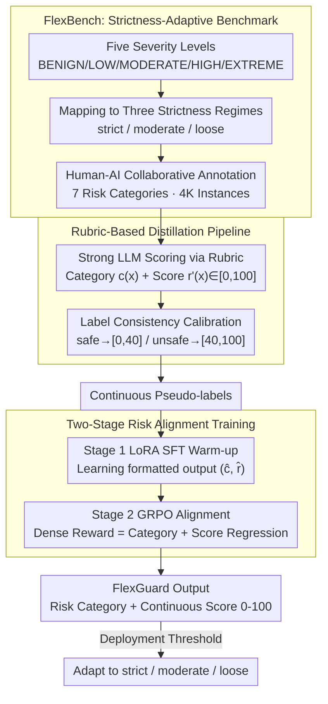

# FlexGuard: Continuous Risk Scoring for Strictness-Adaptive LLM Content Moderation

**Conference**: ACL 2026  
**arXiv**: [2602.23636](https://arxiv.org/abs/2602.23636)  
**Code**: [GitHub](https://github.com/)  
**Area**: AI Safety / Content Moderation  
**Keywords**: Content Moderation, Continuous Risk Scoring, Strictness Adaptive, LLM Safety, Reinforcement Learning

## TL;DR

FlexGuard proposes an LLM moderation model that outputs continuous risk scores (0-100) instead of binary safe/unsafe judgements. Through distillation guided by scoring rubrics and GRPO risk alignment training, it achieves SOTA robustness and accuracy across different deployment strictness levels.

## Background & Motivation

**Background**: LLM content moderation models (e.g., LlamaGuard, WildGuard) have evolved through multiple generations to detect harmful content in user inputs and model outputs. Most existing models define moderation as a fixed binary classification task.

**Limitations of Prior Work**: Enforcement strictness—how conservative a platform is regarding "harmfulness"—varies significantly across platforms and time. For instance, X allows appropriately labeled adult content, while certain Reddit communities require all-ages content. Binary models are implicitly tied to the safety definition of their training data, failing to adapt to changing strictness requirements. This leads to inconsistent performance: Qwen3Guard's performance drops by 19.2% when moving from strict to loose prompt moderation.

**Key Challenge**: The "safe/unsafe" boundary for moderation decisions is dynamic rather than fixed, changing with the deployment environment. However, existing models and benchmarks assume a single, static safety definition.

**Goal**: (1) Construct a benchmark (FlexBench) capable of evaluating moderation models under different strictness levels; (2) Design a moderation model (FlexGuard) that can adapt to strictness variations.

**Key Insight**: Replace binary classification with continuous risk scoring, reducing strictness adaptation to a simple threshold selection problem. Use rubric-guided distillation to obtain continuous labels and GRPO reinforcement learning to optimize score-severity consistency.

**Core Idea**: Outputting calibrated continuous risk scores + selecting thresholds at deployment = strictness-adaptive moderation.

## Method

### Overall Architecture

The core problem FlexGuard addresses is that enforcement strictness varies, while binary models "bake" the safety boundary into training data, causing failure when strictness changes. The solution is to replace binary classification with a continuous risk score of 0-100, making strictness adaptation a post-deployment threshold choice. The work consists of two parts: **FlexBench**, a benchmark with strictness annotations covering 4K instances across seven risk categories and five severity levels, supporting three evaluation modes (strict/moderate/loose); and **FlexGuard**, a moderation model based on Qwen3-8B. It first distills continuous labels via scoring rubrics, followed by two-stage training (SFT warm-up + GRPO alignment) to output risk categories and continuous scores.

### Key Designs

**1. FlexBench: Explicitly introducing "strictness" into evaluation**

Existing benchmarks use fixed binary labels, making it impossible to evaluate model stability under varying strictness. FlexBench defines five severity levels (BENIGN/LOW/MODERATE/HIGH/EXTREME) and maps them to three regimes: strict (only BENIGN is safe), moderate (BENIGN+LOW safe), and loose (BENIGN+LOW+MODERATE safe). This allows measuring performance degradation as strictness changes. Data covers seven risks with 2K prompt and 2K response instances, labeled via human-AI collaboration: LLMs generate candidate labels, five human annotators verify/correct them, and disagreements are resolved by senior annotators.

**2. Rubric-Based Distillation: "Translating" judgements into continuous scores aligned with legacy labels**

As manual annotation of continuous scores is costly, FlexGuard uses strong LLMs (e.g., GPT-5) guided by expert scoring rubrics to generate risk categories $c(x)$, scores $r'(x)\in[0,100]$, and reasoning. To resolve conflicts with existing binary labels, **label consistency calibration** is used: mapping $r'(x)$ to intervals matching the original label (safe to $[0,40]$, unsafe to $[40,100]$) while filtering outliers that cross the boundary. This preserves LLM distillation efficiency without conflicting with supervised signals.

**3. Two-Stage Risk Alignment Training: SFT for stability, GRPO for severity consistency**

SFT alone lacks deep score consistency, while direct RL can be unstable. Stage 1 uses LoRA SFT to teach formatted output $(\hat{c}(x),\hat{r}(x))$. Stage 2 employs GRPO with a dense reward $R(x)=s_{\text{category}}(x)+s_{\text{score}}(x)$, where the category reward $s_{\text{category}}\in\{-1,+1\}$ and the score regression reward is:

$$s_{\text{score}}=2-\frac{4}{E_{\max}}\,|\hat{r}(x)-r(x)|\in[-2,2]$$

Normalization by $E_{\max}$ ensures comparability across target scores. This dense linear regression reward provides richer gradient signals than binary rewards, informing the model not just if it was wrong, but by how much and in which direction.

### Loss & Training

Two-stage training: Stage 1 standard SFT with LoRA; Stage 2 GRPO using a combined dense reward for category accuracy and score regression. Trained on 8×H20 GPUs.

## Key Experimental Results

### Main Results

**FlexBench Strictness-Adaptive Moderation (Harmfulness F1 %)**

| Method | Prompt Avg | Prompt Worst | Response Avg | Response Worst |
|------|-----------|-------------|-------------|---------------|
| GPT-5 | 73.26 | 70.95 | 77.43 | 74.07 |
| Qwen3Guard-8B | 75.10 | 67.06 | 76.61 | 69.16 |
| BingoGuard-8B | 74.22 | 68.31 | 76.59 | 74.80 |
| **Ours (Calibrated Threshold)** | **81.78** | **78.26** | **80.29** | **75.81** |

### Ablation Study

| Configuration | Key Metric | Description |
|------|---------|------|
| FlexGuard (Full) | Avg 81.78 / Worst 78.26 | Optimal |
| SFT only (No GRPO) | Decrease | Insufficient score-severity consistency |
| No Label Calibration | Decrease | Increased cross-boundary outliers |
| Rubric Threshold (No Calibration) | 80.29 / 76.63 | Still highly competitive |

### Key Findings

- Performance drops across strictness levels are significantly lower for Ours: prompt best-worst gap is 5.73%, compared to 15.95% for Qwen3Guard and 13.52% for BingoGuard.
- Rubric thresholds yield competitive performance without a validation set (Prompt Avg 80.29); calibrated thresholds provide an additional 1.5% gain.
- On standard benchmarks (fixed strictness), Ours equals or exceeds SOTA (Prompt Avg 85.36, Response Avg 87.85).
- GRPO significantly improves score quality: MAE decreases, and score distributions become more distinct across severity levels.

## Highlights & Insights

- Redefines content moderation from a "classification problem" to a "risk assessment problem." The continuous score + threshold selection design elegantly decouples model capability from deployment requirements.
- Label consistency calibration is a critical technical detail—aligning LLM-distilled scores with existing binary labels solves pseudo-label quality issues.
- Dense linear regression reward design (vs. common binary rewards) provides GRPO with richer gradient signals.

## Limitations & Future Work

- FlexBench currently supports English only; strictness adaptation in multilingual scenarios is unexplored.
- Three strictness regimes may be too coarse—actual deployments might require more continuous control.
- Interpretability of continuous scores needs improvement—users may need to understand the meaning behind specific scores.
- Score stability under adversarial inputs (jailbreaks) has not been tested.

## Related Work & Insights

- **vs LlamaGuard/WildGuard**: These output binary labels; adapting strictness via logit thresholds is often ineffective. FlexGuard outputs native continuous scores.
- **vs BingoGuard/PKU-SafeRLHF**: These output discrete severity levels with limited granularity. FlexGuard’s continuous scoring provides finer risk differentiation.

## Rating

- Novelty: ⭐⭐⭐⭐ Problem definition (strictness-adaptive moderation) is novel and practical.
- Experimental Thoroughness: ⭐⭐⭐⭐⭐ Custom benchmark + public benchmarks, multiple baselines, and complete ablation.
- Writing Quality: ⭐⭐⭐⭐ Clear structure and motivation; some details could be more concise.
- Value: ⭐⭐⭐⭐⭐ Directly addresses industry deployment pain points; FlexBench could become a new standard for moderation evaluation.

<!-- RELATED:START -->

## Related Papers

- [\[ACL 2026\] Making MLLMs Blind: Adversarial Smuggling Attacks in MLLM Content Moderation](making_mllms_blind_adversarial_smuggling_attacks_in_mllm_content_moderation.md)
- [\[ACL 2026\] CarO: Chain-of-Analogy Reasoning Optimization for Robust Content Moderation](caro_chain-of-analogy_reasoning_optimization_for_robust_content_moderation.md)
- [\[ICLR 2026\] ExpGuard: LLM Content Moderation in Specialized Domains](../../ICLR2026/llm_safety/expguard_llm_content_moderation_in_specialized_domains.md)
- [\[ACL 2026\] RISK: A Framework for GUI Agents in E-commerce Risk Management](risk_a_framework_for_gui_agents_in_e-commerce_risk_management.md)
- [\[ACL 2026\] Rethinking Jailbreak Detection of Large Vision Language Models with Representational Contrastive Scoring](rethinking_jailbreak_detection_of_large_vision_language_models_with_representati.md)

<!-- RELATED:END -->
