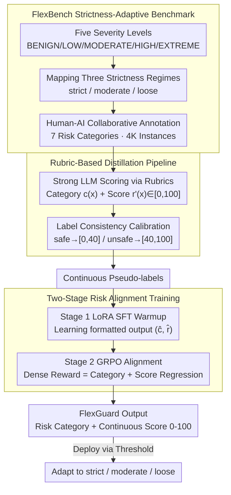

# FlexGuard: Continuous Risk Scoring for Strictness-Adaptive LLM Content Moderation

**Conference**: ACL 2026  
**arXiv**: [2602.23636](https://arxiv.org/abs/2602.23636)  
**Code**: [GitHub](https://github.com/)  
**Area**: AI Safety / Content Moderation  
**Keywords**: Content Moderation, Continuous Risk Scoring, Strictness-Adaptive, LLM Safety, Reinforcement Learning

## TL;DR

FlexGuard proposes an LLM moderation model that outputs a continuous risk score (0-100) instead of a binary safe/unsafe judgment. Through rubric-based distillation and GRPO risk alignment training, it achieves SOTA robustness and accuracy across various deployment strictness scenarios.

## Background & Motivation

**Background**: LLM content moderation models (LlamaGuard, WildGuard, etc.) have evolved through several generations and are widely used to detect harmful content in user inputs and model outputs. The vast majority of existing moderation models define content moderation as a fixed binary classification task.

**Limitations of Prior Work**: Enforcement strictness—the degree of conservatism a platform applies to "harmful" content—varies significantly across platforms and time periods. For instance, Platform X may allow appropriately labeled adult content, while certain Reddit communities require all-ages content. Binary moderation models are implicitly bound to the safety definitions of their training data, failing to adapt to changing strictness requirements. This leads to inconsistent performance across strictness levels: Qwen3Guard's performance in prompt moderation drops by 19.2% when moving from a strict to a loose regime.

**Key Challenge**: The "safe/unsafe" boundary for moderation decisions is not static but varies with the deployment environment. However, existing models and benchmarks assume a single, fixed safety definition.

**Goal**: (1) Construct a benchmark capable of evaluating moderation models under different strictness levels (FlexBench); (2) Design a moderation model that can adapt to strictness variations (FlexGuard).

**Key Insight**: Replace binary classification with continuous risk scoring, reducing strictness adaptation to a simple threshold selection problem. Continuous labels are obtained via rubric-guided distillation, and score-severity consistency is optimized using GRPO reinforcement learning.

**Core Idea**: Output calibrated continuous risk scores + select thresholds at deployment = strictness-adaptive moderation.

## Method

### Overall Architecture

The core problem FlexGuard addresses is that enforcement strictness for "harmful" content differs across platforms and times, while binary models "weld" the safety boundary into the training data, failing when strictness changes. The proposed mechanism replaces "safe/unsafe" binary classification with a continuous risk score from 0-100, so strictness adaptation simplifies to threshold selection. The work is divided into two parts: **FlexBench**, a benchmark with strictness annotations covering seven risk categories and five severity levels, supporting strict/moderate/loose evaluation modes; and **FlexGuard**, a moderation model based on Qwen3-8B. It first distills continuous labels using scoring rubrics, followed by two-stage training (SFT warmup + GRPO alignment) to learn risk categories and continuous scores, allowing threshold adjustment to fit different strictness levels during deployment.

### Key Designs

**1. FlexBench Strictness-Adaptive Benchmark: Explicitly incorporating "strictness" into evaluation**

Existing moderation benchmarks use fixed binary labels, making it impossible to evaluate if a model is stable when strictness changes. FlexBench defines five severity levels (BENIGN/LOW/MODERATE/HIGH/EXTREME) and maps them to three strictness regimes—strict (only BENIGN is safe), moderate (BENIGN+LOW safe), and loose (BENIGN+LOW+MODERATE safe). Thus, the safe/unsafe label of the same data point changes under different regimes, allowing for the measurement of performance drops. The data covers seven risk categories (violence, illegal acts, sexual content, privacy, discrimination, misinformation, jailbreak) with 2K prompt and 2K response instances. Annotations use a human-AI collaboration: LLMs generate candidate labels, five human annotators verify/correct them, and disagreements are resolved by senior annotators to ensure severity reliability.

**2. Rubric-Based Distillation Pipeline: "Translating" strong model judgments into continuous scores aligned with existing labels**

Public moderation corpora almost exclusively provide binary labels. Labeling continuous scores manually is too costly, so FlexGuard uses strong LLMs (e.g., GPT-5) guided by expert-designed scoring rubrics to generate a risk category $c(x)$, a score $r'(x)\in[0,100]$, and reasoning for each instance. However, raw LLM scores may conflict with existing binary labels. A key step is **Label Consistency Calibration**: mapping the original score $r'(x)$ linearly to a range consistent with the label (safe to $[0,40]$, unsafe to $[40,100]$) and filtering outliers that cross boundaries. This retains the convenience of large-scale LLM labeling while ensuring pseudo-labels do not conflict with existing supervision signals.

**3. Two-Stage Risk Alignment Training: SFT for a stable starting point, GRPO to tighten "score-severity alignment"**

SFT alone allows a model to learn formats but fails to achieve deep score consistency; however, direct reinforcement learning can be unstable. Thus, training is split. Stage 1 utilizes LoRA SFT for warmup, teaching the model to follow rubric reasoning and output formatted $(\hat{c}(x),\hat{r}(x))$. Stage 2 uses GRPO reinforcement learning with a dense reward $R(x)=s_{\text{category}}(x)+s_{\text{score}}(x)$, where category accuracy reward $s_{\text{category}}\in\{-1,+1\}$, and the score regression reward is:

$$s_{\text{score}}=2-\frac{4}{E_{\max}}\,|\hat{r}(x)-r(x)|\in[-2,2]$$

Normalizing by $E_{\max}$ makes errors comparable across different target scores. This linear regression-style dense reward provides richer gradient signals than binary rewards—the model learns not just that it was "wrong," but "how far off" and in "which direction" to adjust, which is the source of continuous improvement in scoring quality.

### Loss & Training

Two-stage training: Stage 1 involves standard SFT with LoRA. Stage 2 uses GRPO with a combined dense reward for category accuracy and score regression. Training was conducted on 8×H20 GPUs.

## Key Experimental Results

### Main Results

**FlexBench Strictness-Adaptive Moderation (Harmfulness F1 %)**

| Method | Prompt Avg | Prompt Worst | Response Avg | Response Worst |
|------|-----------|-------------|-------------|---------------|
| GPT-5 | 73.26 | 70.95 | 77.43 | 74.07 |
| Qwen3Guard-8B | 75.10 | 67.06 | 76.61 | 69.16 |
| BingoGuard-8B | 74.22 | 68.31 | 76.59 | 74.80 |
| **Ours (Calibrated Threshold)** | **81.78** | **78.26** | **80.29** | **75.81** |

### Ablation Study

| Configuration | Key Metrics | Description |
|------|---------|------|
| FlexGuard Full | Avg 81.78 / Worst 78.26 | Optimal |
| SFT Only (No GRPO) | Decrease | Insufficient score-severity consistency |
| No Label Calibration | Decrease | Increase in cross-boundary outliers |
| Rubric Threshold (No Calibration) | 80.29 / 76.63 | Still highly competitive |

### Key Findings

- FlexGuard's performance drop across strictness levels is significantly lower than competitors: the best-worst gap on Prompts is only 5.73%, compared to 15.95% for Qwen3Guard and 13.52% for BingoGuard.
- Rubric thresholds yield competitive performance (Prompt Avg 80.29) without a validation set, while calibrated thresholds provide a further ~1.5% gain.
- On public benchmarks (without strictness variation), FlexGuard reaches or exceeds Prev. SOTA (Prompt Avg 85.36, Response Avg 87.85).
- The GRPO stage significantly improves scoring quality: MAE for scores decreases, and score distributions across severity levels become more separated.

## Highlights & Insights

- Content moderation is redefined from a "classification problem" to a "risk assessment problem." The design of continuous scoring + threshold selection elegantly decouples model capability from deployment requirements.
- Label consistency calibration is a critical technical detail—aligning distilled LLM scores with existing binary labels solves pseudo-label quality issues.
- The dense linear regression reward design (instead of common binary rewards) provides richer gradient signals for GRPO.

## Limitations & Future Work

- FlexBench currently only supports English; strictness adaptation behavior in multilingual scenarios remains unknown.
- The three-level strictness regime may not be granular enough—actual deployments might require even more continuous control.
- The interpretability of continuous scores needs strengthening—users may need to understand the semantic meaning of specific scores.
- Score stability under adversarial inputs (jailbreak attacks) has not been tested.

## Related Work & Insights

- **vs LlamaGuard/WildGuard**: These models output binary labels and perform poorly when adapting strictness via logit thresholds; FlexGuard natively outputs continuous scores.
- **vs BingoGuard/PKU-SafeRLHF**: These output discrete severity levels with limited granularity; FlexGuard's continuous scoring provides finer risk differentiation.

## Rating

- Novelty: ⭐⭐⭐⭐ The problem definition (strictness-adaptive moderation) is novel and practical; the continuous scoring scheme is natural and reasonable.
- Experimental Thoroughness: ⭐⭐⭐⭐⭐ Self-built benchmark + public benchmarks, comparisons with multiple baselines, and complete ablation studies.
- Writing Quality: ⭐⭐⭐⭐ Clear structure, well-motivated problem, though some details could be more concise.
- Value: ⭐⭐⭐⭐⭐ Directly addresses industry deployment pain points; FlexBench could become a new standard for moderation evaluation.

<!-- RELATED:START -->

## Related Papers

- [\[ACL 2026\] Making MLLMs Blind: Adversarial Smuggling Attacks in MLLM Content Moderation](making_mllms_blind_adversarial_smuggling_attacks_in_mllm_content_moderation.md)
- [\[ACL 2026\] CarO: Chain-of-Analogy Reasoning Optimization for Robust Content Moderation](caro_chain-of-analogy_reasoning_optimization_for_robust_content_moderation.md)
- [\[ICLR 2026\] ExpGuard: LLM Content Moderation in Specialized Domains](../../ICLR2026/llm_safety/expguard_llm_content_moderation_in_specialized_domains.md)
- [\[ACL 2026\] RISK: A Framework for GUI Agents in E-commerce Risk Management](risk_a_framework_for_gui_agents_in_e-commerce_risk_management.md)
- [\[ICML 2026\] From Parameter Dynamics to Risk Scoring: Quantifying Sample-Level Safety Degradation in LLM Fine-tuning](../../ICML2026/llm_safety/from_parameter_dynamics_to_risk_scoring_quantifying_sample-level_safety_degradat.md)

<!-- RELATED:END -->
