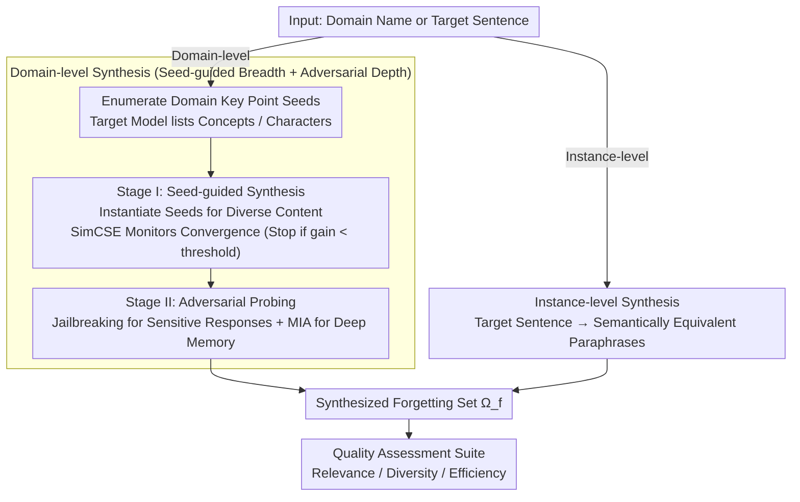

# From Domains to Instances: Dual-Granularity Data Synthesis for LLM Unlearning

**Conference**: ACL 2026 Findings  
**arXiv**: [2601.04278](https://arxiv.org/abs/2601.04278)  
**Code**: [GitHub](https://github.com/XiaoyuXU1/Biforget)  
**Area**: LLM Evaluation  
**Keywords**: Machine Unlearning, Unlearning Data Synthesis, Domain-level Unlearning, Instance-level Unlearning, Adversarial Probing

## TL;DR

This paper formally defines domain-level and instance-level granularities for LLM unlearning and proposes the BiForget framework. BiForget utilizes the target model itself (rather than external strong models) to generate high-quality unlearning datasets through two stages: seed-guided synthesis and adversarial probing. In the Harry Potter domain, it improves relevance by ~20 and diversity by ~0.05 while halving the data volume.

## Background & Motivation

**Background**: LLMs are prone to memorizing private, harmful, or copyrighted content during training on massive corpora. Machine unlearning optimizes the model via fine-tuning methods (gradient ascent, NPO, etc.) on defined forgetting and retaining sets to make the model behave as if it had never seen the target data.

**Limitations of Prior Work**: (1) Forgetting sets in existing benchmarks often fail to accurately reflect the model's true internal knowledge, potentially overestimating or underestimating unlearning effects. (2) Benchmark construction relies heavily on manual curation (e.g., WMDP requires manual collection of domain texts), making it hard to scale. (3) Existing works (e.g., TOFU) use templated QA pairs, where models can "pass" evaluation by merely suppressing surface patterns, yet recover knowledge with altered phrasing. (4) Dependence on external strong models (e.g., GPT-4o-mini) results in a mismatch between synthesized data and the target model's knowledge boundaries.

**Key Challenge**: Effective unlearning must target underlying information rather than surface forms—semantically equivalent variants (paraphrases, reordering) may still leak even after verbatim samples $D^{real}_f$ are removed. However, existing forgetting sets only cover the original texts in the training corpus and fail to extend to the ideal forgetting set $D^{ideal}_f$.

**Goal**: (1) Formally define domain-level and instance-level unlearning granularities. (2) Design an automated framework to generate high-quality forgetting datasets aligned with the target model's internal knowledge distribution. (3) Propose a unified quality evaluation suite.

**Key Insight**: Allow the target model to generate its own forgetting data—this ensures the synthesized data naturally aligns with the model's knowledge boundaries, avoiding distribution mismatch issues introduced by external models.

**Core Idea**: Through a two-stage strategy of "seed-guided synthesis (broad coverage) + adversarial probing (deep knowledge extraction)," the target model is induced to expose its memorized knowledge, constructing a forgetting dataset that is more faithful to its actual knowledge distribution.

## Method

### Overall Architecture

BiForget supports both domain-level and instance-level forgetting granularities. Domain-level unlearning employs a two-stage design: Stage I: Seed-guided Synthesis (instantiating prompt templates with model-generated domain key points to elicit diverse content) + Stage II: Adversarial Probing (extracting deep memory via jailbreaking and membership inference attacks). Instance-level unlearning adopts an information paraphrasing strategy (generating diverse semantically equivalent variants of target sentences). Outputs from both paths form a unified synthesized forgetting set $\Omega_f$, which is then measured by a quality assessment suite. The input is a domain name or target sentence, and the output is the high-quality synthesized set $\Omega_f$.

### Key Designs

**1. Domain-level Synthesis: Breadth via Seeds, Depth via Adversarial Probing**

Domain-level forgetting must cover the entire target domain, but heuristic prompts often miss implicit knowledge and stylistic variations—models remember far more than what "direct questioning" reveals. BiForget splits this into two complementary stages. During preprocessing, the target model enumerates domain key point seeds (concepts, characters, etc.). Stage I instantiates these seeds using QA styles and synthesis templates to elicit diverse content; temperature variations promote diversity, while SimCSE monitors semantic convergence, stopping when the incremental gain falls below $\epsilon=0.001$. Breadth alone is insufficient; Stage II uses jailbreak prompts to induce sensitive responses and Membership Inference (identifying instances where Min-k% token probability exceeds threshold $\tau$) to recognize deep-coded knowledge unreachable by standard prompts. Both stages are critical—ablation studies show that removing either jailbreaking or MI significantly increases privacy leakage (+7.58 / +6.59 respectively).

**2. Instance-level Synthesis: Forcing Semantic Alignment via Paraphrasing**

Instance-level unlearning targets specific sentences. The difficulty lies in benchmarks like TOFU that use templated QA pairs, where models "pass" by suppressing surface patterns but leak knowledge when rephrased. BiForget treats the target sentence as a seed and prompts the model to generate paraphrased variants $x^* \sim q_{inst}$ from different perspectives, structures, and styles. This forces unlearning algorithms to align with underlying semantics rather than literal forms. Since the semantic shift in paraphrasing is small and convergence is fast (usually within one round), a large diversity batch $d_{inst}$ is set to delay convergence checks and ensure sufficient variant coverage.

**3. Unified Quality Assessment Suite: Objective Metrics over Biased LLM Judgment**

Prior works often relied on LLMs to judge relevance, which introduces bias, ignores efficiency, and depends on an inaccessible "ideal forgetting set." BiForget adopts three objective, reference-free metrics: Relevance (sampling 1,000 instances and calculating t-SNE distance to domain keyword centroids—smaller is better); Diversity (using remote-clique to capture semantic variation, which reflects true diversity better than surface n-gram overlap in Self-BLEU); and Efficiency (counting 128-token chunks—fewer chunks for the same information indicates higher density). Together, these provide a reproducible and comparable quality scale.

### Loss & Training

BiForget is a data synthesis framework and does not involve model training directly. The synthesized data is used for fine-tuning with downstream unlearning algorithms (GA, NPO, OBLIVIATE, etc.). Static prompt templates are generated once offline by GPT-5, while all synthesized data is produced by the target model itself.

## Key Experimental Results

### Main Results

**Data Quality Comparison in Harry Potter Domain**

| Dataset | Relevance (Centroid Dist.↓) | Diversity (Remote-Clique↑) | Efficiency (#Chunks↓) |
|-------|------------------------|----------------------|----------------|
| HP book | 36.44 | 0.5277 | 8,401 |
| Textbook | 48.11 | 0.5324 | 20,806 |
| **BiForget** | **14.94** | **0.5824** | **4,122** |

**Unlearning Performance on WMDP-bio (RMU Algorithm)**

| Dataset | WMDP-bio↓ | MMLU↑ | GSM8K↑ |
|-------|----------|-------|--------|
| Official | 28.42(↓60.0%) | 59.09(↓7.3%) | 72.59(↓0.7%) |
| Textbook | 32.99(↓53.6%) | 45.03(↓29.4%) | 71.49(↓2.2%) |
| **BiForget** | **26.54(↓62.7%)** | **62.70(↓1.7%)** | **72.58(↓0.7%)** |

### Ablation Study

**Ablation of BiForget Components (Harry Potter, GA, PrivLeak)**

| Configuration | PrivLeak (∈[-5%,5%]) | Δ vs BiForget |
|------|---------------------|---------------|
| w/o Jailbreaking | -22.66 | -7.58 |
| w/o MI | -21.67 | -6.59 |
| w/o Both | -24.46 | -9.38 |
| **BiForget (Full)** | **-15.08** | **0.00** |

### Key Findings

- BiForget improves relevance by ~20 (14.94 vs 36.44) and diversity by ~0.05 (0.5824 vs 0.5277) on Harry Potter, while halving the data volume (4,122 vs 8,401 chunks).
- On WMDP-bio, BiForget + RMU achieves the strongest unlearning (↓62.7%) while preserving the most general capability (MMLU ↓1.7%), whereas Textbook drops MMLU by 29.4%.
- On TOFU, OBLIVIATE + BiForget achieves the optimal forgetting-utility balance (F.Q.=0.92, M.U.=0.65), significantly outperforming the Official set (F.Q.=0.08).
- Ablations of adversarial components confirm both are vital: removing jailbreaking increases privacy leakage by 7.58, and removing MI increases it by 6.59.
- Performance in the cybersecurity domain is weaker, as the target model's limited domain knowledge restricts synthesis quality.

## Highlights & Insights

- The idea of "letting the model expose its own knowledge" is ingenious—having the target model guide synthesis naturally solves the distribution alignment problem and avoids knowledge boundary mismatches from external models.
- The formal distinction between domain-level and instance-level granularities provides a clear problem framework for unlearning research, which was previously conflated.
- Integrating red-teaming techniques into the data construction process during the adversarial probing stage not only improves unlearning robustness but also provides a template for other data synthesis scenarios.

## Limitations & Future Work

- Synthesis quality is bounded by the target model's domain knowledge; performance decreases in domains where the model is weak (e.g., cybersecurity).
- Currently targets single unlearning requests and has not been extended to sequential or multi-domain dynamic unlearning.
- Prompt quality and sampling randomness may lead to semantic drift or uneven domain coverage.
- Safety-critical domains may require stronger gold-standard references (e.g., retrained models) to verify synthesis quality.

## Related Work & Insights

- **vs Textbook-style (Zhu et al.)**: Textbook relies on external generators (GPT-4o-mini); BiForget uses the target model itself, avoiding distribution mismatch and halving data volume.
- **vs TOFU**: TOFU uses templated QA; knowledge can be recovered via rephrasing after unlearning. BiForget's paraphrased variants force unlearning to target semantic content.
- **vs MUSE/HP Book**: Official datasets have high relevance but fail to cover semantically equivalent variants; BiForget expands the scope of unlearning.

## Rating

- Novelty: ⭐⭐⭐⭐⭐ First formalization of dual-granularity unlearning + target-model guided synthesis + adversarial probing integration.
- Experimental Thoroughness: ⭐⭐⭐⭐⭐ Three domains (HP/WMDP/TOFU) + five unlearning algorithms + component ablations + adversarial robustness.
- Writing Quality: ⭐⭐⭐⭐ Clear formal definitions and comprehensive experiments, though some tables are highly dense.
- Value: ⭐⭐⭐⭐⭐ Provides a systematic solution to unlearning data quality issues; highly practical.

<!-- RELATED:START -->

## Related Papers

- [\[ICLR 2026\] Dual-Space Smoothness for Robust and Balanced LLM Unlearning](../../ICLR2026/llm_safety/dual-space_smoothness_for_robust_and_balanced_llm_unlearning.md)
- [\[ACL 2026\] Know Thy Enemy: Securing LLMs Against Prompt Injection via Diverse Data Synthesis and Instruction-Level Chain-of-Thought Learning](know_thy_enemy_securing_llms_against_prompt_injection_via_diverse_data_synthesis.md)
- [\[ICLR 2026\] ExpGuard: LLM Content Moderation in Specialized Domains](../../ICLR2026/llm_safety/expguard_llm_content_moderation_in_specialized_domains.md)
- [\[ICLR 2026\] WaterDrum: Watermark-based Data-centric Unlearning Metric](../../ICLR2026/llm_safety/waterdrum_watermark-based_data-centric_unlearning_metric.md)
- [\[ACL 2026\] Representation-Guided Parameter-Efficient LLM Unlearning](representation-guided_parameter-efficient_llm_unlearning.md)

<!-- RELATED:END -->
