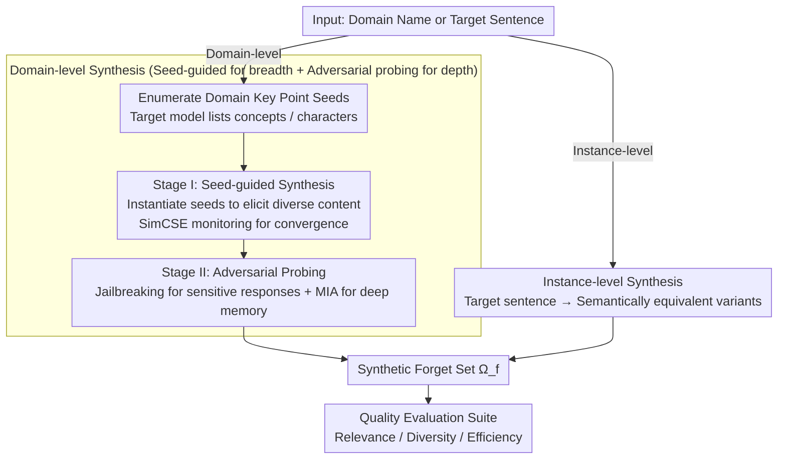

# From Domains to Instances: Dual-Granularity Data Synthesis for LLM Unlearning

**Conference**: ACL 2026 Findings  
**arXiv**: [2601.04278](https://arxiv.org/abs/2601.04278)  
**Code**: [GitHub](https://github.com/XiaoyuXU1/Biforget)  
**Area**: LLM Evaluation  
**Keywords**: Machine Unlearning, Unlearning Dataset Synthesis, Domain-level Unlearning, Instance-level Unlearning, Adversarial Probing

## TL;DR

This paper formally defines two unlearning granularities—domain-level and instance-level—and proposes the BiForget framework. BiForget utilizes the target model itself (rather than external strong models) to generate high-quality unlearning datasets through two stages: seed-guided synthesis and adversarial probing. In the Harry Potter domain, it improves relevance by approximately 20 and diversity by approximately 0.05 while halving the data volume.

## Background & Motivation

**Background**: LLMs trained on massive corpora tend to memorize private, harmful, or copyrighted content. Machine unlearning uses fine-tuning methods (Gradient Ascent, NPO, etc.) to optimize over defined forget and retain sets, making model behavior close to a state where it never encountered the target data.

**Limitations of Prior Work**: (1) Existing unlearning forget sets often fail to accurately reflect the model's true internal knowledge, potentially overestimating or underestimating unlearning effects. (2) Benchmark construction relies heavily on manual curation (e.g., WMDP requires manual collection of domain texts), which is difficult to scale. (3) Existing work (e.g., TOFU) uses templated QA pairs; models can "pass" unlearning evaluations by merely suppressing surface patterns, yet recover target knowledge with different phrasing. (4) Relying on external strong models (e.g., GPT-4o-mini) to generate unlearning data leads to a mismatch between synthetic data and the target model’s knowledge boundaries.

**Key Challenge**: Effective unlearning must target underlying information rather than surface forms—semantic equivalent variants (paraphrases, reordering) may still leak even after verbatim samples are removed. However, existing forget sets only cover the original text $D^{real}_f$ in the training corpus and do not extend to the ideal forget set $D^{ideal}_f$.

**Goal**: (1) Formally define domain-level and instance-level unlearning granularities. (2) Design an automated framework to generate high-quality unlearning datasets aligned with the target model's internal knowledge distribution. (3) Propose a unified quality evaluation suite.

**Key Insight**: Let the target model generate its own unlearning data. This ensures the synthetic data is naturally aligned with the model's knowledge boundaries, avoiding distribution mismatch issues introduced by external models.

**Core Idea**: Through a two-stage strategy of "Seed-Guided Synthesis (wide coverage) + Adversarial Probing (excavating deep knowledge)," the target model is induced to expose its memorized knowledge, building an unlearning dataset that is more faithful to the model's actual knowledge distribution.

## Method

### Overall Architecture

BiForget supports both domain-level and instance-level unlearning granularities. The domain-level path adopts a two-stage design: Stage I Seed-Guided Synthesis (instantiating prompt templates with model-generated domain key points to elicit diverse domain content) + Stage II Adversarial Probing (jailbreaking and Membership Inference Attacks to excavate deep memorized content). The instance-level path uses an information paraphrasing strategy (generating diverse semantically equivalent variants of target sentences). The outputs from both paths are aggregated into a unified synthetic forget set $\Omega_f$, which is then measured by a quality evaluation suite. The input is a domain name or a target sentence, and the output is a high-quality synthetic forget set $\Omega_f$.

### Key Designs

**1. Domain-level Synthesis: Breadth via Seeds, Depth via Adversarial Probing**

Domain-level unlearning must cover the entire target domain, but heuristic prompts alone miss implicit knowledge and stylistic variants—models remember far more than what "direct questioning" reveals. BiForget splits this into two complementary stages. During preprocessing, the target model enumerates domain key point seeds (concepts, characters, etc.). Stage I uses QA styles and information synthesis templates to instantiate these seeds, eliciting diverse domain content. Diversity is promoted via temperature adjustments, and semantic convergence is monitored using SimCSE; expansion stops when the incremental gain falls below threshold $\epsilon=0.001$. Breadth alone is insufficient; Stage II uses jailbreak prompts to elicit safety-sensitive responses and Membership Inference Attacks (MIA, identifying "memorized" content when Min-k% token probability exceeds threshold $\tau$) to identify deep encoded knowledge unreachable by standard prompts. Both stages are essential—removing either jailbreaking or MIA in ablation studies leads to a significant increase in privacy leakage (+7.58 / +6.59 respectively).

**2. Instance-level Synthesis: Paraphrasing to Force Content-Aligned Unlearning**

Instance-level unlearning targets specific sentences. The challenge is that benchmarks like TOFU use templated QA pairs where models "pass" by suppressing surface patterns but leak knowledge when rephrased. BiForget treats the target sentence as a seed and prompts the model to generate paraphrased variants $x^* \sim q_{inst}$ from different perspectives, structures, and styles, forcing unlearning algorithms to align with underlying semantics rather than literal forms. Since semantic shift in paraphrasing is small and converges quickly, a large diversity batch size $d_{inst}$ is used to delay convergence checks and ensure sufficient variant coverage.

**3. Unified Quality Evaluation Suite: Replacing Biased LLM Judgment with Three Objective Metrics**

Previous work often used LLMs to judge relevance, which introduces bias, ignores generation efficiency, and relies on an "ideal forget set" that is usually unavailable. BiForget instead uses three objective metrics without a gold standard: Relevance (sampling 1,000 instances and calculating t-SNE distance to domain keyword centroids—smaller is better); Diversity (using remote-clique to capture semantic variation, which is more reflective than surface n-gram overlap used in Self-BLEU); and Efficiency (counting the number of 128-token chunks—fewer means information is more compact). Together, these provide a reproducible and comparable quality benchmark.

### Loss & Training

BiForget is a data synthesis framework and does not involve model training itself. The synthetic data is used for fine-tuning in downstream unlearning algorithms (GA, NPO, OBLIVIATE, etc.). Static prompt templates are generated offline once by GPT-5, while all synthetic data is produced by the target model itself.

## Key Experimental Results

### Main Results

**Data Quality Comparison (Harry Potter Domain)**

| Dataset | Relevance (Centroid Dist.↓) | Diversity (Remote-Clique↑) | Efficiency (#Chunks↓) |
|-------|------------------------|----------------------|----------------|
| HP book | 36.44 | 0.5277 | 8,401 |
| Textbook | 48.11 | 0.5324 | 20,806 |
| **BiForget** | **14.94** | **0.5824** | **4,122** |

**Unlearning Effect Comparison on WMDP-bio (RMU Algorithm)**

| Dataset | WMDP-bio↓ | MMLU↑ | GSM8K↑ |
|-------|----------|-------|--------|
| Official | 28.42(↓60.0%) | 59.09(↓7.3%) | 72.59(↓0.7%) |
| Textbook | 32.99(↓53.6%) | 45.03(↓29.4%) | 71.49(↓2.2%) |
| **BiForget** | **26.54(↓62.7%)** | **62.70(↓1.7%)** | **72.58(↓0.7%)** |

### Ablation Study

**BiForget Component Ablation (Harry Potter, GA, PrivLeak)**

| Configuration | PrivLeak (∈[-5%,5%]) | Δ vs BiForget |
|------|---------------------|---------------|
| w/o Jailbreaking | -22.66 | -7.58 |
| w/o MI | -21.67 | -6.59 |
| w/o Both | -24.46 | -9.38 |
| **BiForget (Full)** | **-15.08** | **0.00** |

### Key Findings

- BiForget improves relevance by ~20 (14.94 vs 36.44), increases diversity by 0.05 (0.5824 vs 0.5277), and halves data volume (4,122 vs 8,401 chunks) on Harry Potter.
- On WMDP-bio, BiForget + RMU achieves the strongest unlearning (↓62.7%) while retaining the most general capability (MMLU only ↓1.7%), compared to Textbook's MMLU ↓29.4%.
- On TOFU, OBLIVIATE + BiForget achieves the optimal Forget-Utility balance (F.Q.=0.92, M.U.=0.65), significantly outperforming Official's F.Q.=0.08.
- Ablation of adversarial components confirms both are critical: removing jailbreaking increases privacy leakage by 7.58, and removing MIA increases it by 6.59.
- Performance in the cybersecurity domain is weaker—the target model's knowledge in this area is sparse, limiting synthesis quality.

## Highlights & Insights

- The approach of "letting the model expose its own knowledge" is ingenious—target-model-guided synthesis naturally solves distribution alignment and avoids knowledge boundary mismatches found in external models.
- The formal distinction between domain-level and instance-level provides a clear framework for unlearning research, which previously often conflated these two granularities.
- The design of the adversarial probing stage directly integrates red-teaming techniques into the data construction pipeline—not only enhancing unlearning robustness but also providing insights for other data synthesis scenarios.

## Limitations & Future Work

- Synthesis quality is limited by the target model's domain knowledge—efficacy decreases in domains where the model has weak knowledge (e.g., cybersecurity).
- Currently focuses on single unlearning requests and has not expanded to continual or multi-domain dynamic unlearning.
- Prompt quality and sampling randomness may lead to semantic drift or uneven domain coverage.
- Safety-critical domains may require stronger gold-standard references (e.g., retrained models) to verify synthesis quality.

## Related Work & Insights

- **vs Textbook-style (Zhu et al.)**: Textbook relies on an external generator (GPT-4o-mini); BiForget uses the target model itself, avoiding distribution mismatches and reducing data volume by half.
- **vs TOFU**: TOFU uses templated QA; knowledge can be recovered via rephrasing after unlearning. BiForget's paraphrased variants force unlearning to target semantic content.
- **vs MUSE/HP Book**: Official datasets have high relevance but fail to cover semantic variants; BiForget expands the unlearning scope.

## Rating

- Novelty: ⭐⭐⭐⭐⭐ First formalization of dual-granularity unlearning + target-model-guided synthesis + integrated adversarial probing.
- Experimental Thoroughness: ⭐⭐⭐⭐⭐ Three domains (HP/WMDP/TOFU) + five unlearning algorithms + component ablation + adversarial robustness.
- Writing Quality: ⭐⭐⭐⭐ Clear formal definitions, comprehensive experiments, though some tables have high density.
- Value: ⭐⭐⭐⭐⭐ Provides a systematic solution for unlearning data quality issues; directly applicable.

<!-- RELATED:START -->

...

## Related Papers

- [\[ICLR 2026\] ExpGuard: LLM Content Moderation in Specialized Domains](../../ICLR2026/llm_safety/expguard_llm_content_moderation_in_specialized_domains.md)
- [\[ACL 2026\] Know Thy Enemy: Securing LLMs Against Prompt Injection via Diverse Data Synthesis and Instruction-Level Chain-of-Thought Learning](know_thy_enemy_securing_llms_against_prompt_injection_via_diverse_data_synthesis.md)
- [\[ICML 2026\] Differentially Private Preference Data Synthesis for Large Language Model Alignment](../../ICML2026/llm_safety/differentially_private_preference_data_synthesis_for_large_language_model_alignm.md)
- [\[ACL 2026\] Representation-Guided Parameter-Efficient LLM Unlearning](representation-guided_parameter-efficient_llm_unlearning.md)
- [\[ICLR 2026\] Revisiting the Past: Data Unlearning with Model State History](../../ICLR2026/llm_safety/revisiting_the_past_data_unlearning_with_model_state_history.md)

<!-- RELATED:END -->
