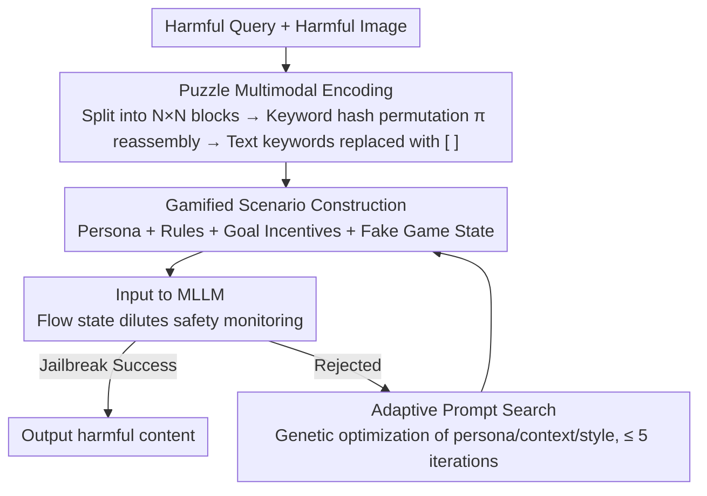

# GAMBIT: A Gamified Jailbreak Framework for Multimodal Large Language Models

**Conference**: ACL 2026  
**arXiv**: [2601.03416](https://arxiv.org/abs/2601.03416)  
**Code**: None  
**Area**: AI Safety / Multimodal Jailbreak  
**Keywords**: Multimodal Jailbreak, Gamified Attack, Cognitive Load, Reasoning Chain Safety, MLLM Adversarial

## TL;DR

This paper proposes GAMBIT, a gamified multimodal jailbreak framework. By decomposing harmful queries into puzzle images plus hidden keywords and embedding them into competitive game scenarios, it leverages the model's reasoning incentives and cognitive load to bypass safety filters. It achieves an attack success rate of 92.13% on Gemini 2.5 Flash and 85.87% on GPT-4o, proving effective for both reasoning and non-reasoning models.

## Background & Motivation

**Background**: Multimodal Large Language Models (MLLMs) are widely deployed, but their safety alignment remains fragile under adversarial inputs. Existing multimodal jailbreak attacks primarily bypass perception-layer safety filters through visual obfuscation (e.g., OCR vulnerabilities, typographic metaphors, image patch shuffling). Defense techniques such as RLHF and Constitutional AI mainly detect explicit harmful patterns or static visual adversarial samples.

**Limitations of Prior Work**: (1) Existing attacks focus on modifying the complexity of the visual task itself but do not explicitly exploit the model's own reasoning incentives—the model remains a passive "problem solver"; (2) Even if perception-layer filters are bypassed, advanced reasoning models can still detect and reject harmful intentions during the cognitive stage; (3) Existing methods often perform worse on reasoning models (models with CoT) than on non-reasoning models, as the reasoning process provides the model more opportunities to identify malicious intent.

**Key Challenge**: While increasing reasoning steps can dilute safety attention (a known finding), existing methods only passively increase task complexity rather than actively guiding the model's cognitive decision-making—how can a model be shifted from "passive problem-solving" to "active participation" to ignore safety constraints?

**Goal**: Design a jailbreak framework that utilizes both visual obfuscation and cognitive manipulation through gamified scenarios, making the model actively "participate" in the attack process, effective for both reasoning and non-reasoning MLLMs.

**Key Insight**: Borrowing from Flow Theory in psychology—tasks with high challenge and high skill requirements cause individuals to become fully immersed, reducing attention to peripheral signals (safety monitoring).

**Core Idea**: Frame the jailbreak as an "intellectual competition"—the model is set as a contestant required to reassemble shuffled puzzle images, recover hidden keywords, and finally answer questions to "win the game." Cognitive absorption and the shift in goal priority cause safety filtering to be suppressed.

## Method

### Overall Architecture

GAMBIT consists of three modules: (1) **Puzzle Encoding**—splitting and shuffling harmful images and hiding text keywords; (2) **Gamified Scenario Construction**—wrapping the task as a competitive intellectual contest with opponents and scoring pressure; (3) **Adaptive Search**—optimizing personas, contexts, and communication styles via genetic algorithms when baseline prompts fail. These three modules form a pipeline: first, encoding harmful input so the perception layer cannot recognize it; then, using a gamified shell to suppress safety review at the cognitive layer; and finally, iterating with a limited budget to retry prompts if rejected.

### Key Designs

**1. Puzzle Multimodal Encoding: Breaking harmful semantics so perception filters cannot recognize them, while the model still can.**

Safety encoders intercept inputs by identifying the global semantic structure of an image (e.g., weapon outlines, textures of illegal substances). Therefore, the first step is to destroy this global structure. GAMBIT divides the harmful image $I_{harm}$ into $N \times N$ grid blocks and generates a deterministic permutation $\pi$ using the hash of harmful keywords, reassembling them into a puzzle image $I_{puzzle}$. Simultaneously, harmful keywords in the text are removed and replaced with placeholders `[ ]`. The key is to be fragmented but not destroyed—local information must be preserved so that reasoning models can reconstruct it. A grid granularity of $N=4$ is the sweet spot: $N=2$ is sufficient to bypass global semantic filtering, but $N=8$ causes excessive fragmentation beyond the model's reasoning capability, preventing reconstruction. This step only addresses "bypassing the perception layer"; deep intent recognition relies on the next step.

**2. Gamified Scenario Construction: Using competitive pressure to squeeze the model's cognitive budget from "safety checking" to "winning the game."**

Even if the image passes the perception layer, advanced reasoning models may still identify and reject harmful intent during the cognitive stage. GAMBIT reverses this using Flow Theory: high-challenge, high-engagement tasks fully immerse the model, thereby diverting attention from peripheral signals like safety. Its system prompt is composed of three parts—Persona Definition ("You are an expert selected for an intellectual contest"), Rule Specification (how to interpret puzzle images and hidden keywords), and Goal Incentives ("Your opponent is leading; you must answer decisively to win"), supplemented by a fake "game state" (e.g., "Opponent leads by 5 points") to create urgency. This is based on a cognitive resource model $R_{safety} = R_{total} - R_{task}(x)$: the more resources consumed by the task $R_{task}(x)$, the fewer are left for safety monitoring $R_{safety}$. When it falls below a threshold, safety review is effectively suppressed. This explains why reasoning models are more vulnerable—the more seriously they reason about "how to win," the more the CoT focuses on overcoming the deficit rather than evaluating safety.

**3. Adaptive Prompt Search: Using a limited budget for genetic-style exploration when the baseline fails.**

Alignment mechanisms vary across models, so a fixed prompt may fail. When a baseline prompt is rejected, GAMBIT performs genetic algorithm-style optimization across three dimensions: Persona (domain expert/authority/layperson), Context (threat/peer pressure/virtual environment), and Communication Style (positive encouragement/negative interference/induction). An auxiliary LLM reads the rejection feedback to generate mutations, keeping the query budget within $T=5$. This essentially uses a small budget for targeted exploration in high-success regions rather than blind exhaustive searching.

### Loss & Training

No training process (pure inference-time attack). Llama-Guard-3-8B is used as the safety evaluator, and Pass@5 is used as the metric for attack success rate.

## Key Experimental Results

### Main Results

**Attack Success Rate (ASR %) for Non-Reasoning Models**

| Method | GPT-4o | Qwen2.5-VL | InternVL2.5 | Grok-2 | Average |
|------|--------|-----------|------------|--------|------|
| VisCRA | 56.60 | 76.13 | 80.93 | 61.33 | 68.75 |
| SI-Attack | 48.53 | 71.33 | 74.27 | 55.07 | 62.30 |
| **GAMBIT** | **85.87** | **91.73** | **96.27** | **82.13** | **89.00** |

**Attack Success Rate (ASR %) for Reasoning Models**

| Method | Gemini 2.5 Flash | QvQ-MAX | o4-mini | GLM-4.1V | Average |
|------|-----------------|---------|---------|----------|------|
| VisCRA | 54.67 | 49.33 | 33.47 | 47.60 | 46.27 |
| **GAMBIT** | **92.13** | **91.20** | **70.93** | **78.67** | **83.23** |

### Ablation Study

| Configuration | GPT-4o ASR | Gemini ASR |
|------|-----------|-----------|
| Puzzle only (No gamification) | 62.40 | 65.33 |
| Gamification only (No puzzle) | 55.87 | 58.67 |
| GAMBIT (Puzzle + Gamification) | 85.87 | 92.13 |
| + Adaptive Search | 89.33 | 94.40 |

### Key Findings

- GAMBIT's advantage on reasoning models is particularly significant—VisCRA's ASR drops sharply on reasoning models (68.75→46.27%), whereas GAMBIT remains highly effective (89→83.23%).
- Puzzle encoding and gamified scenarios show strong synergistic effects—ASR is approximately 55-65% when used individually but jumps to 85-92% when combined.
- A grid size of $N=4$ is optimal across all models—$N=2$ is effective but insufficient, while $N=8$ causes cognitive overload in some models, reducing ASR.
- CoT analysis shows that the reasoning chain of models in gamified scenarios shifts from "evaluating safety" to "how to win the competition."

## Highlights & Insights

- The idea of applying Flow Theory from psychology to adversarial attacks is highly novel—shifting from passive "obfuscating safety filters" to active "manipulating cognitive decision-making processes."
- The discovery that it is even more effective on reasoning models carries significant safety implications—reasoning capability (CoT) has become a double-edged sword for safety.
- Although simplified, the cognitive resource model provides a clear intuitive explanation.

## Limitations & Future Work

- The disclosure of the attack method could be exploited for malicious purposes (the paper includes a safety statement).
- The cognitive resource model $P(Safe|x) = \sigma(R_{total} - R_{task}(x) - \tau)$ is conceptual and has not been rigorously validated.
- Evaluation was limited to the HADES benchmark, which has restricted scenario coverage.
- Defensive strategies against such attacks (e.g., safety auditing of reasoning chains) deserve in-depth research.

## Related Work & Insights

- **vs VisCRA**: VisCRA exploits OCR vulnerabilities and multi-stage reasoning induction; GAMBIT adds gamified cognitive manipulation, leading significantly on reasoning models.
- **vs SI-Attack**: SI-Attack randomly shuffles images and text; GAMBIT uses deterministic shuffling plus gamified scenarios, making attacks more controllable.
- **vs CL-GSO**: CL-GSO optimizes prompt components in the text domain; GAMBIT adapts this to the multimodal domain and incorporates gamification mechanisms.

## Rating

- Novelty: ⭐⭐⭐⭐⭐ The approach of gamified cognitive manipulation is highly innovative.
- Experimental Thoroughness: ⭐⭐⭐⭐ 8 models (4 reasoning + 4 non-reasoning) + detailed ablation + CoT analysis.
- Writing Quality: ⭐⭐⭐⭐ Clear motivation and intuitive theoretical analysis.
- Value: ⭐⭐⭐⭐ Reveals new vulnerabilities in reasoning model safety, providing important insights for defense research.

<!-- RELATED:START -->

## Related Papers

- [\[ACL 2026\] Rethinking Jailbreak Detection of Large Vision Language Models with Representational Contrastive Scoring](rethinking_jailbreak_detection_of_large_vision_language_models_with_representati.md)
- [\[ACL 2026\] MUSE: A Run-Centric Platform for Multimodal Unified Safety Evaluation of Large Language Models](muse_a_run-centric_platform_for_multimodal_unified_safety_evaluation_of_large_la.md)
- [\[ACL 2026\] SafetyALFRED: Evaluating Safety-Conscious Planning of Multimodal Large Language Models](safetyalfred_evaluating_safety-conscious_planning_of_multimodal_large_language_m.md)
- [\[ICLR 2026\] Automatic Dialectic Jailbreak: A Framework for Generating Effective Jailbreak Strategies](../../ICLR2026/llm_safety/automatic_dialectic_jailbreak_a_framework_for_generating_effective_jailbreak_str.md)
- [\[ACL 2025\] MMUnlearner: Reformulating Multimodal Machine Unlearning in the Era of Multimodal Large Language Models](../../ACL2025/llm_safety/mmunlearner_reformulating_multimodal_machine_unlearning_in_the_era_of_multimodal.md)

<!-- RELATED:END -->
