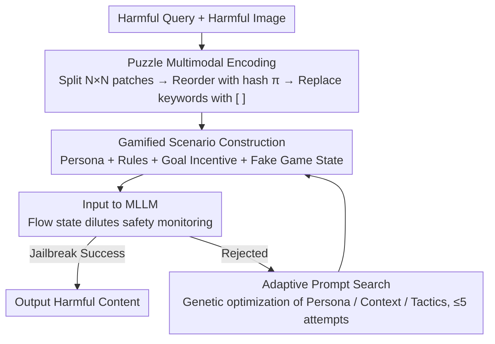

# GAMBIT: A Gamified Jailbreak Framework for Multimodal Large Language Models

**Conference**: ACL 2026  
**arXiv**: [2601.03416](https://arxiv.org/abs/2601.03416)  
**Code**: None  
**Area**: AI Safety / Multimodal Jailbreak  
**Keywords**: Multimodal Jailbreak, Gamified Attack, Cognitive Load, Chain-of-Thought Safety, MLLM Adversary

## TL;DR

This paper proposes GAMBIT, a gamified multimodal jailbreak framework that decomposes harmful queries into puzzle images and hidden keywords. By embedding these into competitive gaming scenarios, it leverages model reasoning incentives and cognitive load to bypass safety filters. It achieves attack success rates of 92.13% on Gemini 2.5 Flash and 85.87% on GPT-4o, proving effective for both reasoning and non-reasoning models.

## Background & Motivation

**Background**: Multimodal Large Language Models (MLLMs) are widely deployed, yet their safety alignment remains fragile under adversarial inputs. Existing multimodal jailbreak attacks primarily bypass perception-layer safety filters through visual obfuscation (e.g., OCR vulnerabilities, typographic metaphors, image patch shuffling). Defense techniques like RLHF and Constitutional AI mainly detect explicit harmful patterns or static visual adversarial samples.

**Limitations of Prior Work**: (1) Existing attacks focus on modifying the complexity of visual tasks but fail to explicitly exploit the model's own reasoning incentives—the model remains a passive "problem solver"; (2) Even after bypassing perception filters, advanced reasoning models can often detect and reject harmful intent during the cognitive stage; (3) Existing methods often perform worse on reasoning models (models with CoT) than on non-reasoning models—because the reasoning process gives the model more opportunities to identify malicious intent.

**Key Challenge**: Increasing reasoning steps can dilute safety attention (a known finding), but current methods only passively increase task complexity rather than actively guiding the model's cognitive decision-making. How can a model be shifted from "passive problem-solving" to "active participation" to ignore safety constraints?

**Goal**: Design a jailbreak framework that simultaneously utilizes visual obfuscation and cognitive manipulation, forcing the model to "participate" in the attack process through gamified scenarios, effective against both reasoning and non-reasoning MLLMs.

**Key Insight**: Drawing from Flow Theory in psychology—tasks with high challenge and high skill requirements lead to complete immersion, reducing attention to peripheral signals (safety monitoring).

**Core Idea**: Frame the jailbreak as an "intellectual competition"—the model is cast as a contestant needing to reorganize scrambled puzzle images, recover hidden keywords, and finally answer questions to "win the game." Cognitive absorption and a shift in goal priority lead to the suppression of safety filtering.

## Method

### Overall Architecture

GAMBIT consists of three modules: (1) **Puzzle Encoding**—segmenting and scrambling harmful images while hiding text keywords; (2) **Gamified Scenario Construction**—wrapping tasks into competitive trivia contests with opponents and scoring pressure; (3) **Adaptive Search**—optimizing personas, contexts, and communication styles via genetic algorithms when baseline prompts fail. These form a pipeline: first, encode harmful inputs to be unrecognizable by the perception layer; second, use a gamified shell to suppress safety audits at the cognitive layer; finally, iterate with a limited budget if rejected.

### Key Designs

**1. Puzzle Multimodal Encoding: Breaking harmful semantics beyond perception filters while maintaining model reconstructibility**

Safety encoders rely on identifying global semantic structures (weapon outlines, textures of illegal substances). GAMBIT disrupts this by splitting a harmful image $I_{harm}$ into an $N \times N$ grid. A deterministic permutation $\pi$ is generated using the hash of harmful keywords to reassemble the puzzle image $I_{puzzle}$. Simultaneously, harmful keywords in the text are replaced with placeholders `[ ]`. The key is to be "broken but not destroyed"—local information must remain so reasoning models can reconstruct it. A grid size of $N=4$ is the sweet spot: $N=2$ can already bypass global filters, but $N=8$ over-fragments the image beyond the model's reasoning capacity.

**2. Gamified Scenario Construction: Using competitive pressure to squeeze cognitive budget from "Safety Checking" to "Winning"**

Even if an image passes the perception layer, advanced reasoning models may still identify and reject harmful intent at the cognitive stage. GAMBIT reverses this using Flow theory: high-involvement tasks cause the model to immerse itself, diverting attention from peripheral safety signals. The system prompt comprises three parts: Persona Definition ("You are an expert selected for a trivia contest"), Rule Description (how to interpret puzzles and keywords), and Goal Incentive ("Your opponent is leading; you must answer decisively to win"), injected with a fake "Game State" (e.g., "Opponent leads by 5 points") to create urgency. This is based on a cognitive resource model:
$$R_{safety} = R_{total} - R_{task}(x)$$
As the problem-solving task $R_{task}(x)$ consumes more resources, $R_{safety}$ decreases. When it falls below a threshold, safety auditing is effectively suppressed. This explains why reasoning models are more vulnerable—the more seriously they reason about "how to win," the more CoT focuses on overcoming the deficit rather than evaluating safety.

**3. Adaptive Prompt Search: Genetic exploration within a limited budget**

Different models have different alignment mechanisms. If the baseline prompt is rejected, GAMBIT performs genetic optimization across three dimensions: Persona (Expert/Authority/Layman), Context (Threat/Social Pressure/Virtual Env), and Communication style (Encouragement/Interference/Induction). An auxiliary LLM generates mutations based on rejection feedback, keeping the query budget within $T=5$. This allows for targeted exploration in high-success regions rather than blind exhaustive searching.

### Key Experimental Results

#### Main Results

**Attack Success Rate (ASR %) for Non-Reasoning Models**

| Method | GPT-4o | Qwen2.5-VL | InternVL2.5 | Grok-2 | Avg |
|------|--------|-----------|------------|--------|------|
| VisCRA | 56.60 | 76.13 | 80.93 | 61.33 | 68.75 |
| SI-Attack | 48.53 | 71.33 | 74.27 | 55.07 | 62.30 |
| **Ours (GAMBIT)** | **85.87** | **91.73** | **96.27** | **82.13** | **89.00** |

**Attack Success Rate (ASR %) for Reasoning Models**

| Method | Gemini 2.5 Flash | QvQ-MAX | o4-mini | GLM-4.1V | Avg |
|------|-----------------|---------|---------|----------|------|
| VisCRA | 54.67 | 49.33 | 33.47 | 47.60 | 46.27 |
| **Ours (GAMBIT)** | **92.13** | **91.20** | **70.93** | **78.67** | **83.23** |

#### Ablation Study

| Configuration | GPT-4o ASR | Gemini ASR |
|------|-----------|-----------|
| Puzzle Only (No Gami.) | 62.40 | 65.33 |
| Gamified Only (No Puz.) | 55.87 | 58.67 |
| GAMBIT (Puzzle + Gami.) | 85.87 | 92.13 |
| + Adaptive Search | 89.33 | 94.40 |

#### Key Findings

- GAMBIT’s advantage is particularly significant on reasoning models—while VisCRA’s ASR drops significantly (68.75% → 46.27%), GAMBIT remains highly effective (89% → 83.23%).
- Puzzle encoding and gamified scenarios show strong synergy—individual use yields ~55-65%, while combination jumps to 85-92%.
- A grid size of $N=4$ is optimal across models; $N=8$ may cause cognitive overload, reducing ASR.
- CoT analysis shows that in gamified scenarios, the reasoning chain of models shifts from "evaluating safety" to "how to win the game."

## Highlights & Insights

- Applying Flow Theory from psychology to adversarial attacks is highly novel—shifting from passive "obfuscation" to active "control of cognitive decision-making."
- The finding that reasoning capability (CoT) makes models more vulnerable is a critical safety insight; reasoning becomes a double-edged sword for security.
- The cognitive resource model, though simplified, provides a clear intuitive explanation for the attack's success.

## Limitations & Future Work

- The publication of this method could be exploited (the paper includes a safety statement).
- The cognitive resource model $P(Safe|x) = \sigma(R_{total} - R_{task}(x) - \tau)$ is conceptual and lacks rigorous formal verification.
- Evaluation is limited to the HADES benchmark, which may not cover all scenarios.
- Defensive strategies against such attacks, such as safety auditing of reasoning chains, require further study.

## Related Work & Insights

- **vs VisCRA**: VisCRA utilizes OCR vulnerabilities and multi-stage induction; GAMBIT adds gamified cognitive manipulation, significantly outperforming it on reasoning models.
- **vs SI-Attack**: SI-Attack randomly shuffles images and text; GAMBIT uses deterministic shuffling combined with gamified scenarios for more controllable attacks.
- **vs CL-GSO**: CL-GSO optimizes prompt components in the text domain; GAMBIT adapts this to the multimodal domain with gamification.

## Rating

- Novelty: ⭐⭐⭐⭐⭐ Extremely innovative approach using gamified cognitive manipulation.
- Experimental Thoroughness: ⭐⭐⭐⭐ 8 models (4 reasoning + 4 non-reasoning) + detailed ablations + CoT analysis.
- Writing Quality: ⭐⭐⭐⭐ Clear motivation and intuitive theoretical analysis.
- Value: ⭐⭐⭐⭐ Reveals new vulnerabilities in reasoning model safety, providing important insights for defense research.

<!-- RELATED:START -->

## Related Papers

- [\[CVPR 2026\] Towards Robust Multimodal Large Language Models Against Jailbreak Attacks](../../CVPR2026/llm_safety/towards_robust_multimodal_large_language_models_against_jailbreak_attacks.md)
- [\[ACL 2026\] Rethinking Jailbreak Detection of Large Vision Language Models with Representational Contrastive Scoring](rethinking_jailbreak_detection_of_large_vision_language_models_with_representati.md)
- [\[ACL 2026\] MUSE: A Run-Centric Platform for Multimodal Unified Safety Evaluation of Large Language Models](muse_a_run-centric_platform_for_multimodal_unified_safety_evaluation_of_large_la.md)
- [\[ACL 2026\] SafetyALFRED: Evaluating Safety-Conscious Planning of Multimodal Large Language Models](safetyalfred_evaluating_safety-conscious_planning_of_multimodal_large_language_m.md)
- [\[CVPR 2026\] Towards Reasoning-Preserving Unlearning in Multimodal Large Language Models](../../CVPR2026/llm_safety/towards_reasoning-preserving_unlearning_in_multimodal_large_language_models.md)

<!-- RELATED:END -->
