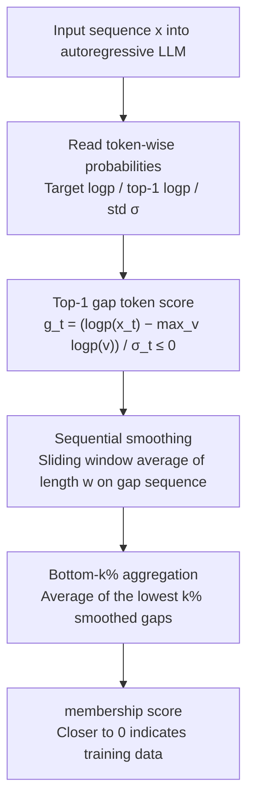

# Gap-K%: Measuring Top-1 Prediction Gap for Detecting Pretraining Data

**Conference**: ACL2026  
**arXiv**: [2601.19936](https://arxiv.org/abs/2601.19936)  
**Code**: https://github.com/meaoww/gap-k  
**Area**: LLM Safety / Pretraining Data Detection / Membership Inference  
**Keywords**: pretraining data detection, membership inference, Top-1 gap, Min-K%, sequential smoothing  

## TL;DR
This paper proposes Gap-K%, which utilizes the normalized log probability gap between the target token and the model's top-1 prediction, combined with sequential sliding window smoothing, to detect whether text appeared in LLM pretraining data. It outperforms baselines like Min-K%++ on WikiMIA, MIMIR, recent models, and under strong paraphrase attacks.

## Background & Motivation
**Background**: The pretraining corpora for large language models are typically not public. External researchers can only indirectly infer whether a piece of text was trained by examining model outputs. This issue pertains to privacy and copyright, as well as benchmark contamination: if a test set has entered the pretraining corpus, model evaluations will be overshot.

**Limitations of Prior Work**: Mainstream reference-free methods mostly utilize token likelihood. Min-K% focuses on the $k\%$ tokens with the lowest probability, and Min-K%++ performs distribution normalization on token log probabilities. However, these methods largely treat tokens as independent points and do not directly utilize the training dynamic signal of "whether the model's top-1 prediction equals the ground-truth token."

**Key Challenge**: The next-token objective of pretraining strongly penalizes cases where the model confidently predicts another token while the ground-truth token is different. Existing likelihood scores only look at the absolute probability of the ground-truth token, making it difficult to distinguish between "model uncertainty" and "confident but wrong model prediction." The former might just be natural language diversity, while the latter is stronger evidence for non-training data.

**Goal**: The authors aim to design a gray-box detection method that does not require a reference model and only needs access to token probabilities, capturing both top-1 confident mispredictions and the local correlation of adjacent tokens in text.

**Key Insight**: The paper analyzes this from the perspective of cross-entropy gradients: the gradient magnitude for non-target token logits is proportional to their probabilities. If the top-1 token is not the ground-truth, it generates the strongest suppression signal; this top-1 gap should be optimized to be smaller in training samples.

**Core Idea**: Use the "gap between the ground-truth token log probability and the top-1 log probability" of each token as a membership signal, aggregate adjacent tokens into local segments using a sliding window, and finally average the $k\%$ segments with the worst gaps, similar to Min-K%.

## Method
Gap-K% is a concise method that requires neither training a detector nor additional data distributions; it only reads the next-token probabilities of the target model for the input sequence. The key lies in replacing "low probability tokens" with "tokens far from the top-1 prediction" and converting token-level fluctuations into local segment-level signals.

### Overall Architecture
Given an autoregressive LLM $\mathcal{M}$ and a text sequence $\mathbf{x}=[x_1,\ldots,x_N]$, the task is to judge if $\mathbf{x}$ belongs to an unknown training set $\mathcal{D}$. The method calculates ground-truth token log probability, full-vocabulary top-1 log probability, and the standard deviation of the log probability distribution per token. A normalized top-1 gap sequence is obtained and smoothed using a sliding window of length $w$. Finally, the lowest $k\%$ smoothed gaps are selected and averaged to produce the membership score. A score closer to 0 indicates that even in the hardest-to-predict segments, the ground-truth tokens are close to the top-1 prediction, making it more likely to be training data.

### Key Designs

**1. Top-1 gap token score: Quantifying the signal of "confident model deviation"**

Min-K%++ only considers how much the ground-truth token log probability deviates from the mean, which fails to distinguish between two distinct scenarios: "a flat distribution where the model is inherently uncertain" and "a sharp distribution where the model is confident but wrong." The latter serves as strong evidence against membership—the pretraining objective heavily penalizes such confident mispredictions, so they should rarely occur in training samples. Gap-K% characterizes this deviation using the top-1: for each position $t$, it calculates $g_t=(\log p(x_t|x_{<t})-\max_{v\in V}\log p(v|x_{<t}))/\sigma_t$, where $\sigma_t$ is the standard deviation of the log probability distribution at that position. This value is always $\le 0$; values closer to 0 indicate the ground-truth is near top-1 (more like training data), while more negative values suggest the model confidently favored another token.

**2. Sequential smoothing: Aggregating noisy isolated tokens into continuous evidence**

The gap of a single token fluctuates significantly; an anomalous token might be a coincidence in natural language rather than evidence of non-training. However, LLM memorization typically occurs at the level of continuous phrases or segments rather than isolated tokens. Thus, if a sequence of adjacent tokens shows large gaps, it is more indicative of non-training text. The paper applies a sliding window average of length $w$ to the gap sequence: $\bar g_t^{(w)}=\frac{1}{w}\sum_{i=0}^{w-1}g_{t+i}$. The window size is tuned by model family: $w=6$ for LLaMA series and $w=3$ for others. Ablations show that smoothing with shuffled token order yields almost no gain, whereas preserving original order significantly improves performance, confirming the local continuity of membership signals.

**3. Bottom-k% aggregation: Focusing on the most discriminative segments**

Since discriminative power is concentrated in a few highly anomalous segments, averaging over the entire sequence would dilute the strong signal with many ordinary tokens. Following the logic of Min-K%, the paper selects the set of positions $\tilde{\mathcal{I}}_k(\mathbf{x})$ with the lowest $k\%$ smoothed gaps and averages only these for the final score:

$$\text{Gap-K}(\mathbf{x})=\frac{1}{|\tilde{\mathcal{I}}_k(\mathbf{x})|}\sum_{t\in\tilde{\mathcal{I}}_k(\mathbf{x})}\bar g_t^{(w)}$$

A score closer to 0 indicates that even in the most difficult segments, the ground-truth was close to top-1. For fair comparison with Min-K%++, $k=20\%$ is used by default.

### Loss & Training
Gap-K% itself requires no training and has no optimization loss. It is a reference-free, gray-box membership score that requires access to logits or token probabilities. AUROC is used as the primary metric in experiments, alongside TPR@5%FPR.

## Key Experimental Results

### Main Results

| Dataset / Setting | Metric | Gap-K% | Strongest Baseline | Gain |
|--------|------|------|----------|------|
| WikiMIA length 32 original | Avg AUROC | 77.8 | Min-K%++ 75.7 | +2.1 |
| WikiMIA length 32 paraphrased | Avg AUROC | 74.3 | Min-K%++ 73.4 | +0.9 |
| WikiMIA length 64 original | Avg AUROC | 78.4 | Min-K%++ 75.8 | +2.6 |
| WikiMIA length 64 paraphrased | Avg AUROC | 71.2 | Min-K%++ 68.9 | +2.3 |
| WikiMIA length 128 original | Avg AUROC | 77.4 | Min-K%++ 74.8 | +2.6 |
| WikiMIA length 128 paraphrased | Avg AUROC | 70.6 | Min-K%++ 68.6 | +2.0 |
| MIMIR average, Pythia-12B | AUROC | 57.3 | Min-K%++ 57.1 | Slight lead in difficult setting |
| WikiMIA-25, LLaMA 3.1 8B | AUROC | 84.1 | Min-K%++ 82.7 | Effective on recent models |
| WikiMIA-25, LLaMA 3.1 8B Instruct | AUROC | 76.6 | Min-K%++ 73.1 | Effective after instruction tuning |
| DIPPER paraphrase attack | AUROC | 66.6 | Min-K%++ 65.5 | Best under strong paraphrase |

### Ablation Study

| Configuration | Key Metric | Description |
|------|---------|------|
| No smoothing | AUROC 72.3 | Uses raw token gaps; high volatility |
| Shuffled-order smoothing | AUROC 72.9 | Smoothing after shuffling tokens yields minimal gain |
| Sequential smoothing | AUROC 74.8 | Original order significantly improves performance |
| Min-K%++ | AUROC 72.6 | Standard mean-normalized likelihood baseline |
| + Top-1 only | AUROC 72.3 | Swapping to top-1 gap alone is insufficient |
| + Smoothing only | AUROC 73.8 | Smoothing also benefits Min-K%++ |
| Gap-K% full | AUROC 74.8 | Combination of top-1 gap and sequential smoothing is most effective |

### Key Findings
- On WikiMIA, Gap-K% consistently outperforms Min-K%++ for both original and paraphrased inputs, showing the top-1 gap captures signals preserved even after rewriting.
- In the TPR@5%FPR metric, gains are more pronounced: improvements of 7.1%, 7.9%, and 3.0% over Min-K%++ on WikiMIA original at lengths 32, 64, and 128 respectively.
- Sensitivity analysis for $k$ shows performance peaks near $k=15\%$, but Gap-K% remains superior across the $5\%-50\%$ range.
- Non-training data displays more tokens with large gaps (e.g., gap $> \tau=3$), supporting the core hypothesis.

## Highlights & Insights
- **Explanation via Training Gradients**: Rather than just another heuristic, the paper explains the detection signal via cross-entropy gradients, showing that top-1 errors are heavily penalized during training.
- **Distinguishing Uncertainty from Confident Errors**: When ground-truth probabilities are low, Min-K%++ might assign similar scores; Gap-K% specifically penalizes sharp distributions favoring the wrong token, which is strong non-membership evidence.
- **Smoothing點 signals into 域 signals**: Converting signals from isolated tokens to sequential segments aligns with the intuition that models memorize phrases/segments rather than individual tokens.
- **Plug-and-play**: The method only requires logits and no reference models, making it a direct and lightweight replacement for Min-K%++.

## Limitations & Future Work
- The method requires gray-box access to token-level probabilities or logits, which are often unavailable via commercial APIs.
- While it covers LLaMA 3.1 and Gemma2, it has not been verified on models at the hundreds of billions parameters scale.
- DIPPER is a strong attack, but not yet a detector-aware adaptive attack. An attacker might optimize text to manipulate top-1 gaps specifically.
- Absolute AUROC on MIMIR remains low, suggesting that when training and non-training distributions are highly similar, likelihood-based signals reach a performance ceiling.

## Related Work & Insights
- **vs Min-K%**: Min-K% averages low-probability tokens without distribution calibration or considering top-1 distance. Gap-K% focuses on the gap to the mode.
- **vs Min-K%++**: Min-K%++ normalizes likelihood via mean/std. Gap-K% replaces the mean with the top-1 prediction, directly addressing the "confident error" penalty hypothesis.
- **vs Reference-based MIA**: Reference-based methods require training similar models, which is costly and difficult for closed pretraining data. Gap-K% remains reference-free with lower deployment barriers.

## Rating
- Novelty: ⭐⭐⭐⭐☆ Clean replacement of the core signal in the Min-K family with a solid training dynamic explanation.
- Experimental Thoroughness: ⭐⭐⭐⭐☆ Extensive coverage of WikiMIA, MIMIR, and paraphrases, though lacks adaptive attack analysis.
- Writing Quality: ⭐⭐⭐⭐☆ Clear mapping between formulas and intuition.
- Value: ⭐⭐⭐⭐☆ Highly practical for pretraining data detection and copyright auditing as a lightweight gray-box baseline.

<!-- RELATED:START -->

## Related Papers

- [\[ICML 2026\] Beyond Procedure: Substantive Fairness in Conformal Prediction](../../ICML2026/llm_safety/beyond_procedure_substantive_fairness_in_conformal_prediction.md)
- [\[AAAI 2026\] Ghost in the Transformer: Detecting Model Reuse with Invariant Spectral Signatures](../../AAAI2026/llm_safety/ghost_in_the_transformer_detecting_model_reuse_with_invariant_spectral_signature.md)
- [\[ACL 2026\] Detecting RAG Extraction Attack via Dual-Path Runtime Integrity Game](detecting_rag_extraction_attack_via_dual-path_runtime_integrity_game.md)
- [\[AAAI 2026\] Uncovering Pretraining Code in LLMs: A Syntax-Aware Attribution Approach](../../AAAI2026/llm_safety/uncovering_pretraining_code_in_llms_a_syntax-aware_attribution_approach.md)
- [\[ICLR 2026\] When Priors Backfire: On the Vulnerability of Unlearnable Examples to Pretraining](../../ICLR2026/llm_safety/when_priors_backfire_on_the_vulnerability_of_unlearnable_examples_to_pretraining.md)

<!-- RELATED:END -->
