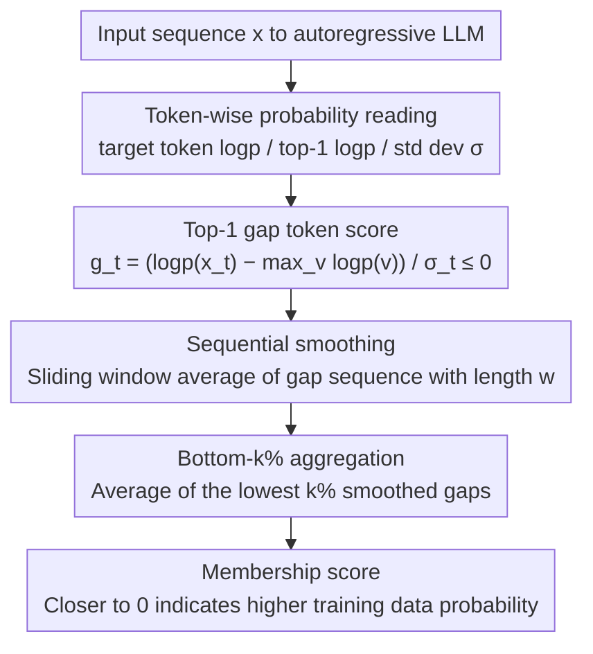

# Gap-K%: Measuring Top-1 Prediction Gap for Detecting Pretraining Data

**Conference**: ACL 2026  
**arXiv**: [2601.19936](https://arxiv.org/abs/2601.19936)  
**Code**: https://github.com/meaoww/gap-k  
**Area**: LLM Security / Pretraining Data Detection / Membership Inference  
**Keywords**: Pretraining data detection, Membership inference, Top-1 gap, Min-K%, Sequential smoothing  

## TL;DR
This paper proposes Gap-K%, which uses the normalized log probability gap between the target token and the model's top-1 prediction, combined with sequential sliding window smoothing, to detect whether text appeared in the LLM pretraining data. It outperforms baselines like Min-K%++ on WikiMIA, MIMIR, recent models, and under strong paraphrase attacks.

## Background & Motivation
**Background**: The pretraining corpora of large language models are typically not public. External researchers can only indirectly infer whether a piece of text was used for training through model outputs. This issue pertains to privacy and copyright, as well as benchmark contamination: if a test set has entered the pretraining corpus, model capability assessments will be overestimated.

**Limitations of Prior Work**: Most mainstream reference-free methods utilize token likelihood. Min-K% focuses on the $k\%$ tokens with the lowest probabilities; Min-K%++ performs distribution normalization on token log probabilities. However, these methods essentially treat tokens as independent points and do not directly utilize the training dynamic signal of "whether the model's top-1 prediction equals the ground truth token."

**Key Challenge**: The next-token objective in pretraining strongly punishes cases where "the model identifies another token with high confidence, but the ground truth token is different." Existing likelihood scores only consider the absolute probability of the ground truth token, making it difficult to distinguish between "model uncertainty" and "confident but incorrect." The former may simply be natural language diversity, while the latter is stronger evidence against the text being training data.

**Goal**: The authors aim to design a reference-free, gray-box detection method that requires only token probability access. The method should capture top-1 confident mispredictions and utilize the local correlation of adjacent tokens in the text.

**Key Insight**: Starting from the cross-entropy gradient analysis, the magnitude of the logit gradient for non-target tokens is proportional to their probability. If the top-1 token is not the ground truth, it generates the strongest signal to be suppressed; in training samples, this top-1 gap should be optimized to be smaller.

**Core Idea**: Use the "gap between the ground truth token log probability and the top-1 log probability" for each token as the membership signal. Aggregate consecutive segments using a sliding window, and finally, take the average of the $k\%$ regions with the worst gaps, following the Min-K% approach.

## Method
The Gap-K% method is straightforward: it does not require training a detector or an additional data distribution. it only reads the next-token probability for each position in the input sequence from the target model. The key lies in replacing "low probability tokens" with "tokens far from the top-1 prediction" and transforming token-level fluctuations into local segment-level signals.

### Overall Architecture
Given an autoregressive LLM $\mathcal{M}$ and a text sequence $\mathbf{x}=[x_1,\ldots,x_N]$, the task is to determine if $\mathbf{x}$ belongs to the unknown training set $\mathcal{D}$. The method calculates the target token log probability, the full-vocabulary top-1 log probability, and the log probability distribution standard deviation for each token. It then derives a normalized top-1 gap sequence and applies a sliding window average of length $w$. Finally, it selects the lowest $k\%$ smoothed gaps and uses their average as the membership score. A score closer to 0 indicates that even in the most difficult segments, the ground truth tokens are close to the model's top-1 predictions, suggesting a higher likelihood of being training data.

### Key Designs

**1. Top-1 gap token score: Quantifying confident deviation as a token-level signal**

Min-K%++ only observes how far the ground truth token log probability deviates from the mean, which fails to distinguish between two distinct scenarios: one where the "entire distribution is flat and the model is inherently uncertain," and another where the "top-1 is extremely sharp and the model is confident, but it bet on the wrong token." The latter serves as strong evidence against membership—the next-token objective punishes such confident mispredictions, making them rare in training samples. Gap-K% characterizes this deviation using the top-1: for each position $t$, it calculates $g_t=(\log p(x_t|x_{<t})-\max_{v\in V}\log p(v|x_{<t}))/\sigma_t$, where $\sigma_t$ is the standard deviation of the log probability distribution at that position. This value is always $\le 0$; values closer to 0 indicate the ground truth is closer to the top-1 (more likely training data), while more negative values indicate the model confidently bet on a different token.

**2. Sequential smoothing: Aggregating isolated noise into contiguous segment evidence**

The gap of a single token fluctuates significantly; an anomalous token might be a random occurrence in natural language and does not necessarily mean the whole section was not trained. However, LLM memorization typically occurs at the level of contiguous phrases or sentences rather than isolated tokens. If a sequence of adjacent tokens all show large gaps, it is more likely to be non-training text. To this end, the paper applies a sliding window average of length $w$ to the gap sequence: $\bar g_t^{(w)}=\frac{1}{w}\sum_{i=0}^{w-1}g_{t+i}$. This transforms the signal from "points" to "segments." The window size is tuned by model family: $w=6$ for the LLaMA series and $w=3$ for others. Ablations show that smoothing after shuffling token order yields almost no gain, while sequential smoothing provides a significant boost, proving that membership signals possess local continuity.

**3. Bottom-k% aggregation: Focusing on minority segments that refute membership**

The discriminative power of training data detection is concentrated in a few highly anomalous segments. Averaging across the entire sequence dilutes these strong signals with many common tokens. Therefore, following the Min-K% logic, the paper selects the set of positions $\tilde{\mathcal{I}}_k(\mathbf{x})$ with the lowest $k\%$ smoothed gaps and averages only these as the final score:

$$\text{Gap-K}(\mathbf{x})=\frac{1}{|\tilde{\mathcal{I}}_k(\mathbf{x})|}\sum_{t\in\tilde{\mathcal{I}}_k(\mathbf{x})}\bar g_t^{(w)}$$

The closer the score is to 0, the more likely the sequence is training data. For fair comparison with Min-K%++, the experiment defaults to $k=20\%$, with sensitivity analysis conducted between $5\%$ and $50\%$ (performance peaks near $k=15\%$ but consistently outperforms Min-K%/Min-K%++ throughout).

### Loss & Training
Gap-K% itself requires no training and has no optimization loss. It is a reference-free, gray-box membership score that requires access to the target model's output logits or token probabilities. In experiments, AUROC is used as the primary metric, and TPR@5%FPR is also reported; Min-K%, Min-K%++, and Gap-K% all use a fixed $k=20\%$ for fair comparison.

## Key Experimental Results

### Main Results

| Dataset / Setting | Metric | Gap-K% | Strongest Baseline / Control | Gain / Conclusion |
|-------------------|--------|--------|------------------------------|-------------------|
| WikiMIA length 32 original | Avg AUROC | 77.8 | Min-K%++ 75.7 | +2.1 |
| WikiMIA length 32 paraphrased | Avg AUROC | 74.3 | Min-K%++ 73.4 | +0.9 |
| WikiMIA length 64 original | Avg AUROC | 78.4 | Min-K%++ 75.8 | +2.6 |
| WikiMIA length 64 paraphrased | Avg AUROC | 71.2 | Min-K%++ 68.9 | +2.3 |
| WikiMIA length 128 original | Avg AUROC | 77.4 | Min-K%++ 74.8 | +2.6 |
| WikiMIA length 128 paraphrased | Avg AUROC | 70.6 | Min-K%++ 68.6 | +2.0 |
| MIMIR average, Pythia-12B | AUROC | 57.3 | Min-K%++ 57.1 | Slight lead in difficult in-distribution setting |
| WikiMIA-25, LLaMA 3.1 8B | AUROC | 84.1 | Min-K%++ 82.7 | Effective on recent models |
| WikiMIA-25, LLaMA 3.1 8B Instruct | AUROC | 76.6 | Min-K%++ 73.1 | Remains effective after instruction tuning |
| DIPPER paraphrase attack | AUROC | 66.6 | Min-K%++ 65.5 / Neighbor 60.3 | Best under strong paraphrase |

### Ablation Study

| Configuration | Key Metric | Description |
|---------------|------------|-------------|
| No smoothing | AUROC 72.3 | Uses raw token gaps, high variance |
| Shuffled-order smoothing | AUROC 72.9 | Smoothing after shuffling tokens; minimal gain |
| Sequential smoothing | AUROC 74.8 | Significant improvement; confirms local continuity of membership signal |
| Min-K%++ | AUROC 72.6 | Original mean-normalized likelihood baseline |
| + Top-1 only | AUROC 72.3 | Replacing likelihood with top-1 gap alone is insufficient |
| + Smoothing only | AUROC 73.8 | Smoothing also helps Min-K%++ |
| Gap-K% full | AUROC 74.8 | Combination of top-1 gap and sequential smoothing is most effective |
| Gap magnitude threshold $\tau=3$ | Train 35.53% vs Non-train 39.94% | Non-train data has more large-gap tokens, supporting core hypothesis |

### Key Findings
- On WikiMIA, Gap-K% consistently outperforms Min-K%++ for both original and paraphrased inputs, indicating that top-1 gap captures signals beyond literal verbatim memorization.
- On MIMIR, while all methods are close to random guessing, Gap-K% remains the strongest or tied for strongest on average across 1.4B, 2.8B, 6.9B, and 12B models, showing it does not fail in harder in-distribution detection scenarios.
- Gains in TPR@5%FPR are more pronounced: the paper reports improvements of 7.1%, 7.9%, and 3.0% over Min-K%++ for WikiMIA original lengths 32, 64, and 128, respectively.
- Sensitivity analysis for $k$ shows performance peaks near $k=15\%$, but Gap-K% consistently outperforms Min-K% and Min-K%++ across the $5\%-50\%$ range.

## Highlights & Insights
- **Explaining detection signals via training gradients**: Rather than just introducing a new heuristic, the paper explains through cross-entropy gradients why training strongly suppresses top-1 errors, making large top-1 gaps rarer in training samples.
- **Distinguishing "uncertainty" from "confident mistakes" is crucial**: When the ground truth probabilities for two tokens are both low, Min-K%++ might give similar scores; Gap-K% additionally penalizes cases where the top-1 is very sharp but incorrect, which provides stronger evidence of non-membership.
- **Sequential smoothing transforms point signals into segment signals**: This aligns with the intuition of text memorization, as models typically memorize phrases or sentences rather than isolated tokens.
- **Simple and plug-and-play**: It only requires logits, avoiding the cost of training reference models or accessing training data distributions; thus, it can serve as a direct replacement or supplement for Min-K%++.

## Limitations & Future Work
- The method requires gray-box access, meaning token-level probabilities or logits must be available. Many commercial APIs do not expose this, preventing use on fully black-box models.
- While evaluations cover LLaMA 3.1, Gemma 2, and instruction-tuned versions, they do not cover more recent model families or verify models at the scale of hundreds of billions of parameters.
- DIPPER paraphrase is a strong attack but not a detector-aware adaptive attack. If an attacker knows the Gap-K% mechanism, they might optimize text to manipulate top-1 gaps and local statistics.
- Absolute AUROC on MIMIR remains low, indicating that when training/non-training distributions are highly similar and memorization signals are weak, likelihood-based signals still face a significant upper bound.

## Related Work & Insights
- **vs Min-K%**: Min-K% averages the lowest probability tokens; it is simple but lacks distribution calibration and ignores whether the model was confidently wrong. Gap-K% focuses on the gap between the ground truth and top-1.
- **vs Min-K%++**: Min-K%++ uses mean and standard deviation to normalize ground truth token likelihood; Gap-K% replaces the mean with the mode/top-1, more directly corresponding to the hypothesis that "training suppresses confident errors."
- **vs reference-based MIA**: Reference-based methods require training extra models on similar distributions, which is costly and unsuitable for detecting closed-source pretraining corpora. Gap-K% maintains a reference-free setting with low deployment barriers.
- **Insight**: Many LLM security detection signals can be derived from training objective gradient dynamics rather than just empirical probability statistics. Future work could combine top-1 gap, entropy, local repetition, and semantic paraphrase robustness.

## Rating
- Novelty: ⭐⭐⭐⭐☆ Clean replacement of the core signal in the Min-K series with a training dynamics explanation; simple yet captures key differences.
- Experimental Thoroughness: ⭐⭐⭐⭐☆ Covers WikiMIA, MIMIR, recent models, paraphrasing, and component ablations; lacks fully black-box and adaptive attack settings.
- Writing Quality: ⭐⭐⭐⭐☆ Clear correspondence between formulas and intuition; ablation design is direct.
- Value: ⭐⭐⭐⭐☆ Practically valuable for pretraining data detection, copyright/privacy auditing, and benchmark contamination checks, particularly as a lightweight gray-box baseline.

<!-- RELATED:START -->

## Related Papers

- [\[ACL 2026\] Detecting RAG Extraction Attack via Dual-Path Runtime Integrity Game](detecting_rag_extraction_attack_via_dual-path_runtime_integrity_game.md)
- [\[AAAI 2026\] Uncovering Pretraining Code in LLMs: A Syntax-Aware Attribution Approach](../../AAAI2026/llm_safety/uncovering_pretraining_code_in_llms_a_syntax-aware_attribution_approach.md)
- [\[ICLR 2026\] When Priors Backfire: On the Vulnerability of Unlearnable Examples to Pretraining](../../ICLR2026/llm_safety/when_priors_backfire_on_the_vulnerability_of_unlearnable_examples_to_pretraining.md)
- [\[AAAI 2026\] Ghost in the Transformer: Detecting Model Reuse with Invariant Spectral Signatures](../../AAAI2026/llm_safety/ghost_in_the_transformer_detecting_model_reuse_with_invariant_spectral_signature.md)
- [\[ICLR 2026\] ImpossibleBench: Measuring LLMs' Propensity of Exploiting Test Cases](../../ICLR2026/llm_safety/impossiblebench_measuring_llms_propensity_of_exploiting_test_cases.md)

<!-- RELATED:END -->
