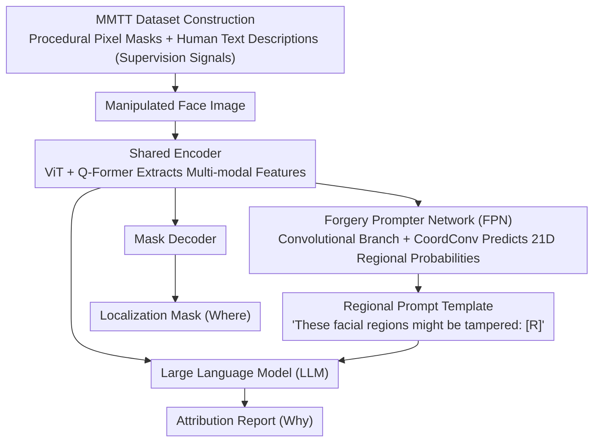

# ForgeryTalker: Generating Attribution Reports for Manipulated Facial Images

**Conference**: ACL 2026  
**arXiv**: [2412.19685](https://arxiv.org/abs/2412.19685)  
**Code**: [https://github.com/NattyLianJc/Generating-Attribution-Reports](https://github.com/NattyLianJc/Generating-Attribution-Reports)  
**Area**: Human Understanding  
**Keywords**: Face Forgery Detection, Attribution Report Generation, Multi-modal Forensics, Image Manipulation Localization, Explainable AI

## TL;DR

This paper proposes a new task called Forgery Attribution Report Generation and constructs the MMTT dataset, which contains 152,217 samples (the first large-scale facial forgery dataset providing both pixel-level masks and human text descriptions). It introduces ForgeryTalker, an end-to-end baseline that jointly generates localization masks and attribution reports through a shared encoder and dual decoders (mask + language model), achieving 59.3 CIDEr and 73.67 IoU.

## Background & Motivation

**Background**: Advanced generative models, such as diffusion models, have significantly enhanced the realism of synthetic images. Face manipulation detection research has evolved from binary classification to fine-grained forgery localization.

**Limitations of Prior Work**: (1) Binary classification only outputs a verdict without providing semantic understanding; (2) Pixel-level masks can locate tampered regions but treat all tampered pixels equally, failing to distinguish between subtle and significant manipulations or explain the reasons and nature of the forgery; (3) As modern forgeries become increasingly realistic, masks cannot provide descriptive evidence for human auditors.

**Key Challenge**: Existing methods answer "where it was tampered with" but fail to address "why it is considered tampered" and "what specific manifestations the manipulation has."

**Goal**: Define the Forgery Attribution Report Generation task—simultaneously locating the tampered area (Where) and generating a natural language explanation based on the editing process (Why), providing interpretable multi-modal forensics.

**Key Insight**: Utilize the forgery process itself to generate pixel-perfect ground truth masks (eliminating manual mask annotation) and combine this with a human-in-the-loop pipeline for writing text descriptions to build a high-quality dataset.

**Core Idea**: Learn a unified forgery-aware multi-modal representation through a shared encoder to drive both a mask decoder (localization) and a Large Language Model (explanation), achieving synergistic enhancement between localization and explanation.

## Method

### Overall Architecture

ForgeryTalker is extended from InstructBLIP and includes: (1) A shared encoder (ViT + Q-Former) to process tampered images and extract multi-modal features; (2) A Forgery Prompter Network (FPN) to generate regional keyword prompts; (3) A mask decoder for forgery localization; (4) A Large Language Model (LLM) to generate attribution reports. Training is conducted in two stages: forgery-aware pre-training and attribution report generation.

> The entire framework is governed by a two-stage training strategy: Stage 1 pre-trains the shared encoder, and Stage 2 independently trains the FPN before freezing it, followed by fine-tuning the Q-Former and mask decoder.

### Key Designs

**1. MMTT Dataset Construction: Obtaining Pixel-Perfect Masks via the Forgery Process and Overlapping Human Text Descriptions**

Existing datasets (e.g., FaceForensics++, Celeb-DF) provide either binary labels or masks, but neither can answer "why this was identified as tampered." MMTT completes both the localization and explanation ground truths: 152,217 samples cover four manipulation paradigms (Face Swap, Face Editing, Transformer Inpainting, and Diffusion Inpainting). Instead of manual drawing, masks are procedurally generated from the forgery pipeline—since the generator produces the tampered regions, pixel-accurate ground truth can be obtained directly, eliminating annotation errors. For the text side, a human-in-the-loop approach is used: 30 professional annotators followed a structured process, observing each image for at least one minute and describing the location and manifestation of the forgery in under 120 words. This combination provides supervision signals for both "where it was changed" and "how it was changed" for the first time.

**2. Forgery Prompter Network (FPN): Automatically Circling "Key Facial Parts for Inspection" for the LLM**

Human auditors must carefully compare regions to find inconsistencies; FPN automates this "locking of suspicious areas." Using ViT as a backbone, it integrates parallel convolutional branches (including CoordConv) in the first $m$ layers to capture subtle anomalies and utilize the spatial structure of facial rigidity. Global attention features and local convolutional features are fused layer by layer, and a classification head predicts a 21-dimensional facial region probability vector. This regional prediction is not used in isolation but is filled into a template ("These facial regions might be tampered with by AI: [R]") to serve as an explicit prompt guiding the LLM—essentially highlighting key points for the language model to explain.

**3. Two-Stage Training Strategy: Building Forgery-Aware Representations and Using Regional Prompts to Guide Report Generation**

Direct end-to-end joint training of localization and explanation was found to be unstable, so it is split into two stages. Stage 1 is forgery-aware pre-training, jointly optimizing masked language modeling $\mathcal{L}_{mlm}$, language modeling $\mathcal{L}_{lm}$, segmentation loss $\mathcal{L}_{seg}$, and cross-modal contrastive alignment $\mathcal{L}_{con}$, allowing the shared encoder to learn a unified multi-modal representation first. Stage 2 is report generation: the FPN is trained separately (with loss $\frac{1}{2}(\mathcal{L}_{BCE}+\mathcal{L}_{Dice})$, where BCE uses a discount factor $\omega<1$ to mitigate category imbalance from un-modified regions), then frozen while the Q-Former and mask decoder are fine-tuned. This way, localization and explanation share an encoder and are linked by FPN regional prompts, enabling the two tasks to reinforce rather than interfere with each other.

### Loss & Training

Pre-training stage loss: $\mathcal{L} = \mathcal{L}_{mlm} + \mathcal{L}_{lm} + \mathcal{L}_{seg} + \mathcal{L}_{con}$. FPN loss: $\frac{1}{2}(\mathcal{L}_{BCE} + \mathcal{L}_{Dice})$, where BCE uses a discount factor $\omega < 1$ to handle class imbalance in unmodified regions. The report generation stage uses standard language modeling loss.

## Key Experimental Results

### Main Results

**Performance of Report Generation and Forgery Localization**

| Method | CIDEr | BLEU-4 | ROUGE-L | IoU |
| :--- | :--- | :--- | :--- | :--- |
| InstructBLIP (baseline) | 42.1 | 8.2 | 29.5 | - |
| ForgeryTalker (w/o FPN) | 52.8 | 11.4 | 33.2 | 68.3 |
| **ForgeryTalker** | **59.3** | **13.1** | **35.7** | **73.67** |

### Ablation Study

| Configuration | CIDEr | IoU | Description |
| :--- | :--- | :--- | :--- |
| Full model | 59.3 | 73.67 | Complete model |
| w/o FPN | 52.8 | 68.3 | FPN contributes to both tasks |
| w/o Pre-training | 45.6 | 65.1 | Pre-training stage is crucial |
| w/o Contrastive Loss | 55.1 | 71.2 | Cross-modal alignment aids synergy |

### Key Findings

- FPN contributes significantly to both report generation (+6.5 CIDEr) and localization (+5.37 IoU), indicating that regional prompts effectively guide both tasks.
- Joint training of localization and report generation outperforms separate training, confirming the synergistic effect of the two tasks.
- The eyes, eyebrows, and lips are the most common targets of manipulation, accounting for the majority of local edits.
- Generated text descriptions average 27.4 words and highly correspond to visual forgery regions.

## Highlights & Insights

- The task definition is forward-looking—moving from "detecting forgery" to "explaining forgery" is a natural evolution in the field of forensics.
- The strategy of generating masks from the forgery process itself eliminates annotation errors and provides an efficient paradigm for dataset construction.
- The design of dual decoders sharing an encoder is transferable to other multi-modal tasks that require simultaneous localization and explanation.

## Limitations & Future Work

- Assumes the input image has already been flagged as suspicious by an upstream detector; it does not process authentic images.
- The annotation cost for text descriptions remains high (requires 30 annotators).
- Covers only facial manipulation; other types of image tampering are not addressed.
- Future work could explore more fine-grained attribution of manipulation methods (e.g., distinguishing between GAN and Diffusion generation).

## Related Work & Insights

- **vs FaceForensics++**: Only provides classification/segmentation labels without text explanations; MMTT provides text attribution for the first time.
- **vs OpenForensics**: Provides detection boxes and masks but lacks semantic explanations.
- **vs DF40**: Large-scale but only provides labels and masks; although MMTT is smaller in scale, its information dimensions are richer.

## Rating

- Novelty: ⭐⭐⭐⭐ Forgery Attribution Report Generation is a meaningful new task definition.
- Experimental Thoroughness: ⭐⭐⭐⭐ Detailed dataset construction and comprehensive ablation studies.
- Writing Quality: ⭐⭐⭐⭐ Clear task motivation and comprehensive dataset comparison.
- Value: ⭐⭐⭐⭐ Advances forensics from detection toward explainable analysis.

<!-- RELATED:START -->

## Related Papers

- [\[ACL 2026\] De-Anonymization at Scale via Tournament-Style Attribution](de-anonymization_at_scale_via_tournament-style_attribution.md)
- [\[AAAI 2026\] Uncovering Pretraining Code in LLMs: A Syntax-Aware Attribution Approach](../../AAAI2026/llm_safety/uncovering_pretraining_code_in_llms_a_syntax-aware_attribution_approach.md)
- [\[ICLR 2026\] Reasoning or Retrieval? A Study of Answer Attribution on Large Reasoning Models](../../ICLR2026/llm_safety/reasoning_or_retrieval_a_study_of_answer_attribution_on_large_reasoning_models.md)
- [\[NeurIPS 2025\] Attention! Your Vision Language Model Could Be Maliciously Manipulated](../../NeurIPS2025/llm_safety/attention_your_vision_language_model_could_be_maliciously_manipulated.md)
- [\[NeurIPS 2025\] Bias in the Picture: Benchmarking VLMs with Social-Cue News Images and LLM-as-Judge Assessment](../../NeurIPS2025/llm_safety/bias_in_the_picture_benchmarking_vlms_with_social-cue_news_images_and_llm-as-jud.md)

<!-- RELATED:END -->
