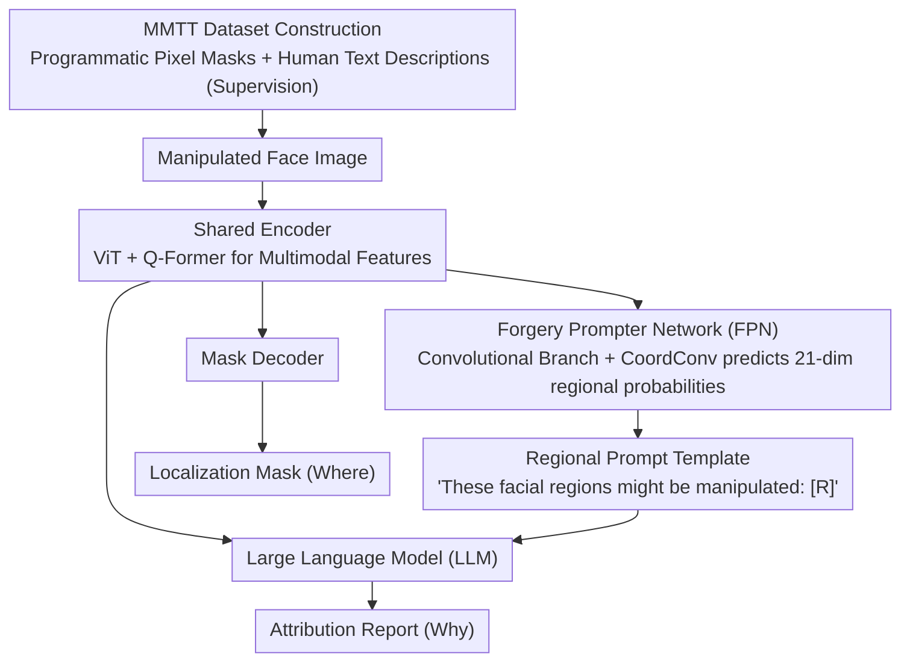

# ForgeryTalker: Generating Attribution Reports for Manipulated Facial Images

**Conference**: ACL 2026  
**arXiv**: [2412.19685](https://arxiv.org/abs/2412.19685)  
**Code**: [https://github.com/NattyLianJc/Generating-Attribution-Reports](https://github.com/NattyLianJc/Generating-Attribution-Reports)  
**Area**: Human Understanding  
**Keywords**: Facial forgery detection, attribution report generation, multimodal forensics, image manipulation localization, explainable AI

## TL;DR

This paper proposes a new task called Forgery Attribution Report Generation and constructs the MMTT dataset containing 152,217 samples (the first large-scale facial forgery dataset providing both pixel-level masks and human text descriptions). It further introduces ForgeryTalker, an end-to-end baseline that jointly generates localization masks and attribution reports via a shared encoder and dual decoders (mask + language model), achieving 59.3 CIDEr and 73.67 IoU.

## Background & Motivation

**Background**: Advanced generative models such as diffusion models have significantly enhanced the realism of synthetic images. Research on facial manipulation detection has evolved from binary classification to fine-grained forgery localization.

**Limitations of Prior Work**: (1) Binary classification only outputs a judgment without providing semantic understanding; (2) While pixel-level masks can localize manipulated regions, they treat all manipulated pixels equally, failing to distinguish between subtle and significant manipulations or explain the reasons and nature of the forgery; (3) As modern forgeries become increasingly realistic, masks cannot provide descriptive evidence for human auditors.

**Key Challenge**: Existing methods answer "where is the manipulation" but fail to address "why is it considered a manipulation" and "what are the specific manifestations of the manipulation."

**Goal**: Define the Forgery Attribution Report Generation task—simultaneously localizing manipulated regions (Where) and generating natural language explanations based on the editing process (Why) to provide explainable multimodal forensics.

**Key Insight**: Utilize the forgery process itself to generate pixel-perfect ground truth masks (without manual labeling), combined with a human-in-the-loop pipeline to write text descriptions, constructing a high-quality dataset.

**Core Idea**: Learn unified forgery-aware multimodal representations through a shared encoder to simultaneously drive a mask decoder (localization) and a Large Language Model (explanation), achieving synergistic enhancement between localization and interpretation.

## Method

### Overall Architecture

ForgeryTalker is extended from InstructBLIP and includes: (1) A shared encoder (ViT + Q-Former) to process manipulated images and extract multimodal features; (2) A Forgery Prompter Network (FPN) to generate regional keyword prompts; (3) A mask decoder for forgery localization; (4) A Large Language Model (LLM) to generate attribution reports. Training occurs in two stages: forgery-aware pre-training and attribution report generation.

> The entire framework is governed by a two-stage training strategy: Stage 1 pre-trains the shared encoder, and Stage 2 trains the FPN separately before freezing it and fine-tuning the Q-Former and mask decoder.

### Key Designs

**1. MMTT Dataset Construction: Trading the forgery process for pixel-perfect masks, overlaid with human text descriptions**

Existing datasets (FaceForensics++, Celeb-DF, etc.) provide either binary labels or masks, but neither can answer "why this was identified as a forgery." MMTT completes both localization and explanation ground truths: 152,217 samples cover four manipulation paradigms (face swapping, facial editing, Transformer inpainting, and diffusion inpainting). Masks are programmatically generated from the forgery pipeline—since the generator produces the manipulated regions, pixel-accurate ground truths are obtained directly, eliminating labeling errors. Text descriptions are created via a human-in-the-loop process: 30 professional annotators followed a structured workflow, observing each image for at least 1 minute and describing the location and manifestation of forgeries in under 120 words. This combination provides supervision signals for both "where" and "how" for the first time.

**2. Forgery Prompter Network (FPN): Circling "which facial parts to check" for human auditors before feeding it to the LLM**

Human auditors must carefully compare regions to find inconsistencies; FPN automates this "suspect region locking." It uses ViT as a backbone with parallel convolutional branches (including CoordConv) in the first $m$ layers to capture subtle anomalies and utilize the spatial structure of facial rigidity. Global attention features and local convolutional features are fused layer-by-layer, and a classification head predicts a 21-dimensional facial region probability vector. This regional prediction is not used in isolation but filled into a template—"These facial regions might be manipulated by AI: [R]"—to serve as an explicit prompt guiding the LLM. This effectively highlights key areas for the language model to explain in detail.

**3. Two-Stage Training Strategy: Building forgery-aware representations followed by region-prompt-guided report generation**

Direct end-to-end joint training of localization and explanation is unstable, so it is split into two stages. Stage 1 is forgery-aware pre-training, jointly optimizing masked language modeling $\mathcal{L}_{mlm}$, language modeling $\mathcal{L}_{lm}$, segmentation loss $\mathcal{L}_{seg}$, and cross-modal contrastive alignment $\mathcal{L}_{con}$, allowing the shared encoder to learn unified multimodal representations. Stage 2 focuses on report generation: the FPN is trained individually (loss is $\frac{1}{2}(\mathcal{L}_{BCE}+\mathcal{L}_{Dice})$, where BCE uses a discount factor $\omega<1$ to mitigate class imbalance from unmodified regions), then frozen while the Q-Former and mask decoder are fine-tuned. This ensures localization and explanation tasks share an encoder and are linked by regional prompts, enhancing each other rather than interfering.

### Loss & Training

Pre-training stage loss: $\mathcal{L} = \mathcal{L}_{mlm} + \mathcal{L}_{lm} + \mathcal{L}_{seg} + \mathcal{L}_{con}$. FPN loss: $\frac{1}{2}(\mathcal{L}_{BCE} + \mathcal{L}_{Dice})$, where BCE uses a discount factor $\omega < 1$ to handle class imbalance of unmodified regions. The report generation stage uses standard language modeling loss.

## Key Experimental Results

### Main Results

**Report Generation and Forgery Localization Performance**

| Method | CIDEr | BLEU-4 | ROUGE-L | IoU |
|------|-------|--------|---------|-----|
| InstructBLIP (baseline) | 42.1 | 8.2 | 29.5 | - |
| ForgeryTalker (w/o FPN) | 52.8 | 11.4 | 33.2 | 68.3 |
| **ForgeryTalker** | **59.3** | **13.1** | **35.7** | **73.67** |

### Ablation Study

| Configuration | CIDEr | IoU | Description |
|------|-------|-----|------|
| Full model | 59.3 | 73.67 | Complete version |
| w/o FPN | 52.8 | 68.3 | FPN contributes to both tasks |
| w/o Pre-training | 45.6 | 65.1 | Pre-training stage is crucial |
| w/o Contrastive Loss | 55.1 | 71.2 | Cross-modal alignment aids synergy |

### Key Findings

- FPN significantly contributes to both report generation (+6.5 CIDEr) and localization (+5.37 IoU), indicating that regional prompts effectively guide both tasks.
- Jointly training localization and report generation outperforms separate training, confirming the synergistic effect of the two tasks.
- Eyes, eyebrows, and lips are the most frequent targets of manipulation, accounting for the majority of local edits.
- The generated text descriptions average 27.4 words, corresponding highly with visual forgery regions.

## Highlights & Insights

- The task definition is forward-thinking—moving from "detecting forgery" to "explaining forgery" is a natural evolution in forensics.
- The strategy of generating masks from the forgery process itself eliminates labeling errors and provides an efficient paradigm for dataset construction.
- The dual-decoder shared-encoder design is transferable to other multimodal tasks requiring simultaneous localization and explanation.

## Limitations & Future Work

- Assumes the input image has already been flagged as suspicious by an upstream detector; does not handle authentic images.
- The cost of annotating text descriptions remains high (30 annotators).
- Covers only facial manipulations; other types of image manipulation are not addressed.
- Future work could explore more fine-grained manipulation method attribution (e.g., distinguishing between GAN and diffusion generation).

## Related Work & Insights

- **vs FaceForensics++**: Provides only classification/segmentation labels without text explanations; MMTT provides text attribution for the first time.
- **vs OpenForensics**: Provides detection boxes and masks but no semantic explanation.
- **vs DF40**: Large-scale but only labels + masks; MMTT is smaller but possesses richer informational dimensions.

## Rating

- Novelty: ⭐⭐⭐⭐ Forgery Attribution Report Generation is a meaningful new task definition.
- Experimental Thoroughness: ⭐⭐⭐⭐ Detailed dataset construction and extensive ablation verification.
- Writing Quality: ⭐⭐⭐⭐ Clear motivation and comprehensive dataset comparison.
- Value: ⭐⭐⭐⭐ Pushes forensics from detection toward explainable analysis.

<!-- RELATED:START -->

## Related Papers

- [\[ACL 2026\] De-Anonymization at Scale via Tournament-Style Attribution](de-anonymization_at_scale_via_tournament-style_attribution.md)
- [\[AAAI 2026\] Uncovering Pretraining Code in LLMs: A Syntax-Aware Attribution Approach](../../AAAI2026/llm_safety/uncovering_pretraining_code_in_llms_a_syntax-aware_attribution_approach.md)
- [\[ICLR 2026\] Automatic Dialectic Jailbreak: A Framework for Generating Effective Jailbreak Strategies](../../ICLR2026/llm_safety/automatic_dialectic_jailbreak_a_framework_for_generating_effective_jailbreak_str.md)
- [\[ICLR 2026\] Reasoning or Retrieval? A Study of Answer Attribution on Large Reasoning Models](../../ICLR2026/llm_safety/reasoning_or_retrieval_a_study_of_answer_attribution_on_large_reasoning_models.md)
- [\[NeurIPS 2025\] Attention! Your Vision Language Model Could Be Maliciously Manipulated](../../NeurIPS2025/llm_safety/attention_your_vision_language_model_could_be_maliciously_manipulated.md)

<!-- RELATED:END -->
