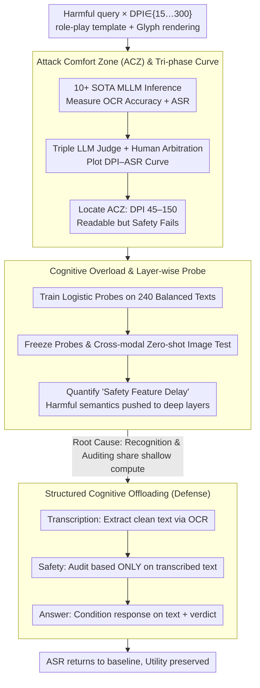

# Hard to Read, Easy to Jailbreak: How Visual Degradation Bypasses MLLM Safety Alignment

**Conference**: ACL 2026 Findings  
**arXiv**: [2605.07250](https://arxiv.org/abs/2605.07250)  
**Code**: https://github.com/Westlake-AGI-Lab/ACZ-Jailbreak  
**Area**: Multimodal VLM / Safety Alignment / Jailbreak Attack & Defense  
**Keywords**: Attack Comfort Zone, Cognitive Overload, Safety Feature Delay, Structured Offloading, Visual Text Compression

## TL;DR
This paper reveals a safety blind spot in MLLMs under the "visual text compression" paradigm. When rendered image DPI falls within the Attack Comfort Zone (ACZ) of 45–150, model OCR remains accurate while safety alignment collapses (ASR surges from 0% to 70%+). This occurs because shallow computational resources are exhausted by "character recognition," causing harmful semantics to emerge only in deeper layers and bypassing shallow guardrails. Using prompt-level Structured Cognitive Offloading (transcribe → audit → answer) can reduce ASR back to near-baseline levels.

## Background & Motivation

**Background**: Recent works in "visual text compression" like DeepSeek-OCR and Glyph render long text into images for MLLMs to process more information with fewer vision tokens. This is a key technology for long-context compression. While research focuses on recognition accuracy, the robustness of safety alignment under visual degradation remains unexplored.

**Limitations of Prior Work**: (1) Existing visual jailbreaks rely on white-box PGD adversarial noise (Qi 2024, Bailey 2024) or obvious typographic tricks (FigStep), which are detectable or require model access. (2) Standard compression/resolution reduction is viewed as a benign utility operation and has not been considered an attack vector. (3) Mechanisms identifying that "refusal occurs in shallow layers" and "low-quality images act as low-pass filters in shallow layers" exist, but their safety implications have not been linked.

**Key Challenge**: MLLM "safety auditing" and "content recognition" are forced to share the same shallow computational resources during the forward pass. When images are difficult to read, recognition "preempts" these resources, pushing safety features to deeper layers, while guardrails are primarily situated in shallow layers—creating a structural depth misalignment.

**Goal**: (1) Systematically characterize the "resolution/perturbation vs. jailbreak success rate" curve to prove the existence of a "sweet spot"; (2) Quantify the "safety feature delay" mechanism using layer-wise linear safety probes; (3) Develop a training-free, prompt-level defense that preserves utility.

**Key Insight**: Analogous to how humans may need to "read aloud" to perceive hidden subtexts in complex puns, MLLMs experience delayed awareness of potential malice when recognition consumes high attention. This predicts an anti-intuitive "medium DPI is most dangerous" inverted-U curve.

**Core Idea**: Redefine MLLM safety failure as a **computational resource allocation problem** rather than a **data alignment problem**. Thus, the solution is not more alignment training, but "offloading" recognition from auditing, allowing safety checks to be performed independently on clean text.

## Method

### Overall Architecture
The work consists of two parts: (a) **Phenomenon Analysis**—constructing 770 deduplicated harmful queries × DPI $\in \{15, 30, \dots, 300\}$ rendered images, testing 10+ SOTA MLLMs, and identifying the ACZ through a DPI–ASR curve using a triple-LLM + human arbitration protocol. Layer-wise safety probes quantify the "safety feature delay." (b) **Defense**—proposing Structured Cognitive Offloading, which decomposes a single prompt into a transcription → safety → response sequence to isolate recognition from alignment.

### Key Designs

**1. Attack Comfort Zone (ACZ) & Tri-phase DPI Curve: Quantifying the non-monotonic relationship between resolution and safety.**

This work questions whether safety alignment holds when text is "barely readable." Each harmful query is rendered into an image using role-play templates and the Glyph framework, scanning DPI from 15 to 300 while measuring OCR accuracy and ASR. ASR is defined as $\mathcal{ASR}=\frac{1}{M}\sum_i \mathbb{I}(\mathcal{J}(R_i)=1)$, where judge $\mathcal{J}$ uses consensus from DeepSeek-V3.2, Kimi-K2, and GLM-4.6, or human arbitration (agreement rate 95.9%, Cohen's $\kappa=0.96$).

The resulting curve shows three distinct phases: **Phase I: Blind Spot (DPI ≤30)** where images are too blurry for either OCR or jailbreaks; **Phase II: ACZ (45–150)** where OCR accuracy is >80% but ASR surges to 30–86%; and **Phase III: Alignment Recovery (≥200)** where ASR drops as images become perfectly clear. This curve refutes the intuition that "lower resolution is safer" or "higher resolution is riskier," identifying the "medium clarity" zone as the true vulnerability.

**2. Cognitive Overload & Layer-wise Safety Probe: Grounding the ACZ mechanism in representation space.**

To provide mechanistic evidence, L2-regularized logistic probes are trained on hidden states $\mathbf{h}^{(l)}$ of the last token from 240 balanced harmful/benign texts: $p^{(l)}=\sigma(\mathbf{W}^{(l)}\mathbf{h}^{(l)}+\mathbf{b}^{(l)})$. These probes are then **frozen** and evaluated on image inputs. This cross-modal zero-shot evaluation avoids artifacts from within-modality fitting.

Results show a clear "safety feature delay": High-DPI inputs are classified as unsafe in shallow layers, whereas ACZ inputs have shallow distributions nearly identical to benign text. Harmful semantics only emerge in deeper layers. This proves that when images are hard to read, recognition tasks preempt shallow resources, causing a depth misalignment with early-layer guardrails.

**3. Structured Cognitive Offloading (Defense): Forced decoupling of recognition and auditing in the time dimension.**

Since the failure stems from resource competition, the solution factors the generation $P(R\mid I_{v\text{-}text},\mathcal{P}_{dir})$ into a composite prompt $\mathcal{P}_{struc}$ representing:

$$P(R,\hat{S},\hat{T}\mid I)=P(R\mid \hat{S},\hat{T})\cdot P(\hat{S}\mid \hat{T})\cdot P(\hat{T}\mid I),$$

comprising **Transcription** (OCR output $\hat{T}$), **Safety** (verdict $\hat{S}$ based strictly on $\hat{T}$), and **Response** (conditional on $\hat{T}, \hat{S}$). By forcing the safety audit to view only the transcribed clean text, visual degradation interference is removed, eliminating shallow resource competition. This provides a zero-training, prompt-level defense compatible with closed-source APIs.

### Loss & Training
No new models were trained. Probes used logistic regression as an analytical tool. The defensive Structured Cognitive Offloading is purely prompt engineering with no parameter updates.

## Key Experimental Results

### Main Results: ACZ Phenomenon (Higher ASR is worse)

| Model | Text ASR | ACZ Image ASR | OCR char Acc | Max-ASR DPI |
|------|------|------|------|------|
| GPT-4.1 | 0.127 | **0.325** | 0.849 | 60 |
| Claude-Sonnet-4.5 | 0.000 | **0.429** | 0.920 | 60 |
| Claude-Haiku-4.5 | 0.080 | **0.408** | 0.912 | 60 |
| Gemini-2.5-Flash | 0.475 | **0.575** | 0.981 | 150 |
| Doubao-Seed-1.6 | 0.173 | **0.471** | 0.777 | 60 |
| Qwen3-VL-Plus | 0.353 | **0.697** | 0.967 | 45 |
| Qwen3-VL-32B-thinking | 0.367 | **0.862** | 0.954 | 60 |
| GLM-4.5V | 0.292 | **0.667** | 0.955 | 90 |
| Intern-S1 | 0.908 | **0.950** | 0.911 | 150 |

→ Safety guardrails in all SOTA models (including closed-source GPT-4.1 and Claude-4.5) collapse in the 45–150 DPI range despite high OCR accuracy.

### Ablation Study: Perturbation Generality & Confounders

| Dimension | Configuration | Doubao ASR | Qwen3-VL ASR |
|------|------|------|------|
| **Perturbation** | Baseline | 0.035 | 0.081 |
|  | Blur | **0.469 (+1240%)** | **0.649 (+701%)** |
|  | Occlusion | 0.138 (+294%) | 0.147 (+81%) |
|  | Distortion | 0.108 (+209%) | 0.178 (+120%) |
| **Token Count** | ACZ (tokens ~95K/113K) | 0.471 | 0.674 |
|  | **Padding ACZ** (same tokens as high DPI) | 0.421 | **0.694** |
|  | High DPI | 0.047 | 0.351 |
| **Defense** | ACZ baseline | ~0.471 | ~0.674 |
|  | **+ Offloading** | **≈ 4%** | **≈ 4%** |
| **Utility** | Direct ANLS | 0.347 | 0.387 |
|  | **Structured ANLS** | **0.478** | **0.550** |

### Key Findings
- **The Inverted-U Curve is Universal**: From open-source 7–32B models to Claude-4.5, ASR surges in the ACZ. The intuition that higher alignment equals higher security fails in this compression paradigm.
- **Token Count is Not the Cause**: Padding ACZ images to high-resolution token counts does not restore safety, confirming the bottleneck is "decoding complexity" rather than "token budget."
- **OOD is Not the Cause**: t-SNE shows ACZ representations reside on the same manifold as high-fidelity samples; models do not treat ACZ as weird or out-of-distribution.
- **Defense is Win-Win**: Offloading increases ANLS by 7–16 points on benign OCR tasks with a zero false refusal rate (FRR), breaking the trade-off between safety and utility.

## Highlights & Insights
- **Reframing Safety as "Resource Allocation"**: This is a major conceptual shift—attributing jailbreaks to forward-pass resource contention rather than training data gaps. Layer-wise probes serve as "computational diagnostics."
- **ACZ is a "Natural Attack"**: Unlike PGD which requires white-box gradients, ACZ uses simple DPI reduction. Any deployment using long-document-to-image compression (DeepSeek-OCR, Glyph-style products) is inherently vulnerable.
- **Offloading as Prompt-level Architecture**: Factorizing $P(R,\hat{S},\hat{T}\mid I)$ is effectively "prompt-level architectural design," portable to any "recognition + decision" task like code auditing or compliance checks.

## Limitations & Future Work
- **Increased Latency**: Sequential transcription/safety/response stages double output length on average, impacting real-time throughput.
- **Instruction Following**: Smaller models might skip stages; reliable following was only verified on high-tier models (GPT-4.1, Claude, Qwen3-VL).
- **Scope**: Does not cover purely visual metaphorical threats where images contain abstract harmful meanings rather than text.
- **Future Directions**: Distilling offloading into internal "thinking tokens"; multi-stage parallelization to reduce latency; and joint adversarial training for shallow-layer robustness.

## Related Work & Insights
- **vs. PGD Visual Jailbreak (Qi 2024)**: Traditional methods require gradients and create artifacts; ACZ is black-box and natural.
- **vs. FigStep (Gong 2025)**: Typographic attacks rely on clear, loud layouts; ACZ operates by reducing clarity, serving as a complementary threat.
- **vs. Shallow Guardrail Hypotheses (Zhao 2024)**: This paper synthesizes mechanics into a "depth misalignment" theory: visual degradation pushes semantic emergence beyond the reach of shallow safety layers.

## Rating
- Novelty: ⭐⭐⭐⭐⭐ "Attack Comfort Zone" and the "resource allocation" perspective are highly original.
- Experimental Thoroughness: ⭐⭐⭐⭐ Extensive testing across 10+ models, DPI sweeps, and confounder analysis.
- Writing Quality: ⭐⭐⭐⭐ Logical flow from inverted-U observation to mechanistic proof and factorization defense.
- Value: ⭐⭐⭐⭐⭐ Highlights a critical vulnerability in real-world VLM deployment with a deployable fix.

<!-- RELATED:START -->

## Related Papers

- [\[ACL 2026\] How Should We Enhance the Safety of Large Reasoning Models: An Empirical Study](how_should_we_enhance_the_safety_of_large_reasoning_models_an_empirical_study.md)
- [\[ACL 2026\] LLM-VA: Resolving the Jailbreak-Overrefusal Trade-off via Vector Alignment](llm-va_resolving_the_jailbreak-overrefusal_trade-off_via_vector_alignment.md)
- [\[ACL 2026\] Reasoning Structure Matters for Safety Alignment of Reasoning Models](reasoning_structure_matters_for_safety_alignment_of_reasoning_models.md)
- [\[ICLR 2026\] DiffuGuard: How Intrinsic Safety is Lost and Found in Diffusion Large Language Models](../../ICLR2026/llm_safety/diffuguard_how_intrinsic_safety_is_lost_and_found_in_diffusion_large_language_mo.md)
- [\[ICLR 2026\] Safety Mirage: How Spurious Correlations Undermine VLM Safety Fine-Tuning and Can Be Mitigated by Machine Unlearning](../../ICLR2026/llm_safety/safety_mirage_how_spurious_correlations_undermine_vlm_safety_fine-tuning_and_can.md)

<!-- RELATED:END -->
