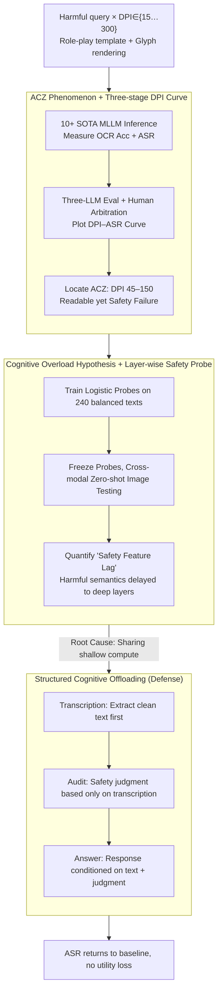

# Hard to Read, Easy to Jailbreak: How Visual Degradation Bypasses MLLM Safety Alignment

**Conference**: ACL 2026 Findings  
**arXiv**: [2605.07250](https://arxiv.org/abs/2605.07250)  
**Code**: https://github.com/Westlake-AGI-Lab/ACZ-Jailbreak  
**Area**: Multimodal VLM / Safety Alignment / Jailbreak Attack & Defense  
**Keywords**: Attack Comfort Zone, Cognitive Overload, Safety Feature Lag, Structured Offloading, Visual Text Compression

## TL;DR
This paper reveals for the first time a safety blind spot in MLLMs under the "visual text compression" paradigm. When the rendered image DPI falls within the Attack Comfort Zone (ACZ) of 45–150, the model's OCR remains accurate, but safety alignment collapses (with ASR soaring from 0% to over 70%). The reason is that shallow computational resources are exhausted by "character recognition," causing harmful semantics to only emerge in deeper layers, thereby bypassing shallow guardrails. Using prompt-level Structured Cognitive Offloading (transcribe first → then audit → then answer) can bring the ASR back to near-baseline levels.

## Background & Motivation

**Background**: Recent works in visual text compression, such as DeepSeek-OCR and Glyph, render long text into images for MLLMs to process, using significantly fewer vision tokens to carry the same amount of text. This is a key technology for current long-context compression. Academic research has primarily focused on whether models can "read correctly," while almost no one has questioned whether safety alignment remains intact when readability is degraded.

**Limitations of Prior Work**: (1) Existing visual jailbreaks rely on white-box PGD adversarial noise (Qi 2024, Bailey 2024) or obvious typographical tricks (FigStep), both of which require manipulation and are easily detected; (2) Standard compression/resolution reduction should be a benign utility operation and has not been suspected as an attack surface; (3) Existing mechanistic studies indicate that "refusal primarily occurs in shallow layers" and "shallow layers act as low-pass filters for low-quality images," but no one has linked these two to derive safety consequences.

**Key Challenge**: The "safety auditing" and "content recognition" of MLLMs are forced to share the same shallow computational resources during the forward pass. When an image is difficult to read, recognition "preempts" shallow resources, pushing safety features into deeper layers, while guardrails are positioned only at the shallow layers—creating a structural depth mismatch.

**Goal**: (1) Systematically characterize the "resolution/perturbation vs. jailbreak success rate" curve to prove the existence of a sweet spot; (2) Directly measure the "safety feature lag" mechanism using layer-wise linear safety probes; (3) Provide a training-free, prompt-level defense that does not compromise normal utility.

**Key Insight**: An analogy is drawn to the human phenomenon of needing to "read aloud" puns to perceive latent meanings. When identification consumes significant "attention," the perception of potential malice in the content is delayed. This predicts a counter-intuitive "inverted-U" curve where medium DPI is the most dangerous.

**Core Idea**: MLLM safety failure is redefined as a **computing resource allocation problem** rather than a **data alignment problem**. Therefore, the solution is not more alignment training, but "offloading" recognition from auditing, allowing safety auditing to be completed independently on clean text.

## Method

### Overall Architecture
This paper consists of two parts: (a) **Phenomenon Analysis**: Constructing 770 deduplicated harmful queries rendered at DPI $\in \{15, 30, \dots, 300\}$, running across 10+ SOTA MLLMs, and plotting the DPI–ASR curve using an ASR protocol involving three-LLM evaluation plus human arbitration to identify the ACZ; quantifying the "safety feature lag" using layer-wise linear safety probes. (b) **Defense Method**: Proposing Structured Cognitive Offloading, which splits a single prompt into a sequence: transcription → safety → response; and identifying the root cause as "content decoding difficulty" by abating three types of confounders: token count, templates, and OOD.

### Key Designs

**1. Attack Comfort Zone (ACZ) Phenomenon + Three-stage DPI Curve: Quantifying the non-monotonic relationship between resolution and safety.**

Academic research on visual text compression has focused on whether the reading is correct, but ignored safety. This paper renders every harmful query using role-play templates and the Glyph framework, scanning a full spectrum of DPI from 15 to 300, while measuring char/word OCR accuracy and attack success rate. ASR is defined as $\mathcal{ASR}=\frac{1}{M}\sum_i \mathbb{I}(\mathcal{J}(R_i)=1)$, where the judgment $\mathcal{J}$ is adopted if DeepSeek-V3.2, Kimi-K2, and GLM-4.6 agree, otherwise human arbitration is used (95.9% agreement, Cohen's $\kappa=0.96$).

The scanned curve shows three distinct stages: **Phase I Blind Zone (DPI ≤30)** where images are too blurry, and both OCR and ASR are near 0; **Phase II ACZ (45–150)** where OCR is >80% but ASR spikes to 30–86%; **Phase III Alignment Recovery (≥200)** where OCR $\approx 1$ and ASR drops. Most models peak at 45–60 DPI—the most dangerous "readable but safety failure" zone.

**2. Cognitive Overload Hypothesis + Layer-wise Safety Probe: Moving from phenomenon to mechanism.**

To prove that ACZ is not caused by OOD or template artifacts, the paper uses 120+120 balanced text samples (harmful/harmless) to train an L2-regularized logistic probe $p^{(l)}=\sigma(\mathbf{W}^{(l)}\mathbf{h}^{(l)}+\mathbf{b}^{(l)})$ on the hidden state $\mathbf{h}^{(l)}$ of the last token of each layer. These probes are then **frozen** and used to evaluate image inputs.

The results clearly show "safety feature lag": High-DPI inputs are classified as unsafe in shallow layers, while ACZ inputs' shallow distributions overlap with harmless text, only separating at deeper layers. This quantifies the depth mismatch caused by recognition preempting shallow compute.

**3. Structured Cognitive Offloading (Defense): Decoupling recognition and auditing in the time dimension.**

Standard monolithic generation follows $P(R\mid I_{v\text{-}text},\mathcal{P}_{dir})$. This paper uses a composite prompt $\mathcal{P}_{struc}$ to factorize the generation as:

$$P(R,\hat{S},\hat{T}\mid I)=P(R\mid \hat{S},\hat{T})\cdot P(\hat{S}\mid \hat{T})\cdot P(\hat{T}\mid I),$$

The three stages are **Transcription** (OCR clean text $\hat{T}$), **Safety** (safety judgment $\hat{S}$ based only on $\hat{T}$), and **Response** (final answer conditioned on $\hat{T}, \hat{S}$). Since auditing only sees clean text, visual degradation interference is discarded, and shallow resource competition disappears.

### Loss & Training
No new models were trained. Probes were trained using logistic regression on 240 samples for analysis purposes only. The defense, Structured Cognitive Offloading, is purely prompt engineering with no parameter updates.

## Key Experimental Results

### Main Results: ACZ Phenomenon (Higher ASR is worse)

| Model | Text ASR | ACZ Image ASR | OCR char Acc | Max-ASR DPI |
|------|------|------|------|------|
| GPT-4.1 | 0.127 | **0.325** | 0.849 | 60 |
| Claude-Sonnet-4.5 | 0.000 | **0.429** | 0.920 | 60 |
| Claude-Haiku-4.5 | 0.080 | **0.408** | 0.912 | 60 |
| Gemini-2.5-Flash | 0.475 | **0.575** | 0.981 | 150 |
| Doubao-Seed-1.6 | 0.173 | **0.471** | 0.777 | 60 |
| Qwen3-VL-Plus | 0.353 | **0.697** | 0.967 | 45 |
| Qwen3-VL-32B-thinking | 0.367 | **0.862** | 0.954 | 60 |
| GLM-4.5V | 0.292 | **0.667** | 0.955 | 90 |
| Intern-S1 | 0.908 | **0.950** | 0.911 | 150 |

### Ablation Study: Perturbation Generality + Token Confounder + Defense

| Dimension | Configuration | Doubao ASR | Qwen3-VL ASR |
|------|------|------|------|
| **Generality** | Baseline | 0.035 | 0.081 |
|  | Blur | **0.469 (+1240%)** | **0.649 (+701%)** |
|  | Occlusion | 0.138 | 0.147 |
| **Token Confounder** | ACZ (tokens ~95K/113K) | 0.471 | 0.674 |
|  | **Padding ACZ** (tokens ~985K/905K) | 0.421 | **0.694** |
|  | High DPI (same tokens as above) | 0.047 | 0.351 |
| **Defense** | ACZ Baseline | ~0.471 | ~0.674 |
|  | + Offloading | **≈ 4%** | **≈ 4%** |
| **Utility** (ANLS↑, FRR↓) | Direct ANLS | 0.347 | 0.387 |
|  | Structured ANLS | **0.478** | **0.550** |

### Key Findings
- **The Inverted-U curve is universal**: From open-source 7–32B models to closed-source Claude-4.5/GPT-4.1, ASR consistently spikes in the ACZ.
- **Token count is not the cause**: Padding ACZ images to high-resolution token counts does not reduce ASR, confirming the bottleneck is "decoding complexity."
- **OOD is false**: t-SNE shows ACZ representations lie on the same manifold as high-fidelity samples; the model does not perceive ACZ as weird input.
- **Defense has no side effects**: On 300 benign samples, offloading actually improves ANLS by 7–16 points with zero false refusals.

## Highlights & Insights
- **Redefining MLLM safety as a "resource allocation problem"**: This suggests that safety failures can occur even with perfect data if the forward pass compute is preempted.
- **ACZ is a "natural attack"**: Unlike white-box PGD or manual typography, ACZ is a simple "reduce DPI" operation, making any visual text compression deployment naturally vulnerable.
- **Factorized prompt paradigm**: The $P(R,\hat{S},\hat{T}\mid I)$ approach is a form of "prompt-level architecture design" extensible to any "recognition + decision" coupled task.

## Limitations & Future Work
- **Output length increased by 102%**: Serialization of transcription, safety, and response doubles average output length.
- **Instruction following is not guaranteed**: Smaller models might skip the transcription stage.
- **Visual metaphor coverage**: This method does not address threats inherent in the image itself (non-textual threats).
- **Future Directions**: Distilling offloading into "thinking tokens"; studying parallelization of stages; enhancing shallow layer robustness to visual degradation.

## Related Work & Insights
- **vs. PGD Visual Jailbreak**: ACZ is black-box, natural, and leaves no artifacts, making it a broader threat.
- **vs. FigStep**: While typography attacks use specific layouts, ACZ shows that *reducing* legibility can also lead to jailbreak.
- **vs. Shallow Layer Bottleneck**: This work synthesizes existing research into a "depth mismatch" mechanism where visual degradation pushes semantics past shallow guardrails.

## Rating
- Novelty: ⭐⭐⭐⭐⭐ 
- Experimental Thoroughness: ⭐⭐⭐⭐ 
- Writing Quality: ⭐⭐⭐⭐ 
- Value: ⭐⭐⭐⭐⭐

## Related Papers

- [\[ICML 2026\] Old Habits Die Hard: How Conversational History Geometrically Traps LLMs](../../ICML2026/llm_safety/old_habits_die_hard_how_conversational_history_geometrically_traps_llms.md)
- [\[ACL 2026\] How Should We Enhance the Safety of Large Reasoning Models: An Empirical Study](how_should_we_enhance_the_safety_of_large_reasoning_models_an_empirical_study.md)
- [\[ACL 2026\] LLM-VA: Resolving the Jailbreak-Overrefusal Trade-off via Vector Alignment](llm-va_resolving_the_jailbreak-overrefusal_trade-off_via_vector_alignment.md)
- [\[ACL 2026\] Reasoning Structure Matters for Safety Alignment of Reasoning Models](reasoning_structure_matters_for_safety_alignment_of_reasoning_models.md)
- [\[ACL 2026\] SafeMERGE: Preserving Safety Alignment in Fine-Tuned Large Language Models via Selective Layer-Wise Model Merging](safemerge_preserving_safety_alignment_in_fine-tuned_large_language_models_via_se.md)

<!-- RELATED:END -->

<!-- RELATED:START -->

## Related Papers

- [\[ACL 2026\] How Should We Enhance the Safety of Large Reasoning Models: An Empirical Study](how_should_we_enhance_the_safety_of_large_reasoning_models_an_empirical_study.md)
- [\[ACL 2026\] When Models Outthink Their Safety: Unveiling and Mitigating Self-Jailbreak in Large Reasoning Models](when_models_outthink_their_safety_unveiling_and_mitigating_self-jailbreak_in_lar.md)
- [\[ACL 2026\] SafeMERGE: Preserving Safety Alignment in Fine-Tuned Large Language Models via Selective Layer-Wise Model Merging](safemerge_preserving_safety_alignment_in_fine-tuned_large_language_models_via_se.md)
- [\[ACL 2026\] Making MLLMs Blind: Adversarial Smuggling Attacks in MLLM Content Moderation](making_mllms_blind_adversarial_smuggling_attacks_in_mllm_content_moderation.md)
- [\[ACL 2026\] GAMBIT: A Gamified Jailbreak Framework for Multimodal Large Language Models](gambit_a_gamified_jailbreak_framework_for_multimodal_large_language_models.md)

<!-- RELATED:END -->
