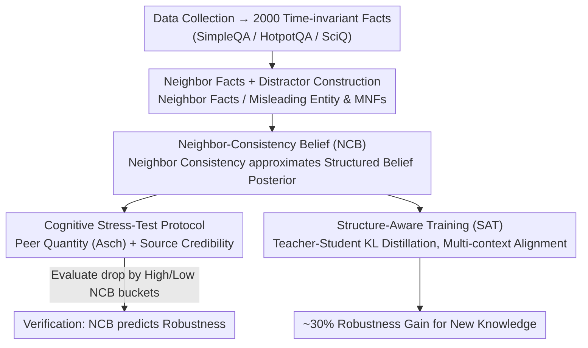

# Illusions of Confidence? Diagnosing LLM Truthfulness via Neighborhood Consistency

**Conference**: ACL 2026  
**arXiv**: [2601.05905](https://arxiv.org/abs/2601.05905)  
**Code**: https://github.com/zjunlp/belief (Available)  
**Area**: LLM Reasoning / Calibration / Trustworthiness  
**Keywords**: Belief Robustness, Neighborhood Consistency, Self-Consistency, Bayesian Belief, Structure-Aware Training

## TL;DR
This paper points out that for LLMs, "high self-consistency does not equal true belief"—on 995 questions where the model answered correctly with 100% consistency, inserting minor contextual interference caused accuracy to plummet to 33.8%. The authors propose **Neighbor-Consistency Belief (NCB)**: a structured proxy for belief robustness by performing joint consistency estimation of a target fact and its "conceptual neighbors" (premises/entailments/topics). Based on Asch's conformity experiments and Source Credibility theory, they designed a cognitive stress-test protocol, proving on 4 LLMs that high NCB data is significantly more resistant to interference. They further introduce **Structure-Aware Training (SAT)**: utilizing teacher-student KL distillation to force student models to output consistently across different neighborhood contexts, improving the robustness of newly learned knowledge by approximately 30% over Ans/Know augmentation baselines.

## Background & Motivation

**Background**: To evaluate whether an LLM "knows" a fact, the mainstream approach relies on self-consistency (majority voting over multiple samples) or token-level confidence. However, LLMs are increasingly deployed in scenarios "driven by external context" such as RAG, multi-agent collaboration, and complex prompt engineering. In these scenarios, "knowing" is insufficient; the model must remain stable under interference.

**Limitations of Prior Work**: The authors conducted a pilot using Qwen3-30B-A3B on 995 questions with self-consistency = 1.0 (correct in all 30 samples). After inserting just one peer disagreement, accuracy dropped from 100% to 33.8%. This indicates that existing confidence metrics fail to distinguish between "guessing correctly based on memory fragments" and "answering based on structured beliefs."

**Key Challenge**: Belief should be a **structured latent state** (in cognitive science, the human brain organizes knowledge using semantic networks where related facts constrain each other to resist interference). In contrast, point-wise metrics like self-consistency only examine "multiple outputs of the same question," failing to capture the network structure between facts.

**Goal**: (a) Provide a computational metric to distinguish between "answering via structured belief" and "answering via isolated memory"; (b) Design a rigorous cognitive stress-test to verify that this metric predicts robustness; (c) Apply "structural invariance" as a training objective to make learned knowledge more interference-resistant.

**Key Insight**: Model belief as a binary latent variable $\theta \in \{\mathcal{S}_\text{struct}, \mathcal{S}_\text{unstruct}\}$ and use Bayesian posterior estimation—if the model answers a set of neighboring facts correctly, the posterior probability of it being in a structured belief state is significantly higher than unstructured. This posterior is approximated as the NCB score.

**Core Idea**: Use "neighbor consistency" instead of "self-consistency" as a proxy for belief strength and explicitly incorporate this structural invariance into the training loss.

## Method

### Overall Architecture
The core question is how to upgrade LLM fact verification from "voting consistency on one question" to "recognition of the network structure between facts" and use this structurally as a training objective. The pipeline consists of three steps. First, **Data Construction**: Select 500 items each from SimpleQA / HotpotQA / SciQ, balanced into 2000 time-invariant facts across STEM / Arts & Culture / Social Sciences / Sports. For each target fact $(q^*, \mathcal{E}^*)$, DeepSeek-V3.2 generates "Neighbor Facts" (covering entity premises, logical entailments, and topical associations; avg. 7.84 per fact, human/expert-verified), plus Misleading Entities $\mathcal{E}^\dagger$ and their Misleading Neighbor Facts (MNFs, avg. 4.88 per fact) as distractors. Second, **Measurement + Stress Test**: For each fact, 30 target responses and 10 neighbor samples are taken ($T=0.7$). NCB scores are calculated via neighbor consistency. Then, the model is re-tested under two types of interference: Peer Quantity (Asch conformity) and Source Credibility (authoritative sources) across three reasoning strategies: Standard / CoT / Reflection. Third, **Integrating Structural Invariance into Training**: The teacher sees the bare question while the student sees "question + neighborhood context," using KL distillation to align the student's output across various contexts with the teacher's interference-free distribution.

### Key Designs

**1. Neighbor-Consistency Belief (NCB): Approximating the posterior of "structured belief" via neighbor consistency**

Point-wise metrics like self-consistency only focus on whether multiple samples of the same question are consistent, ignoring the network structure between facts. Thus, they cannot distinguish between "answering based on structured beliefs" and "guessing correctly based on isolated memory fragments"—in the pilot, 995 questions with self-consistency = 1.0 crashed from 100% to 33.8% with one peer disagreement. NCB models belief as a binary latent variable $\theta \in \{\mathcal{S}_\text{struct}, \mathcal{S}_\text{unstruct}\}$. It focuses on the posterior $P(\theta = \mathcal{S}_\text{struct} \mid \hat{\mathcal{E}}^* = \mathcal{E}^*, \forall i, \hat{a}_i = a_i)$ when both the target and neighbors are correct. Using Bayes' theorem, odds = Bayes Factor × Prior Odds. With the assumption $P((\forall i, \hat a_i = a_i) \mid \hat{\mathcal{E}}^* = \mathcal{E}^*, \mathcal{S}_\text{struct}) \gg P(\cdot \mid \mathcal{S}_\text{unstruct})$ (neighbors are correct only under structured belief), one can prove odds $\gg 1$. This latent posterior is approximated by the Empirical Correctness Frequency $\hat p(\hat a = a \mid q)$ over the observation set $\mathcal{O} = \{(q^*, \mathcal{E}^*)\} \cup NFs$. This is effective because it is supported by neural cognitive science (interlocking semantic networks, Anderson’s inhibitory control theory) and "anchoring in context" from knowledge editing: the human brain organizes knowledge via mutually constraining semantic networks to resist interference.

**2. Cognitive Stress-Test Protocol: Quantifying belief stability via Asch Conformity and Source Credibility**

To prove NCB predicts robustness, a rigorous external interference paradigm is needed. The authors adapted two classic cognitive psychology experiments: (1) **Peer Quantity** (Asch conformity)—the model views several peer agent dialogues before answering $q^*$, categorized into Conflict (peers provide wrong entity $\mathcal{E}^\dagger$) and Misleading (peers discuss MNFs, indirectly priming wrong answers), sweeping peer count $N \in [1, 10]$. (2) **Source Credibility** (Hovland source effect)—interference text is wrapped in Low (social media/friends) / Medium (blogs) / High (academic/news) authority tiers, using Conflict (falsifying NFs with $\mathcal{E}^\dagger$) or Misleading (embedding MNFs in authoritative narratives). Samples are bucketed by NCB (top 5% / 20% / 35%) to observe Accuracy drop. This preserves ecological validity while providing clear controllable axes (peer count, authority).

**3. Structure-Aware Training (SAT): Integrating structural invariance into the loss for noise-resistant knowledge**

Traditional SFT only memorizes $(q, a)$ pairs without requiring the same output under noise, making newly learned knowledge fragile. SAT injects this robustness constraint: a frozen teacher $\theta_T$ and a trainable student $\theta_S$ (both initialized from Ans. Aug checkpoints). Two types of contexts are synthesized for each fact: $C_{nq}$ (semantic neighbors) and $C_\text{general}$ (general noise). The student is forced to align its distribution under $(C, x)$ with the teacher's interference-free distribution:

$$\mathcal{L}_\text{KD} = \frac{1}{|C_b|}\sum_{(c, x) \in C_b} D_\text{KL}(P_{\theta_T}(y \mid x) \parallel P_{\theta_S}(y \mid C, x))$$

This trains the student to "imitate the teacher's unperturbed distribution regardless of the prompt," essentially redefining belief from point-wise to context-invariant.

### Loss & Training
In SAT, the student only optimizes the KL loss (unsupervised hard labels). Both teacher and student are based on Qwen-2.5-32B-Instruct Ans. Aug checkpoints. Stress-Test details: 30 target samples + 10 neighbor samples per fact, $T=0.7$, bf16 + vLLM, 8×A100.

## Key Experimental Results

### Main Results

Stress-Test on top/bottom 35% NCB subsets across 4 LLMs (Standard setting). Values represent "Accuracy after Stress ↓ Drop" (baselines were near 100%):

| Model | NCB Group | Quantity-Stress Standard | Source-Stress Standard | Reflection (Source) |
|------|--------|--------------------------|--------------------------|-----------------------|
| Qwen-2.5-32B | Low NCB-35% | 74.0 (↓25.7) | 79.2 (↓20.5) | 78.7 (↓20.9) |
| Qwen-2.5-32B | High NCB-35% | **84.0 (↓16.0)** | **87.2 (↓12.8)** | **84.5 (↓15.5)** |
| Qwen3-30B-A3B | Low NCB-35% | 70.8 (↓28.8) | 75.2 (↓24.3) | 84.1 (↓15.4) |
| Qwen3-30B-A3B | High NCB-35% | **82.4 (↓17.6)** | **85.4 (↓14.6)** | **90.2 (↓9.8)** |
| Qwen3-30B-Thinking | Low NCB-35% | 77.3 (↓22.6) | 77.8 (↓22.1) | 84.7 (↓15.3) |
| Qwen3-30B-Thinking | High NCB-35% | **88.1 (↓11.3)** | **87.1 (↓12.3)** | **93.7 (↓5.8)** |
| OLMo-2-32B | Low NCB-35% | 71.4 (↓28.3) | 80.3 (↓19.3) | 85.1 (↓14.5) |
| OLMo-2-32B | High NCB-35% | **81.3 (↓18.7)** | **88.2 (↓11.8)** | **89.8 (↓10.2)** |

Across all 4 models, the drop in High NCB groups is consistently ~50%–70% of that in Low NCB groups.

### Ablation Study

SAT vs. SFT augmentation baselines (Qwen-2.5-32B-Instruct, 100 correctly learned previously wrong facts):

| Metric | Vanilla (Untrained) | Ans. Aug | Know. Aug | **SAT (Ours)** |
|------|----------------|----------|------------|------------------|
| Base ACC | 4.8 | 92.4 | 85.4 | **93.0** |
| Quantity Stress | 8.2 | 20.1 | 31.0 | **58.1** |
| Source Stress | 4.6 | 41.6 | 35.7 | **63.0** |
| Average Stress | 6.4 | 30.9 | 33.4 | **60.6** |
| MMLU | 72.84 | 82.9 | 81.1 | 80.1 |
| GSM8k | 91.66 | 91.5 | 88.8 | 91.0 |

SAT doubled the Average Stress performance from 33.4 to 60.6 (**~80% relative gain**) while maintaining general capabilities.

### Key Findings
- **Finding 1 — NCB is a reliable indicator of belief robustness**: All 4 models show High NCB groups have significantly smaller drops. Reasoning models (Qwen3-Thinking) tend to "actively refuse to answer" on Low NCB facts, indicating self-awareness of unstructured knowledge.
- **Finding 2 — Structured beliefs persist under high interference**: Under Peer Conflict (6 opposing votes), Low NCB accuracy crashed from 97% to 62%, whereas High NCB only fell from 98% to 81%. The Asch "truth-teller" effect was replicated: a single dissenter significantly reduces conformity pressure.
- **Finding 3 — CoT is unstable, Reflection wins**: CoT often **amplifies** drops (e.g., Qwen-2.5 Low NCB-35% worsened from ↓25.7% to ↓31.6%), while Reflection consistently reduces drops across all settings. 
- **Finding 4 — Scaling does not eliminate belief fragility**: Increasing Qwen-2.5 from 1.5B to 72B did not close the robustness gap between High and Low NCB, suggesting this is not simply a matter of model size.

## Highlights & Insights
- **Upgrading LLM belief evaluation from point-wise to graph-wise** is the paper’s primary conceptual contribution. High confidence does not imply knowledge. This idea can be transferred to hallucination detection and knowledge editing.
- **Using Asch and Source Credibility as stress-test protocols** serves as an elegant template for "Cognitive Psychology × LLM" research. Classic 70-year-old designs provide ready-made schema for controllable interference evaluation.
- **SAT's "Teacher-Student KL + Multi-context Augmentation"** is a highly reusable trick for RAG fine-tuning, adversarial robustness, and persona consistency.

## Limitations & Future Work
- Neighbor Facts only cover three relation types; complex causal chains or hierarchical taxonomies are not yet included.
- NCB reflects a robustness proxy rather than a direct measure of human-like comprehension.
- Constructing belief neighborhoods introduces significant compute overhead for both training and inference.

## Related Work & Insights
- **vs. Self-Consistency (Wang et al., 2023a)**: SC is shown to "systematically overestimate robustness" as evidenced by the collapse of SC=1.0 samples under interference.
- **vs. Semantic Entropy (Farquhar et al., 2024)**: NCB transcends point-wise analysis by extending belief to a conceptual neighborhood.
- **vs. Knowledge Editing Brittleness**: This work provides a structural explanation (lack of neighbor consistency) for why new knowledge is fragile and offers SAT as a remedy.

## Rating
- **Novelty**: ⭐⭐⭐⭐⭐ Transitioning from point-wise to graph-wise evaluation with Bayesian derivation is highly original.
- **Experimental Thoroughness**: ⭐⭐⭐⭐ Broad coverage across 4 LLMs, stress configurations, and scaling experiments.
- **Writing Quality**: ⭐⭐⭐⭐ Logic is clear; the integration of cognitive psychology is well-executed.
- **Value**: ⭐⭐⭐⭐⭐ Addresses the "illusion of confidence," providing both a metric and a training solution for trustworthy LLM deployment.

<!-- RELATED:START -->

## Related Papers

- [\[ACL 2026\] ADVICE: Answer-Dependent Verbalized Confidence Estimation](advice_answer-dependent_verbalized_confidence_estimation.md)
- [\[AAAI 2026\] The Confidence Trap: Gender Bias and Predictive Certainty in LLMs](../../AAAI2026/llm_safety/the_confidence_trap_gender_bias_and_predictive_certainty_in_llms.md)
- [\[ACL 2025\] Truth Knows No Language: Evaluating Truthfulness Beyond English](../../ACL2025/llm_safety/truth_knows_no_language_evaluating_truthfulness_beyond_english.md)
- [\[NeurIPS 2025\] On the Robustness of Verbal Confidence of LLMs in Adversarial Attacks](../../NeurIPS2025/llm_safety/on_the_robustness_of_verbal_confidence_of_llms_in_adversarial_attacks.md)
- [\[ICML 2025\] CROW: Eliminating Backdoors from Large Language Models via Internal Consistency Regularization](../../ICML2025/llm_safety/crow_eliminating_backdoors_from_large_language_models_via_internal_consistency_r.md)

<!-- RELATED:END -->
