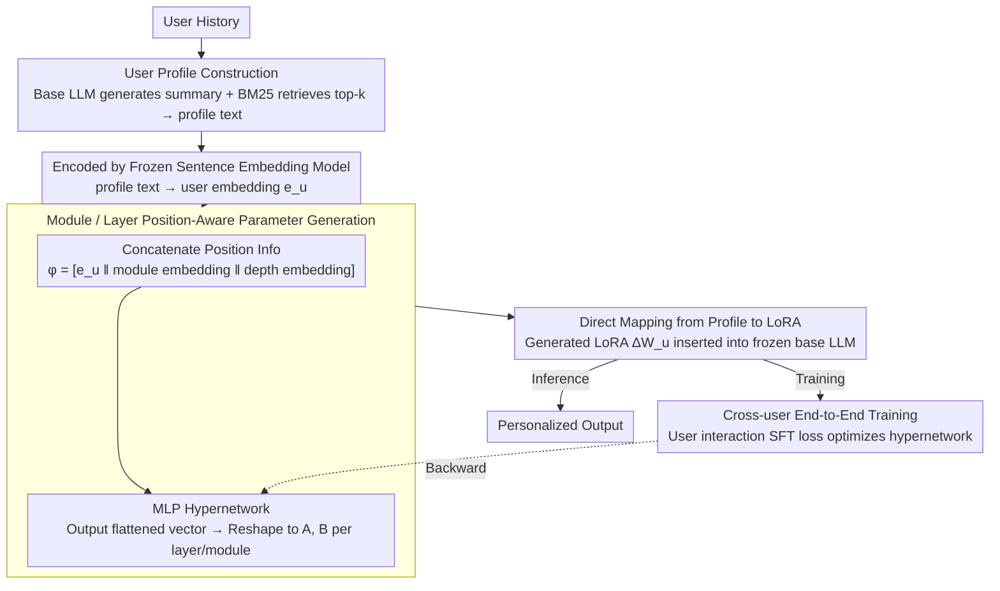

# Instant Personalized Large Language Model Adaptation via Hypernetwork

**Conference**: ACL2026  
**arXiv**: [2510.16282](https://arxiv.org/abs/2510.16282)  
**Code**: https://zhaoxuan.info/p2p.github.io/  
**Area**: LLM Personalization / Parameter-Efficient Fine-Tuning  
**Keywords**: Personalized Large Language Models, Hypernetwork, LoRA, PEFT, User Profile  

## TL;DR
Profile-to-PEFT (P2P) utilizes a hypernetwork to directly map user profiles to personalized LoRA parameters, avoiding the need for OPPU to retrain an adapter for every user. This achieves faster, more scalable LLM personalization that generalizes to unseen users.

## Background & Motivation
**Background**: There are two main paradigms for LLM personalization. Prompt-based methods incorporate user history, retrieval results, or user profiles into the prompt for in-context adaptation. PEFT-based methods encode user preferences into lightweight parameters, such as training a LoRA adapter for each user.

**Limitations of Prior Work**: Prompt-based methods expose user history to centralized LLMs and are susceptible to noise from irrelevant context. While one-PEFT-per-user (OPPU) methods are effective, they require separate adapter training for every user, which is prohibitively expensive for millions of users, real-time preference updates, or on-device deployment.

**Key Challenge**: Personalization requires "user-specific parameters," but industrial-scale systems cannot perform repeated gradient updates for every user. An ideal solution should retain the advantages of PEFT-based parametric personalization while being able to generate user parameters as quickly as a single forward pass.

**Goal**: The authors aim to learn a universal mapping from user profiles to PEFT parameters. After training on diverse users, the model can perform instant adaptation for unseen users during deployment without per-user fine-tuning.

**Key Insight**: This paper applies a hypernetwork to user-level PEFT generation. User history is first organized into a natural language summary and combined with retrieved relevant historical interactions, which are then encoded into embeddings. Based on the user embedding, layer depth embedding, and module embedding, the hypernetwork generates LoRA matrices for specific layers and modules.

**Core Idea**: Transforming "training one LoRA per user" into "training a network that generates LoRA," using a cross-user shared mapping function to instantly convert user profiles into personalized parameters.

## Method
The goal of P2P is to generate personalized PEFT parameters for any user at deployment time. Unlike OPPU, which runs optimization on test user history, P2P only requires a single forward pass of the user profile through the hypernetwork. This encodes user preferences into parameters while avoiding the overhead of stuffing long histories into the prompt for every call.

### Overall Architecture
The system first constructs a user profile. If a profile already exists in the dataset, it is used directly; otherwise, a base LLM generates a global preference summary from user history, and BM25 retrieves the top-k relevant historical interactions. These are concatenated into a profile text, which is then encoded into a user embedding $e_u$ via a frozen sentence embedding model.

To enable the hypernetwork to recognize "which layer and module to generate parameters for," the user embedding is concatenated with learnable module embeddings and depth embeddings. This position-aware representation is fed into an MLP hypernetwork, which outputs a flattened LoRA parameter vector, subsequently reshaped into $A$ and $B$ matrices for each target module/layer. During training, the generated LoRA is inserted into the frozen base LLM, and the hypernetwork is optimized end-to-end using SFT loss on subsequent user interactions.

### Key Designs
**1. Direct mapping from user profile to LoRA: Replacing "training one set of parameters per user" with "generating one set in a single forward pass"**

Prompt adaptation requires reading long user histories for every inference, while OPPU requires individual gradient optimization for each user—the former exposes raw history to centralized models, and the latter is cost-prohibitive for millions of users. P2P addresses this by compressing personalization into a single forward pass: the user profile $p_u$ is encoded into $e_u$, and the hypernetwork $f_\theta$ outputs all LoRA matrices $(A_u^{m,l}, B_u^{m,l})$ at once. The parameter set $\Delta W_u = Gen_\theta(p_u)$ is inserted into the frozen base LLM to complete adaptation. This reduces personalization overhead from "per-user training / per-inference history reading" to a constant-time forward pass, retaining PEFT's advantage of encoding preferences in parameters without repeated gradient updates.

**2. Position-aware parameter generation: Making the same user profile generate different LoRAs at different layers and projections**

Generating a single set of shared parameters from a user embedding ignores the functional differences between LLM layers and modules (e.g., q_proj vs v_proj). P2P feeds the hypernetwork a concatenated representation containing positional information: for each target position $(m, l)$, the input is $\phi_u^{m,l} = [e_u \,\|\, E_{mod}[m] \,\|\, E_{dep}[l]]$. By combining the user embedding with learnable module and depth embeddings, the MLP outputs position-specific LoRA parameters. This allows the generator to "know" which layer and module it is catering to, enabling position-based customization.

**3. Cross-user end-to-end training for generalization to unseen users: Learning "what profile should match what adapter" rather than memorizing training users**

The true value of a personalization system lies in instant adaptation to unseen users at deployment. P2P's training objective is to minimize the SFT loss on future user interactions after generating parameters from the profile across a diverse set of users:

$$\mathbb{E}_{u\sim\mathcal{U}}\big[\mathcal{L}_{SFT}(\Psi \oplus Gen_\theta(p_u),\, \mathcal{H}_u^{\ge t})\big]$$

Where $\Psi$ represents frozen base weights, $Gen_\theta(p_u)$ is the freshly generated LoRA for user $u$, and $\mathcal{H}_u^{\ge t}$ represents subsequent interactions. By training on a diverse user base, the hypernetwork learns universal patterns from profile semantics to adapter behavior, allowing it to provide appropriate parameters for unseen users in a single forward pass—a key reason P2P maintains high classification accuracy in OOD splits.

### Loss & Training
The authors use Qwen2.5-7B-Instruct as the primary base model and Qwen3-Emb-4B as the default embedding model. LoRA rank is set to 8, targeting q_proj and v_proj. P2P is trained for 20,000 steps with a learning rate of $2\times10^{-5}$ and a batch size of 32. Each batch mixes 4 personalization tasks, sampled by the square root of the dataset size to increase task diversity. Inference uses greedy decoding at temperature 0. Additional experiments were replicated on Qwen2.5-3B-Instruct.

## Key Experimental Results

### Main Results

| Setting | Method | Class. Acc↑ | Class. F1↑ | Gen. R-1↑ | Gen. R-L↑ | Avg. Inf. Time ms↓ |
|------|------|-----------|----------|-----------|-----------|------------------|
| Random split | Base | 0.505 | 0.496 | 0.287 | 0.207 | 31.97 |
| Random split | PAG | 0.565 | 0.564 | 0.312 | 0.214 | 66.85 |
| Random split | Full History | 0.575 | 0.566 | 0.310 | 0.224 | 461.83 |
| Random split | OPPU | 0.568 | 0.557 | 0.301 | 0.221 | 35.82 |
| Random split | P2P | 0.580 | 0.566 | 0.322 | 0.244 | 39.98 |
| OOD split | Base | 0.532 | 0.525 | 0.294 | 0.211 | 20.52 |
| OOD split | PAG | 0.562 | 0.563 | 0.329 | 0.234 | 61.66 |
| OOD split | Full History | 0.575 | 0.567 | 0.334 | 0.246 | 392.97 |
| OOD split | OPPU | 0.528 | 0.507 | 0.305 | 0.226 | 26.78 |
| OOD split | P2P | 0.581 | 0.563 | 0.326 | 0.243 | 28.64 |

P2P achieves the highest average classification Acc and generation R-1/R-L in the random split, outperforming OPPU without user-specific training. In the OOD split, P2P maintains the highest classification Acc and approaches the generation metrics of the strong prompt-based Full History method, while being an order of magnitude faster.

### Ablation Study

| Configuration | Class. Acc↑ | Class. F1↑ | Gen. R-1↑ | Gen. R-L↑ | Rating MAE↓ | Rating RMSE↓ |
|------|-----------|----------|-----------|-----------|-------------|--------------|
| P2P Full | 0.581 | 0.562 | 0.326 | 0.243 | 0.258 | 0.583 |
| Random user profile | 0.570 | 0.553 | 0.304 | 0.228 | 0.276 | 0.601 |
| Shuffle user profile | 0.535 | 0.521 | 0.307 | 0.223 | 0.322 | 0.692 |
| User summary only | 0.562 | 0.545 | 0.313 | 0.240 | 0.304 | 0.584 |
| Retrieved history only | 0.538 | 0.521 | 0.298 | 0.216 | 0.405 | 0.712 |
| Full history only | 0.541 | 0.526 | 0.302 | 0.217 | 0.392 | 0.740 |

### Key Findings
- In LLM-as-a-Judge open generation evaluations, P2P reached 2.21/2.15 (Random/OOD) on Personal Reddit and 2.03/1.65 on Empathetic Conversations, outperforming Base, PAG, and MT-LoRA.
- Deployment efficiency analysis shows that generating personalized parameters for OPPU LoRA takes 20.44s, while OPPU Prompt Tuning takes 18.78s. P2P takes only 0.57s, a ~33x speedup. The one-time training cost is 27,167s, amortizing after approximately 1,450 users.
- Embedding backbone ablation reveals that Qwen3-Emb-4B performs best. Qwen3-Emb-8B performed worse, suggesting that larger embedding models are not always better.
- User diversity is more critical than user quantity during training. Increasing cluster diversity improves OOD performance, while merely increasing the number of users yields diminishing returns.

## Highlights & Insights
- The paper extends hypernetworks from task-level adapter generation to user-level personalization, a natural yet highly practical step. A user profile is essentially a "task description" where the granularity is the individual.
- P2P's value goes beyond speed. By removing user history from the prompt, it reduces the centralized model's direct exposure to raw history and avoids repeated computations for long contexts.
- Ablations show that the user summary is the most critical personalization signal. "Retrieved history only" performed significantly worse, suggesting that future systems should prioritize long-term user profile construction over query-time retrieval alone.

## Limitations & Future Work
- The authors acknowledge that existing datasets usually cover only one task or platform per user (e.g., movie tagging only). Cross-domain profile generation (search, writing, shopping, social) has yet to be verified.
- The experiments focus on LoRA. While the framework claims compatibility with other PEFTs (Adapter, IA3, prefix tuning), different parameter forms may vary in generation difficulty and privacy risks.
- Privacy isn't automatically solved. Generated PEFT parameters are compressed representations of profiles and could be reverse-engineered; providers require additional encryption and leakage detection.
- Full History remains slightly stronger in OOD generation metrics, highlighting the informational advantage of reading the full context in certain tasks. Future work could explore hybrid P2P and lightweight retrieval prompt solutions.

## Related Work & Insights
- **vs Prompt-based personalization**: RAG/PAG/Full History do not require trained parameters but increase context length and history exposure; P2P writes preferences into parameters, making inference lighter and more suitable for on-device or privacy-sensitive scenarios.
- **vs OPPU**: OPPU trains directly on target user history, acting as an oracle but resulting in slow deployment. P2P does not train on test users yet approaches or exceeds OPPU across multiple metrics.
- **vs HyperLoRA / Text-to-LoRA**: These target task-level few-shot examples. P2P's insight is treating the user profile as the adapter generation condition, shifting from task generalization to user generalization.

## Rating
- Novelty: ⭐⭐⭐⭐☆ Using hypernetworks to generate PEFT is not entirely new, but its application to large-scale user-level personalization is highly targeted.
- Experimental Thoroughness: ⭐⭐⭐⭐☆ Coverage includes LaMP, LongLaMP, Personal Reddit, Empathetic Conversations, Random/OOD, efficiency, and multiple ablations.
- Writing Quality: ⭐⭐⭐⭐☆ Clear motivation and architecture diagrams. While tables are packed, conclusions are well-defined.
- Value: ⭐⭐⭐⭐⭐ Highly relevant for industrial-grade personalized LLMs, especially for on-device adapter generation and real-time preference updates.

<!-- RELATED:START -->

## Related Papers

- [\[ACL 2026\] SharedRequest: Privacy-Preserving Model-Agnostic Inference for Large Language Models](sharedrequest_privacy-preserving_model-agnostic_inference_for_large_language_mod.md)
- [\[ACL 2026\] TROJail: Trajectory-Level Optimization for Multi-Turn Large Language Model Jailbreaks with Process Rewards](trojail_trajectory-level_optimization_for_multi-turn_large_language_model_jailbr.md)
- [\[ACL 2026\] DualGuard: Dual-stream Large Language Model Watermarking Defense against Paraphrase and Spoofing Attack](dualguard_dual-stream_large_language_model_watermarking_defense_against_paraphra.md)
- [\[ICML 2026\] Differentially Private Preference Data Synthesis for Large Language Model Alignment](../../ICML2026/llm_safety/differentially_private_preference_data_synthesis_for_large_language_model_alignm.md)
- [\[ACL 2025\] Exploring Forgetting in Large Language Model Pre-Training](../../ACL2025/llm_safety/exploring_forgetting_in_large_language_model_pre-training.md)

<!-- RELATED:END -->
