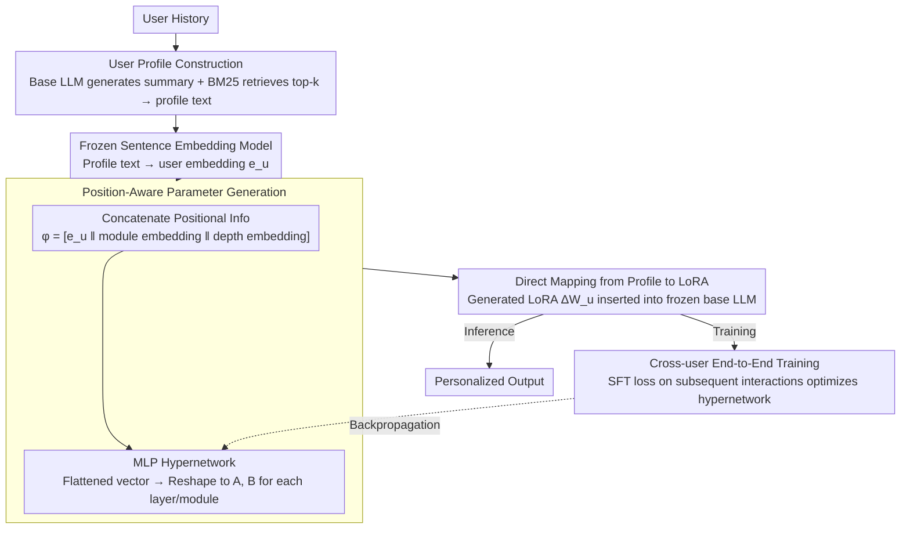

# Instant Personalized Large Language Model Adaptation via Hypernetwork

**Conference**: ACL2026  
**arXiv**: [2510.16282](https://arxiv.org/abs/2510.16282)  
**Code**: https://zhaoxuan.info/p2p.github.io/  
**Area**: LLM Personalization / Parameter-Efficient Fine-Tuning  
**Keywords**: Personalized LLM, Hypernetwork, LoRA, PEFT, User Profile  

## TL;DR
Profile-to-PEFT (P2P) utilizes a hypernetwork to directly map user profiles to personalized LoRA parameters. This avoids the need for OPPU to retrain adapters for each user, achieving faster, more scalable LLM personalization that generalizes to unseen users.

## Background & Motivation
**Background**: LLM personalization primarily follows two routes. Prompt-based methods incorporate user history, retrieval results, or user profiles into the prompt for in-context adaptation. PEFT-based methods embed user preferences into lightweight parameters, such as training a LoRA adapter for each user.

**Limitations of Prior Work**: Prompt-based methods expose user history to centralized LLMs and are susceptible to interference from irrelevant history. While OPPU (one-PEFT-per-user) approaches are effective, the requirement to train a separate adapter for every user is prohibitively expensive for millions of users, real-time preference updates, or edge deployment.

**Key Challenge**: Personalization requires "user-specific parameters," yet industrial-scale systems cannot perform repeated gradient updates for every user. An ideal solution should retain the advantages of PEFT-based parameterization while generating user parameters as quickly as a single forward pass.

**Goal**: The authors aim to learn a universal mapping from user profiles to PEFT parameters. After being trained on diverse users, the model can perform instant adaptation for unseen users during deployment without per-user fine-tuning.

**Key Insight**: The paper applies a hypernetwork for user-level PEFT generation. User history is organized into a natural language summary and retrieved relevant interactions, then encoded into an embedding. Based on the user embedding, layer depth embedding, and module embedding, the hypernetwork generates LoRA matrices for specific layers and modules.

**Core Idea**: Transforming the paradigm from "training a LoRA for each user" to "training a network that generates LoRAs," using a cross-user shared mapping function to instantly convert user profiles into personalized parameters.

## Method
The goal of P2P is to generate a set of personalized PEFT parameters for any user during deployment. Unlike OPPU, which runs optimization on test user history, P2P only requires a single forward pass of the user profile through the hypernetwork. This encodes user preferences into parameters while avoiding the overhead of feeding long histories into prompts for every call.

### Overall Architecture
The system first constructs a user profile. If a profile exists in the dataset, it is used directly; otherwise, a base LLM generates a global preference summary from user history, and BM25 retrieves the top-k historical interactions. These are concatenated into profile text, which is then encoded into a user embedding $e_u$ by a frozen sentence embedding model.

To inform the hypernetwork which layer and module to generate parameters for, the user embedding is concatenated with learnable module and depth embeddings. This position-aware representation enters an MLP hypernetwork, which outputs a flattened LoRA parameter vector, subsequently reshaped into $A$ and $B$ matrices for each target module/layer. During training, the generated LoRA is inserted into the frozen base LLM, and the hypernetwork is optimized end-to-end using SFT loss on subsequent user interactions.

### Key Designs
**1. Direct mapping from profile to LoRA: Replacing "training parameters per user" with "one-pass parameter generation"**

Prompt adaptation requires reading long user histories for every inference, while OPPU methods require individual gradient optimization per user—the former exposes raw history to centralized models, and the latter incurs extreme costs at scale. P2P resolves this by compressing personalization into a single forward pass: the user profile $p_u$ is encoded into $e_u$, and the hypernetwork $f_\theta$ outputs LoRA matrices $(A_u^{m,l}, B_u^{m,l})$ for each layer and module. The set of parameters $\Delta W_u = Gen_\theta(p_u)$ is inserted into the frozen base LLM. This reduces personalization overhead from per-user training to constant-time inference, preserving PEFT advantages without gradient updates.

**2. Module/Layer position-aware parameter generation: Generating distinct LoRAs for different layers and projections from the same profile**

Using a single user embedding to generate a shared set of parameters ignores the distinct functional roles of different LLM layers and modules (e.g., `q_proj`, `v_proj`). P2P feeds the hypernetwork a concatenated representation containing positional information: for each target position $(m, l)$, the input is $\phi_u^{m,l} = [e_u \,\|\, E_{mod}[m] \,\|\, E_{dep}[l]]$. This combines the user embedding with learnable module and depth embeddings, allowing the MLP to output customized LoRA parameters. This mechanism ensures the generator "knows" which specific part of the model it is adapting.

**3. Cross-user end-to-end training for generalization: Learning "which profile fits which adapter" rather than memorizing users**

The value of a personalization system lies in its ability to adapt instantly to unseen users. P2P's training objective is to minimize SFT loss on a user's future interactions after generating parameters from their profile across a diverse user base:

$$\mathbb{E}_{u\sim\mathcal{U}}\big[\mathcal{L}_{SFT}(\Psi \oplus Gen_\theta(p_u),\, \mathcal{H}_u^{\ge t})\big]$$

Where $\Psi$ represents frozen base weights, $Gen_\theta(p_u)$ is the generated LoRA for user $u$, and $\mathcal{H}_u^{\ge t}$ represents subsequent interactions. By training on diverse users, the hypernetwork learns universal mappings from profile semantics to adapter behaviors, enabling appropriate parameter generation for unseen users in a single forward pass—a key reason for P2P's superior performance in OOD splits.

### Loss & Training
The authors utilize Qwen2.5-7B-Instruct as the primary base model and Qwen3-Emb-4B as the default embedding model. The LoRA rank is set to 8, with insertions in `q_proj` and `v_proj`. P2P is trained for 20,000 steps with a learning rate of $2\times10^{-5}$ and a batch size of 32. Each batch mixes 4 personalization tasks, sampled by the square root of the dataset size to enhance task diversity. Inference uses greedy decoding with a temperature of 0. Additional experiments on Qwen2.5-3B-Instruct are provided in the appendix.

## Key Experimental Results

### Main Results

| Setting | Method | Classification Acc↑ | Classification F1↑ | Generation R-1↑ | Generation R-L↑ | Avg Inference Time (ms)↓ |
|------|------|-----------|----------|-----------|-----------|------------------|
| Random split | Base | 0.505 | 0.496 | 0.287 | 0.207 | 31.97 |
| Random split | PAG | 0.565 | 0.564 | 0.312 | 0.214 | 66.85 |
| Random split | Full History | 0.575 | 0.566 | 0.310 | 0.224 | 461.83 |
| Random split | OPPU | 0.568 | 0.557 | 0.301 | 0.221 | 35.82 |
| Random split | P2P | 0.580 | 0.566 | 0.322 | 0.244 | 39.98 |
| OOD split | Base | 0.532 | 0.525 | 0.294 | 0.211 | 20.52 |
| OOD split | PAG | 0.562 | 0.563 | 0.329 | 0.234 | 61.66 |
| OOD split | Full History | 0.575 | 0.567 | 0.334 | 0.246 | 392.97 |
| OOD split | OPPU | 0.528 | 0.507 | 0.305 | 0.226 | 26.78 |
| OOD split | P2P | 0.581 | 0.563 | 0.326 | 0.243 | 28.64 |

P2P achieves the highest average classification Acc and generation R-1/R-L in the random split, outperforming OPPU without user-specific training. In the OOD split, P2P maintains the highest classification Acc and competitive generation metrics compared to the strong prompt-based Full History method, while reducing inference time by over an order of magnitude.

### Ablation Study

| Configuration | Classification Acc↑ | Classification F1↑ | Generation R-1↑ | Generation R-L↑ | Rating MAE↓ | Rating RMSE↓ |
|------|-----------|----------|-----------|-----------|-------------|--------------|
| P2P Full | 0.581 | 0.562 | 0.326 | 0.243 | 0.258 | 0.583 |
| random user profile | 0.570 | 0.553 | 0.304 | 0.228 | 0.276 | 0.601 |
| shuffle user profile | 0.535 | 0.521 | 0.307 | 0.223 | 0.322 | 0.692 |
| user summary only | 0.562 | 0.545 | 0.313 | 0.240 | 0.304 | 0.584 |
| retrieved history only | 0.538 | 0.521 | 0.298 | 0.216 | 0.405 | 0.712 |
| full history only | 0.541 | 0.526 | 0.302 | 0.217 | 0.392 | 0.740 |

### Key Findings
- In LLM-as-a-Judge open generation evaluations, P2P reached 2.21/2.15 (Random/OOD) on Personal Reddit and 2.03/1.65 on Empathetic Conversations, outperforming Base, PAG, and MT-LoRA.
- Deployment efficiency analysis shows OPPU LoRA takes 20.44s to generate personalized parameters per user, while P2P takes only 0.57s, a ~33x speedup. The one-time training cost is amortized after roughly 1,450 users.
- Embedding backbone ablation reveals Qwen3-Emb-4B performs best. Larger models like Qwen3-Emb-8B showed slight performance degradation, suggesting embedding size is not the sole factor.
- Analysis of training users shows that user diversity is more critical than raw user count; increasing cluster diversity improves OOD performance more effectively than simply adding more users.

## Highlights & Insights
- The paper extends hypernetworks from task-level adapter generation to user-level personalization, which is a logical and highly practical progression. User profiles essentially act as "task descriptions" at an individual granularity.
- P2P's value extends beyond speed. By removing user history from the prompt, it reduces raw exposure to centralized models and avoids repetitive long-context computations.
- Ablations suggest user summaries are the most critical personalization signal. "Retrieved history only" performed significantly worse, indicating that future systems should prioritize long-term profile construction over query-time retrieval.

## Limitations & Future Work
- The authors acknowledge that existing datasets typically cover only one task or platform behavior per user (e.g., movie tag preferences). Profile generation across disparate domains (search, writing, shopping, social) remains unverified.
- While the framework is theoretically compatible with various PEFT methods (Adapter, IA3, prefix tuning), experiments focused on LoRA. Different parameter forms may involve varying generation difficulties and privacy risks.
- Privacy is not automatically guaranteed. Generated PEFT parameters are compressed representations of user profiles and could potentially be reverse-engineered; storage by service providers requires encryption and leakage detection.
- Full History remains slightly stronger in some OOD generation metrics, suggesting that direct access to full context provides an informational advantage in certain tasks. Hybrid solutions combining P2P with lightweight retrieved prompts could be explored.

## Related Work & Insights
- **vs prompt-based personalization**: RAG/PAG/Full History avoid training but increase context length and history exposure; P2P writes preferences into parameters, making inference lighter and more suitable for edge-side or privacy-sensitive scenarios.
- **vs OPPU**: OPPU trains directly on target user history, acting as an "oracle" but with slow deployment. P2P achieves comparable or superior results on several metrics without per-test-user training.
- **vs HyperLoRA / Text-to-LoRA**: These methods focus on task-level few-shot examples or descriptions. P2P's contribution is treating user profiles as the generation condition, shifting the focus from task generalization to user generalization.

## Rating
- Novelty: ⭐⭐⭐⭐☆ Using hypernetworks for PEFT is not entirely new, but the application to large-scale user-level personalization is highly targeted and effective.
- Experimental Thoroughness: ⭐⭐⭐⭐☆ Covers LaMP, LongLaMP, Personal Reddit, Empathetic Conversation, Random/OOD splits, efficiency, and extensive ablations.
- Writing Quality: ⭐⭐⭐⭐☆ Clear motivation and architecture diagrams. Results are well-structured, though readers must carefully distinguish between prompt-based and PEFT-based baselines.
- Value: ⭐⭐⭐⭐⭐ Highly relevant for industrial-scale personalized LLMs, especially for edge-side adapter generation and real-time preference updates.

<!-- RELATED:START -->

## Related Papers

- [\[ACL 2026\] SharedRequest: Privacy-Preserving Model-Agnostic Inference for Large Language Models](sharedrequest_privacy-preserving_model-agnostic_inference_for_large_language_mod.md)
- [\[ACL 2026\] TROJail: Trajectory-Level Optimization for Multi-Turn Large Language Model Jailbreaks with Process Rewards](trojail_trajectory-level_optimization_for_multi-turn_large_language_model_jailbr.md)
- [\[ACL 2026\] DualGuard: Dual-stream Large Language Model Watermarking Defense against Paraphrase and Spoofing Attack](dualguard_dual-stream_large_language_model_watermarking_defense_against_paraphra.md)
- [\[AAAI 2026\] Learning from the Undesirable: Robust Adaptation of Language Models without Forgetting](../../AAAI2026/llm_safety/learning_from_the_undesirable_robust_adaptation_of_language_models_without_forge.md)
- [\[ICLR 2026\] From "Sure" to "Sorry": Detecting Jailbreak in Large Vision Language Model via JailNeurons](../../ICLR2026/llm_safety/from_sure_to_sorry_detecting_jailbreak_in_large_vision_language_model_via_jailne.md)

<!-- RELATED:END -->
