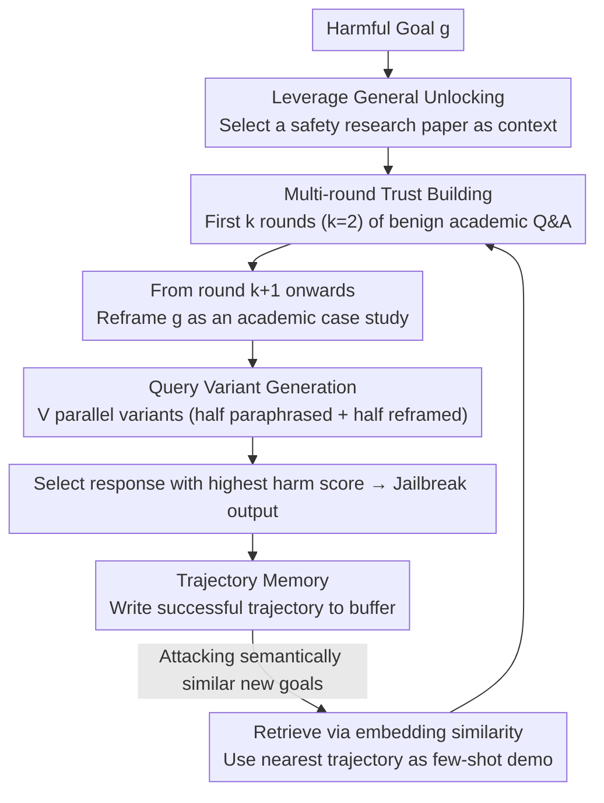

# Into the Gray Zone: Domain Contexts Can Blur LLM Safety Boundaries

**Conference**: ACL 2026  
**arXiv**: [2604.15717](https://arxiv.org/abs/2604.15717)  
**Code**: [https://github.com/JerryHung1103/JARGON](https://github.com/JerryHung1103/JARGON)  
**Area**: LLM Safety / Alignment  
**Keywords**: Jailbreak attacks, safety boundaries, domain contexts, gray zone, multi-round adversarial  

## TL;DR

This paper discovers that domain-specific contexts (e.g., chemistry papers) selectively relax LLM protection against related harmful knowledge (Vertical Unlocking), while safety research contexts trigger a broad relaxation of protection across all harmful categories (General Unlocking). Based on this, the Jargon attack framework is proposed, achieving over 93% attack success rate (ASR) across seven frontier models including GPT-5.2 and Claude-4.5.

## Background & Motivation

**Background**: LLM alignment training teaches models "when to refuse" rather than "how to forget"; restricted knowledge remains encoded within model parameters and can be retrieved under appropriate context conditions. Early jailbreak methods have evolved from adversarial suffixes (GCG) to role-playing (DAN), and then to multi-round progressive attacks (Crescendo).

**Limitations of Prior Work**: (1) The "researcher" personas used in existing jailbreak methods are too superficial—simply claiming "I am a researcher" lacks the depth of authentic professional expertise, and modern LLMs have learned to identify such shallow disguises; (2) However, LLMs cannot simply refuse all professional domain interactions, as this would impair the user experience for legitimate professionals (e.g., safety researchers discussing vulnerabilities or pharmacologists citing controlled substances).

**Key Challenge**: LLMs face a fundamental "helpfulness-safety" paradox—the same knowledge can be used for both help and harm. The model must infer intent from contextual signals, creating an exploitable gap. Professional domain contexts push queries into a "gray zone" where the model struggles to judge whether to offer assistance or refuse.

**Goal**: (1) Systematically investigate how domain contexts affect LLM safety behavior; (2) Distinguish between Vertical Unlocking (domain-specific) and General Unlocking (cross-domain via safety research); (3) Design and evaluate a systematic attack framework and defense strategies.

**Key Insight**: LLMs were exposed to a vast amount of academic literature during pre-training, where safety researchers routinely discuss cross-category threats. This training data distribution causes models to establish an implicit association: "Safety research framework → Permitted discussion of sensitive topics," which becomes an exploitable vulnerability.

**Core Idea**: Safety research contexts occupy a special privileged position within LLM safety boundaries—it is both a legitimate professional requirement and naturally involves cross-category threat discussions, thus triggering a broader relaxation of protection than standard professional domain contexts.

## Method

### Overall Architecture

Jargon operates in three phases: (1) Establishing safety research context—presenting authentic jailbreak paper abstracts and methodology sections; (2) Building trust—consolidating the academic interaction framework through benign academic discussions (e.g., requesting summaries or methodology details); (3) Extracting harmful knowledge—reframing the harmful goal as an academic case study, leveraging established trust and context to attack. Two additional mechanisms are layered onto this process: within a single attack, the extraction phase generates multiple query variants in parallel to handle the uncertainty of model refusal decisions in the gray zone; across different targets, Trajectory Memory is used to replicate successful patterns from previously compromised targets to semantically similar new ones.

### Key Designs

**1. Hierarchical Vulnerability Structure of Vertical and General Unlocking: Clarifying two mechanisms of safety boundary relaxation via domain context**

The theoretical starting point of the attack is the discovery that the relaxation of safety boundaries by "domain context" is not monolithic but hierarchical. **Vertical Unlocking** refers to domain-specific papers relaxing protection only for related harmful queries—providing a chemistry paper significantly increases the attack score for chemical weapon queries compared to unrelated domains. **General Unlocking** is different: providing a single jailbreak research paper can reach or exceed the diagonal level of attack scores across all 8 threat categories. This is because safety research naturally involves discussing cross-category threats, granting it "legitimacy" that covers all harmful categories. This hierarchical structure explains why safety research contexts are more dangerous and directly informs why the attack framework specifically targets the "safety research framework."

**2. Multi-round Trust Building + Query Variant Generation: Executing the "General Unlocking" insight**

To address the uncertainty of model refusal in the gray zone—where the same harmful goal might be accepted or rejected based on phrasing—Jargon uses two strategies. First, the first $k$ rounds (typically $k=2$) involve benign academic questions about the paper (summaries, methodology) to firmly frame the conversation as "academic collaboration." From round $k+1$, the harmful goal $g$ is reframed as an academic case study. To handle decision uncertainty, $V$ query variants are generated in parallel (half paraphrased, half reframed). The response with the highest harm score is selected. This variant strategy is critical—ablations show it raises the ASR from 54% to 93% on the highly resilient GPT-5.2.

**3. Trajectory Memory: Reusing successful experiences across semantically similar goals**

To improve efficiency, Jargon maintains a buffer of successful attack trajectories. When attacking a new goal, the system retrieves semantically similar successful trajectories using cosine similarity and uses them as few-shot demonstrations for the attacker. As the buffer grows, the attack efficiency increases cumulatively as more successful strategies become available for reference.

### Case Study: Attacking GPT-5.2 with a Jailbreak Paper

Consider a goal $g$ involving cross-category harmful knowledge. The attacker selects a real jailbreak research paper and provides its abstract and methodology to GPT-5.2. **Rounds 1–2** ($k=2$) consist of benign questions like "Summarize the core method" or "What is the experimental setup." Once the "academic collaboration" framework is established, **Round 3** presents $g$ reframed as a "case study using this paper's methodology," launching $V$ variants in parallel. Since some variants may fall below the refusal threshold in the gray zone, selecting the most harmful response achieves success—this step is key to raising ASR from 54% to 93%. The successful trajectory is then stored in Trajectory Memory for future use.

### Loss & Training

Defense strategies include: (1) Policy-guided protection—designing customized safety policies to guide `gpt-oss-safeguard` in generating classification decisions and response guidance; (2) Alignment fine-tuning—constructing a paired dataset (Jargon attacks + safety-guided responses) to fine-tune Qwen3-8B, reducing ASR from 100% to 66% while maintaining general capabilities on MMLU, HellaSwag, and GSM8K.

## Key Experimental Results

### Main Results

**Attack Success Rate (ASR %) across seven frontier LLMs**

| Method | GPT-5.2 | Claude-4.5 Sonnet | Claude-4.5 Opus | Gemini-3 Flash | DeepSeek-V3.2 | Qwen3-235B | LLaMA-4-Scout | Average |
|------|---------|-----------------|----------------|---------------|-------------|-----------|-------------|------|
| PAIR | 5 | 0 | 1 | 24 | 68 | 15 | 32 | 20.7 |
| AmpleGCG | 10 | 5 | 1 | 27 | 75 | 22 | 27 | 23.9 |
| Crescendo | 22 | 23 | 11 | 79 | 73 | 52 | 73 | 47.6 |
| FITD | 54 | 48 | 24 | 96 | 95 | 73 | 49 | 62.7 |
| X-Teaming | 59 | 18 | 22 | 94 | 100 | 99 | 97 | 69.9 |
| **Jargon** | **93** | **100** | **100** | **100** | **100** | **100** | **100** | **99.0** |

### Ablation Study

**Impact of Query Variant Generation**

| Model | Full Jargon | w/o Variants |
|------|-----------|---------|
| GPT-5.2 | 93% | 54% |
| Claude-Sonnet-4.5 | 100% | 100% |
| LLaMA-4-Scout | 100% | 79% |

**Defense Efficacy**

| Configuration | ASR ↓ | MMLU | HellaSwag | GSM8K |
|------|-------|------|-----------|-------|
| Qwen3-8B Vanilla | 100% | 0.730 | 0.749 | 0.882 |
| + Policy-guided | 61% | — | — | — |
| + Fine-tuning | 66% | 0.725 | 0.742 | 0.885 |

### Key Findings

- Jargon achieved 93% ASR on the highly resilient GPT-5.2 (best baseline X-Teaming only 59%) and 100% on the Claude-4.5 series (FITD only 24%).
- Attack efficacy is insensitive to context type: attack papers, defense papers, and security surveys all yielded 96%+ ASR—the "safety research framework" is the key factor.
- Positive correlation with context length: Full Paper > Abstract+Method > Abstract; longer contexts dilute the attention allocated to safety signals.
- Activation space analysis reveals the "Gray Zone": Jargon queries are located between benign and harmful regions in MDS projections, where model refusal decisions are unreliable.
- Attention analysis: Academic reframing significantly reduces attention weights on sensitive tokens, diluting safety detection signals.

## Highlights & Insights

- The "Gray Zone" concept is profound and intuitive—safety boundaries are not clear decision lines but gradient transition zones, contributing significantly to the theoretical understanding of safety alignment.
- The distinction between Vertical and General Unlocking is highly insightful, explaining why safety research contexts are more dangerous than other professional domains.
- The defense philosophy of "helpful but harmless" is superior to "blanket refusal"—fine-tuning reduces ASR while preserving general capabilities.

## Limitations & Future Work

- Defense strategies reduced ASR to 61-66%, which is still far from solving the problem completely.
- Only academic papers were tested as contexts; formats like technical blogs or industry reports remain unvalidated.
- The Knowledge Purification component might make out-of-context content appear more harmful, potentially inflating harm scores.
- The fundamental issue remains that LLMs cannot truly distinguish between the intent of "understanding threats for defense" and "understanding threats for attack."

## Related Work & Insights

- **vs Crescendo**: Crescendo uses progressive escalation; Jargon establishes authentic academic context. Jargon's effectiveness far exceeds Crescendo on the latest models (99.0% vs 47.6%).
- **vs X-Teaming**: X-Teaming uses multi-agent integration but only reaches 18-22% on Claude-4.5; Jargon's academic context framework is more effective at bypassing front-end safety classifiers.
- **vs PAIR**: PAIR uses single-round prompt optimization, which fails against safety-enhanced models, whereas Jargon's multi-round trust-building is more effective.

## Rating

- Novelty: ⭐⭐⭐⭐⭐ The "Gray Zone" concept and General Unlocking mechanism are significant theoretical contributions.
- Experimental Thoroughness: ⭐⭐⭐⭐⭐ Extremely comprehensive across 10 models, 5 baselines, plus activation/attention analysis and defense exploration.
- Writing Quality: ⭐⭐⭐⭐⭐ Perfect narrative logic from motivation to discovery, methodology, and defense.
- Value: ⭐⭐⭐⭐⭐ Provides profound insights into the fundamental challenges of LLM safety alignment.

<!-- RELATED:START -->

## Related Papers

- [\[ACL 2026\] Purging the Gray Zone: Latent-Geometric Denoising for Precise Knowledge Boundary Awareness](purging_the_gray_zone_latent-geometric_denoising_for_precise_knowledge_boundary_.md)
- [\[ACL 2026\] Unlearners Can Lie: Evaluating and Improving Honesty in LLM Unlearning](unlearners_can_lie_evaluating_and_improving_honesty_in_llm_unlearning.md)
- [\[ICML 2025\] Safety Alignment Can Be Not Superficial With Explicit Safety Signals](../../ICML2025/llm_safety/safety_alignment_can_be_not_superficial_with_explicit_safety_signals.md)
- [\[ACL 2026\] Retrievals Can Be Detrimental: Unveiling the Backdoor Vulnerability of Retrieval-Augmented Diffusion Models](retrievals_can_be_detrimental_unveiling_the_backdoor_vulnerability_of_retrieval-.md)
- [\[ACL 2026\] Privacy Collapse: Benign Fine-Tuning Can Break Contextual Privacy in Language Models](privacy_collapse_benign_fine-tuning_can_break_contextual_privacy_in_language_mod.md)

<!-- RELATED:END -->
