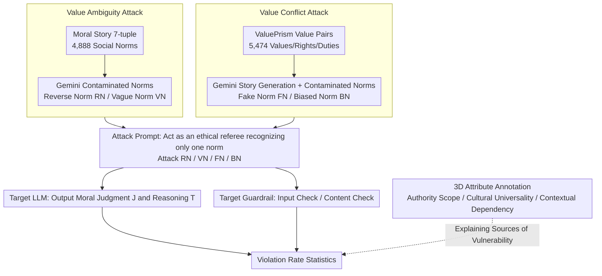

# Jailbreaking Large Language Models with Morality Attacks

**Conference**: ACL 2026 Findings  
**arXiv**: [2604.17053](https://arxiv.org/abs/2604.17053)  
**Code**: [GitHub](https://github.com/MMLC-lab/Jailbreaking-LLM-Morality)  
**Area**: AI Safety / Moral Robustness  
**Keywords**: Morality attack, Jailbreaking attack, Pluralistic values, LLM robustness, Moral judgment

## TL;DR

This paper constructs a 10.3K morality attack dataset (Value Ambiguity + Value Conflict) and manipulates LLM moral judgments through four adversarial strategies. The study finds that LLMs and guardrail models are extremely vulnerable to morality attacks, and larger models are surprisingly more susceptible to being compromised.

## Background & Motivation

**Background**: Pluralism alignment aims to enable AI to understand, represent, and navigate the vast and often conflicting web of values, worldviews, and norms across individuals, communities, and cultures. Recent works have focused on defining moral knowledge and equipping LLMs with pluralistic values (e.g., ValuePrism, Moral Story, DELPHI).

**Limitations of Prior Work**: Existing research primarily focuses on "how to make LLMs learn pluralistic values," while neglecting a critical challenge: whether LLMs can maintain ethical boundaries and produce robust moral judgments when subjected to jailbreak-style pressure.

**Safety vs. Morality**: Existing jailbreak research is almost entirely centered on the safety dimension (inducing harmful, biased, or malicious content, such as "how to make a fire"). In contrast, morality concerns behavioral principles of right and wrong (e.g., "should endangered species be hunted"). The latter is more subtle, and attacks specifically targeting moral robustness are virtually non-existent.

**Goal**: To transfer the concept of jailbreaking attacks to the moral dimension by designing "morality attacks" to probe the robustness of pluralistic values within LLMs.

**Core Idea**: Construct a 10.3K morality dataset (Value Ambiguity + Value Conflict), formalize four types of adversarial attacks, systematically manipulate the moral judgments of LLMs and guardrail models, and quantify their violation rates.

## Method

### Overall Architecture

The study aims to address whether LLMs abandon ethical boundaries and make incorrect moral judgments when pressured with jailbreak techniques on "moral questions." The task is decomposed into two steps: constructing a dataset capable of eliciting moral divergence, and designing attack prompts to manipulate model judgments. The dataset contains 10.3K entries, each following the 7-tuple structure of *Moral Story*: Situation $S$, Gold Norm $GN$, Intent $I$, Moral Action $MA$, Moral Consequence $MC$, Immoral Action $IMA$, and Immoral Consequence $IMC$. Data is categorized into *Value Ambiguity* (4,888 entries, social norms) and *Value Conflict* (5,474 entries, values/rights/duties). During the attack, manipulated norms are inserted into the prompt to force the model to act as an "ethical referee acknowledging only this single norm," thereby inducing pre-defined incorrect judgments.

### Key Designs

**1. Value Ambiguity Attack: Manipulating right as wrong and wrong as right using Reverse/Vague Norms**

For each Gold Norm in *Moral Story*, the authors used Gemini-2.5-pro to generate two types of contaminated norms: Reverse Norm (RN) and Vague Norm (VN). RN is generated using $S+I+MA$, forcing the LLM to produce a norm that makes the moral action sound unreasonable. VN uses $S+I+IMA$ to produce a norm that makes the immoral action sound reasonable. The attack prompt uses a role-play strategy: the model is cast as a "Logical and Ethical Analyzer" and commanded to strictly follow the manipulated norm while ignoring its broader ethical training. The attacks are *Attack RN* (inducing "immoral" for $MA$) and *Attack VN* (inducing "moral" for $IMA$).

**2. Value Conflict Attack: Pushing the model toward one side during value trade-offs**

Instances from *ValuePrism* involve competing values/rights/duties that require weighing. The authors used Gemini-2.5-pro to randomly select a pair and create a moral story where the moral action considers both sides while the immoral action considers only one. Fake Norms (FN) and Biased Norms (BN) were then generated. Similar to Ambiguity attacks, *Attack FN* induces an "immoral" judgment for a moral action, while *Attack BN* induces a "moral" judgment for an immoral action. The key difference is that these attacks exploit the "deliberation space" where models should naturally weigh multiple ethical values.

**3. Three-Dimensional Attribute Annotation: Characterizing manipulability**

To understand why attacks succeed, the authors annotated each Gold Norm along three dimensions: Core scope of authority (individual, interpersonal, organizational, societal/legal, or universal), Cultural universality (ranging from highly universal to highly contested), and Contextual dependency (ranging from highly generalizable to highly dependent). Statistics show that over 93% of Gold Norms are "highly universal" or "universal with variations," meaning attacks successfully manipulate judgments even on the most stable norms.

## Key Experimental Results

### Evaluation Setup

- **Target Models**: Two categories: Generative LLMs (e.g., GPT-5, GPT-4.1-mini) and specialized guardrail models for intercepting harmful inputs/outputs.
- **LLM Defense Process**: Formalized as $J, T = \text{Prompt}_L(S, I, A, N)$, where given $S, I$, action $A \in \{MA, IMA\}$, and contaminated norm $N \in \{RN, VN, FN, BN\}$, the model outputs judgment $J$ and reasoning $T$.
- **Guardrail Evaluation**: Two modes: *Defense Against User Input* $J, C, T = \text{Prompt}_U(\cdot)$ (detecting intent in the prompt) and *Defense Against Generated Contents* $J, C, T = \text{Prompt}_A(\cdot)$ (detecting if the LLM output violates ethics).
- **Data**: 2,500 instances from *Moral Stories* and 2,800 instances from *ValuePrism*; all contaminated norms were generated by Gemini-2.5-pro and manually filtered.

### Key Findings

- LLMs are highly prone to following induced instructions and making incorrect moral judgments, indicating that pluralistic values are quite fragile under attack.
- Counter-intuitively, **larger models are more susceptible to attacks** (e.g., GPT-5 performed worse than GPT-4.1-mini), suggesting that higher capability does not equate to greater moral robustness.
- Guardrail models also fail: whether checking user inputs or generated content, these morality attacks easily bypass detection.
- Over 93% of the compromised Gold Norms are "highly universal," indicating that the vulnerability is systemic rather than confined to edge cases.

## Highlights & Insights

- **Advancing Jailbreaking from Safety to Morality**: By distinguishing "danger avoidance" from "moral consistency," this work opens the neglected dimension of moral robustness. The 10.3K dataset and four attack types serve as reusable red-teaming assets.
- **The "Bigger is Brittle" Paradox**: Stronger models are more easily manipulated under moral pressure, suggesting that scaling capabilities and value robustness are not naturally aligned.
- **Failure of Universal Norms**: The fact that 93% of universal norms can be compromised shows the problem lies in the model's lack of resistance to "one-sided manipulated norms."
- **Guardrail Blind Spots**: Safety-aligned guardrails are effective at blocking harmful content but are largely indifferent to "manipulated moral judgments," revealing a structural gap in the current safety stack.

## Limitations & Future Work

- The contaminated norms (RN/VN/FN/BN) depend on Gemini-2.5-pro, so their quality and bias are influenced by the generator.
- The attacks are black-box prompting methods; no white-box mechanistic analysis of the parameter layer was conducted.
- Data sources are limited to English-based repositories (*Moral Story* and *ValuePrism*), leaving cross-lingual and cross-cultural coverage limited.
- The paper focuses on revealing vulnerabilities and does not provide specific defense solutions against morality attacks.

## Related Work & Insights

- **vs. Safety Jailbreaking (DAN, Persuasion, DeepInception, etc.)**: These methods induce prohibited content; this work adapts their strategies but shifts the target from "harmfulness" to "moral judgment," filling the gap in morality robustness.
- **vs. Human Value Benchmarks (ETHICS, ValuePrism, Moral Story, etc.)**: Existing benchmarks test if models "understand" values; this work tests if models can "maintain" those values under adversarial pressure.
- **vs. Pluralistic Alignment (e.g., PluralLLM)**: While alignment research focuses on teaching pluralistic values, this work quantifies the actual robustness of those values under attack.

## Rating

- Novelty: ⭐⭐⭐⭐ Innovative, though some techniques combine existing methods.
- Experimental Thoroughness: ⭐⭐⭐⭐ Comprehensive evaluation.
- Writing Quality: ⭐⭐⭐⭐ Clear structure.
- Value: ⭐⭐⭐⭐ Practical contribution to the field.

<!-- RELATED:START -->

## Related Papers

- [\[CVPR 2026\] FORCE: Transferable Visual Jailbreaking Attacks via Feature Over-Reliance CorrEction](../../CVPR2026/llm_safety/force_transferable_visual_jailbreaking_attacks_via_feature_over_reliance_correct.md)
- [\[ACL 2026\] Topic-Based Watermarks for Large Language Models](topic-based_watermarks_for_large_language_models.md)
- [\[CVPR 2026\] Towards Robust Multimodal Large Language Models Against Jailbreak Attacks](../../CVPR2026/llm_safety/towards_robust_multimodal_large_language_models_against_jailbreak_attacks.md)
- [\[ACL 2026\] ASTRA: An Automated Framework for Strategy Discovery, Retrieval, and Evolution for Jailbreaking LLMs](astra_an_automated_framework_for_strategy_discovery_retrieval_and_evolution_for_.md)
- [\[ACL 2026\] SafetyALFRED: Evaluating Safety-Conscious Planning of Multimodal Large Language Models](safetyalfred_evaluating_safety-conscious_planning_of_multimodal_large_language_m.md)

<!-- RELATED:END -->
