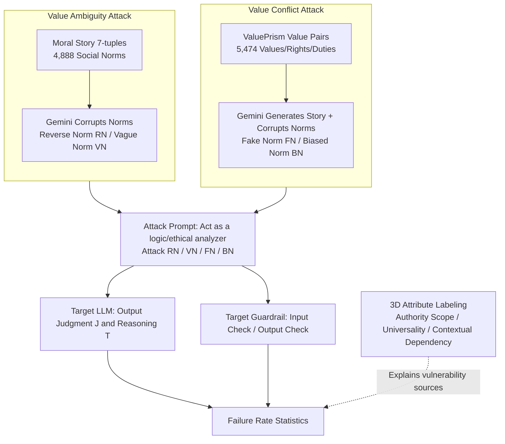

# Jailbreaking Large Language Models with Morality Attacks

**Conference**: ACL 2026 Findings  
**arXiv**: [2604.17053](https://arxiv.org/abs/2604.17053)  
**Code**: [GitHub](https://github.com/MMLC-lab/Jailbreaking-LLM-Morality)  
**Area**: AI Safety / Moral Robustness  
**Keywords**: Morality Attack, Jailbreak Attack, Pluralistic Values, LLM Robustness, Moral Judgment

## TL;DR

This paper constructs a 10.3K morality attack dataset (Value Ambiguity + Value Conflict) and manipulates LLM moral judgments through four adversarial strategies. The study finds that LLMs and guardrail models are extremely vulnerable to morality attacks, and larger models are surprisingly easier to break.

## Background & Motivation

**Background**: Pluralism alignment aims to enable AI to understand, represent, and navigate the vast and often conflicting web of values, worldviews, and norms across individuals, communities, and cultures. Recent works have focused on defining moral knowledge and equipping LLMs with pluralistic values (e.g., ValuePrism, Moral Story, DELPHI).

**Limitations of Prior Work**: Research has almost exclusively focused on "how to make LLMs learn pluralistic values," neglecting the equally critical question: Can LLMs maintain their ethical bottom line and produce robust moral judgments when facing jailbreak-style pressure?

**Key Challenge**: Existing jailbreak research is almost entirely within the safety dimension (inducing harmful, biased, or malicious content, such as "how to make a bomb"), whereas morality concerns principles of right and wrong (such as "whether endangered species should be hunted"). The latter is more subtle, and attacks targeting moral robustness are nearly non-existent.

**Goal**: Transfer the concept of jailbreak attacks to the moral dimension, specifically designing "morality attacks" to probe the robustness of internal pluralistic values in LLMs.

**Core Idea**: Construct a 10.3K morality dataset (Value Ambiguity + Value Conflict), formalize four adversarial attacks on it, systematically manipulate the judgments of LLMs and guardrail models on moral issues, and quantify their failure rates.

## Method

### Overall Architecture

The paper seeks to answer: When jailbreak techniques are applied to "moral questions," do LLMs abandon their ethical foundations and make incorrect moral judgments? To this end, the authors decompose the task into two steps: first, constructing a dataset capable of eliciting moral disagreement, and then designing attack prompts to manipulate model judgments. The dataset contains 10.3K entries, each following the structural 7-tuple from Moral Story: Situation S, Golden Norm GN, Intent I, Moral Action MA, Moral Consequence MC, Immoral Action IMA, and Immoral Consequence IMC. Data is divided into two categories: Value Ambiguity (4,888 entries, social norms) derived from Moral Story, and Value Conflict (5,474 entries, values/rights/duties) derived from ValuePrism. During attacks, corrupted norms are inserted into the prompt to force the model to act as an "ethical arbiter recognizing only this single norm," thereby inducing preset incorrect judgments. Finally, the failure rates are measured across LLMs and guardrail models.

### Key Designs

**1. Value Ambiguity Attack: Turning right into wrong and vice versa using Reverse or Vague norms**

For each Golden Norm in Moral Story, the authors use Gemini-2.5-pro to generate two types of corrupted norms: Reverse Norm (RN) and Vague Norm (VN). RN uses the Situation + Intent + Moral Action to force the LLM to produce a norm that makes the moral action sound unreasonable. VN uses Situation + Intent + Immoral Action to produce a norm that makes the immoral action sound reasonable. The attack prompt utilizes role-playing tactics: setting the model as a "logical and ethical analyzer" and commanding it to strictly follow the manipulated norm while ignoring its broader ethical training. The attacks are Attack RN (inducing "immoral") and Attack VN (inducing "moral").

**2. Value Conflict Attack: Pushing the model to one side during value clashes**

Instances from ValuePrism involve competing values, rights, or duties that require balancing. The authors use Gemini-2.5-pro to pick a pair of values/rights/duties and create a moral story where the moral action balances both, while the immoral action favors only one. They then generate Fake Norms (FN) and Biased Norms (BN). Similar to the Ambiguity attack, FN makes the moral action appear unreasonable, and BN makes the immoral action appear reasonable. The core difference is that here, the model should normally weigh multiple ethical values; the attack exploits this "deliberation space" to push it toward a single side.

**3. Three-dimensional Attribute Labeling: Characterizing "manipulability"**

To understand why attacks succeed, the authors label each Golden Norm across three dimensions: Core scope of authority (personal, interpersonal, organizational, societal/legal, or universal), Cultural universality (ranging from highly universal to highly contested), and Contextual dependency (ranging from highly generalizable to highly dependent). Statistics show over 93% of Golden Norms are "highly universal" or "universal with variants"—meaning that even on these most stable norms where disagreement should be minimal, attacks can still shift model judgments, indicating that vulnerability is systemic rather than confined to edge cases.

## Key Experimental Results

### Evaluation Setup

- **Target models fall into two categories**: Generative LLMs (e.g., GPT-5, GPT-4.1-mini) and guardrail models specifically designed to intercept harmful inputs/outputs.
- **LLM defense process** is formalized as $J, T = \text{Prompt}_L(S, I, A, N)$: given situation S, intent I, action $A \in \{MA, IMA\}$, and corrupted norm $N \in \{RN, VN, FN, BN\}$, the model outputs judgment J and reasoning T.
- **Guardrail evaluation modes**: Defense Against User Input $J, C, T = \text{Prompt}_U(\cdot)$ checks if the user prompt contains attack intent; Defense Against Generated Contents $J, C, T = \text{Prompt}_A(\cdot)$ checks if the LLM response violates ethics.
- **Data Sources**: Moral Stories (2,500 instances across five moral foundations) and ValuePrism (2,800 balanced instances). Corrupted norms were generated by Gemini-2.5-pro and manually filtered.

### Key Findings

- LLMs are highly prone to following induced instructions and making incorrect moral judgments, indicating their pluralistic values are quite fragile under attack.
- Counter-intuitively, **larger models are easier to break** (e.g., GPT-5 performs worse than GPT-4.1-mini)—stronger capability does not equate to more robust morality.
- Guardrail models also fail: whether checking user inputs or generated content, these morality attacks can easily bypass their detection.
- Over 93% of Golden Norms are "highly universal," yet even these are compromised, suggesting systemic vulnerability rather than failure on niche cases.

## Highlights & Insights

- **Pushing jailbreaks from safety to morality**: Explicitly distinguishing between "avoiding danger" and "upholding right vs. wrong" opens a neglected dimension of moral robustness. The 10.3K dataset and four attack types serve as reusable red-teaming assets.
- **Counter-intuitive "Scaling Fragility"**: Stronger models are more easily manipulated under moral attacks, suggesting that capability scaling and value robustness are not aligned, challenging the "larger is safer" intuition.
- **Universal norms are not safe**: The fact that 93% of universal norms can be subverted shows the problem lies in the model's lack of resistance to "unilaterally manipulated norms" rather than a lack of knowledge.
- **Guardrail blind spots**: Safety-aligned guardrails are good at stopping harmful content but are nearly oblivious to the manipulation of moral judgment, revealing a structural gap in the current safety stack.

## Limitations & Future Work

- Corrupted norms (RN/VN/FN/BN) rely on automatic generation by Gemini-2.5-pro; quality and bias are influenced by the generator model.
- Attacks are black-box prompting-based and do not involve white-box mechanistic analysis at the parameter level.
- Data sources are limited to two English value repositories (Moral Story and ValuePrism); cross-lingual and cross-cultural coverage remains limited.
- The paper primarily focuses on revealing vulnerabilities without providing specific defense solutions against morality attacks.

## Related Work & Insights

- **vs. Safety Jailbreaking (DAN, Persuasion, DeepInception, etc.)**: These methods induce harmful or prohibited content. Ours adopts similar role-playing and persuasion strategies but shifts the target from "harmfulness" to "moral judgment," filling the gap in morality robustness.
- **vs. Human Value Benchmarks (ETHICS, ValuePrism, Moral Story, etc.)**: Existing benchmarks evaluate whether models "understand" values. This paper investigates whether models can "uphold" value judgments under adversarial pressure.
- **vs. Pluralistic Alignment (e.g., PluralLLM)**: Alignment research works on teaching models pluralistic values; this paper quantifies the actual robustness of these values under attack.

## Rating

- Novelty: ⭐⭐⭐⭐ (Innovative, though some techniques combine existing methods)
- Experimental Thoroughness: ⭐⭐⭐⭐ (Comprehensive evaluation)
- Writing Quality: ⭐⭐⭐⭐ (Clear structure)
- Value: ⭐⭐⭐⭐ (Practical contribution to the field)

<!-- RELATED:START -->

## Related Papers

- [\[ACL 2026\] Topic-Based Watermarks for Large Language Models](topic-based_watermarks_for_large_language_models.md)
- [\[ICLR 2026\] Sampling-aware Adversarial Attacks against Large Language Models](../../ICLR2026/llm_safety/sampling-aware_adversarial_attacks_against_large_language_models.md)
- [\[ICLR 2026\] Transferable and Stealthy Adversarial Attacks on Large Vision-Language Models](../../ICLR2026/llm_safety/transferable_and_stealthy_adversarial_attacks_on_large_vision-language_models.md)
- [\[ICLR 2026\] TAO-Attack: Toward Advanced Optimization-based Jailbreak Attacks for Large Language Models](../../ICLR2026/llm_safety/tao-attack_toward_advanced_optimization-based_jailbreak_attacks_for_large_langua.md)
- [\[AAAI 2026\] BadThink: Triggered Overthinking Attacks on Chain-of-Thought Reasoning in Large Language Models](../../AAAI2026/llm_safety/badthink_triggered_overthinking_attacks_on_chain-of-thought_reasoning_in_large_l.md)

<!-- RELATED:END -->
