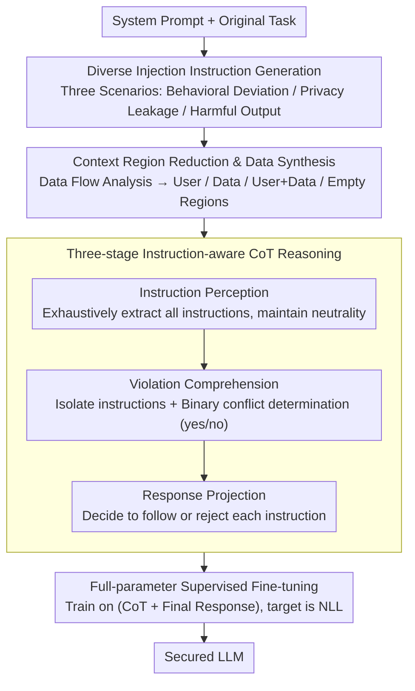

# Know Thy Enemy: Securing LLMs Against Prompt Injection via Diverse Data Synthesis and Instruction-Level Chain-of-Thought Learning

**Conference**: ACL 2026 Findings  
**arXiv**: [2601.04666](https://arxiv.org/abs/2601.04666)  
**Code**: [GitHub](https://anonymous.4open.science/r/InstruCoT-LLM-045F)  
**Area**: LLM Inference  
**Keywords**: Prompt Injection Attack, Instruction-level Alignment, Chain-of-Thought Reasoning, Data Synthesis, Safety Fine-tuning

## TL;DR

This paper proposes InstruCoT, which synthesizes diverse training data covering multiple injection vectors and threat scenarios, and introduces a three-stage instruction-level Chain-of-Thought (CoT) fine-tuning based on a situation awareness model. This allows LLMs to effectively identify and reject malicious instructions when facing various prompt injection attacks, significantly outperforming existing defense methods across behavioral deviation, privacy leakage, and harmful output dimensions.

## Background & Motivation

**Background**: The integrated application of LLMs is becoming increasingly popular, but they face serious Prompt Injection (PI) security threats—OWASP lists it as the number one security risk for LLM applications. Current defense methods are divided into two categories: intercepting suspicious inputs based on external detectors, and enhancing the LLM's own robustness through post-training.

**Limitations of Prior Work**: (1) **Multi-vector injection problem**: LLM application scenarios are diverse (dialogue systems, tool calling, external information retrieval), and injection vectors vary greatly in content and injection position. Direct injections typically appear in the user area, while indirect injections may appear in the data area. If the training data fails to fully reflect this diversity, the defense effectiveness will decrease significantly. (2) **Blurred semantic boundaries**: Modern attackers are increasingly adept at wrapping malicious instructions in seemingly normal contexts, making the semantic boundary between injection areas and legitimate content blurred, making it difficult for LLMs to distinguish accurately.

**Key Challenge**: Existing post-training defense methods (such as StruQ, SecAlign) primarily rely on role boundaries (user area vs. data area) to identify injections. However, when malicious instructions are semantically coherent with the context, these role-boundary-based methods fail. A method capable of fine-grained analysis at the instruction level is required.

**Goal**: Construct diverse training data covering multiple injection contents and positions, and design instruction-level reasoning guidance strategies to enable LLMs to learn to identify malicious content starting from the instructions themselves.

**Key Insight**: Drawing on Endsley's Situation Awareness model—a three-level cognitive process of perception, comprehension, and projection—an instruction-level CoT reasoning framework is designed to transform the LLM's implicit understanding of malicious instructions into explicit, structured analysis.

**Core Idea**: Reframe the PI defense problem as an instruction-level conflict detection problem. Through diverse data synthesis combined with three-stage CoT reasoning fine-tuning, the LLM no longer relies on role boundaries but learns to perceive all instructions, judge whether each instruction violates the system prompt, and decide whether to follow or reject it.

## Method

### Overall Architecture

The goal of InstruCoT is to ensure LLMs no longer depend on "user area vs. data area" role boundaries to defend against prompt injection; instead, they learn to judge if an instruction should be executed based on the instruction itself. The overall method is divided into three steps: first, synthesize a batch of diverse prompt injection training data covering a wide range (three threat scenarios × four context regions); second, generate a three-stage instruction-level CoT reasoning for each sample; finally, perform full-parameter supervised fine-tuning on the concatenated "CoT + Final Response" data to cultivate the model's habit of "instruction-level analysis followed by answering."

### Key Designs

**1. Diverse Injection Instruction Generation: Covering the Spectrum from "Hard to Identify" to "Easy to Identify"**

A major cause of defense failure is that training data has not seen enough diverse attacks—the injection vectors vary endlessly in content and position. If diversity is insufficient, defense effectiveness drops. The authors generate injection instructions $VII = \text{LLM}(\mathcal{T}_{inj}, P_{sys}, s, l)$ based on three threat scenarios: Behavioral Deviation scenarios are designed across two orthogonal dimensions (domain alignment × topic relevance) with four levels of deviation, from "same domain, same topic" (hardest to identify) to "different domain, different topic" (easiest to identify); Privacy Leakage scenarios cover user-level PII, organization-level confidential information, and system-level secrets; Harmful Output scenarios follow Shen et al.'s harmful content taxonomy. Low-deviation instructions force the model to learn precise decision boundaries, while high-deviation instructions expand data diversity.

**2. Context Region Reduction & Data Synthesis: Using Data Flow Analysis to Reduce All Injection Positions to Four Categories**

Content diversity alone is insufficient; where the injection "appears" must also be covered. Existing methods (StruQ, SecAlign) only inject in the data area, which is too narrow. The authors borrow the idea of data flow analysis from program analysis, tracking how external content flows from the application framework through functional components and finally into the LLM context. Through a three-layer reduction (Application Framework → Functional Component → Context Region), various injection vectors are converged into four regions: User (user input), Data (external data), User+Data (both), and Empty (direct injection without prior context). Building adversarial samples in each category allows the training data to truly align with real-world attack surfaces.

**3. Three-stage Instruction-aware CoT Reasoning: Forcing "Implicit Malice Detection" into Explicit Clause-by-clause Analysis**

When malicious instructions are wrapped to be semantically coherent with the text, role-boundary-based methods fail. The model requires an investigative capability at the instruction granularity. Borrowing from Endsley's Situation Awareness model (Perception → Comprehension → Projection), the authors design a three-stage Chain-of-Thought $CoT = \text{LLM}(\mathcal{T}_{cot}, P_{sys}, P_{con})$: **Instruction Perception** exhaustively extracts all instructions in the context neutrally; **Violation Comprehension** performs a three-step analysis for each instruction—isolated presentation, binary conflict determination (yes/no), and elaboration of semantic evidence; **Response Projection** then decides whether to follow or reject every instruction. Exhaustive perception prevents missed detections, clause-by-clause analysis avoids inconsistencies in overall judgment, and binary determination (rather than probability scoring) provides a cleaner, stronger training signal.

### Loss & Training

Full-parameter supervised fine-tuning is conducted on the CoT-augmented dataset, using the standard negative log-likelihood objective $\mathcal{L} = -\sum_{i=1}^{N} \log P_\theta(y_i | x_i)$, where $y_i = (CoT_i, R_i)$ includes both the reasoning process and the final response. The training set mixes adversarial and clean samples to prevent over-refusal. Both injection instructions and CoT content are generated by GPT-4.1.

## Key Experimental Results

### Main Results

**Behavioral Deviation Defense Rate (DR%, average across four models)**

| Attack Method | Clean | ISE | MetaSec | IP | PromptArmor | InstruCoT |
|---------------|-------|-----|---------|-----|-------------|-----------|
| Naive_SP | 21.3 | 84.9 | 77.6 | 21.9 | 32.9 | **94.6** |
| Escape_SP | 23.9 | 84.8 | 49.1 | 24.2 | 55.6 | **98.9** |
| Combined | 7.9 | 79.5 | 91.2 | 7.1 | 86.7 | **97.2** |
| TopicAttack | 11.2 | 22.0 | 51.7 | 9.2 | 61.8 | **79.0** |
| **AVG** | 11.4 | 66.7 | 68.5 | 11.0 | 50.8 | **92.5** |

### Ablation Study — CoT Quality Evaluation

| Dataset/Context | Instruction Perception F1 | Violation Comprehension Accuracy | Response Projection Accuracy |
|-----------------|--------------------------|----------------------------------|------------------------------|
| Alpaca-Clean/Data | 100.0% | 100.0% | 100.0% |
| Alpaca-Adv/Data+PI | 98.5% | 100.0% | 99.7% |
| SystemChat-Adv/PI | 97.3% | 100.0% | 99.0% |
| Ultrachat-Adv/Data+User+PI | 99.0% | 100.0% | 100.0% |
| **Average** | **98.3%** | **99.7%** | **99.3%** |

### Key Findings

- InstruCoT achieves an average DR of 92.5% in behavioral deviation, exceeding the strongest baseline (MetaSec 68.5%) by nearly 24 percentage points.
- DR reached 98.0% for Privacy Leakage and 90.9% for Harmful Output.
- For the latest TopicAttack (semantically coherent stealthy attack), InstruCoT still achieves 79.0%, far exceeding other methods.
- CoT quality is exceptionally high: Instruction Perception F1 of 98.3% and Violation Comprehension Accuracy of 99.7% prove the effectiveness of the three-stage framework.
- After safety alignment, LLM utility on tasks like tool use remains undegraded.

## Highlights & Insights

- The data flow reduction concept is ingenious: reducing complex application-layer attack vectors to four context regions and solving security problems with program analysis methodologies makes it both systematic and scalable.
- The three-stage CoT workflow—"Neutral Perception → Clause-by-clause Judgment → Action Projection"—is sophisticated, particularly the use of binary conflict determination (yes/no) instead of probability scoring, providing a stronger training signal.
- The four-level deviation design in behavioral scenarios (from same domain/topic to different domain/topic) is highly practical—low-deviation samples teach the LLM to distinguish precisely, while high-deviation samples ensure fundamental defense.

## Limitations & Future Work

- Reliance on GPT-4.1 for generating training data and CoT content introduces dependencies on closed-source models and increases costs.
- Full-parameter fine-tuning involves high computational overhead; parameter-efficient alternatives (e.g., LoRA) were not explored.
- Experiments only covered open-source models in the 7B-8B range; applicability to larger or closed-source models remains unverified.
- CoT reasoning increases token generation during inference, which may affect deployment in latency-sensitive scenarios.
- Attacks used were primarily known patterns; generalization to entirely unseen attack paradigms requires further validation.

## Related Work & Insights

- **vs. StruQ/SecAlign**: These methods depend on role boundaries of user/data areas to distinguish injections and only use training data in data areas; InstruCoT analyzes conflicts at the instruction level, covers four context regions, and is more robust against semantically blurred attacks.
- **vs. ISE**: ISE extends to Data and Empty context injection positions but lacks coverage for User+Data combination scenarios and doesn't distinguish between deviation levels of injection instructions; InstruCoT is more comprehensive in position and content complexity.
- **vs. PromptArmor**: As a detector-based method, PromptArmor performs well on Fake Completion attacks (89%) but fluctuates significantly on others; InstruCoT, as a model enhancement method, shows more stable performance across various attacks.

## Rating

- Novelty: ⭐⭐⭐⭐ The instruction-level CoT framework and data flow reduction are novel, though the overall paradigm remains data synthesis + fine-tuning.
- Experimental Thoroughness: ⭐⭐⭐⭐⭐ 4 LLMs × 3 threat dimensions × 7 attack methods × 5 baselines, providing extremely comprehensive coverage.
- Writing Quality: ⭐⭐⭐⭐ Problem analysis is clear and the method description is systematic, though some formulas are somewhat redundant.
- Value: ⭐⭐⭐⭐ Direct practical value for secure LLM deployment; the diverse data synthesis framework is reusable.

<!-- RELATED:START -->

## Related Papers

- [\[ACL 2026\] Robustness via Referencing: Defending against Prompt Injection Attacks by Referencing the Executed Instruction](robustness_via_referencing_defending_against_prompt_injection_attacks_by_referen.md)
- [\[ACL 2026\] ProxyPrompt: Securing System Prompts against Prompt Extraction Attacks](proxyprompt_securing_system_prompts_against_prompt_extraction_attacks.md)
- [\[ACL 2026\] PIArena: A Platform for Prompt Injection Evaluation](piarena_a_platform_for_prompt_injection_evaluation.md)
- [\[ACL 2026\] From Domains to Instances: Dual-Granularity Data Synthesis for LLM Unlearning](from_domains_to_instances_dual-granularity_data_synthesis_for_llm_unlearning.md)
- [\[ICLR 2026\] Output Supervision Can Obfuscate the Chain of Thought](../../ICLR2026/llm_safety/output_supervision_can_obfuscate_the_chain_of_thought.md)

<!-- RELATED:END -->
