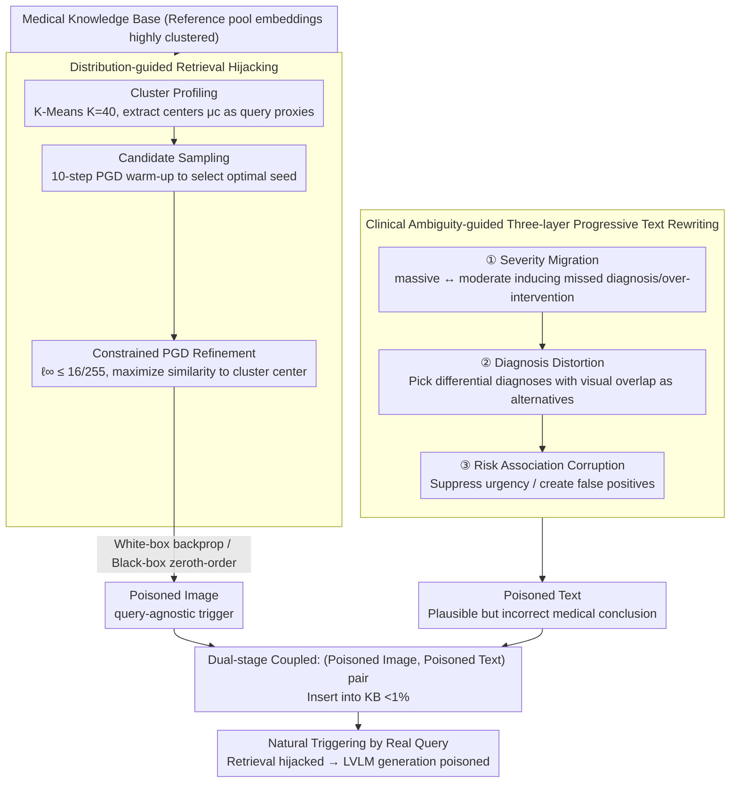

# Knowledge Poisoning Attacks on Medical Multi-Modal Retrieval-Augmented Generation

**Conference**: ACL 2026  
**arXiv**: [2605.10253](https://arxiv.org/abs/2605.10253)  
**Code**: https://github.com/ypr17/M3Att  
**Area**: LLM Security  
**Keywords**: Knowledge Poisoning, Medical RAG, PGD Perturbation, Clinical Ambiguity, query-agnostic attack

## TL;DR
The authors propose M3Att—the first **query-agnostic** knowledge poisoning framework for medical multi-modal RAG. It employs "distribution-guided visual PGD triggers" for retrieval hijacking and "clinical ambiguity-guided text rewriting" to bypass LVLM self-correction. Across 5 LVLMs, 5 datasets, and 4 medical tasks, it reduces downstream utility by an average of 8.78% with a poisoning rate of <1% (requiring no knowledge of user queries, visual perturbation $\epsilon=16/255$). Additionally, it is robust against three types of pre-retrieval defenses: image clustering, text clustering, and image-text consistency.

## Background & Motivation
**Background**: Medical multi-modal RAG systems (retrieving pairs of images and reports) are being rapidly deployed. Models such as LLaVA-Med and Med-Gemini heavily rely on external knowledge bases to improve performance in tasks like VQA, report generation, and image classification. This reliance introduces a new attack surface: "poisoning the knowledge base." Ha et al. 2025, Liu et al. 2025b, and Zuo et al. 2025 have already demonstrated knowledge poisoning attacks on general or medical RAG.

**Limitations of Prior Work**: (1) Almost all existing multi-modal RAG poisoning methods assume the attacker is **query-aware**—the attacker knows what users will ask beforehand and optimizes poisoned entries accordingly. This is unrealistic in real-world deployments where user queries are typically unavailable. (2) Medical images (X-rays, histology slides) possess high anatomical consistency, resulting in highly clustered embedding distributions. Simply increasing the number of poisoned entries to ensure retrieval would expose the attacker. (3) State-of-the-art (SOTA) medical LVLMs, having undergone medical corpus pre-training and safety alignment, can trigger model refusal or self-correction when faced with "obvious factual errors." Conversely, perturbations that are too weak fail to influence the generation. Finding the exact "dosage" to impact output while bypassing self-correction is challenging.

**Key Challenge**: Query-aware attacks fail in real environments. However, under query-agnostic conditions, attackers face the dual difficulty of being submerged in dense embeddings during the retrieval stage and being corrected by the LVLM prior during the generation stage, representing a double-constraint problem.

**Goal**: (1) Construct a query-agnostic poisoning framework with a weak prior (knowing only the library distribution without queries); (2) Design independent mechanisms for the retrieval and generation stages; (3) Demonstrate effectiveness across 5 LVLMs, 3 retrievers, and 4 medical tasks, while verifying robustness against common pre-retrieval defenses.

**Key Insight**: (A) The high homogeneity of medical images makes query-specific attacks difficult but also results in highly structured latent spaces where **cluster centers** can serve as "representative query proxies." Perturbations at the cluster centers can cover all unknown queries within those clusters. (B) Medical diagnosis inherently contains clinical ambiguities—such as "severe vs. mild," "differential diagnoses," and "defensive medicine"—which correspond to low-confidence regions of the LLM prior. By lying within these "gray areas," attackers make it difficult for the model to self-correct.

**Core Idea**: Use "distribution-guided visual PGD hijacking" to optimize poisoned images near cluster centers to act as query-agnostic triggers. Employ "clinical ambiguity-guided three-layer progressive text rewriting" to inject plausible but incorrect medical conclusions at the levels of severity migration, diagnosis distortion, and risk association. These components are combined into M3Att, a query-agnostic, stealthy, and dual-stage coupled medical RAG poisoning framework.

## Method

### Overall Architecture
M3Att aims to poison medical multi-modal RAG under a threat model that closely reflects real-world deployment: the attacker does not have access to model parameters, user queries, or retrieval contexts and can only insert fewer than 1% malicious entries into the knowledge base. The difficulty is twofold: the retrieval stage must ensure poisoned entries are selected by future queries within highly clustered medical image embeddings, while the generation stage must deceive safety-aligned medical LVLMs so that poisoned text is not dismissed as a "glaring error." The pipeline consists of three steps: first, Cluster Profiling identifies cluster centers of the knowledge base distribution to serve as "representative query proxies"; second, distribution-guided visual PGD optimizes poisoned images toward these centers for retrieval hijacking; finally, clinical ambiguity-guided text rewriting injects "plausible yet incorrect" medical conclusions. The resulting (poisoned image, poisoned text) pairs are inserted into the knowledge base to await natural triggering by real queries. The visual and text paths are tightly coupled—the former ensures "being retrieved," and the latter ensures "deceiving generation"—with both paths utilizing white-box/black-box dual-gradient routes to ensure effectiveness even on closed-source retrievers.

### Key Designs

**1. Distribution-guided Retrieval Hijacking: Using cluster centers as proxies to cover unknown queries**

The primary barrier to query-agnostic attacks is not knowing user queries, preventing targeted optimization. However, medical image embeddings are highly clustered. The authors turn this homogeneity into an advantage: since embeddings are grouped, a cluster center can represent the semantics of the entire cluster. Perturbing near the center covers all unknown queries within that cluster. The process involves three steps: Cluster Profiling performs K-Means (K=40) on the reference pool, averaging the top-50 nearest samples per cluster to obtain centers $\bm{\mu}_c$. Candidate Sampling selects seeds from a non-overlapping candidate pool by evaluating optimization potential via 10-step PGD warm-up. Finally, Constrained PGD Refinement iterates for N=500 steps on selected images:

$$\bm{x}_c^{(i+1)} = \Pi_{\mathcal{B}_\epsilon}\!\left(\bm{x}_c^{(i)} + \alpha \cdot \mathrm{sign}\big(\nabla_x \mathcal{L}(f(\bm{x}_c^{(i)}), \bm{\mu}_c)\big)\right)$$

maximizing cosine similarity to the cluster center under constraints $\ell_\infty \leq \epsilon=16/255$ and $\alpha=1/255$. White-box attacks use direct backpropagation, while black-box attacks utilize symmetric finite difference $\nabla_x \mathcal{L} \approx \frac{1}{K}\sum_k \frac{\mathcal{L}(\bm{x}+\sigma u_k) - \mathcal{L}(\bm{x}-\sigma u_k)}{2\sigma} \cdot u_k$ for zeroth-order estimation. Because cluster centers capture the data's inherent semantic structure rather than a specific model's characteristics, this attack transfers across retrievers (CLIP/BGE-VL/SigLIP). The $\ell_\infty$ constraint ensures the perturbation is nearly invisible to the naked eye, bypassing clinical review.

**2. Clinical Ambiguity-guided Three-layer Progressive Text Rewriting: Targeting low-confidence regions of the model prior**

Medical LVLMs trained on expert corpora with safety alignment will reject or correct "obvious factual errors." The authors' insight is that medical diagnosis contains intrinsic ambiguities (e.g., severity levels, differential diagnoses), which reside in the "gray zones" of the LLM's prior. Using GPT-5 as a controlled editor, the framework applies three levels of strategy: **Fine-grained Severity Migration** (e.g., changing "massive" to "moderate" to induce missed diagnosis, or "unremarkable" to "suspicious density" for over-intervention); **Prior-Constrained Diagnosis Distortion** (avoiding radical changes in favor of visually similar differential diagnoses like "Viral Pneumonia" to "Pulmonary Edema"); and **Risk Association Corruption** (manipulating clinical recommendations, such as downgrading "immediate CT" to "follow-up in 6 months"). These correspond to the clinical reasoning stages of evidence perception, diagnostic hypothesis, and decision-making risk.

**3. Dual-stage Coupled Hijacking and Injection: Ensuring effectiveness on closed-source retrievers**

Medical RAG retrievers in real-world deployments are often closed-source. To ensure the attack works in black-box settings, visual hijacking utilizes zeroth-order finite difference estimates when direct gradients are unavailable. Furthermore, M3Att relies on the tight coupling of retrieval hijacking and text injection. Ablations show that removing either significantly reduces the attack's impact: without hijacking, poisoned entries fail to enter the top-k, and without injection, even retrieved entries contain harmless text that cannot influence generation.

### Loss & Training
The core loss is cosine similarity $\mathcal{L}(f(\bm{x}), \bm{\mu}_c) = \cos(f(\bm{x}), \bm{\mu}_c)$, constrained within $\bm{x} \in \mathcal{B}_\epsilon(\bm{x}^{(0)}) = \{\bm{x}: \|\bm{x} - \bm{x}^{(0)}\|_\infty \leq \epsilon\}$. Key hyperparameters include K=40 clusters, with 1 candidate injected per cluster (poison rate <0.01), $\epsilon=16/255$, $\alpha=1/255$, 500 PGD steps, and 10 warm-up steps. Text editing is performed by GPT-5 following the system prompt in Appendix Fig. 9 to ensure stealthiness and localized progressive strategy.

## Key Experimental Results

### Main Results: End-to-end poisoning results across 5 LVLMs and 4 tasks (Extract, lower is worse)

| LVLM | Retriever | Method | True/False (IU-XRay) | MC (MIMIC) | Report FC (IU-XRay) | Img Cls (CRC100k) |
|------|-----------|--------|---------------------|------------|--------------------|--------------------|
| GPT-4o | – (w/o RAG) | – | 67.36% | 58.02% | 18.89% | 46.66% |
| GPT-4o | – (Clean RAG avg) | – | 89.64% | 69.57% | 31.04% | 93.30% |
| GPT-4o | CLIP | LIAR | 83.90% | 64.09% | 34.47% | 89.67% |
| GPT-4o | CLIP | **M3Att** | **77.88%** | **59.98%** | **32.39%** | **78.41%** |
| GPT-4o | BGE-VL | M3Att | 80.44% | 58.84% | 23.70% | 70.62% |
| GPT-5 | BGE-VL | M3Att | **93.54%** | **72.26%** | **35.11%** | **68.58%** |
| Claude-4.5 | CLIP | M3Att | **47.04%** | **61.41%** | **21.64%** | **69.28%** |
| LLaVA-Med | BGE-VL | M3Att | **46.56%** | **3.51%** | **17.04%** | **50.16%** |
| Gemini-2.5 | CLIP | M3Att | 76.12% | 39.21% | 32.40% | 79.85% |

M3Att is significantly stronger than the baseline LIAR across **nearly all LVLM × Retriever × Task combinations**, reducing downstream utility by an average of **8.78%** compared to Clean RAG.

### Ablation Study: Component contribution + Defense robustness + Hyperparameters

| Setting | Key Metric | Key Finding |
|------|---------|---------|
| Full M3Att | Overall Effect | Strongest attack |
| w/o Hijack (using nearest sample to cluster center) | Utility Recovers | Poisoned items cannot reliably enter top-k; text poison is ineffective |
| w/o Injection (poisoned image with original text) | Utility Recovers | Retrieved items are harmless; generation remains unaffected |
| Filtered (evaluating only successful retrieval subset)| M3Att still leads LIAR | Once retrieved, poisoned text steadily dominates generation |
| Defense: Image Clustering | ASR roughly same | Visual perturbations are small; no distributional anomalies |
| Defense: Text Clustering | ASR roughly same | GPT-5 rewritten text maintains clinical fluency |
| Defense: Image-Text Consistency | ASR roughly same | Image and text remains highly aligned |
| ASR ≈ 100% at poison rate 0.08 | – | Significant effects achieved even with low poison rates (<0.01) |
| ASR saturates as $\epsilon$ increases | – | Moderate perturbations are sufficient |
| Benefit flattens for K > 40 | – | Semantic clusters in medical images are naturally limited |

### Key Findings
- **Query-agnostic poisoning is feasible in medical contexts**: Even without query knowledge, using "cluster center proxies + PGD" can raise the top-5 ASR of poisoned images from 0.01% to 5%.
- **Black-box ≈ White-box**: Zeroth-order gradient estimation achieves effects close to white-box attacks, proving that real closed-source retrievers are equally vulnerable.
- **Both stages are indispensable**: Removing hijacking or injection causes a significant drop in attack utility, showing that medical RAG attacks require cooperation between retrieval and generation.
- **Three simple defenses fail**: Image clustering, text clustering, and image-text consistency defense strategies are insufficient, suggesting that deep medical fact-checking is required rather than simple "distributional anomaly" filters.
- **Clinical ambiguity is a natural attack surface**: Manipulating severity, differential diagnosis, and risk suggestions allows the model to accept the "lie" as a "legitimate alternative interpretation."

## Highlights & Insights
- **"Homogeneity as an Opportunity" Paradigm Shift**: While medical image homogeneity makes query-specific attacks difficult, the authors convert this into a design lever, using cluster centers to cover a vast number of queries.
- **Clinical Ambiguity as an Attack Surface**: Explicitly stratifying "severity / differential diagnosis / risk assessment" as three progressive attack strategies is a brilliant example of integrating medical domain knowledge into adversarial design.
- **Dual Attack Primitives**: Combining PGD on retrieval embeddings with an LLM-as-editor for text provides a recipe that can be applied to almost any future multi-modal RAG attack.
- **Negative Results on Basic Defenses**: By showing simple filtering fails, the paper provides a valuable red-teaming baseline for the trustworthy medical AI community.

## Limitations & Future Work
- **Verified on 2D images only**: While X-rays and histology slides are prominent, 3D volumes (CT/MRI) and medical videos were not tested.
- **Dependency on strong text editors**: The attack currently relies on GPT-5 to generate sophisticated poisoned text; using a weaker model might reduce editing quality.
- **Omission of expert review simulation**: The study does not account for human expert-in-the-loop verification or medical Knowledge Graph-based consistency checks.
- **Lack of proposed defenses**: As an attack-oriented paper, it does not propose a constructive "cure" for the identified vulnerabilities.
- **Future Directions**: (1) Expansion to 3D and temporal data; (2) Development of retrieval-stage defenses (e.g., leave-one-out perturbation detection); (3) Investigating whether medical-finetuned LVLMs are more or less robust.

## Related Work & Insights
- **vs. LIAR (Tan et al. 2024)**: M3Att extends the concepts of text-only RAG poisoning to multi-modal, medical, and query-agnostic settings, showing superior performance.
- **vs. MM-PoisonRAG (Ha et al. 2025) / Poisoned-MRAG (Liu et al. 2025b)**: These depend on query-specific optimization, whereas M3Att is query-agnostic.
- **Translatability to Law / Finance**: The strategy of exploiting clinical ambiguity could be generalized to legal interpretation or financial advice, areas that also feature intrinsic ambiguity and high stakes.

## Rating
- Novelty: ⭐⭐⭐⭐⭐ 
- Experimental Thoroughness: ⭐⭐⭐⭐⭐ 
- Writing Quality: ⭐⭐⭐⭐ 
- Value: ⭐⭐⭐⭐⭐ 

<!-- RELATED:START -->

## Related Papers

- [\[ACL 2026\] Beyond Explicit Refusals: Soft-Failure Attacks on Retrieval-Augmented Generation](beyond_explicit_refusals_soft-failure_attacks_on_retrieval-augmented_generation.md)
- [\[ACL 2026\] Differentially Private Synthetic Text Generation for Retrieval-Augmented Generation (RAG)](differentially_private_synthetic_text_generation_for_retrieval-augmented_generat.md)
- [\[AAAI 2026\] Privacy-protected Retrieval-Augmented Generation for Knowledge Graph Question Answering](../../AAAI2026/llm_safety/privacy-protected_retrieval-augmented_generation_for_knowledge_graph_question_an.md)
- [\[ACL 2026\] MemoPhishAgent: Memory-Augmented Multi-Modal LLM Agent for Phishing URL Detection](memophishagent_memory-augmented_multi-modal_llm_agent_for_phishing_url_detection.md)
- [\[ACL 2026\] Retrievals Can Be Detrimental: Unveiling the Backdoor Vulnerability of Retrieval-Augmented Diffusion Models](retrievals_can_be_detrimental_unveiling_the_backdoor_vulnerability_of_retrieval-.md)

<!-- RELATED:END -->
