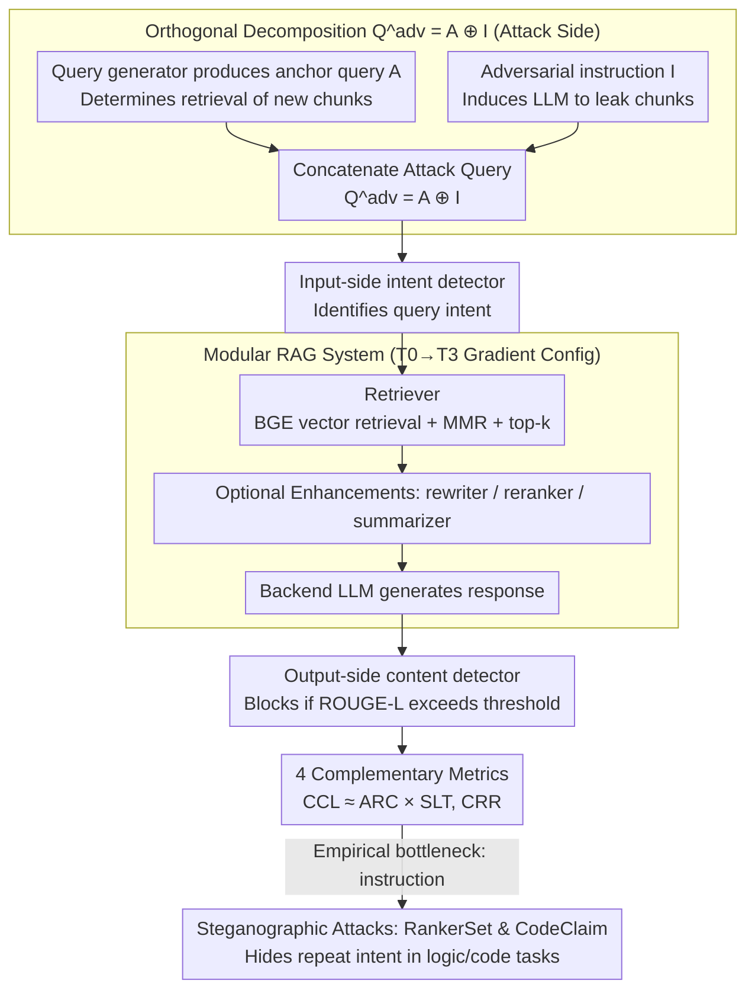

# LeakDojo: Decoding the Leakage Threats of RAG Systems

**Conference**: ACL 2026 Findings  
**arXiv**: [2605.05818](https://arxiv.org/abs/2605.05818)  
**Code**: Open-sourced (GitHub link in the paper)  
**Area**: RAG / Information Retrieval / LLM Security  
**Keywords**: RAG Leakage Attacks, prompt injection, Red-teaming framework, Instruction-following safety, Steganographic attacks

## TL;DR
This paper introduces LeakDojo, the first configurable evaluation framework that modularly decouples RAG systems, attacks, and defenses. By systematically quantifying RAG leakage risks across 6 attacks, 14 LLMs, 4 datasets, and multiple enhancement modules, it discovers that "stronger instruction-following capability leads to higher leakage risk" and "RAG faithfulness is positively correlated with leakage risk."

## Background & Motivation

**Background**: Retrieval-Augmented Generation (RAG) has become the de facto standard for LLMs to access private or high-value knowledge bases (medical, financial, legal, etc.). Modern RAG systems are no longer simple "retrieve + generate" pipelines but stacks of various enhancement modules like rewriters, rerankers, and summarizers. Concurrently, several works (TGTB, PIDE, DGEA, RAG-Thief, PoR, IKEA, etc.) have demonstrated that LLMs can be coerced into outputting raw retrieved chunks via prompt injection, thereby "stealing" the knowledge base.

**Limitations of Prior Work**: (1) Benchmarks, attack budgets, and RAG configurations vary across these attacks, making **fair comparison impossible**; (2) most are designed for simple RAG and their efficacy on "modern RAG" with rewriters/rerankers/summarizers is unknown; (3) whether the increasing instruction-following capability of new LLMs amplifies leakage risk remains an open question.

**Key Challenge**: (a) **Usability vs. Security**: Do enhancement modules (rewriter/summarizer) that improve faithfulness simultaneously amplify leakage? (b) **Capability vs. Security**: Are more powerful and "obedient" LLMs actually more vulnerable RAG backends? These trade-offs have not been quantitatively answered in existing research.

**Goal**: (1) Provide a unified framework to fairly evaluate 6 existing attacks; (2) decouple the design space of RAG systems, attacks, and defenses to quantify the independent and joint impacts of each module; (3) extract actionable "leakage mechanism" patterns (e.g., identifying whether the bottleneck is the query generator or the adversarial instruction).

**Key Insight**: The authors reformulate RAG leakage attacks as $Q^{adv}_i = A_i \oplus I$, where $A_i$ is the $i$-th **anchor query** (determining if a new chunk can be retrieved) and $I$ is the **adversarial instruction** (determining if the model will output the chunk). These components are orthogonal and independently replaceable, enabling modularly decoupled evaluation.

**Core Idea**: Build LeakDojo with "configurability" as the core design principle. RAG systems, attacks, and defenses are plug-and-play modules. Systematic benchmarking is performed using four complementary metrics (CCL, SLT, ARC, CRR) to extract operational leakage patterns. Based on the finding that the "instruction is the bottleneck," two novel steganographic attacks (RankerSet, CodeClaim) are designed to verify the framework's extensibility.

## Method

### Overall Architecture

LeakDojo decomposes RAG leakage scenarios into three layers of configurable components:

1.  **RAG System Side**: Retriever (embedding model + retrieval strategy + top-$k$) + optional rewriter / reranker / summarizer + backend LLM (local vLLM or remote API).
2.  **Attack Side**: Query generator (static or interactive, responsible for generating anchor query $A_i$) + adversarial instruction $I$ (inducing the LLM to repeat context).
3.  **Defense Side**: Input-side intent detector (e.g., GPT-4o-mini to judge query intent) + output-side content detector (blocking if ROUGE-L > threshold).

Each module is independent and controllable, supporting four types of research: (a) fair benchmarking of existing attacks; (b) auditing leakage risks of online RAGs; (c) comparing different defenses; (d) plug-and-play extension of new attacks.

Threat model: Black-box, $N=200$ interaction budget, attacker only knows high-level domain, goal is to maximize unique chunk leakage.

### Key Designs

**1. Orthogonal Decomposition $Q^{adv}_i = A_i \oplus I$: Splitting performance into independently quantifiable sub-problems**

Previously, all RAG leakage attacks were compared as "black-box holistic methods," where the highest leakage rate won without explaining *why*. LeakDojo formalizes a single-turn attack query as the concatenation of anchor query $A_i$ and adversarial instruction $I$. $A_i$ determines if a new chunk is **retrieved**, while $I$ determines if the **LLM will output the chunk**. Evaluation uses ARC (unique retrieved / max $k \times N$) for coverage, SLT (ratio of queries triggering leak, via ROUGE-L recall $> 0.5$) for trigger capability, and CCL (unique leaked chunks / max) for overall leakage.

Key empirical evidence shows that the meta-analysis $\text{CCL} \approx \text{ARC} \times \text{SLT}$ holds almost perfectly—the impacts of the two components are approximately multiplicative and orthogonal. This rule allows the evaluation to pinpoint bottlenecks: e.g., TGTB has high ARC but low SLT on weak models, indicating the issue lies with the instruction. It clarifies the research path: most improvements have focused on query generators, while the decomposition shows that triggering power in the instruction is the truly scarce resource.

**2. Modular RAG/Attack/Defense + 4 Complementary Metrics: Quantifying if "switching LLMs is more dangerous" as an ablatable problem**

A single metric can mask mechanistic differences—IKEA has high SLT but low ARC, resulting in low CCL; looking only at CCL would misclassify it as "weak." LeakDojo makes all three layers plug-and-play: the RAG side defines four levels (T0/T1/T2/T3, from vanilla to full), and the attack side implements 6 methods. Usability is measured via Ragas faithfulness.

Results are reported using four metrics: CCL (cumulative leakage), SLT (trigger rate), ARC (retrieval coverage), and CRR (verbatim recovery quality). This allows RAG developers to quantitatively answer whether adding a rewriter or changing the backend LLM amplifies leakage.

**3. Steganographic Attacks RankerSet & CodeClaim based on logical masking: Turning the "instruction bottleneck" discovery into stronger attacks**

This serves as a case study for LeakDojo's extensibility. Previous instructions containing keywords like "repeat" or "verbatim" are easily blocked by intent detectors (cutting CCL to $<1\%$). RankerSet and CodeClaim hide the "repeat chunk" intent within a logical reasoning chain—treating the chunk as input for a sorting or code declaration task. The instruction appears as a legitimate task request on the surface.

This aligns with the direction indicated by the orthogonal decomposition: rather than diversifying queries, it is more effective to make instructions stealthier. Results confirm this: with the intent detector enabled, CodeClaim + GEN-PIDE on DeepSeek-V3 achieved a 59.6% CCL, approximately 8x higher than the default instruction without any defense (7.3%).

### Loss & Training
LeakDojo is an evaluation framework, not a training method, so there is no loss function. For reproducibility, all LLMs use greedy decoding with an attack budget $N=200$. Rewriters/summarizers use GPT-4o-mini; the retriever uses bge-large-en-v1.5 + MMR + bge-reranker-large.

## Key Experimental Results

### Main Results

6 major LLMs × 4 datasets × 3 RAG variants (vanilla / +reranker / +rewriter+reranker) were evaluated using 4 metrics across 6 attacks. Selected CCL (%) for typical scenarios:

| Attack | Gemini-1.5-flash · ENRON | GPT-4o · ENRON | DeepSeek-V3 · ENRON | Qwen-2-7B · ENRON |
| :--- | :--- | :--- | :--- | :--- |
| TGTB | 72.3 | 69.5 | 0.1 | 10.4 |
| GEN-PIDE | 69.4 | 36.8 | 38.8 | 35.4 |
| DGEA | 11.2 | 16.5 | 8.1 | 12.4 |
| RAG-Thief | 44.4 | 3.3 | **64.4** | 64.1 |
| **PoR** | **88.3** | **83.2** | 6.8 | **70.2** |
| IKEA | 23.2 | 15.4 | 1.0 | 6.0 |

**Key Observations**: (a) No single attack is strongest across all LLMs; (b) ARC remains relatively constant on the same dataset, but SLT fluctuates wildly across models, confirming the **bottleneck is the instruction**; (c) the Pearson correlation between IFEval scores and SLT across 14 LLMs is $r=0.578$ ($p=0.039$): **higher instruction-following leads to higher leakage risk**.

### Ablation Study

**Impact analysis of RAG modules × Datasets × Attacks** (CCL vs. Faithfulness):

| Configuration | ARC Change | CCL Change | Faithfulness | Interpretation |
| :--- | :--- | :--- | :--- | :--- |
| T0 → T1 (+reranker) | Negligible | Negligible ($r=-0.186$) | Slight increase | Reranker is neutral to leakage; safe to use |
| T1 → T2 (+rewriter) | **Mean↑, Var↓** | Overall↑ | Increase | Rewriter stabilizes weak attacks, lowering the entry bar |
| T2 → T3 (+summarizer) | Slight decrease | Significant↓ | Significant↓ | Summarizer sacrifices context integrity and usability |

**Correlation between Faithfulness and CCL**: (FIQA $r=0.83, p=4.88e-7$; SCIFACT $r=0.57$; NFCORPUS $r=0.51$) — More "faithful" RAGs are more susceptible to leakage.

**Orthogonal Decomposition Validation**: $\text{SLT} \times \text{ARC}$ almost perfectly fits the CCL curves for all 6 attacks, proving the components are approximately independent.

**Defense + New Attack Comparison** (FIQA · DeepSeek-V3 · T2 · CCL %):

| Attack | Default | + intent det. | RankerSet + Di | CodeClaim + Di | CodeClaim + DiDo |
| :--- | :--- | :--- | :--- | :--- | :--- |
| TGTB | 7.3 | 0.6 | 50.9 | **59.0** | 25.9 |
| GEN-PIDE | 57.5 | 0.2 | 47.8 | 59.6 | 26.5 |
| PoR | 48.7 | 0.2 | 51.7 | 57.9 | 26.9 |

CodeClaim maintains 50–60% CCL even with intent detection active, which is higher than default instructions **without defense**, verifying that "instruction as bottleneck" directly translates to high-efficacy attacks.

### Key Findings
- **$\text{CCL} \approx \text{ARC} \times \text{SLT}$** is significant: it refutes the strategy of merely stacking query generators and identifies instruction steerability as the critical path.
- **Power is Dangerous**: Instruction-following capability (IFEval) positively correlates with SLT, implying a trade-off between model capability and RAG safety.
- **Rewriters are Security Risks**: Rewriters pull weak queries into high ARC, effectively lowering the "attack threshold."
- **Summarizers trade Usability for Security**: They reduce CCL but harm faithfulness; consider as a last resort in security-sensitive contexts.
- **Rerankers are Neutral**: Negligible correlation with CCL.
- **Existing attacks lack stealth**: Simple intent detectors slash CCL to <1%, but logical masking bypasses them, suggesting industrial deployments cannot rely on keyword-based defenses.

## Highlights & Insights
- **The orthogonal decomposition $Q^{adv} = A \oplus I$** is key to transforming chaotic red-teaming into quantifiable mechanism research. This concise formalization explains why certain attacks fail on specific models and can be transferred to other injection-based evaluations.
- **Quantitative evidence for the "capability ↔ security" trade-off**: While suspected, the $r=0.578$ correlation between IFEval and SLT provides statistical proof that safety research must keep pace with capability scaling.
- **The "faithfulness ↔ leakage" correlation** points to a counter-intuitive principle: the more one compels a RAG to repeat retrieved content faithfully, the more it complies with attackers. Safety mechanisms must explicitly distinguish between "user-intended repetition" and "attacker-induced extraction."
- **Case studies reinforce the framework logic**: Designing RankerSet/CodeClaim based on analytical findings creates a closed-loop validation of the framework's utility.

## Limitations & Future Work
- **Attack costs are not quantified**: Metrics use a fixed budget $N=200$ without considering tokens, latency, or API costs.
- **Limited RAG design coverage**: Only three enhancement types were studied; more complex structures like Agentic-RAG or GraphRAG may have different leakage dynamics.
- **Language bias**: The study is limited to English datasets.
- **Simple defenses**: Only basic detectors were tested; future work should evaluate against specific prompt-injection defenses like SecAlign or StruQ.
- **Horizon of leakage**: Future research should investigate leakage behavior over longer horizons beyond $N=200$ in monitoring scenarios.

## Related Work & Insights
- **vs. RAG-Thief / PoR / IKEA**: These proposed new query generators; LeakDojo re-evaluates them to reveal no "universal strongest" method and identifies the **instruction as the actual bottleneck**.
- **vs. HarmBench / RACCOON**: LeakDojo incorporates the unique RAG challenges of "multi-turn stateful attacks" and "multi-module architectures."
- **vs. Ragas**: LeakDojo evaluates safety alongside usability, quantifying for the first time the positive correlation between faithfulness and leakage.

## Rating
- Novelty: ⭐⭐⭐⭐ The framework integrates existing concepts, but the three sets of quantitative findings (orthogonal decomposition, IFEval correlation, faithfulness correlation) offer high insight.
- Experimental Thoroughness: ⭐⭐⭐⭐⭐ Comprehensive coverage across attacks, LLMs, RAG configurations, and metrics.
- Writing Quality: ⭐⭐⭐⭐ Clear architecture and grouping, though some findings require careful reading of large tables.
- Value: ⭐⭐⭐⭐⭐ The open-source framework and findings on the "instruction bottleneck" provide immediate safety guidance for industrial RAG deployment.

<!-- RELATED:START -->

## Related Papers

- [\[ACL 2026\] Do Multimodal RAG Systems Leak Data? A Comprehensive Evaluation of Membership Inference and Image Caption Retrieval Attacks](do_multimodal_rag_systems_leak_data_a_comprehensive_evaluation_of_membership_inf.md)
- [\[ICLR 2026\] Silent Leaks: Implicit Knowledge Extraction Attack on RAG Systems through Benign Queries](../../ICLR2026/llm_safety/silent_leaks_implicit_knowledge_extraction_attack_on_rag_systems.md)
- [\[ACL 2026\] A Survey on the Safety and Security Threats of Computer-Using Agents: JARVIS or Ultron?](a_survey_on_the_safety_and_security_threats_of_computer-using_agents_jarvis_or_u.md)
- [\[ACL 2026\] Robust Multimodal Safety via Conditional Decoding](robust_multimodal_safety_via_conditional_decoding.md)
- [\[ACL 2026\] Differentially Private Synthetic Text Generation for Retrieval-Augmented Generation (RAG)](differentially_private_synthetic_text_generation_for_retrieval-augmented_generat.md)

<!-- RELATED:END -->
