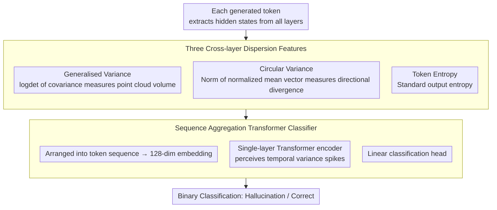

# Learning Uncertainty from Sequential Internal Dispersion in Large Language Models

**Conference**: ACL 2026  
**arXiv**: [2604.15741](https://arxiv.org/abs/2604.15741)  
**Code**: [GitHub](https://github.com/ponhvoan/internal-variance)  
**Area**: Uncertainty Estimation / Hallucination Detection  
**Keywords**: Uncertainty Estimation, Hallucination Detection, Hidden State Variance, Sequential Aggregation, Internal Representation Dispersion

## TL;DR

The SIVR framework is proposed, which computes internal variance of LLM hidden states across layers (generalized variance, circular variance, and token entropy) as token-level features. A lightweight Transformer encoder aggregates full sequence patterns to estimate uncertainty and detect hallucinations, significantly outperforming baselines with stronger generalization.

## Background & Motivation

**Background**: Uncertainty estimation is a crucial tool for detecting LLM hallucinations. Existing methods include sampling consistency (e.g., Semantic Entropy), output probability methods (e.g., Entropy), and internal state probing.

**Limitations of Prior Work**: (1) Sampling methods incur high computational overhead; (2) Methods like CoE rely on overly strict assumptions about layer-wise evolution that do not hold across different models or tasks; (3) Using only the last or average token information discards temporal patterns.

**Key Challenge**: CoE compresses information into a single score, ignoring variance patterns at different token positions. For instance, in "Praia is in Portugal", a variance spike at "Portugal" can flag an error, but averaging would mask it.

**Goal**: Design internal state features based on more relaxed assumptions while preserving complete sequential information.

**Key Insight**: Uncertainty is reflected in the "dispersion" of hidden states across layers—representations are more concentrated when correct and more dispersed when erroneous.

**Core Idea**: Use three dispersion statistics (generalized variance, circular variance, and token entropy) to describe the cross-layer dispersion of each token, and employ a Transformer encoder to learn full sequence patterns for hallucination prediction.

## Method

### Overall Architecture

For each generated token, the hidden states of all layers are extracted to compute three cross-layer dispersion features $\bm{v}_t = [v_t, c_t, e_t]$. These aggregate into a sequence input for a lightweight Transformer encoder to perform binary classification.

### Key Designs

**1. Generalised Variance: Characterizing "volume" dispersion of cross-layer representations with a scalar**

Methods like CoE only examine differences between adjacent layers (step size), which involves strong assumptions that often fail across models and tasks. Generalized variance adopts a more fundamental perspective—treating the hidden states of a token across all layers as a point cloud and measuring its "volume" via the log-determinant of the regularized covariance matrix $v_t = \log\det(\Sigma') = \sum_i \log \lambda_i$.

This is effective because the log-determinant aggregates the entire feature spectrum (all eigenvalues $\lambda_i$) rather than local differences between layers, providing a comprehensive cross-layer dispersion measure directly related to differential entropy. This aligns with the Core Idea: representations are more concentrated (lower dispersion) when the model is correct and more dispersed when it is incorrect.

**2. Circular Variance: Providing a complementary dispersion signal from "direction" rather than "magnitude"**

Generalized variance captures magnitude and volume, but two point clouds with the same volume might have entirely different directional distributions. Circular variance projects hidden states of all layers onto a unit sphere and calculates the norm of their mean vector:

$$c_t = 1 - \Big\|\frac{1}{L+1}\sum_l \hat{\bm{h}}_t^l\Big\|$$

When directions across layers are consistent, the mean vector approaches unit length, resulting in a smaller $c_t$; when directions diverge, the mean vector shortens, increasing $c_t$. It naturally complements generalized variance—one handles magnitude while the other handles direction—implicitly encoding pairwise directional relationships between all layers to fully describe token-level cross-layer dispersion.

**3. Sequential Aggregation Transformer Classifier: Preserving sequence-wide dispersion patterns instead of compressing to an average**

CoE compresses the entire output into a single score, which smooths out "variance spikes at specific critical tokens"—for example, the spike at "Portugal" in "Praia is in Portugal" which could mark an error. Ours preserves the full temporal sequence: the triple features $\bm{v}_t = [v_t, c_t, e_t]$ for each token are arranged as a sequence, passed through a 128-dimensional embedding layer, a single-layer Transformer encoder, and a linear head for binary classification. The training objective is cross-entropy with $l_2$ regularization.

Since the Transformer is aware of token order, it learns temporal patterns such as "sudden spikes in variance," which are discriminative signals lost in mean aggregation or last-token pooling. This explains why sequence aggregation achieves 2–3 AUC points higher than mean aggregation in ablation studies. The classifier is extremely lightweight and can be trained with only hundreds to thousands of labeled samples.

### Loss & Training

Binary cross-entropy with $l_2$ regularization, requiring only a small amount of labeled data (hundreds to thousands of samples).

## Key Experimental Results

### Main Results

AUC comparison across 7 datasets on Llama-3.1-8B:

| Method | TriviaQA | SciQ | MedMCQA | MATH | Avg AUC | Rank |
|------|---------|------|---------|------|---------|------|
| Entropy | 80.46 | 72.85 | 62.76 | 62.77 | 67.63 | 7.96 |
| SE | 84.44 | 79.44 | 66.88 | 67.27 | 68.87 | 7.13 |
| CoE-C | 66.97 | 75.06 | 62.14 | 58.67 | 61.25 | 11.08 |
| **SIVR** | **90.75** | **83.64** | **68.37** | **71.22** | **75.35** | **1.88** |

### Ablation Study

| Configuration | Avg AUC | Description |
|------|---------|------|
| Token Entropy Only | 71.2 | Basic effectiveness but insufficient |
| GV Only | 72.8 | Complementary signal |
| Combined (SIVR) | **75.35** | Optimal |
| Mean Aggregation (vs Seq) | 72.5 | Loss of temporal patterns |

### Key Findings

- SIVR achieves an average rank of 1.88, significantly outperforming the runner-up, with strong complementarity between the three features.
- Sequence aggregation improves AUC by 2-3 points over mean/last-token aggregation, proving the value of temporal patterns.
- OOD generalization is markedly better than CoE, requiring minimal training data.

## Highlights & Insights

- **The "dispersion" hypothesis is more robust than "step-size"**—CoE assumptions vary across different models, while SIVR's dispersion hypothesis is more fundamental and universal.
- **The paradigm of preserving sequence structure is transferable**—Any task requiring inference of sequence-level attributes from token-level signals can benefit from this approach.
- **Lightweight yet effective**—With only 3 statistics and a single-layer Transformer, the inference overhead is practically negligible.

## Limitations & Future Work

- Requires labeled data; although the quantity is small, new domains require additional annotation.
- Only validated for greedy decoding; performance under sampling-based decoding remains to be evaluated.
- Insufficient validation on large-scale models (70B+).
- The use of SIVR for active hallucination mitigation has not yet been explored.

## Related Work & Insights

- **vs CoE**: CoE makes overly strong assumptions that fail across tasks; SIVR employs a more relaxed hypothesis.
- **vs Semantic Entropy**: SE requires multiple samples and is computationally expensive; SIVR requires only a single forward pass.
- **vs Lookback Lens**: Lookback Lens focuses on specific layers or attention patterns, whereas SIVR provides a more global perspective.

## Rating

- Novelty: ⭐⭐⭐⭐ The internal variance feature approach is clear; individual components are simple but their combination is effective.
- Experimental Thoroughness: ⭐⭐⭐⭐⭐ Comprehensive ablation across 7 datasets and multiple models.
- Writing Quality: ⭐⭐⭐⭐ Clear motivation and effective visualization.
- Value: ⭐⭐⭐⭐⭐ Highly practical with direct value for hallucination detection.

<!-- RELATED:START -->

## Related Papers

- [\[ACL 2026\] From Passive Metric to Active Signal: The Evolving Role of Uncertainty Quantification in Large Language Models](from_passive_metric_to_active_signal_the_evolving_role_of_uncertainty_quantifica.md)
- [\[ACL 2026\] Exploring Cross-Client Memorization of Training Data in Large Language Models for Federated Learning](exploring_cross-client_memorization_of_training_data_in_large_language_models_fo.md)
- [\[ICML 2025\] CROW: Eliminating Backdoors from Large Language Models via Internal Consistency Regularization](../../ICML2025/llm_safety/crow_eliminating_backdoors_from_large_language_models_via_internal_consistency_r.md)
- [\[ACL 2025\] UAlign: Leveraging Uncertainty Estimations for Factuality Alignment on Large Language Models](../../ACL2025/llm_safety/ualign_leveraging_uncertainty_estimations_for_factuality_alignment_on_large_lang.md)
- [\[ACL 2026\] Multi-component Causal Tracing in Large Language Models](multi-component_causal_tracing_in_large_language_models.md)

<!-- RELATED:END -->
