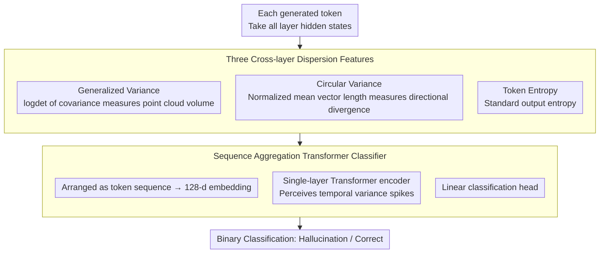

# Learning Uncertainty from Sequential Internal Dispersion in Large Language Models

**Conference**: ACL 2026  
**arXiv**: [2604.15741](https://arxiv.org/abs/2604.15741)  
**Code**: [GitHub](https://github.com/ponhvoan/internal-variance)  
**Area**: Uncertainty Estimation / Hallucination Detection  
**Keywords**: Uncertainty Estimation, Hallucination Detection, Hidden State Variance, Sequence Aggregation, Internal Representation Dispersion

## TL;DR

Ours proposes the SIVR framework, which computes internal variance (generalized variance, circular variance, token entropy) across LLM hidden layers as token-level features. A lightweight Transformer encoder aggregates full sequence patterns to estimate uncertainty and detect hallucinations, significantly outperforming baselines with stronger generalization.

## Background & Motivation

**Background**: Uncertainty estimation is a critical means for detecting LLM hallucinations. Existing methods include sampling consistency (e.g., Semantic Entropy), output probability methods (e.g., Entropy), and internal state probing.

**Limitations of Prior Work**: (1) Sampling methods incur high computational overhead; (2) methods like CoE rely on overly strict assumptions regarding layer-wise evolution that do not hold across models/tasks; (3) using only the last or average token loses temporal patterns.

**Key Challenge**: CoE compresses information into a single score, ignoring variance patterns at different token positions. For example, in "Praia is in Portugal", a variance spike at "Portugal" can flag an error, but mean aggregation would mask it.

**Goal**: To design internal state features based on relaxed assumptions while preserving complete sequence information.

**Key Insight**: Uncertainty is reflected in the "dispersion" of hidden states across layers—representations are more concentrated when correct and more dispersed when incorrect.

**Core Idea**: Use three dispersion statistics (generalized variance, circular variance, and token entropy) to describe the cross-layer dispersion of each token, and learn full sequence patterns using a Transformer encoder to predict hallucinations.

## Method

### Overall Architecture

For each generated token, all hidden states across layers are extracted to compute three internal variance features $\bm{v}_t = [v_t, c_t, e_t]$. These are then fed as a sequence into a lightweight Transformer encoder for binary classification.

### Key Designs

**1. Generalized Variance: Characterizing "Volume" Dispersion with a Scalar**

Methods like CoE only consider differences (step sizes) between adjacent layers, an assumption that often fails across models and tasks. Generalized variance adopts a fundamental perspective: treating the hidden states of a token across all layers as a point cloud and measuring its "volume" via the log-determinant of the regularized covariance matrix $v_t = \log\det(\Sigma') = \sum_i \log \lambda_i$.

This is effective because the log-determinant aggregates the entire feature spectrum (all eigenvalues $\lambda_i$) rather than local differences between two layers, providing a comprehensive cross-layer dispersion measure. Furthermore, it directly relates to differential entropy; greater dispersion corresponds to higher uncertainty, aligning with the hypothesis that representations are more dispersed when the model is incorrect.

**2. Circular Variance: Providing Complementary "Directional" Signals**

While generalized variance captures magnitude/volume, two point clouds with the same volume can have entirely different directional distributions. Circular variance first normalizes the hidden states of each layer onto a unit sphere and then examines the magnitude of their mean vector:

$$c_t = 1 - \Big\|\frac{1}{L+1}\sum_l \hat{\bm{h}}_t^l\Big\|$$

The more consistent the directions across layers, the closer the mean vector is to unit length, resulting in a smaller $c_t$. Conversely, divergent directions yield a larger $c_t$. This naturally complements generalized variance by encoding pairwise directional relationships across all layers.

**3. Sequence Aggregation Transformer Classifier: Preserving Temporal Patterns**

CoE compresses entire outputs into a single score, smoothing out variance spikes at critical tokens. For instance, a spike at "Portugal" in "Praia is in Portugal" could flag an error, but it disappears when averaged. Ours preserves the full temporal sequence: the triplet features $\bm{v}_t = [v_t, c_t, e_t]$ for each token are arranged as a sequence, passed through a 128-dimensional embedding layer, and processed by a single-layer Transformer encoder with a linear head for binary classification. 

Because the Transformer is aware of token order, it learns temporal patterns such as "sudden spikes in variance," which are lost in mean or last-token aggregation. This explains why sequence aggregation yields a 2–3 point AUC improvement over mean aggregation in ablation studies. The classifier is extremely lightweight and can be trained with only a few hundred to a few thousand labeled samples.

### Loss & Training

Binary cross-entropy with $l_2$ regularization is used, requiring only small-scale labeled data.

## Key Experimental Results

### Main Results

Comparison of AUC on 7 datasets using Llama-3.1-8B:

| Method | TriviaQA | SciQ | MedMCQA | MATH | Average AUC | Rank |
|------|---------|------|---------|------|---------|------|
| Entropy | 80.46 | 72.85 | 62.76 | 62.77 | 67.63 | 7.96 |
| SE | 84.44 | 79.44 | 66.88 | 67.27 | 68.87 | 7.13 |
| CoE-C | 66.97 | 75.06 | 62.14 | 58.67 | 61.25 | 11.08 |
| **SIVR** | **90.75** | **83.64** | **68.37** | **71.22** | **75.35** | **1.88** |

### Ablation Study

| Configuration | Average AUC | Description |
|------|---------|------|
| Token Entropy Only | 71.2 | Basic effectiveness but insufficient |
| Generalized Variance Only | 72.8 | Complementary signal |
| Combined (SIVR) | **75.35** | Best performance |
| Mean Aggregation instead of Sequence | 72.5 | Loss of temporal patterns |

### Key Findings

- SIVR achieves an average rank of 1.88, significantly outperforming the runner-up, with strong complementarity among the three features.
- Sequence aggregation improves AUC by 2-3 points over mean/last-token aggregation, proving the value of temporal patterns.
- OOD generalization is significantly better than CoE, requiring only minimal training data.

## Highlights & Insights

- **The "dispersion" hypothesis is more robust than "step size"**—whereas CoE assumptions shift between models, SIVR's hypothesis is more fundamental and universal.
- **Transferable sequence structure paradigm**—any task requiring the inference of sequence-level attributes from token-level signals can benefit from this approach.
- **Lightweight yet effective**—three statistics plus a single-layer Transformer result in negligible inference overhead.

## Limitations & Future Work

- Requires labeled data; although the volume is small, new domains require additional annotation.
- Only verified on greedy decoding; performance under sampling-based decoding remains to be evaluated.
- Insufficient validation on large-scale models (70B+).
- The use of SIVR for active hallucination mitigation has not yet been explored.

## Related Work & Insights

- **vs CoE**: CoE's strong assumptions fail across tasks; SIVR employs a more relaxed and robust hypothesis.
- **vs Semantic Entropy**: SE requires multiple samples and is computationally expensive; SIVR requires only a single forward pass.
- **vs Lookback Lens**: While the former focuses on specific layers or attention patterns, SIVR provides a more global perspective across all layers.

## Rating

- Novelty: ⭐⭐⭐⭐ The internal variance feature is intuitive; components are simple but combined effectively.
- Experimental Thoroughness: ⭐⭐⭐⭐⭐ Comprehensive ablation across 7 datasets and multiple models.
- Writing Quality: ⭐⭐⭐⭐ Clear motivation and effective visualization.
- Value: ⭐⭐⭐⭐⭐ Highly practical with direct utility for hallucination detection.

<!-- RELATED:START -->

## Related Papers

- [\[ACL 2026\] From Passive Metric to Active Signal: The Evolving Role of Uncertainty Quantification in Large Language Models](from_passive_metric_to_active_signal_the_evolving_role_of_uncertainty_quantifica.md)
- [\[ACL 2026\] Exploring Cross-Client Memorization of Training Data in Large Language Models for Federated Learning](exploring_cross-client_memorization_of_training_data_in_large_language_models_fo.md)
- [\[ACL 2025\] UAlign: Leveraging Uncertainty Estimations for Factuality Alignment on Large Language Models](../../ACL2025/llm_safety/ualign_leveraging_uncertainty_estimations_for_factuality_alignment_on_large_lang.md)
- [\[ICML 2025\] CROW: Eliminating Backdoors from Large Language Models via Internal Consistency Regularization](../../ICML2025/llm_safety/crow_eliminating_backdoors_from_large_language_models_via_internal_consistency_r.md)
- [\[ACL 2026\] Multi-component Causal Tracing in Large Language Models](multi-component_causal_tracing_in_large_language_models.md)

<!-- RELATED:END -->
