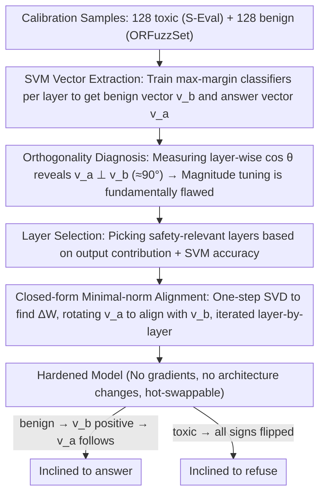

# LLM-VA: Resolving the Jailbreak-Overrefusal Trade-off via Vector Alignment

**Conference**: ACL 2026  
**arXiv**: [2601.19487](https://arxiv.org/abs/2601.19487)  
**Code**: https://hotbento.github.io/LLM-VA-Web/  
**Area**: LLM Safety / Alignment / Representation Engineering  
**Keywords**: jailbreak, over-refusal, vector steering, SVM probe, closed-form weight update

## TL;DR
LLM-VA discovers that LLMs encode "whether to answer" (answer vector $v_a$) and "input safety" (benign vector $v_b$) into two nearly orthogonal directions internally, leading to a persistent trade-off between jailbreak and over-refusal. By performing closed-form minimal-norm weight updates to align $v_a$ and $v_b$, the model's "willingness to answer" becomes causally dependent on "input safety." Evaluated on 12 LLMs, it achieves an F1 score 11.45% higher than the strongest baseline with only a 4.08% utility drop, requiring no fine-tuning or architectural modifications.

## Background & Motivation
**Background**: Safety alignment in LLMs faces two simultaneous failure modes: jailbreak (providing harmful answers to toxic queries) and over-refusal (refusing benign queries). Mainstream mitigation approaches include RLHF/adversarial training/rule filtering (expensive) and vector steering (cheap, manipulating latent space directions, e.g., VectorSteer, AlphaSteer, SCANS, CAST).

**Limitations of Prior Work**: Existing vector steering methods almost exclusively "tune the magnitude of $v_a$"—decreasing magnitude suppresses jailbreaks but amplifies over-refusals, and vice versa. AlphaSteer uses null-space projection to preserve utility but remains magnitude-based; SCANS/CAST introduce input toxicity information but require hooks for architectural changes and treat the two failure types as independent targets requiring heavy hyperparameter tuning.

**Key Challenge**: This work uses SVMs to extract $v_a$ and $v_b$ layer-by-layer across 12 LLMs and finds they are **nearly orthogonal** $(\sim 90^\circ)$ across all layers. This implies that the model's internal judgment of "willingness to answer" and "input toxicity" are treated as completely independent; magnitude regulation can only scale projections on the $v_a$ direction globally, inevitably affecting both benign and toxic inputs in the same way, making it impossible to suppress both errors simultaneously.

**Goal**: Align $v_a$ with $v_b$ so that the projection of $v_a$ itself carries "input safety" information. This naturally suppresses toxic inputs while encouraging benign ones, resolving both failure modes **at once**.

**Key Insight**: Identify directions using SVMs $\rightarrow$ achieve alignment via closed-form minimal-norm weight modifications, bypassing gradient optimization and fine-tuning.

**Core Idea**: The root cause of the jailbreak/over-refusal trade-off is $v_a \perp v_b$ (structural decoupling); the solution is geometric alignment rather than magnitude adjustment.

## Method

### Overall Architecture
LLM-VA consists of three steps, moving entirely without gradients:
1. **Vector Identification**: For each layer, a linear SVM is trained on 128 toxic (S-Eval) + 128 benign (ORFuzzSet) samples to find the classification hyperplanes, yielding $v_b$ (normal vector for benign vs toxic) and $v_a$ (normal vector for answer vs refuse).
2. **Layer Selection**: A subset of layers "most relevant to safety decisions" is selected based on their contribution to the final output and SVM classification accuracy (avoiding ambiguous early layers and task-irrelevant late layers).
3. **Vector Alignment**: A closed-form minimal-norm weight update $\Delta W$ rotates $v_a$ to align with $v_b$ in the MLP/attention output space of the selected layers, iterating through all chosen layers.

The pivot of this pipeline is the **layer-wise orthogonality diagnosis after vector identification**: measuring that $v_a$ and $v_b$ are nearly orthogonal $(\sim 90^\circ)$ leads to the inference that "magnitude tuning is destined to fail" and geometric alignment must be used. When an input $x$ enters the aligned model, if $x$ is benign $\rightarrow$ the $v_b$ projection is positive $\rightarrow$ the $v_a$ projection is also positive (due to alignment) $\rightarrow$ the model tends to answer; if toxic $\rightarrow$ the opposite occurs $\rightarrow$ the model tends to refuse.

### Key Designs

**1. SVM extraction of dual vectors $v_a$ and $v_b$: Use real samples to train max-margin classifiers per layer to obtain the cleanest geometric "safety" and "answer" directions.**

To manipulate behavior in latent space, the prerequisite is accurately finding the directions for "willingness to answer" and "input toxicity." This work trains two SVMs for each transformer layer output $h^{(\ell)}$: one using activations from toxic (S-Eval) / benign (ORFuzzSet) samples, where the normal vector is the benign vector $v_b$; and another using answered / refused samples, where the normal vector is the answer vector $v_a$. Both SVM decision boundaries fall near zero. 

SVM is chosen over logistic regression because the max-margin hyperplane provides the most geometrically clear direction and is less sensitive to sample size—high-separation directions can be trained with only 128+128=256 samples per layer. Extracting from real activations is also more aligned with the model's actual encoding compared to "concept vectors" derived from prompt engineering.

**2. Orthogonality diagnosis as a methodological pillar: Proving $v_a \perp v_b$ is a structural fact, then concluding "magnitude tuning is destined to fail."**

This is the most critical observation of the paper. Across 4 model families (Llama-3.1, Gemma-2, Mistral-v0.3, Qwen3), the authors measure the cosine similarity $\cos\theta = \frac{v_a^\top v_b}{\|v_a\|\|v_b\|}$ layer-by-layer, finding $\angle(v_a, v_b) \approx 90^\circ$ at all layers. Simultaneously, they verify that classification accuracy for both directions is high, indicating this is true information independence rather than high-dimensional random noise.

This leads to a geometric "impossibility theorem": when $v_a \perp v_b$, the projection on $v_a$ carries zero information about "input safety" provided by $v_b$. Scaling the magnitude of $v_a$ thus has a consistent effect on both benign and toxic inputs—decreasing it suppresses jailbreaks but also suppresses valid answers (increasing over-refusal). This elevates the empirical phenomenon of the "whack-a-mole" trade-off into a geometric necessity and identifies geometric alignment as the required solution.

**3. Closed-form minimal-norm weight alignment: One-step SVD to rotate $v_a$ to align with $v_b$, making "willingness to answer" causally dependent on "input safety."**

Since the root cause is the decoupling of two directions, they are re-coupled. The goal is to find a minimal weight perturbation $\Delta W$ that rotates $v_a$ to be parallel to $v_b$ in the layer's output space, formalized as $\min \|\Delta W\|_F$ s.t. $(W+\Delta W)\,v_a \parallel v_b$. This minimal-norm problem with orthogonal constraints has a closed-form solution (similar to Procrustes rotation) that can be solved in one step via SVD and applied iteratively.

The design satisfies three constraints: the closed-form solution ensures speed and reproducibility; the minimal norm $\|\Delta W\|_F$ ensures minimal interference with the model's general capabilities; and keeping the architecture unchanged allows the hardened checkpoints to be shipped directly into existing inference frameworks. After alignment, benign inputs result in a positive $v_b$ projection, leading to a positive $v_a$ projection and the model's inclination to answer; toxic inputs flip both, leading to refusal.

### Loss & Training
**No training**. All "training" is limited to two tasks: (a) per-layer SVM training (standard hinge loss + 256 samples, completed in seconds); (b) closed-form $\Delta W$ calculation (SVD step). The entire process completes in minutes on a single GPU. The authors provide the hardened weights for 12 LLMs.

## Key Experimental Results

### Main Results
12 LLMs from 5 families (Llama-3.1/3.2/3.3, Gemma-2, Mistral-v0.3, Qwen3, etc.) were compared against 5 baselines (None, VectorSteer, AlphaSteer, SCANS, CAST) and Fine-tuning. The overall averages are:

| Method | F1 (Safety Trade-off) | Utility Retention | Fine-tune? | Arch. Change? |
|------|--------------------------|----------------|-------------------|-------------|
| None (Original) | Baseline | 100% | – | – |
| Fine-tuning | High but expensive | Medium | Yes | No |
| VectorSteer | Low (Severe trade-off) | High | No | Yes |
| AlphaSteer (Best baseline) | Medium | 100% | No | Yes |
| CAST | Medium | Medium | No | Yes |
| SCANS | Medium | Medium | No | Yes |
| **LLM-VA (Ours)** | **AlphaSteer + 11.45%** | **95.92%** | **No** | **No** |

LLM-VA is the only method that simultaneously avoids fine-tuning and architectural changes while mitigating both jailbreak and over-refusal (Table 1).

### Ablation Study

| Config / Observation | Key Metric | Description |
|-------------|---------|------|
| Full LLM-VA | F1 +11.45% vs AlphaSteer | Complete method |
| Tune $v_a$ magnitude only (VectorSteer path) | Significant trade-off | Jailbreak↓ ↔ over-refusal↑ strong coupling |
| $\angle(v_a,v_b)$ measurement | $\sim 90°$ all layers/models | Confirms structural orthogonality |
| Adaptation to model bias | Auto-fixes dominant failure | Models prone to jailbreak primarily reduce jailbreaks; over-conservative models primarily reduce over-refusal without manual tuning |
| Layer selection vs. All-layer alignment | Selection is superior | Early layers have ambiguous directions; alignment there harms utility |
| Closed-form vs Gradient alignment | Closed-form more stable + fast | One-step SVD solution with no hyperparameters |

### Key Findings
- $v_a \perp v_b$ is a universal phenomenon across 12 models from 5 families, not a specific case—indicating that RLHF-like training systematically optimizes helpfulness and harmlessness into orthogonal goals.
- LLM-VA automatically adapts to each model's safety bias: models prone to jailbreak (e.g., base instruct versions) primarily reduce jailbreaks; overly conservative models primarily reduce over-refusal—no per-model hyperparameter tuning is required.
- The trade-off of a 4.08% utility drop for an 11.45% F1 gain is superior to all baselines, and aligned weights are hot-swappable with the original model, resulting in very low deployment costs.
- While SVM directions exist in early layers, their separation is low; aligning them disrupts utility, meaning layer selection is essential rather than "more is better."

## Highlights & Insights
- The reasoning chain of "Orthogonality $\rightarrow$ Geometric Impossibility $\rightarrow$ Alignment not Scaling" is exceptionally clean—providing a geometric theoretical explanation for an empirically observed trade-off.
- Closed-form minimal-norm alignment is a rare "theoretical + practical" method in representation engineering: minute-level cost, no data beyond a calibration set, and directly combinable with RLHF models.
- The coverage of 12 models and 5 families is top-tier for vector steering research, and the weights are directly useful to the community.
- Implicit criticism of the RLHF paradigm: optimizing helpful and harmless as independent rewards naturally leads to orthogonalization; future alignment training might need to explicitly encourage correlation between these directions to avoid the trade-off at the source.

## Limitations & Future Work
- The method is based on *single-turn* benign/toxic binary classification; effectiveness against multi-turn jailbreaks (stepwise induction) or complex attacks in code/agent contexts was not tested.
- $v_a/v_b$ are extracted via linear SVMs, assuming "safety/answering = linear direction," which may have limited coverage of safety concepts encoded non-linearly (e.g., role-play evasion).
- It cannot be used on highly aligned flagship models (GPT series closed-source) as it requires hidden state access; it serves the open-source ecosystem.
- Self-reflection: Aligning $v_a$ with $v_b$ essentially makes the model "follow the safety classifier blindly," which might increase false positives for borderline/grey-area queries (dangerous info for education/research). Future work could introduce a "neutral direction" for tripartite alignment.

## Related Work & Insights
- **vs VectorSteer (Zou 2023a)**: Only tunes $v_a$ magnitude; this paper proves that path geometrically impossible to resolve the trade-off.
- **vs AlphaSteer (Sheng 2025)**: Uses null-space projection for utility but remains magnitude-based; ours achieves +11.45% F1.
- **vs SCANS / CAST (Cao 2025 / Lee 2024)**: Introduces toxicity info but requires hooks/architecture changes + many hyperparameters; ours avoids this and adapts automatically.
- **vs Fine-tuning**: Fine-tuning can resolve the trade-off but is costly and may disrupt general capabilities; ours achieves comparable results at nearly zero cost.

## Rating
- Novelty: ⭐⭐⭐⭐⭐ "Orthogonality diagnosis + closed-form alignment" is a standout theoretical and practical contribution to vector steering.
- Experimental Thoroughness: ⭐⭐⭐⭐ Broad coverage of 12 models and 5 families, though multi-turn/agent scenarios are missing.
- Writing Quality: ⭐⭐⭐⭐⭐ The logical derivation (observation $\rightarrow$ theory $\rightarrow$ method) is remarkably tight and elegant.
- Value: ⭐⭐⭐⭐⭐ Resolves jailbreak + over-refusal simultaneously without fine-tuning or architecture changes; deployment-friendly with open-sourced weights.

<!-- RELATED:START -->

## Related Papers

- [\[ICLR 2026\] Improving the Trade-off Between Watermark Strength and Speculative Sampling Efficiency for Language Models](../../ICLR2026/llm_safety/improving_the_trade-off_between_watermark_strength_and_speculative_sampling_effi.md)
- [\[ACL 2025\] From Trade-off to Synergy: A Versatile Symbiotic Watermarking Framework for Large Language Models](../../ACL2025/llm_safety/from_tradeoff_to_synergy_a_versatile.md)
- [\[ACL 2026\] Hard to Read, Easy to Jailbreak: How Visual Degradation Bypasses MLLM Safety Alignment](hard_to_read_easy_to_jailbreak_how_visual_degradation_bypasses_mllm_safety_align.md)
- [\[ACL 2026\] GAMBIT: A Gamified Jailbreak Framework for Multimodal Large Language Models](gambit_a_gamified_jailbreak_framework_for_multimodal_large_language_models.md)
- [\[ACL 2026\] CAP: Controllable Alignment Prompting for Unlearning in LLMs](cap_controllable_alignment_prompting_for_unlearning_in_llms.md)

<!-- RELATED:END -->
