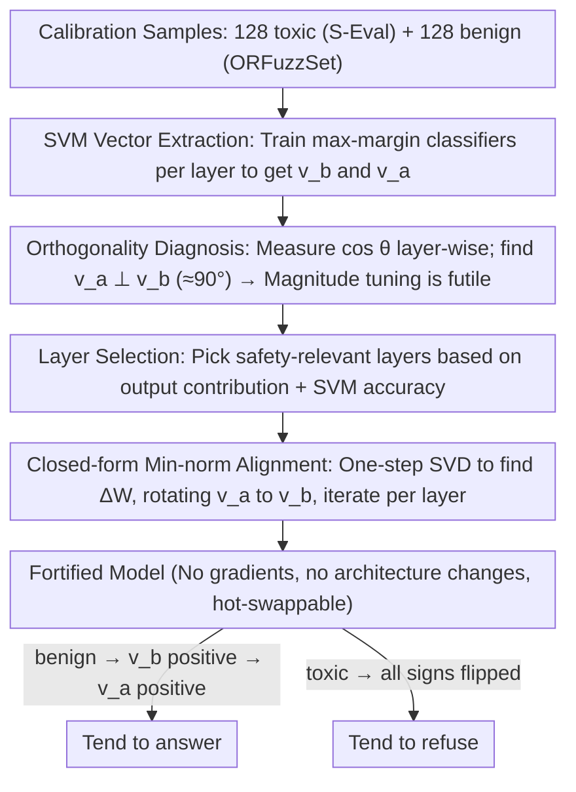

# LLM-VA: Resolving the Jailbreak-Overrefusal Trade-off via Vector Alignment

**Conference**: ACL 2026  
**arXiv**: [2601.19487](https://arxiv.org/abs/2601.19487)  
**Code**: https://hotbento.github.io/LLM-VA-Web/  
**Area**: LLM Safety / Alignment / Representation Engineering  
**Keywords**: jailbreak, over-refusal, vector steering, SVM probe, closed-form weight update

## TL;DR
LLM-VA discovers that LLMs encode "whether to answer" (answer vector $v_a$) and "whether the input is safe" (benign vector $v_b$) as two nearly orthogonal directions, causing a persistent trade-off between jailbreak and over-refusal. By applying closed-form minimum-norm weight updates to align $v_a$ with $v_b$, the model's "willingness to answer" becomes causally dependent on "input safety." Evaluated on 12 LLMs, it achieves an 11.45% higher F1 than the strongest baseline with only a 4.08% utility drop, requiring no fine-tuning or architectural changes.

## Background & Motivation
**Background**: Safety-aligned LLMs suffer from two simultaneous failure modes: jailbreak (providing harmful answers to toxic queries) and over-refusal (refusing benign queries). Mainstream mitigation strategies include RLHF/adversarial training/rule-based filtering (expensive) and vector steering (low-cost, manipulating latent space directions, e.g., VectorSteer, AlphaSteer, SCANS, CAST).

**Limitations of Prior Work**: Existing vector steering methods almost exclusively "tune the magnitude of $v_a$." Decreasing magnitude suppresses jailbreaks but amplifies over-refusals; increasing magnitude does the opposite. AlphaSteer uses null-space projection to preserve utility but remains magnitude-based; SCANS/CAST incorporate input toxicity information but require hooks to modify architecture and treat the two failures as independent targets for hyperparameter tuning.

**Key Challenge**: This paper uses SVMs to extract $v_a$ and $v_b$ layer-by-layer across 12 LLMs, finding them to be **nearly orthogonal** $(\sim 90^\circ)$ in all layers. This implies that models internally treat the judgment of "willingness to answer" and "input danger" as completely independent. Magnitude adjustment only scales the projection along the $v_a$ direction, inevitably affecting both benign and toxic inputs in the same way, making it impossible to suppress both errors simultaneously.

**Goal**: Align $v_a$ with $v_b$ so that the projection on $v_a$ inherently carries "input safety" information. This naturally suppresses toxic inputs and encourages benign ones, resolving both failure modes **at once**.

**Key Insight**: Identify directions using SVMs $\rightarrow$ achieve alignment via closed-form minimum-norm weight modifications, bypassing gradient optimization and fine-tuning.

**Core Idea**: The root of jailbreak/over-refusal is $v_a \perp v_b$ (structural decoupling); the solution is geometric alignment rather than magnitude adjustment.

## Method

### Overall Architecture
LLM-VA consists of three steps, moving entirely without gradients:
1. **Vector Identification**: For each layer, train classification hyperplanes using SVMs on 128 toxic (S-Eval) + 128 benign (ORFuzzSet) samples to obtain $v_b$ (benign vs. toxic normal vector) and $v_a$ (answer vs. refuse normal vector).
2. **Layer Selection**: Select a subset of layers most relevant to safety decisions based on their contribution to the final output and SVM classification accuracy (avoiding ambiguous early layers and task-irrelevant late layers).
3. **Vector Alignment**: Rotate $v_a$ in the MLP/attention output space to align with $v_b$ through minimum-norm weight updates $\Delta W$, iterating until all selected layers are completed.

The pivot of this pipeline is a **layer-wise orthogonality diagnosis after vector identification**: measuring that $v_a \perp v_b$ ($\sim 90^\circ$) leads to the inference that "magnitude tuning is destined to fail" and geometric alignment must be used. When input $x$ enters the aligned model: if $x$ is benign $\rightarrow$ $v_b$ projection is positive $\rightarrow$ $v_a$ projection is also positive (aligned) $\rightarrow$ model tends to answer; if $x$ is toxic $\rightarrow$ the opposite occurs.

### Key Designs

**1. SVM Extraction of $v_a$ and $v_b$: Training max-margin classifiers per layer using real samples to obtain geometrically clean "safety" and "answer" directions.**

Accurately finding the directions of "willingness to answer" and "input danger" is a prerequisite for latent space manipulation. This paper trains two SVMs for each transformer layer output $h^{(\ell)}$: one classifies using activations from toxic (S-Eval) / benign (ORFuzzSet) samples, defining the benign vector $v_b$; the other classifies answered / refused samples, defining the answer vector $v_a$. Both SVM decision boundaries fall near zero. SVM is preferred over logistic regression because max-margin hyperplanes provide the clearest geometric directions and are less sensitive to sample size—high-separation directions are trained using only 256 samples per layer.

**2. Orthogonality Diagnosis as a Methodological Pillar: Proving $v_a \perp v_b$ is a structural fact, then deriving that "magnitude tuning is destined to fail."**

This is the most critical observation. Across 4 model families (Llama-3.1, Gemma-2, Mistral-v0.3, Qwen3), the authors measure cosine similarity $\cos\theta = \frac{v_a^\top v_b}{\|v_a\|\|v_b\|}$ layer-by-layer, consistently finding $\angle(v_a, v_b) \approx 90^\circ$. High classification accuracy for both directions confirms this is true information independence, not high-dimensional accidental orthogonality. This leads to a geometric "impossibility theorem": when $v_a \perp v_b$, the projection on $v_a$ contains zero information about $v_b$. Scaling $v_a$ affects benign and toxic inputs identically, explaining why magnitude-based methods always struggle with the trade-off.

**3. Closed-form Minimum-norm Weight Alignment: Rotating $v_a$ to align with $v_b$ via one-step SVD to make "willingness to answer" causally dependent on "input safety."**

Since decoupling is the root cause, the solution is re-coupling. The paper seeks a minimal weight perturbation $\Delta W$ to rotate $v_a$ parallel to $v_b$ in the output space: $\min \|\Delta W\|_F$ s.t. $(W+\Delta W)\,v_a \parallel v_b$. This constrained minimum-norm problem has a closed-form solution (similar to Procrustes rotation) solved via SVD. The minimum-norm $\|\Delta W\|_F$ ensures minimal disturbance to general capabilities, and the lack of architectural changes allows the fortified checkpoints to be used in existing inference frameworks.

### Loss & Training
**No training**. All "training" is limited to: (a) Layer-wise SVM training (standard hinge loss + 256 samples, completed in seconds); (b) Closed-form $\Delta W$ calculation (one-step SVD). The entire process completes in minutes on a single GPU.

## Key Experimental Results

### Main Results
Compared across 12 LLMs from 5 families against 5 baselines (None, VectorSteer, AlphaSteer, SCANS, CAST) + Finetuning:

| Method | F1 (Safety Trade-off) | Utility Retention | Fine-tuning Req. | Architecture Mod. |
|------|--------------------------|----------------|-------------------|-------------|
| None (Original) | Baseline | 100% | – | – |
| Finetuning | High but expensive | Moderate | Yes | No |
| VectorSteer | Low (Severe trade-off) | High | No | Yes |
| AlphaSteer (Best baseline) | Moderate | 100% | No | Yes |
| CAST | Moderate | Moderate | No | Yes |
| SCANS | Moderate | Moderate | No | Yes |
| **LLM-VA (Ours)** | **AlphaSteer + 11.45%** | **95.92%** | **No** | **No** |

LLM-VA is the only method to simultaneously achieve "no fine-tuning, no architecture change, and dual mitigation of jailbreak + over-refusal."

### Ablation Study

| Configuration / Observation | Key Metric | Description |
|-------------|---------|------|
| Full LLM-VA | F1 +11.45% vs AlphaSteer | Complete method |
| Tuning $v_a$ magnitude only | Significant trade-off | Strong coupling: jailbreak↓ ↔ over-refusal↑ |
| $\angle(v_a,v_b)$ Measurement | $\sim 90°$ across layers | Confirms structural orthogonality |
| Adaptation to Model Bias | Automatic dominance fix | Reduces jailbreak in bold models; reduces over-refusal in conservative models |
| Layer Selection vs. All | Selection is superior | Early layers have ambiguous directions; blind alignment hurts utility |
| Closed-form vs. Gradient | Closed-form is stable | One-step SVD solution with no hyperparameters |

### Key Findings
- $v_a \perp v_b$ is a universal phenomenon across 12 models from 5 families, suggesting RLHF systematically optimizes helpfulness and harmlessness as orthogonal goals.
- LLM-VA automatically adapts to each model's safety bias without manual hyperparameter tuning.
- The trade-off of 4.08% utility drop for 11.45% F1 gain is superior to all baselines.
- Aligning early layers hurts utility because their directions are ambiguous; layer selection is crucial.

## Highlights & Insights
- The logical chain "Orthogonality $\rightarrow$ Geometric Impossibility $\rightarrow$ Alignment not Scaling" provides a clean theoretical explanation for empirical trade-offs.
- Closed-form minimum-norm alignment is a rare "theoretical + practical" method in representation engineering: fast, minimal data requirements, and compatible with RLHF models.
- Criticizes the RLHF training paradigm: optimizing helpful and harmless as independent rewards naturally leads to orthogonalization.

## Limitations & Future Work
- Focuses on *single-turn* classification; effectiveness against multi-turn jailbreaks or complex code/agent attacks is untested.
- Relies on linear SVMs, assuming safety/answering are linear directions; may not cover safety concepts encoded non-linearly.
- Cannot be applied to closed-source models (e.g., GPT series) as it requires hidden state access.
- Aligning $v_a$ with $v_b$ essentially forces the model to follow the safety classifier blindly, which might increase false positives for neutral but "risky" queries (e.g., educational info on dangerous topics).

## Related Work & Insights
- **vs. VectorSteer**: Only tunes $v_a$ magnitude; this paper proves such a route cannot geometrically resolve the trade-off.
- **vs. AlphaSteer**: Uses null-space projection for utility but remains magnitude-based; LLM-VA improves F1 by 11.45%.
- **vs. SCANS / CAST**: Adds toxicity info but requires architecture hooks and multiple hyperparameters; LLM-VA is architecture-agnostic and self-adapting.
- **vs. Fine-tuning**: Fine-tuning solves the trade-off but is expensive and risks catastrophic forgetting; LLM-VA achieves comparable results at nearly zero cost.

## Rating
- Novelty: ⭐⭐⭐⭐⭐ "Orthogonality diagnosis + closed-form alignment" is a standout theoretical and practical contribution.
- Experimental Thoroughness: ⭐⭐⭐⭐ Broad coverage across 12 models, though lacks multi-turn/agent scenarios.
- Writing Quality: ⭐⭐⭐⭐⭐ Excellent derivation from observation to theory to method.
- Value: ⭐⭐⭐⭐⭐ Resolves the trade-off without fine-tuning or architecture changes; highly deployment-friendly.

<!-- RELATED:START -->

## Related Papers

- [\[ICLR 2026\] Improving the Trade-off Between Watermark Strength and Speculative Sampling Efficiency for Language Models](../../ICLR2026/llm_safety/improving_the_trade-off_between_watermark_strength_and_speculative_sampling_effi.md)
- [\[ACL 2025\] From Trade-off to Synergy: A Versatile Symbiotic Watermarking Framework for Large Language Models](../../ACL2025/llm_safety/from_tradeoff_to_synergy_a_versatile.md)
- [\[ACL 2026\] Hard to Read, Easy to Jailbreak: How Visual Degradation Bypasses MLLM Safety Alignment](hard_to_read_easy_to_jailbreak_how_visual_degradation_bypasses_mllm_safety_align.md)
- [\[ACL 2026\] GAMBIT: A Gamified Jailbreak Framework for Multimodal Large Language Models](gambit_a_gamified_jailbreak_framework_for_multimodal_large_language_models.md)
- [\[ACL 2026\] Rethinking Jailbreak Detection of Large Vision Language Models with Representational Contrastive Scoring](rethinking_jailbreak_detection_of_large_vision_language_models_with_representati.md)

<!-- RELATED:END -->
