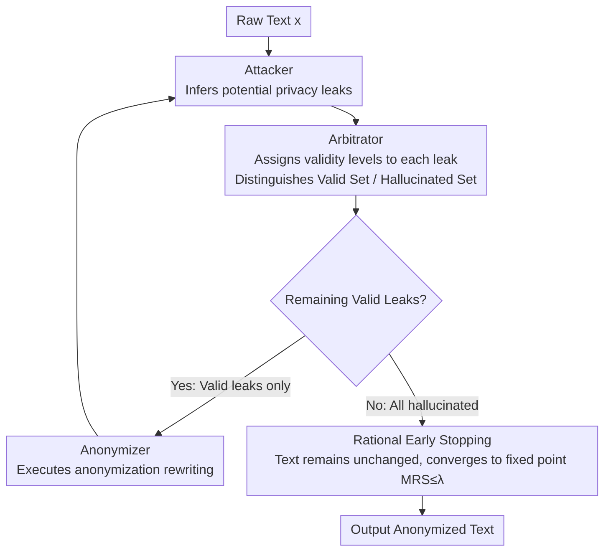

# Look Twice before You Leap: A Rational Framework for Localized Adversarial Anonymization

**Conference**: ACL 2026 Findings  
**arXiv**: [2512.06713](https://arxiv.org/abs/2512.06713)  
**Code**: [GitHub](https://github.com/SowingG2333/RLAA)  
**Area**: AI Safety / Privacy Protection  
**Keywords**: Text Anonymization, Adversarial Games, Privacy Paradox, Localized Deployment, Economic Rationality

## TL;DR
The authors propose the RLAA framework, which utilizes an Attacker-Arbitrator-Anonymizer architecture and Marginal Rate of Substitution (MRS) rationality constraints to resolve the utility collapse issue when migrating adversarial text anonymization to local small models (LSMs). This achieves a privacy-utility balance superior to API-based solutions on local devices without requiring additional training.

## Background & Motivation

**Background**: LLMs extensively process sensitive texts containing Personally Identifiable Information (PII), making text anonymization a prerequisite for compliance with regulations like GDPR/CCPA. The current state-of-the-art paradigm is Feedback-guided Adversarial Anonymization (FgAA), which enhances anonymization quality through iterative games between attacker and anonymizer models.

**Limitations of Prior Work**: FgAA relies on remote APIs of powerful LLMs like GPT-4, creating a fundamental "privacy paradox"—to protect privacy, users must first send raw sensitive data to an untrusted third party. However, directly migrating FgAA to Local Small Models (LSMs) leads to severe utility collapse, where texts are over-anonymized into hollow summaries.

**Key Challenge**: Utility collapse is not merely due to the limited capability of small models, but rather the economic irrationality under imperfect reasoning of greedy adversarial strategies. Small models tend to over-defend against "hallucinated leaks," resulting in marginal privacy gains approaching zero while marginal utility costs continue to accumulate.

**Goal**: To design a fully localized, training-free anonymization framework capable of achieving a reasonable privacy-utility balance on LSMs.

**Key Insight**: Modeling the anonymization process from an economic perspective as a trade-off between Marginal Privacy Gain (MPG) and Marginal Utility Cost (MUC), leveraging the cognitive asymmetry where verification is more reliable than generation to achieve rational decision-making.

**Core Idea**: Introducing an Arbitrator role as a "rational gatekeeper" to verify the validity of leak reasoning between the attacker's feedback and the anonymizer's actions. By filtering out hallucinated leaks, the framework structurally prevents utility collapse.

## Method

### Overall Architecture
RLAA adopts an iterative Attacker-Arbitrator-Anonymizer (A-A-A) architecture. Given a source text, the Attacker infers potential privacy leaks; the Arbitrator verifies whether these leaks are authentic and valid; the Anonymizer performs anonymization only on verified real leaks. An early stopping mechanism is triggered when the Arbitrator filters out all leaks, preventing meaningless continuous modifications. The entire iteration is governed by an economic rationality framework (MRS analysis) that provides a theoretical benchmark for "when to stop."

### Key Designs

**1. Economic Rationality Framework (MRS Analysis) — Quantifying "Over-Anonymization" Errors through Marginal Analysis**

Utility collapse was previously only described intuitively as "excessive anonymization." RLAA transforms this into a quantifiable economic criterion. By defining Marginal Privacy Gain $\Delta P_t$, Marginal Utility Cost $\Delta C_t$, and the Marginal Rate of Substitution $MRS_t = \Delta C_t / \Delta P_t$, the rationality condition requires $MRS_t \leq \lambda$. The problem with greedy adversarial strategies is that small models over-defend against "hallucinated leaks," causing $\Delta P_t \to 0$ and thus $MRS_t \to \infty$, sliding into the economic irrationality zone—hardly any privacy is added, while utility loss continues to accumulate. This framework not only diagnoses the root cause of collapse but also provides an analytical tool for decision-making.

**2. Arbitrator — Establishing a Rational Gate between Attack Feedback and Anonymization Actions**

Since collapse stems from small models treating hallucinated leaks as real threats, RLAA inserts an Arbitrator between the Attacker and the Anonymizer. It assigns a validity level $v_k \in \{High, Med, Low, Invalid\}$ for each leak $l_k$ identified by the attacker, separating them into a valid set and a hallucinated set—only executing valid leaks while ignoring hallucinated ones. This leverages the cognitive asymmetry that "verification is easier than generation": small models are prone to hallucination in open-ended reasoning but remain reliable in structured discrimination of specific leak details. Consequently, the rationality constraint $MRS_t \leq \lambda$ is implicitly enforced through architecture rather than numerical optimization or fine-tuning.

**3. Rational Early Stopping Mechanism — Halting Iteration at a Fixed Point when Marginal Gains Vanish**

Greedy strategies lack convergence guarantees and may continue destructive modifications even when marginal privacy gains are zero. RLAA links early stopping to the arbitration results: when the Arbitrator judges all leaks in a round to be hallucinated ($\mathcal{P}^{(t)} = \emptyset$), the system stops and the text remains unchanged $x^{(t+1)} = x^{(t)}$, ensuring the iteration converges to a fixed point. This step implements the MRS analysis conclusion: once further anonymization cannot yield privacy gains, the cost in utility should no longer be paid.

### Loss & Training
RLAA is a training-free framework that directly utilizes pre-trained LSMs (e.g., Llama3-8B, Qwen2.5-7B) for inference, requiring only approximately 4GB VRAM (with 4-bit quantization). All three roles can share the same LSM backbone.

## Key Experimental Results

### Main Results

| Method | Base Model | UTIL↑ | PRIV↓ | ROUGE↑ | BLEU↑ |
|------|----------|-------|-------|--------|-------|
| FgAA-Naive | Llama3-8B | 0.730 | 0.195 | 0.218 | 0.053 |
| IncogniText | Llama3-8B | 0.633 | 0.123 | 0.350 | 0.230 |
| **RLAA** | Llama3-8B | **0.879** | 0.213 | **0.596** | **0.425** |
| FgAA-API | DeepSeek-V3.2 | 0.826 | 0.206 | 0.465 | 0.208 |

### Ablation Study

| Configuration | UTIL↑ | PRIV↓ | Description |
|------|-------|-------|------|
| Full RLAA | 0.879 | 0.213 | Complete model |
| w/o Arbitrator (FgAA-Naive) | 0.730 | 0.195 | Removing Arbitrator results in utility collapse |
| SEAL | 0.464 | 0.179 | Requires training data, extremely low utility |
| IncogniText | 0.633 | 0.123 | Injects hallucinations, lowest privacy but poor utility |

### Key Findings
- The Arbitrator is the critical component to prevent utility collapse; removing it causes UTIL to drop from 0.879 to 0.730 and ROUGE from 0.596 to 0.218.
- RLAA even Pareto-dominates API-based solutions on the reddit-self-disclosure dataset (better privacy + higher utility).
- Excellent cross-model generalization: effective across Llama3-8B, Qwen2.5-7B, and DeepSeek-V3.2-Exp.
- MRS analysis confirms that RLAA constrains the iterative process within the economic rationality zone.

## Highlights & Insights
- Modeling anonymization via economic marginal analysis is a brilliant perspective. The MRS framework not only explains the root cause of utility collapse but also provides a generalizable decision-theory tool. This logic can be transferred to any scenario involving privacy-utility trade-offs.
- Utilizing the cognitive asymmetry of "verification is easier than generation" is an ingenious design. While small models frequent hallucinate during generation, they are more reliable at judging whether a reasoning chain is plausible. This provides a new path for the practical application of LSMs.
- The entirely training-free design significantly lowers deployment barriers and eliminates dependence on APIs and external training data.

## Limitations & Future Work
- The privacy protection rate (PRIV=0.213) is not as low as IncogniText (0.123), indicating an inherent privacy-utility trade-off.
- The Arbitrator's judgment quality is still bounded by the LSM's capabilities; extremely subtle privacy leaks might be missed.
- Evaluation is primarily on Reddit data; validation in high-sensitivity domains like healthcare or law is still required.
- The three-role iteration increases inference costs (requiring three LLM calls per round).
- Future work could integrate finer-grained arbitration strategies and domain adaptation.

## Related Work & Insights
- **vs FgAA**: FgAA's greedy strategy leads to utility collapse on small models; this paper implements rational constraints via the Arbitrator.
- **vs SEAL**: SEAL requires training data and SFT/DPO, whereas RLAA is entirely training-free; furthermore, SEAL exhibits extremely low utility.
- **vs IncogniText**: IncogniText achieves privacy by injecting false information, sacrificing semantic faithfulness, whereas RLAA preserves original semantics.

## Rating
- Novelty: ⭐⭐⭐⭐⭐ The economic MRS framework and Arbitrator design are highly original.
- Experimental Thoroughness: ⭐⭐⭐⭐ Extensive multi-dataset and multi-model evaluations, though domain coverage is limited.
- Writing Quality: ⭐⭐⭐⭐⭐ Clear argumentation with a smooth connection between theory and experiments.
- Value: ⭐⭐⭐⭐ Successfully addresses the practical privacy paradox with a broadly transferable framework.

<!-- RELATED:START -->

## Related Papers

- [\[ACL 2026\] Adaptive Text Anonymization: Learning Privacy-Utility Trade-offs via Prompt Optimization](adaptive_text_anonymization_learning_privacy-utility_trade-offs_via_prompt_optim.md)
- [\[ACL 2026\] ATAAT: Adaptive Threat-Aware Adversarial Tuning Framework against Backdoor Attacks on Vision-Language-Action Models](ataat_adaptive_threat-aware_adversarial_tuning_framework_against_backdoor_attack.md)
- [\[ACL 2026\] Subject-level Inference for Realistic Text Anonymization Evaluation](subject-level_inference_for_realistic_text_anonymization_evaluation.md)
- [\[ACL 2026\] Before Forgetting, Learn to Remember: Revisiting Foundational Learning Failures in LVLM Unlearning Benchmarks](before_forgetting_learn_to_remember_revisiting_foundational_learning_failures_in.md)
- [\[ACL 2026\] De-Anonymization at Scale via Tournament-Style Attribution](de-anonymization_at_scale_via_tournament-style_attribution.md)

<!-- RELATED:END -->
