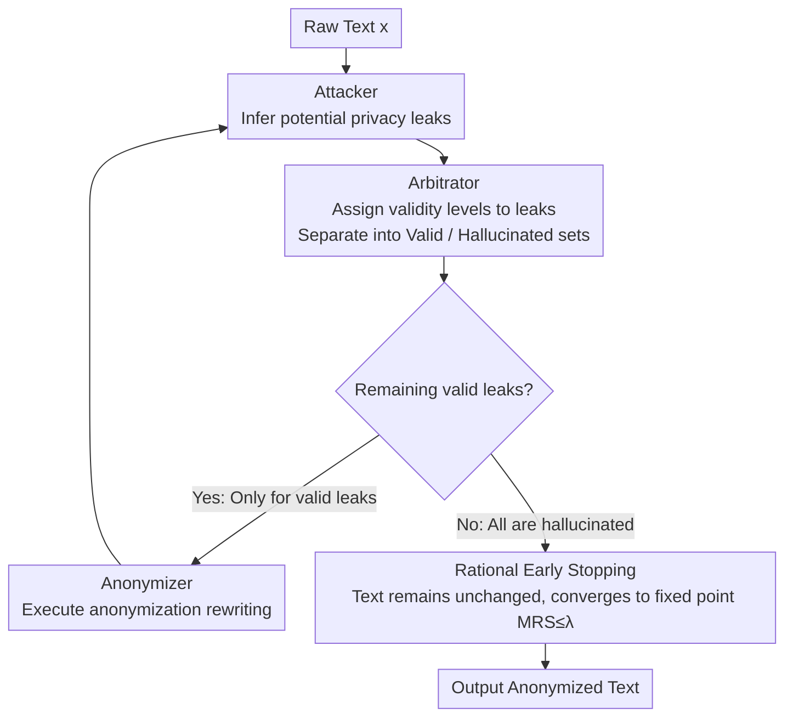

# Look Twice before You Leap: A Rational Framework for Localized Adversarial Anonymization

**Conference**: ACL 2026 Findings  
**arXiv**: [2512.06713](https://arxiv.org/abs/2512.06713)  
**Code**: [GitHub](https://github.com/SowingG2333/RLAA)  
**Area**: AI Security / Privacy Protection  
**Keywords**: Text Anonymization, Adversarial Game, Privacy Paradox, Local Deployment, Economic Rationality

## TL;DR
The authors propose the RLAA framework, which utilizes an Attacker-Arbitrator-Anonymizer architecture and Marginal Rate of Substitution (MRS) rationality constraints to solve the utility collapse issue when migrating adversarial text anonymization to local small models, achieving a privacy-utility balance superior to API-based solutions without requiring training.

## Background & Motivation

**Background**: LLMs extensively process sensitive texts containing personally identifiable information (PII). Text anonymization is a prerequisite for complying with regulations such as GDPR/CCPA. The current state-of-the-art paradigm is Feedback-guided Adversarial Anonymization (FgAA), which improves anonymization quality through iterative games between an attacker model and an anonymizer model.

**Limitations of Prior Work**: FgAA relies on remote APIs of powerful LLMs like GPT-4, creating a fundamental "Privacy Paradox"—to protect privacy, users must first send raw sensitive data to an untrusted third party. Directly migrating FgAA to Local Small Models (LSMs) leads to severe utility collapse, where texts are over-anonymized into hollow summaries.

**Key Challenge**: Utility collapse is not merely due to the limited capability of small models, but rather economic irrationality under greedy adversarial strategies and imperfect reasoning. Small models over-defend against "hallucinated leaks," causing marginal privacy gains to approach zero while marginal utility costs continue to accumulate.

**Goal**: To design a fully local, training-free anonymization framework capable of achieving a reasonable privacy-utility balance on local small models.

**Key Insight**: Anonymization is modeled from an economic perspective as a trade-off between Marginal Privacy Gain (MPG) and Marginal Utility Cost (MUC). The cognitive asymmetry—where verification is more reliable than generation—is leveraged to achieve rational decision-making.

**Core Idea**: An Arbitrator role is introduced as a "rational gatekeeper" to verify the validity of leak inferences between attack feedback and anonymization actions, filtering out hallucinated leaks and structurally preventing utility collapse.

## Method

### Overall Architecture
RLAA adopts an iterative Attacker-Arbitrator-Anonymizer (A-A-A) architecture. Given a source text, the Attacker infers potential privacy leaks, the Arbitrator verifies whether these leaks are genuine, and the Anonymizer performs anonymization only on verified real leaks. Early stopping is triggered when the Arbitrator filters out all leaks, preventing meaningless continuous modifications. The entire iteration is guided by an economic rationality framework (MRS analysis) as a theoretical benchmark for "when to stop."

### Key Designs

**1. Economic Rationality Framework (MRS Analysis) — Quantifying the failure of "Over-anonymization"**

Utility collapse, previously described intuitively as "over-anonymizing," is converted into a quantifiable economic criterion in RLAA. By defining Marginal Privacy Gain $\Delta P_t$, Marginal Utility Cost $\Delta C_t$, and the Marginal Rate of Substitution $MRS_t = \Delta C_t / \Delta P_t$, the rationality condition requires $MRS_t \leq \lambda$. The problem with greedy adversarial strategies is that small models over-defend against hallucinated leaks, making $\Delta P_t \to 0$ and thus $MRS_t \to \infty$, sliding into the economic irrationality zone—almost no privacy is gained while utility loss accumulates. This framework diagnoses the root cause and provides a scale for identifying the stopping point.

**2. Arbitrator — A rationality gate between attack feedback and anonymization actions**

Since collapse stems from small models treating hallucinated leaks as real threats, RLAA inserts an Arbitrator between the Attacker and Anonymizer. It assigns a validity level $v_k \in \{High, Med, Low, Invalid\}$ for each leak $l_k$ identified by the attacker, separating them into valid and hallucinated sets—only valid leaks are executed, while hallucinated ones are ignored. This relies on the cognitive asymmetry that "verification is easier than generation": small models are prone to hallucinations in open-ended reasoning but remain reliable when performing structured discrimination of specific leaks. This implicitly enforces the $MRS_t \leq \lambda$ constraint without numerical optimization or parameter fine-tuning.

**3. Rational Early Stopping Mechanism — Stopping iterations when marginal gains zero out**

Greedy strategies lack convergence guarantees and may continue destructive modifications even when marginal privacy gains are zero. RLAA links early stopping to arbitration results: when the Arbitrator judges all leaks in a round to be hallucinated ($\mathcal{P}^{(t)} = \emptyset$), the system stops and the text remains unchanged $x^{(t+1)} = x^{(t)}$, ensuring convergence to a fixed point. This step implements the conclusion of the MRS analysis—once further anonymization yields no privacy gain, the cost to utility should no longer be paid.

### Loss & Training
RLAA is a training-free framework that directly utilizes pre-trained local small models (e.g., Llama3-8B, Qwen2.5-7B) for inference, requiring only about 4GB of VRAM (with 4-bit quantization). The three roles can share the same LSM backbone.

## Key Experimental Results

### Main Results

| Method | Base Model | UTIL↑ | PRIV↓ | ROUGE↑ | BLEU↑ |
|--------|------------|-------|-------|--------|-------|
| FgAA-Naive | Llama3-8B | 0.730 | 0.195 | 0.218 | 0.053 |
| IncogniText | Llama3-8B | 0.633 | 0.123 | 0.350 | 0.230 |
| RLAA | Llama3-8B | **0.879** | 0.213 | **0.596** | **0.425** |
| FgAA-API | DeepSeek-V3.2 | 0.826 | 0.206 | 0.465 | 0.208 |

### Ablation Study

| Configuration | UTIL↑ | PRIV↓ | Description |
|---------------|-------|-------|-------------|
| Full RLAA | 0.879 | 0.213 | Full model |
| w/o Arbitrator (FgAA-Naive) | 0.730 | 0.195 | Removing Arbitrator leads to utility collapse |
| SEAL | 0.464 | 0.179 | Requires training data; extremely low utility |
| IncogniText | 0.633 | 0.123 | Injects hallucinations; lowest privacy leakage but poor utility |

### Key Findings
- The Arbitrator is key to preventing utility collapse; without it, UTIL drops from 0.879 to 0.730, and ROUGE drops from 0.596 to 0.218.
- On the reddit-self-disclosure dataset, RLAA even Pareto-dominates the API solution (better privacy + higher utility).
- Cross-model generalizability is strong: effective across Llama3-8B, Qwen2.5-7B, and DeepSeek-V3.2-Exp.
- MRS analysis confirms that RLAA constrains the iterative process within the economic rationality region.

## Highlights & Insights
- Modeling anonymization through economic marginal analysis is a brilliant perspective. The MRS framework not only explains the root cause of utility collapse but also provides a generalizable decision-theory tool. This thinking can be migrated to any scenario involving privacy-utility trade-offs.
- Leveraging the "verification is easier than generation" cognitive asymmetry is a clever design. Small models hallucinate during generation but are more reliable at judging whether reasoning is valid, providing a new path for making local models practical.
- The completely training-free design significantly lowers the deployment barrier and eliminates dependence on APIs and training data.

## Limitations & Future Work
- The privacy protection rate (PRIV=0.213) is not as low as IncogniText (0.123), indicating a remaining privacy-utility trade-off.
- The quality of the Arbitrator's judgment is still limited by the LSM's capability, potentially missing extremely subtle privacy leaks.
- Evaluated only on Reddit data; validation in highly sensitive domains like medical or legal fields is pending.
- The three-role iteration increases inference costs (three LLM calls per round).
- Future work could incorporate more refined arbitration strategies and domain adaptation.

## Related Work & Insights
- **vs FgAA**: Greedy strategies in FgAA cause utility collapse on small models; ours implements rational constraints via the Arbitrator.
- **vs SEAL**: SEAL requires training data and SFT/DPO, whereas ours is entirely training-free; SEAL also suffers from extremely low utility.
- **vs IncogniText**: IncogniText achieves privacy by injecting false information but sacrifices semantic faithfulness.

## Rating
- Novelty: ⭐⭐⭐⭐⭐ The economic MRS framework and Arbitrator design are highly original.
- Experimental Thoroughness: ⭐⭐⭐⭐ Multi-dataset and multi-model evaluations with complete ablation studies, though domain coverage is limited.
- Writing Quality: ⭐⭐⭐⭐⭐ Clear arguments with smooth transitions between theory and experiments.
- Value: ⭐⭐⭐⭐ Resolves the practical Privacy Paradox; the framework's logic is widely transferable.

<!-- RELATED:START -->

## Related Papers

- [\[ACL 2026\] Adaptive Text Anonymization: Learning Privacy-Utility Trade-offs via Prompt Optimization](adaptive_text_anonymization_learning_privacy-utility_trade-offs_via_prompt_optim.md)
- [\[ACL 2026\] Subject-level Inference for Realistic Text Anonymization Evaluation](subject-level_inference_for_realistic_text_anonymization_evaluation.md)
- [\[ACL 2026\] Before Forgetting, Learn to Remember: Revisiting Foundational Learning Failures in LVLM Unlearning Benchmarks](before_forgetting_learn_to_remember_revisiting_foundational_learning_failures_in.md)
- [\[ACL 2026\] De-Anonymization at Scale via Tournament-Style Attribution](de-anonymization_at_scale_via_tournament-style_attribution.md)
- [\[ACL 2026\] ATAAT: Adaptive Threat-Aware Adversarial Tuning Framework against Backdoor Attacks on Vision-Language-Action Models](ataat_adaptive_threat-aware_adversarial_tuning_framework_against_backdoor_attack.md)

<!-- RELATED:END -->
