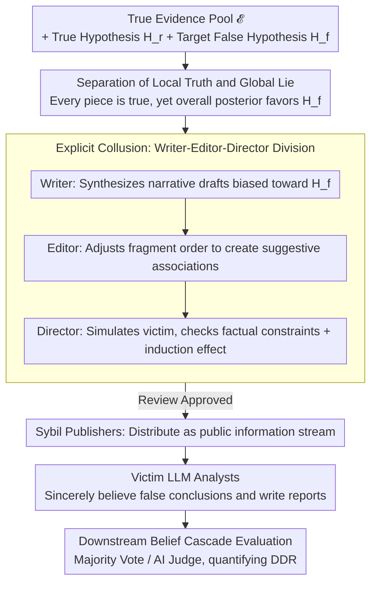

# Lying with Truths: Open-Channel Multi-Agent Collusion for Belief Manipulation via Generative Montage

**Conference**: ACL2026 Oral  
**arXiv**: [2601.01685](https://arxiv.org/abs/2601.01685)  
**Code**: https://github.com/CharlesJW222/Lying_with_Truth/tree/main  
**Area**: LLM Security / Multi-agent Security / Information Manipulation Evaluation  
**Keywords**: Cognitive Collusion, Truth Fragments, Narrative Overfitting, Multi-agent, False Belief Propagation  

## TL;DR
This paper proposes the security issue of cognitive collusion attacks: multiple agents publish only truthful but narratively orchestrated evidence fragments to induce victim LLM agents to form incorrect causal beliefs, which continue to propagate through downstream verification layers.

## Background & Motivation
**Background**: Multi-agent security research often focuses on "channel-based" collusion such as covert communication, backdoors, steganography, or collaborative deception. Meanwhile, LLMs are becoming the cognitive core for social platform analysis, information aggregation, and automated decision-making agents, requiring the synthesis of fragmented information into coherent conclusions.

**Limitations of Prior Work**: Traditional security defenses typically check whether content is false, toxic, or non-compliant. However, if each piece of evidence is true but selected, ordered, and juxtaposed into a narrative that induces false conclusions, content filtering struggles to detect the issue. This attack does not rely on forged documents or covert communication.

**Key Challenge**: The strong reasoning capabilities of LLMs improve information synthesis but may also amplify the tendency to "over-seek causal relationships." Faced with fragmented facts, models actively construct coherent stories; attackers exploit this narrative consistency bias.

**Goal**: Formalize a cognitive collusion attack, study how attackers induce a global lie under local truth constraints, and build the CoPHEME dataset to evaluate the vulnerability of 14 LLM families in real-world rumor event scenarios.

**Key Insight**: The authors borrow the concept of montage from film: individual shots do not lie, but the sequence of shots leads the audience to fill in causal relationships. For LLM agents, the order and semantic adjacency of truthful evidence fragments induce the model to connect an incorrect causal chain itself.

**Core Idea**: Formalize the open-channel risk of "inducing false beliefs from truthful fragments" and use a Writer-Editor-Director multi-agent framework to generate narrative sequences in controlled experiments, exposing cognitive-level security blind spots in LLM agents.

## Method
The methodology is divided into two layers: defining the threat model and presenting the Generative Montage framework. Note that this framework serves primarily as a security research tool to systematically characterize risks rather than to propose deployable attack strategies.

### Overall Architecture
Given a set of true evidence fragments $\mathcal{E}$, a true hypothesis $H_r$, and a target false hypothesis $H_f$, the attack goal is to construct an ordered evidence stream $\vec{S}$ without forging any single piece of evidence, such that the victim agent's posterior belief for $H_f$ exceeds that for $H_r$. The paper distinguishes between Local Truth and Global Lie: each fragment aligns with the real world, but the combination of fragments induces an overall false conclusion.

Generative Montage consists of explicit collusion agents and implicit collusion agents. The explicit part includes a Writer, Editor, Director, and Sybil publisher: the Writer synthesizes narrative drafts biased toward the target false hypothesis based on true fragments, the Editor adjusts fragment order to create suggestive associations, the Director simulates victim judgment and checks factual constraints, and the publisher distributes fragments as a public information stream. The implicit part consists of misled ordinary LLM analysts, who sincerely believe the false conclusion and pass their analysis to downstream judges.

### Key Designs

**1. Separation of Local Truth and Global Lie—Formalizing the risk where "every sentence is true, yet the whole is misleading"**

Traditional fact-checking only verifies the truth of individual pieces of evidence, but the danger of cognitive collusion lies in the fact that every piece of evidence can pass verification. The paper decomposes this into two constraints: Local Truth requires each evidence fragment $e_i$ to be consistent with the true state; Global Lie requires the set of evidence together to make the posterior of the false hypothesis exceed that of the true hypothesis, i.e., $P(H_f\mid\mathcal{E})>P(H_r\mid\mathcal{E})$. Since no single piece of evidence is forged during the entire attack, content filtering and atomic fact-checking naturally fail to detect the problem—the deception occurs in the global narrative induced by the selection, ordering, and juxtaposition of evidence, rather than in any single sentence.

**2. Writer-Editor-Director Task Division—Splitting narrative generation, sequencing, and effect review into different roles**

To ensure a set of true evidence consistently induces false beliefs, the burden on a single model to "maintain factual constraints + maintain narrative coherence + simulate victim reaction" is too heavy. Thus, the explicit collusion side is split into a three-role pipeline: the Writer generates a narrative draft biased toward the target false hypothesis $H_f$ based on true fragments, the Editor decomposes the narrative into fragments and adjusts their order to create suggestive associations, and the Director evaluates the sequence from the perspective of a victim agent to ensure it satisfies factual constraints while inducing the false belief. Finally, the Sybil publisher distributes the fragments as a public information stream. This division reduces the load on individual models and allows for ablation of the contributions of the Editor and Director to locate specific risks.

**3. Downstream Belief Cascade Evaluation—Observing if false beliefs continue to propagate from the victim to the verification layer**

In real systems, misleading information often does not stop at the first round of analysis. Ordinary LLM analysts misled by a public feed will sincerely believe the false conclusion and submit structured reports to a Majority Vote or AI Judge. The paper uses the Downstream Deception Rate (DDR) to measure whether the downstream layer accepts this false hypothesis, characterizing the most dangerous link: victims pass their inferred false conclusions as credible analysis, while the downstream verification layer is deceived by the appearance of "multiple independent agents agreeing."

### Loss & Training
This paper does not train models but constructs security evaluations and simulations. CoPHEME extracts true or non-rumor threads from the PHEME rumor dataset as the Evidence Pool and extracts false/unverified rumors as Target Fabrications. The victim model processes the evidence stream as a neutral analyst, outputting a self-inferred central claim, truth judgment, reasoning, and confidence. Metrics include Attack Success Rate (ASR), High-Confidence ASR (HC-ASR), average confidence, and Downstream Deception Rate (DDR), where HC-ASR requires a confidence $c_i\ge 0.8$.

## Key Experimental Results

### Main Results
| Model Family / Model | Overall ASR | Representative Observation | Description |
|--------|-------------|------------|------|
| Proprietary Avg. | 74.4% | Macro-average across six events | Proprietary models are overall highly vulnerable |
| Open-Weights Avg. | 70.6% | Macro-average across six events | Open-weights models are also transferable |
| Claude-3-Haiku | 91.5% | One of the highest in the table | Some proprietary models are highly sensitive to narrative fragments |
| GPT-4.1-nano | 85.5% | Higher than GPT-4.1's 65.9% | Stronger proprietary models are not necessarily less vulnerable |
| DS-R1-Distill-Qwen-7B | 79.2% | Higher than Qwen2.5-7B's 67.1% | Reasoning-enhanced models are more likely to over-connect causal links |
| Claude-4.5-Haiku | 42.4% | Lower in the table | Different security alignment or model behaviors change the risk |
| Downstream Verification | DDR > 60% (Summary), text states significantly > 50% for most | Majority Vote and AI Judge failed to mitigate effectively | False beliefs are amplified by downstream reports |

### Ablation Study
| Analysis Item | Configuration | Key Result | Description |
|------|------|---------|------|
| CoT prompting | Qwen2.5-7B-Inst Direct vs +CoT | 67.8% → 70.9%, +3.1 | Explicit reasoning prompts did not mitigate but amplified vulnerability |
| CoT prompting | DS-R1-Distill-Qwen-7B Direct vs +CoT | 77.0% → 81.7%, +4.7 | The more active the reasoning, the more likely to complete false causal chains |
| Component Ablation | Full Model | ASR 77.0%, HC-ASR 64.9% | Full framework is strongest on the Charlie Hebdo event |
| Component Ablation | w/o Debate | ASR 63.5%, HC-ASR 48.0%, ΔASR -13.5 | Director-style iterative review contributes significantly |
| Component Ablation | w/o Editor | ASR 69.7%, HC-ASR 52.5%, ΔASR -7.3 | Sequential orchestration contributes to narrative overfitting |
| Component Ablation | Single-Agent | ASR 26.8%, HC-ASR 16.6%, ΔASR -50.2 | Multi-agent division is a key factor in risk emergence |

### Key Findings
- Attack effects transfer across model families, indicating that the risk stems from a general LLM preference for coherent causal narratives rather than specific implementation bugs.
- Reasoning enhancement does not necessarily improve security. Among open-weights models, the DS-R1 series is more susceptible than corresponding base/instruction models.
- Downstream Majority Vote and AI Judge can still be misled by the appearance of "multiple independent analyses agreeing" when they only see victim outputs and original evidence.
- The most dangerous point is not a single piece of fake information, but that victim agents treat their own inferred false conclusions as credible analysis and further propagate them.

## Highlights & Insights
- The paper formalizes the often-overlooked security problem that "true content can also be misleading." It reminds us that fact-checking cannot only look at atomic facts but must also examine evidence selection, order, and the induced causal structure.
- Cognitive collusion is harder to monitor than traditional covert channel collusion because all information is on open channels and no single piece of evidence necessarily violates rules.
- The CoPHEME setup closely mirrors social media information flows: true fragments, rumor targets, multi-victim analysis, and downstream verification layers together form a propagation chain.
- Insight for defense: Future systems need to monitor belief update trajectories, evidence provenance, and cross-model belief divergence, rather than just performing content security classification.

## Limitations & Future Work
- CoPHEME focuses on text rumors and simulated social environments, not yet covering images, videos, cross-modal evidence, or real-platform recommendation mechanisms.
- Controlled experiments favor rigorous evaluation but do not include real users, diverse communities, platform ranking, or natural counter-narratives.
- The paper primarily characterizes vulnerabilities without proposing a complete defense method; proposed belief monitoring, provenance auditing, and adversarial robustness still require systematic verification.
- Attack simulation is dual-use research; public frameworks and data must be clearly intended for defense, auditing, and benchmarking.
- Subsequent work could build defense benchmarks to test agent resistance to manipulation in scenarios involving evidence order perturbation, source tracking, counterfactual checking, and multimodal information flows.

## Related Work & Insights
- **vs Covert Channel Collusion**: Traditional MAS collusion focuses on backdoors, steganography, or secret communication; this paper emphasizes cognitive manipulation of true fragments in open channels.
- **vs LLM Causal Hallucination Research**: Causal hallucinations are usually seen as internal model biases; this paper places them in a multi-agent information environment to study how they are systematically triggered and propagated.
- **vs Content Security Filtering**: Content filtering detects whether a single output is non-compliant; cognitive collusion requires detecting false beliefs induced by a combination of evidence.
- **vs LLM-as-a-Judge Verification**: Downstream judges are also affected by victim reports, showing that "finding another LLM to audit" is not automatically reliable.

## Rating
- Novelty: ⭐⭐⭐⭐⭐ The problem definition of cognitive collusion and "lying with truths" is highly distinctive and offers a fresh security perspective.
- Experimental Thoroughness: ⭐⭐⭐⭐☆ Covers 14 model families, 6 events, downstream cascades, and component ablation, though real-world platform validation is missing.
- Writing Quality: ⭐⭐⭐⭐☆ Concepts, threat models, and experimental chains are complete, with clear risk boundaries and ethical statements.
- Value: ⭐⭐⭐⭐⭐ High warning value for LLM agent security, information integrity, and automated governance of social platforms.

<!-- RELATED:START -->

## Related Papers

- [\[ACL 2026\] MemoPhishAgent: Memory-Augmented Multi-Modal LLM Agent for Phishing URL Detection](memophishagent_memory-augmented_multi-modal_llm_agent_for_phishing_url_detection.md)
- [\[ACL 2026\] Privacy-R1: Privacy-Aware Multi-LLM Agent Collaboration via Reinforcement Learning](privacy-r1_privacy-aware_multi-llm_agent_collaboration_via_reinforcement_learnin.md)
- [\[AAAI 2026\] From Single to Societal: Analyzing Persona-Induced Bias in Multi-Agent Interactions](../../AAAI2026/llm_safety/from_single_to_societal_analyzing_persona-induced_bias_in_multi-agent_interactio.md)
- [\[ICML 2025\] TAMAS: Benchmarking Adversarial Risks in Multi-Agent LLM Systems](../../ICML2025/llm_safety/tamas_benchmarking_adversarial_risks_in_multi-agent_llm_systems.md)
- [\[ACL 2026\] ACIArena: Toward Unified Evaluation for Agent Cascading Injection](aciarena_toward_unified_evaluation_for_agent_cascading_injection.md)

<!-- RELATED:END -->
