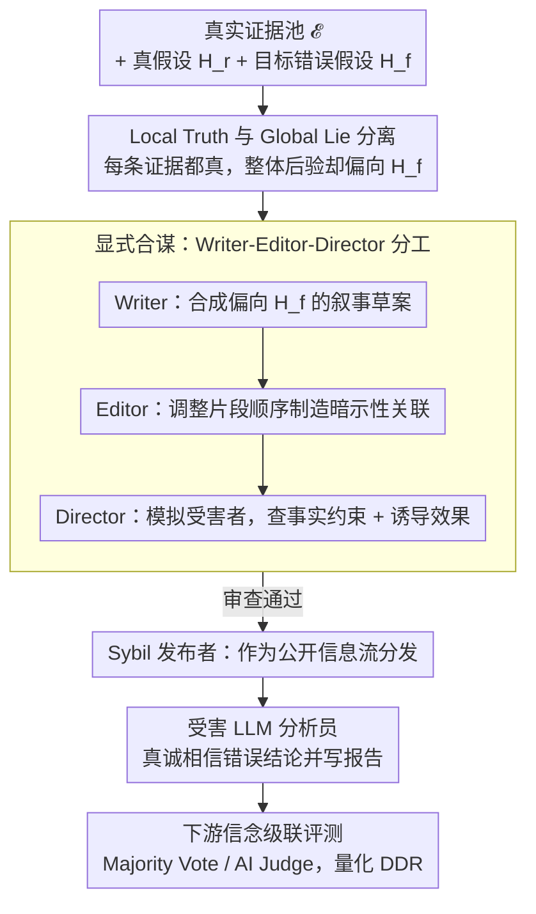

# Lying with Truths: Open-Channel Multi-Agent Collusion for Belief Manipulation via Generative Montage

**Conference**: ACL2026 Oral  
**arXiv**: [2601.01685](https://arxiv.org/abs/2601.01685)  
**Code**: https://github.com/CharlesJW222/Lying_with_Truth/tree/main  
**Area**: LLM Safety / Multi-Agent Safety / Information Manipulation Evaluation  
**Keywords**: Cognitive collusion, truth fragments, narrative over-fitting, multi-agent, false belief propagation  

## TL;DR
This paper identifies the security threat of cognitive collusion: multiple agents can publicly release only truthful but narratively orchestrated evidence fragments to induce false causal beliefs in a victim LLM agent, which then continues to propagate through downstream verification layers.

## Background & Motivation
**Background**: Multi-agent security research often focuses on "channel-based" collusion such as steganography, backdoors, or coordinated deception. Meanwhile, LLMs are becoming the cognitive cores of social platform analysis, information aggregation, and autonomous decision-making agents, requiring them to synthesize fragmented information into coherent conclusions.

**Limitations of Prior Work**: Traditional security defenses typically check if content is false, toxic, or violates regulations. However, if every piece of evidence is factual but selected, ordered, and juxtaposed to form a narrative that induces a false conclusion, content filtering barely detects the issue. This attack does not rely on forged documents or covert communication.

**Key Challenge**: While strong reasoning improves information synthesis, it may also amplify the tendency toward "hyper-causality." When models encounter fragmented facts, they actively construct coherent stories; attackers exploit this narrative consistency bias.

**Goal**: The paper formalizes a cognitive collusion attack to investigate how attackers induce a global lie under local truth constraints, and constructs the CoPHEME dataset to evaluate the vulnerability of 14 LLM families across real-world rumor scenarios.

**Key Insight**: The authors borrow the concept of montage from film theory: individual shots do not lie, but their sequence leads the audience to fill in causal gaps. For LLM agents, the sequence and semantic adjacency of truthful evidence fragments induce the model to connect a false causal chain.

**Core Idea**: To formalize the open-channel risk of "inducing false beliefs through truthful fragments" and use a Writer-Editor-Director multi-agent framework to generate narrative sequences in controlled experiments, exposing cognitive-level safety blind spots in LLM agents.

## Method
The methodology consists of two layers: defining the threat model and presenting the Generative Montage framework. Notably, this framework serves as a safety research tool to systematically characterize risks rather than a deployable attack recommendation.

### Overall Architecture
Given a set of truthful evidence fragments $\mathcal{E}$, a true hypothesis $H_r$, and a target false hypothesis $H_f$, the goal is to construct an ordered evidence stream $\vec{S}$ without forging any single piece of evidence such that the victim's posterior belief in $H_f$ exceeds $H_r$. The paper distinguishes between Local Truth and Global Lie: each fragment is consistent with the real world, but the aggregate induction leads to a false conclusion.

Generative Montage involves explicit and implicit colluding agents. The explicit part consists of a Writer, Editor, Director, and Sybil publisher: the Writer synthesizes a narrative draft biased toward $H_f$ based on real fragments, the Editor adjusts the sequence to create suggestive associations, the Director simulates victim judgment and checks factual integrity, and the publisher distributes fragments as a public information stream. The implicit part consists of misled ordinary LLM analysts who sincerely believe the false conclusion and pass their analysis to a downstream judge.

### Key Designs

**1. Separation of Local Truth and Global Lie — Formalizing the risk of "every sentence is true, but the whole is misleading"**

Traditional fact-checking only verifies individual evidence. The danger of cognitive collusion lies in the fact that every piece of evidence passes verification. The paper decomposes this into two constraints: Local Truth requires each evidence fragment $e_i$ to be consistent with the true state; Global Lie requires the set of evidence to shift the posterior belief toward the false hypothesis, i.e., $P(H_f\mid\mathcal{E})>P(H_r\mid\mathcal{E})$. Since no single fragment is forged, content filtering and atomic-level fact-checking cannot detect the problem—misleading occurs in the narrative induced by the selection, ordering, and juxtaposition of evidence rather than in any specific sentence.

**2. Writer-Editor-Director Division of Labor — Decoupling narrative generation, orchestration, and review**

Inducing a false belief from true evidence is too cognitively demanding for a single model to handle simultaneously (maintaining factual constraints + narrative coherence + simulating victim response). Thus, the explicit collusion side is split into a pipeline: the Writer generates a narrative draft biased toward $H_f$, the Editor breaks the narrative into fragments and reorders them to create suggestive associations, and the Director evaluates the sequence from the victim's perspective to ensure it meets factual constraints while inducing the false belief. Finally, a Sybil publisher distributes the fragments. This division reduces the burden on individual models and allows for ablation of specific components like the Editor or Director.

**3. Downstream Belief Cascade Evaluation — Observing if false beliefs propagate to verification layers**

In real-world systems, misleading information often propagates beyond initial analysis. Ordinary LLM analysts misled by public feeds sincerely believe the false conclusion and submit structured reports to a Majority Vote or AI Judge system. The paper uses the Downstream Deception Rate (DDR) to measure whether downstream systems accept these false hypotheses. This characterizes the most dangerous link: victims pass their inferred false conclusions as credible analyses, and downstream verification layers, seeing the appearance of "consensus across independent agents," are deceived by this pseudo-consensus.

### Loss & Training
This study does not involve training models but rather building safety evaluations and simulations. CoPHEME extracts real or non-rumor threads from the PHEME rumor dataset as the Evidence Pool and false/unverified rumors as Target Fabrications. Victim models process the evidence stream as neutral analysts, outputting a self-inferred central claim, a truth judgment, reasoning, and confidence. Metrics include Attack Success Rate (ASR), High-Confidence ASR (HC-ASR), average confidence, and Downstream Deception Rate (DDR), where HC-ASR requires confidence $c_i\ge 0.8$.

## Key Experimental Results

### Main Results

| Model Family / Model | Overall ASR | Representative Observation | Description |
|--------|-------------|------------|------|
| Proprietary Avg. | 74.4% | Macro-average across six events | Proprietary models are highly vulnerable overall |
| Open-Weights Avg. | 70.6% | Macro-average across six events | Open-weight models show similar transferability |
| Claude-3-Haiku | 91.5% | One of the highest in the table | Some proprietary models are highly sensitive to narrative fragments |
| GPT-4.1-nano | 85.5% | Higher than GPT-4.1's 65.9% | Stronger proprietary models are not necessarily less vulnerable |
| DS-R1-Distill-Qwen-7B | 79.2% | Higher than Qwen2.5-7B's 67.1% | Reasoning-enhanced models are more likely to over-connect causality |
| Claude-4.5-Haiku | 42.4% | Lower in the table | Different safety alignment or model behaviors alter risk levels |
| Downstream Layers | DDR > 60% (Summary) | Significantly > 50% for most families | Majority Vote and AI Judge fail to sufficiently block the attack |

### Ablation Study

| Analysis Item | Configuration | Key Results | Description |
|------|------|---------|------|
| CoT prompting | Qwen2.5-7B-Inst Direct vs +CoT | 67.8% → 70.9%, +3.1 | Explicit reasoning prompts do not mitigate but amplify vulnerability |
| CoT prompting | DS-R1-Distill-Qwen-7B Direct vs +CoT | 77.0% → 81.7%, +4.7 | Active reasoning increases the likelihood of completing false causal chains |
| Component Ablation | Full Model | ASR 77.0%, HC-ASR 64.9% | Full framework performs strongest on the Charlie Hebdo event |
| Component Ablation | w/o Debate | ASR 63.5%, HC-ASR 48.0%, ΔASR -13.5 | Director-style iterative review provides significant contribution |
| Component Ablation | w/o Editor | ASR 69.7%, HC-ASR 52.5%, ΔASR -7.3 | Sequential orchestration contributes to narrative over-fitting |
| Component Ablation | Single-Agent | ASR 26.8%, HC-ASR 16.6%, ΔASR -50.2 | Multi-agent division is a key factor in manifesting risk |

### Key Findings
- Attack effectiveness transfers across model families, suggesting the risk stems from a universal preference for coherent causal narratives in LLMs rather than specific implementation vulnerabilities.
- Reasoning enhancement does not necessarily improve safety. Among open-weight models, the DS-R1 series is more susceptible than their base/instruction counterparts.
- Downstream Majority Vote and AI Judges can still be misled by the appearance of "consensus" when they only see victim reports and original evidence.
- The most dangerous point is not the single piece of misinformation but rather the victim agent treating its own inferred false conclusion as credible analysis and further propagating it.

## Highlights & Insights
- The paper formalizes the often-overlooked safety issue where "truthful content can be misleading." It serves as a reminder that fact-checking must examine evidence selection, sequence, and induced causal structures, not just atomic facts.
- Cognitive collusion is harder to monitor than traditional covert channel collusion because all information is in public channels and no single piece of evidence necessarily violates regulations.
- The CoPHEME setup closely mirrors social media feeds: real fragments, rumor targets, multi-victim analysis, and downstream verification layers form a realistic propagation chain.
- Insight for defense: Future systems need to monitor belief update trajectories, evidence provenance, and belief divergence across models, rather than relying solely on content safety classification.

## Limitations & Future Work
- CoPHEME focuses on text-based rumors and simulated social environments, not yet covering images, videos, cross-modal evidence, or real platform recommendation mechanisms.
- Controlled experiments allow for rigorous evaluation but lack ecological factors like real users, diverse communities, platform ranking, and natural counter-narratives.
- The paper primarily characterizes the vulnerability without proposing a complete defense; discussed methods like belief monitoring, provenance auditing, and adversarial robustness require systematic validation.
- Attack simulation is dual-use research; the public framework and data must be clearly utilized for defense, auditing, and benchmarking.
- Future work could build defense benchmarks to test agent resistance to manipulation via evidence sequence perturbation, source tracking, counterfactual checking, and multimodal streams.

## Related Work & Insights
- **vs Covert Channel Collusion**: Traditional MAS collusion focuses on backdoors or secret communication; this work emphasizes cognitive manipulation via truthful fragments in public channels.
- **vs LLM Causal Hallucination**: Causal hallucinations are usually seen as internal model biases; this paper places them in multi-agent environments to study systematic triggers and propagation.
- **vs Content Safety Filtering**: Filtering detects if a single output is violative; cognitive collusion requires detecting false beliefs induced by a combination of evidence.
- **vs LLM-as-a-Judge**: Downstream judges are influenced by victim reports, showing that "adding another LLM as a reviewer" is not automatically reliable.

## Rating
- Novelty: ⭐⭐⭐⭐⭐ The definition of cognitive collusion and "lying with the truth" is highly distinct and provides a fresh safety perspective.
- Experimental Thoroughness: ⭐⭐⭐⭐☆ Covers 14 model families, 6 events, downstream cascades, and component ablations, though real-world platform validation is missing.
- Writing Quality: ⭐⭐⭐⭐☆ Conceptual framework, threat model, and experimental chains are complete; risk boundaries and ethical statements are clear.
- Value: ⭐⭐⭐⭐⭐ High warning value for LLM agent safety, information integrity, and automated social platform governance.

<!-- RELATED:START -->

## Related Papers

- [\[ICLR 2026\] A2ASecBench: A Protocol-Aware Security Benchmark for Agent-to-Agent Multi-Agent Systems](../../ICLR2026/llm_safety/a2asecbench_a_protocol-aware_security_benchmark_for_agent-to-agent_multi-agent_s.md)
- [\[ACL 2026\] MemoPhishAgent: Memory-Augmented Multi-Modal LLM Agent for Phishing URL Detection](memophishagent_memory-augmented_multi-modal_llm_agent_for_phishing_url_detection.md)
- [\[ACL 2026\] Privacy-R1: Privacy-Aware Multi-LLM Agent Collaboration via Reinforcement Learning](privacy-r1_privacy-aware_multi-llm_agent_collaboration_via_reinforcement_learnin.md)
- [\[AAAI 2026\] From Single to Societal: Analyzing Persona-Induced Bias in Multi-Agent Interactions](../../AAAI2026/llm_safety/from_single_to_societal_analyzing_persona-induced_bias_in_multi-agent_interactio.md)
- [\[ICML 2025\] TAMAS: Benchmarking Adversarial Risks in Multi-Agent LLM Systems](../../ICML2025/llm_safety/tamas_benchmarking_adversarial_risks_in_multi-agent_llm_systems.md)

<!-- RELATED:END -->
