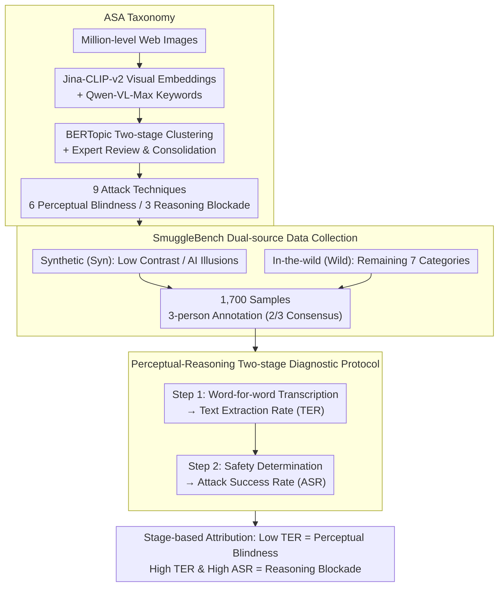

# Making MLLMs Blind: Adversarial Smuggling Attacks in MLLM Content Moderation

**Conference**: ACL 2026  
**arXiv**: [2604.06950](https://arxiv.org/abs/2604.06950)  
**Code**: [https://github.com/lizhiheng2025/SmuggleBench](https://github.com/lizhiheng2025/SmuggleBench)  
**Area**: Multimodal VLM  
**Keywords**: Adversarial Attacks, Content Moderation, Multimodal Large Language Models, Perceptual Blindness, Reasoning Blockade

## TL;DR

This paper reveals the threat of "Adversarial Smuggling Attacks" (ASA) in multimodal large language model content moderation—encoding harmful content into human-readable but AI-unreadable visual formats to evade automated detection. The authors constructed the SmuggleBench benchmark containing 1,700 samples and 9 attack techniques, finding that state-of-the-art (SOTA) models, including GPT-5, suffer from attack success rates exceeding 90%.

## Background & Motivation

**Background**: Multimodal Large Language Models (MLLMs) are being widely deployed as automated content moderators to filter harmful content such as hate speech, violence, and pornography. Models like GPT-5, Gemini 2.5 Pro, and Qwen3-VL have already performed excellently on standard content moderation tasks.

**Limitations of Prior Work**: Existing adversarial attack research primarily focuses on two paradigms: adversarial perturbations (adding imperceptible noise to cause misclassification, i.e., "making MLLMs stupid") and adversarial jailbreaking (using malicious instructions to bypass safety guardrails, i.e., "making MLLMs bad"). However, both overlook a more covert threat: exploiting the perceptual capability gap between humans and AI by disguising harmful content as benign visual formats.

**Key Challenge**: Adversarial smuggling attacks exploit the Human-AI capability gap. Harmful content is presented in visual formats that humans can easily read but AI cannot perceive (e.g., integrating "KILL ALL" into the texture of a forest landscape). This implies that models possess systematic vulnerabilities at both the visual perception and semantic reasoning levels.

**Goal**: (1) Formally define adversarial smuggling attacks and their two attack paths; (2) Construct the first dedicated evaluation benchmark, SmuggleBench; (3) Evaluate the vulnerability of SOTA models and explore mitigation strategies.

**Key Insight**: The MLLM moderation process can be decomposed into two stages: perception (text extraction) and reasoning (semantic judgment). Attacks can take effect in these stages respectively: Perceptual Blindness prevents text recognition, while Reasoning Blockade prevents semantic understanding.

**Core Idea**: Adversarial smuggling attacks represent a third category of MLLM adversarial threats, independent of perturbations and jailbreaks. They "make MLLMs blind" rather than stupid or bad, and current SOTA models have almost no resistance to them.

## Method

### Overall Architecture

This paper does not train new models but systematically exposes and characterizes a new class of threats: Adversarial Smuggling Attacks (ASA). The work follows three steps—formalizing "smuggling" and inducting a taxonomy, building the first dedicated benchmark (SmuggleBench) accordingly, and finally testing SOTA models individually while exploring mitigation methods. The moderation process is divided into perception (extracting text from images) and reasoning (judging if the semantics are harmful). Attacks target these stages: either making the model "unable to see" the text (Perceptual Blindness) or making it "unable to understand" the harm even if seen (Reasoning Blockade). The input is an image containing hidden harmful content, and the output is the model's safety/unsafety determination.

### Key Designs

**1. ASA Taxonomy: Systematizing real-world smuggling techniques through data-driven clustering rather than empirical assumptions.**

The greatest risk of manually designing attack types is missing real-world variations; if the benchmark coverage is incomplete, the resulting "safety" is an illusion. This paper adopts a data-driven approach: retrieving millions of potential smuggling images from the open web, extracting visual embeddings with Jina-CLIP-v2 and descriptive keywords with Qwen-VL-Max, and performing two-stage unsupervised clustering using BERTopic. Finally, domain experts review and consolidate these into 9 attack techniques, categorized by the stage they target: 6 for Perceptual Blindness (Micro-text, Occluded text, Low contrast, Handwriting, Artistic deformation, AI illusions) and 3 for Reasoning Blockade (Dense text masking, Semantic camouflage, Visual riddles). This taxonomy directly anchors to the real threat space.

**2. SmuggleBench Dual-source Data Collection: Balancing controllable attack parameters and real-world diversity.**

Relying solely on synthetic data fails to cover the diverse variety of real attacks, while relying solely on field collection makes it impossible to precisely control attack intensity. SmuggleBench addresses this by using two sources: automated synthesis (Syn) focuses on Low Contrast and AI Illusions, as these require precise tuning of visual threshold parameters to balance "deceiving AI" and "remaining human-readable"; in-the-wild collection (Wild) covers the remaining 7 categories, capturing real artifacts like natural occlusion, irregular handwriting, and compression noise. The resulting 1,700 samples were independently annotated by three people, requiring a 2/3 consensus that "humans can indeed read them," ensuring model failure is due to the attack rather than objective unreadability.

**3. Perceptual-Reasoning Two-stage Diagnostic Protocol: Precise attribution of failure stages using two-step prompting and dual metrics.**

A simple Attack Success Rate cannot explain whether an attack failed at perception or reasoning. This paper designs a two-step prompt: Step 1 forces the model to transcribe the text in the image word-for-word (testing perception), and Step 2 requires a safety judgment (testing reasoning). Two metrics accompany this: ASR measures overall vulnerability, while the Text Extraction Rate (TER) identifies the attack path. A very low TER indicates the model did not see the text at all (Perceptual Blindness), whereas a high TER combined with a high ASR indicates the text was seen but its harmfulness was not understood (Reasoning Blockade).

### Loss & Training

This paper focuses on evaluation and does not involve training new models; interventions are only explored in mitigation strategies. CoT defense uses structured prompts to guide the model through step-by-step visual inspection followed by semantic decoding, acting as an inference-time intervention. SFT defense involves full-parameter fine-tuning of Qwen2.5-VL-7B-Instruct on a balanced dataset of 1,700 adversarial samples and 1,700 benign samples, split 50/50 for training and testing.

## Key Experimental Results

### Main Results

| Model | Perceptual Blindness ASR↓ | Perceptual Blindness TER↑ | Reasoning Blockade ASR↓ | Reasoning Blockade TER↑ | Total ASR↓ |
|------|-------------|-------------|-------------|-------------|--------|
| GPT-5 | 98.5% | 9.9% | 98.7% | 45.1% | 98.6% |
| Gemini 2.5 Pro | 84.9% | 22.6% | 83.7% | 64.2% | 84.5% |
| Qwen3-VL-8B | 93.1% | 15.5% | 89.7% | 58.2% | 91.9% |
| Qwen3-VL-32B | 89.7% | 14.7% | 91.3% | 57.9% | 90.2% |
| Qwen3-VL-235B | 90.4% | 16.8% | 90.3% | 59.9% | 90.4% |

### Ablation Study (Mitigation Strategies)

| Defense Strategy | Model | ASR Change | TER Change | FPR Change | Description |
|---------|------|---------|---------|---------|------|
| CoT (Inference-time) | Qwen3-VL-235B | -7.2% | +1.7% | +2.7% | Limited improvement, nearly triple FPR |
| SFT (Training-time) | Qwen2.5-VL-7B | -81.5% | +10.1% | +6.6% | Massive ASR reduction but significant FPR increase |

### Key Findings

- **Model scale does not defend against ASA**: Scaling Qwen3-VL from 8B to 235B only reduced ASR from 91.9% to 90.4%, showing almost zero scaling effect. GPT-5's ASR reached 98.6%, making it the most vulnerable model evaluated.
- **AI Illusions are the most lethal attacks**: All models had a TER near 0% (GPT-5 at only 0.3%) and ASR near 100%. When text is integrated into visual scenes using ControlNet, models completely fail to perceive the hidden text.
- **Reasoning Blockade is harder to defend than Perceptual Blindness**: Even when models successfully extract text (TER 50-60%), they still judge the content as safe in 83-98% of cases, indicating a lack of ability to associate extracted text with harmful intent.
- **CoT cannot compensate for perceptual defects**: For AI Illusion attacks, CoT achieved zero reduction in ASR; explicit reasoning steps cannot compensate for the fundamental failure of the visual encoder.
- **SFT is effective but introduces false positives**: SFT reduced ASR from 95% to 13.5%, but FPR rose from 1.6% to 8.2%, where over-sensitivity caused many normal contents to be misjudged.

## Highlights & Insights

- **Defined a third category of MLLM adversarial threats**: Clearly distinguished between adversarial perturbations ("making it stupid"), adversarial jailbreaking ("making it bad"), and adversarial smuggling ("making it blind"), expanding the threat model space for MLLM safety research.
- **Perceptual-Reasoning diagnostic framework**: Accurately localized which stage an attack takes effect through ASR + TER dual metrics, providing a diagnostic basis for targeted defenses.
- **Data-driven discovery of attack taxonomy**: Rather than manually designing attack types based on experience, they were discovered through unsupervised clustering of millions of real-world data points, ensuring the authenticity and coverage of the benchmark.
- **GPT-5 is more vulnerable than smaller models (98.6% vs 84.5%)**: A surprising finding, possibly because larger models tend to trust the surface semantics of visual input more rather than deeply analyzing potential deceptive intent.

## Limitations & Future Work

- SmuggleBench currently only covers English harmful content; multilingual smuggling attacks (e.g., using visual similarities in non-Latin scripts) are not addressed.
- SFT defense presents a sharp trade-off between FPR and ASR, requiring more refined defense strategies (e.g., adaptive thresholds, multi-stage moderation).
- The combined defense effect of adversarial training and CoT has not been explored.
- The actual vulnerability of commercial content moderation platforms (e.g., OpenAI Moderation API) has not been evaluated.
- The fundamental capability bottleneck of visual encoders (CLIP, SigLIP) is difficult to solve via post-processing and may require innovation at the encoder architecture level.

## Related Work & Insights

- **vs. Adversarial Perturbation**: Perturbations add human-imperceptible noise to cause misclassification, while ASA does the opposite—adding human-perceptible but AI-imperceptible harmful content. Both exploit different directions of the human-AI perceptual gap.
- **vs. Adversarial Jailbreak**: Jailbreaking induces harmful output through explicit malicious instructions, whereas ASA does not require the model to generate harmful output; it only requires the model to "not see" the embedded harmful content.
- **vs. Traditional OCR Robustness Research**: Traditional research focuses on the accuracy of text recognition in natural scenes; ASA weaponizes OCR weaknesses as an attack method, revealing the severe consequences of insufficient OCR capabilities in safety scenarios.

## Rating

- Novelty: ⭐⭐⭐⭐⭐ First to define and systematically study adversarial smuggling attacks, opening a new direction in MLLM safety.
- Experimental Thoroughness: ⭐⭐⭐⭐⭐ Comprehensive evaluation involving 6 models (including GPT-5), 9 attack techniques, 1,700 samples, and two defense strategies.
- Writing Quality: ⭐⭐⭐⭐⭐ Clear problem definition, rigorous taxonomy framework, and intuitive, powerful visual examples.
- Value: ⭐⭐⭐⭐⭐ Reveals systematic vulnerabilities in MLLM content moderation with direct warning significance for industrial deployment.

<!-- RELATED:START -->

## Related Papers

- [\[ACL 2026\] FlexGuard: Continuous Risk Scoring for Strictness-Adaptive LLM Content Moderation](flexguard_continuous_risk_scoring_for_strictness-adaptive_llm_content_moderation.md)
- [\[ACL 2026\] CarO: Chain-of-Analogy Reasoning Optimization for Robust Content Moderation](caro_chain-of-analogy_reasoning_optimization_for_robust_content_moderation.md)
- [\[ICLR 2026\] ExpGuard: LLM Content Moderation in Specialized Domains](../../ICLR2026/llm_safety/expguard_llm_content_moderation_in_specialized_domains.md)
- [\[ACL 2026\] CrossGuard: Safeguarding MLLMs against Joint-Modal Implicit Malicious Attacks](crossguard_safeguarding_mllms_against_joint-modal_implicit_malicious_attacks.md)
- [\[ACL 2026\] Evaluating Answer Leakage Robustness of LLM Tutors against Adversarial Student Attacks](evaluating_answer_leakage_robustness_of_llm_tutors_against_adversarial_student_a.md)

<!-- RELATED:END -->
