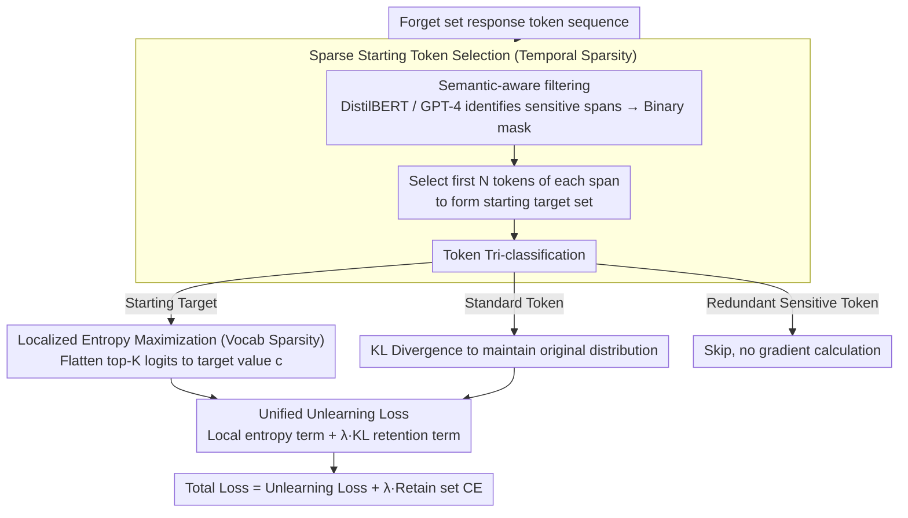

# Maximizing Local Entropy Where It Matters: Prefix-Aware Localized LLM Unlearning

**Conference**: ACL 2026  
**arXiv**: [2601.03190](https://arxiv.org/abs/2601.03190)  
**Code**: [GitHub](https://github.com/nxZhai/PALU)  
**Area**: LLM Safety / Machine Unlearning  
**Keywords**: LLM Unlearning, Localized Entropy Maximization, Prefix-Aware, Vocabulary Sparsification, Privacy Protection

## TL;DR

This paper proposes PALU (Prefix-Aware Localized Unlearning), which achieves localized entropy maximization unlearning across both temporal and vocabulary dimensions: it applies unlearning objectives only to sensitive prefix tokens in the temporal dimension and flattens only the top-K logits in the vocabulary dimension. This enables efficient unlearning with minimal parameter perturbation while maintaining the model's general capabilities.

## Background & Motivation

**Background**: LLMs inevitably memorize sensitive, private, and copyrighted information from training data. Machine Unlearning aims to selectively remove specific knowledge from a model without retraining from scratch. Existing methods are primarily based on negated cross-entropy (negated CE) and its variants.

**Limitations of Prior Work**: (1) Negated CE objectives only suppress the probability of the top-1 token, but the suppressed probability mass may transfer to highly related synonyms, leaving the distribution sharp (low entropy) and the model failing to truly "forget"; (2) Existing methods apply unlearning gradients indiscriminately to all response tokens, including content-irrelevant functional words like "is" or "for," leading to unnecessary degradation of linguistic abilities; (3) Full-vocabulary entropy maximization methods (e.g., PDU), while theoretically superior, require calculating gradients over the $|V|$-dimensional vocabulary, which is computationally prohibitive.

**Key Challenge**: Efficient unlearning requires precise intervention, yet existing methods perform global, indiscriminate optimization in both the temporal (token sequence) and vocabulary dimensions—redundant optimization both wastes computation and harms general model capabilities.

**Goal**: To achieve effective unlearning with minimal necessary perturbation by implementing sparsification in both temporal and vocabulary dimensions.

**Key Insight**: Two key observations—(i) Sensitive semantics are triggered by a few prefix tokens, and applying unlearning only to these "starting tokens" is sufficient to deflect the generation path; (ii) Autoregressive decoding is dominated by a few high-probability candidates, and flattening only the top-K logits can effectively introduce uncertainty.

**Core Idea**: Bi-directional localization—only intervene on sensitive prefix tokens in the temporal dimension, and only flatten top-K logits toward a uniform value $c$ in the vocabulary dimension, reducing unlearning complexity from $O(T|V|)$ to $O(TK)$.

## Method

### Overall Architecture

PALU aims to ensure "unlearning is precise without collateral damage." It compresses unlearning interventions into minimal subsets across two dimensions: the temporal dimension (token sequence) focuses only on sensitive prefixes, and the vocabulary dimension modifies only the top-K logits. Specifically, it consists of two layers: at the token level, it identifies sensitive spans via semantic-aware filtering and selects only the first $N$ "starting tokens" from each span as unlearning targets—remaining tokens are either fixed via KL divergence or skipped. At the vocabulary level, a localized entropy maximization objective (flattening only top-K logits) replaces traditional negated CE for these starting tokens. The combination of these layers reduces unlearning complexity from $O(T|V|)$ to $O(TK)$.

### Key Designs

**1. Sparse Starting Token Selection (Temporal Sparsity): Deflecting the generation trajectory by intervening only on the first few tokens of each sensitive span**

Existing methods apply unlearning gradients indiscriminately to all response tokens, suppressing even functional words like "is" or "for," which unnecessarily harms linguistic abilities. PALU is based on the premise that even within a sensitive span, usually only the first few tokens determine semantic direction, while subsequent tokens merely unfold along the established path—thus, controlling the starting point is sufficient to deflect the entire trajectory. Implementation involves identifying sensitive spans using DistilBERT or GPT-4 to obtain a binary mask $m_t$, then selecting only the first $N$ tokens of each span to form the starting target set $\mathcal{I}_{\text{init}}$. Tokens are classified into three types: starting targets (apply unlearning loss), standard tokens (maintain original distribution via KL divergence), and redundant sensitive tokens (skipped, no gradient).

**2. Localized Entropy Maximization (Vocabulary Sparsity): Introducing uncertainty only in the critical top-K decoding subspace to avoid full-vocabulary computation costs**

Negated CE only suppresses the top-1 token, often allowing probability mass to shift to synonymous tokens, which maintains a sharp distribution and fails to achieve true forgetting. Conversely, full-vocabulary entropy maximization is computationally heavy as it calculates gradients over $|V|$ dimensions. PALU takes a middle ground: for each starting token $t \in \mathcal{I}_{\text{init}}$, it extracts the top-K logit indices $V_{\text{top}}$ from a frozen reference model and flattens these logits toward a target value $c$ by minimizing their variance:

$$\mathcal{L}_{\text{local}}(z_t) = \frac{1}{K}\sum_{i \in V_{\text{top}}}(z_{t,i} - c)^2$$

This step flattens the top-K (increasing local entropy) and, by setting a small $c$, suppresses the overall probability mass of the top-K. This requires only $O(TK)$ computation while injecting structural uncertainty into the candidates that actually dominate decoding.

**3. Unified Unlearning Loss: Combining token-level and vocabulary-level sparsity into a single objective**

The two dimensions of sparsification are combined for joint optimization. The unlearning loss for PALU is defined as:

$$\mathcal{L}_f = \mathbb{E}_{t \in \mathcal{I}_{\text{init}}}[\mathcal{L}_{\text{local}}(z_t)] + \lambda \mathbb{E}_{t \notin \mathcal{I}_{\text{sens}}}[\text{KL}(P_{\theta_{\text{ref}}} \| P_\theta)]$$

Gradients are non-zero only for starting tokens (flattening top-K) and standard tokens (KL retention), while gradients for redundant sensitive tokens are strictly zero. This assigns "unlearning" and "retention" to non-overlapping token subsets, adhering to the principle of minimal intervention.

### Loss & Training

The total loss is $\mathcal{L}_{\text{all}} = \mathcal{L}_f + \lambda \mathcal{L}_r$, where $\mathcal{L}_r$ is the standard CE on the retain set. Base models include Llama-2-7B and Llama-3.1-8B. The top-K indices are extracted once from a frozen reference model and remain fixed throughout the unlearning process.

## Key Experimental Results

### Main Results

**TOFU Forget 5% Benchmark (Llama-2-7B)**

| Method | FQ ↑ | MU ↑ | Fluency ↑ | EM ↓ |
|------|------|------|-----------|------|
| GA | 5.95E-11 | 0.5580 | 0.7423 | 0.9215 |
| NPO | 0.6284 | 0.5920 | 0.8115 | 0.6574 |
| TPO | 0.6284 | 0.5862 | 0.7929 | 0.6621 |
| PDU | 0.0021 | 0.5111 | 0.4834 | 0.6498 |
| **PALU** | **0.7126** | **0.6238** | 0.8122 | **0.5935** |
| Retain (Ideal) | 1.0000 | 0.6266 | 0.8889 | 0.6670 |

**TOFU Forget 5% Benchmark (Llama-3.1-8B)**

| Method | FQ ↑ | MU ↑ |
|------|------|------|
| NPO | 0.6284 | 0.6006 |
| TPO | 0.7216 | 0.5921 |
| **PALU** | **0.9238** | **0.6162** |
| Retain (Ideal) | 1.0000 | 0.6323 |

### Ablation Study

**Dual Sparsity Ablation**

| Configuration | FQ ↑ | MU ↑ |
|------|------|------|
| Global Negated CE (baseline) | ~0.63 | ~0.59 |
| + Token Sparsity (Prefix only) | Gain | Maintain |
| + Vocab Sparsity (Top-K only) | Gain | Maintain |
| + Dual Sparsity (PALU) | **Highest** | **Highest** |

**Impact of Key Hyperparameters**

- Top-K Truncation Size: K=50 provides the best balance of FQ/MU; overly large K (K→|V|) degrades to global entropy maximization.
- Prefix Length N: N=3-5 is sufficient to disrupt sensitive generation; larger N may harm MU.
- Target Value c: The Local Mean strategy outperforms Uniform and Global Mean strategies.

### Key Findings

- PALU achieves an FQ of 0.9238 on Llama-3.1-8B, a 28% improvement over the strongest baseline TPO (0.7216).
- MU reaches 0.6162, nearly approaching the theoretical upper bound of the Retain model (0.6323)—breaking the trade-off where more unlearning leads to worse general capability.
- Performance remains stable across Forget 1% and 10% settings, whereas other methods (NPO, DPO) see rapid degradation at the 10% setting.
- Computational complexity is reduced from $O(T|V|)$ to $O(TK)$, yielding approximately 1000x acceleration when K=50.

## Highlights & Insights

- The observation that "intervening only on prefixes can deflect the entire generation trajectory" is highly insightful—revealing the causal chain characteristics of autoregressive generation.
- Localized entropy maximization represents a sophisticated compromise between negated CE and global entropy maximization—avoiding probability transfer issues while maintaining computational efficiency.
- PALU shows greater advantages on stronger models (Llama-3.1), indicating the method is scalable as model capability increases.

## Limitations & Future Work

- Dependency on external models (DistilBERT/GPT-4) to identify sensitive spans introduces additional computation and potential errors.
- Top-K indices are extracted from a frozen model and fixed; as unlearning progresses, the logit distribution may shift, making fixed indices inaccurate.
- Evaluation is primarily performed on the synthetic TOFU dataset; real-world unlearning scenarios are more complex.
- Robustness under adversarial attacks is not discussed—e.g., whether an attacker can bypass prefix unlearning to recover sensitive information.

## Related Work & Insights

- **vs GA/GD**: Negated CE causes unbounded probability drops and catastrophic collapse; PALU achieves bounded, stable unlearning through entropy maximization.
- **vs PDU**: Global entropy maximization is theoretically optimal but computationally $O(T|V|)$ is unacceptable; PALU localizes this to top-K.
- **vs TPO**: TPO achieves token-level sparsity but still uses negated CE and calculates over the full vocabulary; PALU achieves dual token+vocabulary sparsity.
- **vs SU (Selective Unlearning)**: SU selects important tokens but ignores vocabulary redundancy; PALU sparsifies across both dimensions.

## Rating

- Novelty: ⭐⭐⭐⭐⭐ Precise insights into bi-directional localization; redefines unlearning through the lens of "intervention efficiency."
- Experimental Thoroughness: ⭐⭐⭐⭐ Extensive TOFU settings + MUSE + two base models + detailed ablation, though lacking adversarial evaluation.
- Writing Quality: ⭐⭐⭐⭐⭐ Natural and fluid derivation from dual-sparsity observations to method design.
- Value: ⭐⭐⭐⭐⭐ Breaks the unlearning-generalization trade-off, providing a feasible solution for practical LLM unlearning deployment.

<!-- RELATED:START -->

## Related Papers

- [\[ACL 2026\] Forget What Matters, Keep the Rest: Selective Unlearning of Informative Tokens](forget_what_matters_keep_the_rest_selective_unlearning_of_informative_tokens.md)
- [\[ACL 2026\] STELA: A Linguistics-Aware LLM Watermarking via Syntactic Predictability](a_linguistics-aware_llm_watermarking_via_syntactic_predictability.md)
- [\[ACL 2026\] Reasoning Structure Matters for Safety Alignment of Reasoning Models](reasoning_structure_matters_for_safety_alignment_of_reasoning_models.md)
- [\[AAAI 2026\] ALTER: Asymmetric LoRA for Token-Entropy-Guided Unlearning of LLMs](../../AAAI2026/llm_safety/alter_asymmetric_lora_for_token-entropy-guided_unlearning_of.md)
- [\[ACL 2025\] Which Retain Set Matters for LLM Unlearning? A Case Study on Entity Unlearning](../../ACL2025/llm_safety/which_retain_set_matters_for_llm_unlearning_a_case_study_on_entity_unlearning.md)

<!-- RELATED:END -->
