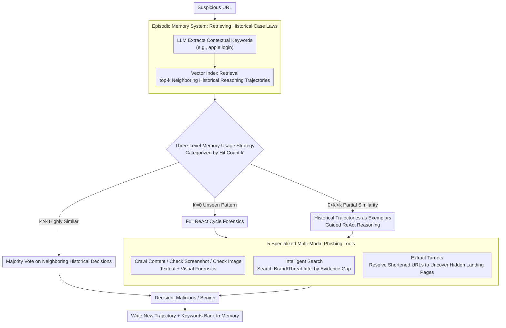

# MemoPhishAgent: Memory-Augmented Multi-Modal LLM Agent for Phishing URL Detection

**Conference**: ACL 2026  
**arXiv**: [2602.21394](https://arxiv.org/abs/2602.21394)  
**Code**: [GitHub](https://github.com/XuanChen-xc/MemoPhishAgent)  
**Area**: Security AI  
**Keywords**: Phishing Detection, LLM Agent, Episodic Memory, Multi-modal Reasoning, Tool Calling

## TL;DR

MemoPhishAgent (MPA) is proposed as the first memory-augmented multi-modal LLM agent specifically designed for phishing URL detection. By dynamically orchestrating five specialized tools and utilizing an episodic memory system to reuse historical reasoning trajectories, MPA achieves a 13.6% recall improvement on public benchmarks and a 20% improvement on real-world social media data. It has been deployed in production, processing approximately 60,000 high-risk URLs weekly.

## Background & Motivation

**Background**: Phishing attacks continue to evolve, and traditional defenses (static blacklists, manual heuristic rules) provide insufficient coverage for new domains and techniques. Reference-based methods using brand-domain mapping improve robustness but suffer from high maintenance costs and lag behind new brands and subdomains.

**Limitations of Prior Work**: (1) Existing LLM solutions are mostly prompt-based deterministic pipelines, lacking adaptive evidence gathering capabilities; (2) Tools are used in fixed sequences (e.g., OCR followed by brand matching then domain verification), failing to adjust dynamically based on the current evidence state; (3) The absence of a memory system prevents the reuse of historical investigation experiences, leading to inefficient repetitive analysis of similar phishing patterns.

**Key Challenge**: Phishing attacks are non-stationary—attackers constantly change strategies—while defense systems are often memoryless, performing analysis from scratch every time.

**Goal**: Construct a phishing detection agent capable of dynamically adjusting evidence gathering strategies, learning from historical investigations, and suitable for production environments.

**Key Insight**: Model phishing detection as a multi-step reasoning process that simulates the investigative behavior of human experts, dynamically selecting tools to collect evidence.

**Core Idea**: Combine 5 specialized multi-modal phishing tools, a ReAct reasoning loop, and an episodic memory system (to store/retrieve historical reasoning trajectories) to achieve adaptive and learnable phishing detection.

## Method

### Overall Architecture

MPA receives a list of suspicious URLs, each processed by an Agent: (1) It dynamically selects from 5 specialized tools to collect multi-modal evidence (text + vision + external knowledge); (2) It performs multi-step reasoning within a "ReAct" loop, deciding the next action based on the current evidence state; (3) It utilizes an episodic memory system to retrieve similar historical cases to accelerate judgment or provide exemplars for guidance. The final output is a "Malicious" or "Benign" decision.

### Key Designs

**1. 5 Specialized Multi-Modal Phishing Tools: Decomposing Human Expert Forensics into Schedulable Atomic Actions**

General agent tools are not tailored for phishing scenarios—they do not read fake login boxes in full-page screenshots or dig up hidden redirection targets from short links. MPA creates 5 specific tools covering text, vision, external knowledge, and nested attack surfaces: `Crawl Content` extracts the page body as Markdown text; `Check Screenshot` performs overall analysis of the full-page screenshot; `Check Image` conducts fine-grained image inspection (e.g., verifying brand logo authenticity). These three constitute multi-modal evidence. `Intelligent Search` does not just search the domain; it dynamically constructs queries based on collected evidence to fetch the latest brand or threat intelligence. `Extract Targets` specifically extracts redirection targets and sub-links to uncover the actual landing pages behind URL shorteners or platform-hosted paths like `sites.google.com`.

This division is intentional because phishing evidence is naturally scattered across modalities: text-only detection misses visual impersonation, while vision-only detection fails to understand redirection logic. By complementary networking, the agent compensates for evidence gaps rather than following a fixed forensic sequence.

**2. Episodic Memory System: Turning Repetitive Investigations into Reusable Precedents**

A characteristic of phishing attacks is high repetition—the same attack template is applied to different victims. Repeating analysis from scratch is inefficient. The episodic memory system is designed to consume this repetition: after processing a page, an LLM compresses it into a set of compact keywords (e.g., "apple login", "wallet connect") serving as episodic keys, stored with the full reasoning trajectory in a vector index. When a new URL arrives, the same keywords are extracted to retrieve top-$k$ nearest neighbors. Matched historical trajectories then serve as ready-made precedents. As deployment time increases, the memory bank thickens, and the proportion of directly reusable cases grows, significantly speeding up the process with almost zero additional compute.

**3. Three-Level Memory Usage Strategy: Let Memory be a Consultant, not a Judge**

Relying too heavily on memory can be counterproductive—simply using old conclusions can lead to misjudgments against variant attacks. MPA uses three levels based on the retrieval hit count $k'$ (the number of truly similar entries in the top-$k$): if $k'=0$, it is an unseen pattern, requiring a full ReAct cycle for forensic analysis; if $0 < k' < k$, indicating partial similarity, retrieved historical trajectories are fed as in-context exemplars to guide reasoning, though the agent makes the final decision; if $k' \ge k$, indicating high similarity, a majority vote is performed on these neighboring historical decisions for a fast result. This gradient positions memory as "contextual guidance" rather than a "thinking substitute," utilizing the speed dividend of repetition while maintaining reliability for unknown patterns.

### A Complete Example: How a Short Link Mimicking Apple Login is Judged

Assume a `bit.ly/xxx` short link arrives. The Agent first calls `Extract Targets` to resolve it to the actual landing page `apple-id-verify.weebly.com`. Next, `Crawl Content` extracts the text, finding "Sign in to Apple ID" throughout. `Check Screenshot` shows the login box and Apple logo layout are highly simulated. `Check Image` further compares the logo, finding pixel-level flaws compared to official resources. The Agent then uses these pieces of evidence to extract keywords "apple login / weebly host / id verify" to query episodic memory. If the hit count $k' \ge k$ (matching previous Apple impersonation precedents with the same template), it directly votes "Malicious," skipping the `Intelligent Search` step. If there is a partial match ($0 < k' < k$), the old trajectory serves as an exemplar, supplemented by an `Intelligent Search` to confirm `weebly.com` is not an official Apple domain before making a decision. If there is no match ($k'=0$), it follows the full ReAct cycle and writes the new trajectory and keywords back to memory for future use.

## Key Experimental Results

### Main Results

| Method | TR-OP Recall | DynaPD Recall | Speed (s/URL) |
|------|------------|-------------|-----------|
| **Ours (MPA)** | **93.4%** | **93.6%** | **4.46** |
| PhishLLM | ~80% | ~88% | 14.2 |
| MLLM | ~82% | ~85% | 5.1 |
| URLTran | ~86% | — | 2.8 (inc. training) |

### Ablation Study

| Configuration | Key Metric | Description |
|------|---------|------|
| Full MPA | 93.4% Recall | All components included |
| - Memory System | -27% Recall | Memory is the largest contributor |
| - Tool Design | Performance Drop | Specialized tools outperform general tools |
| Prompt-based Baseline | Poor | Fixed flows are inferior to adaptive selection |

### Key Findings
- The episodic memory system contributes a significant 27% recall improvement without additional computational overhead.
- MPA is the fastest among all methods (4.46s/URL) because the memory system skips massive amounts of redundant analysis.
- On real-world social media data (SocPhish), recall improved by 20%, indicating a greater advantage in real-world scenarios.
- Production deployment processes ~60K high-risk URLs weekly, achieving a 91.44% recall rate.
- URL shorteners and platform-hosted paths (e.g., sites.google.com) are blind spots for traditional methods; MPA overcomes this via multi-modal tools.

## Highlights & Insights
- **Deployed in Production**: Beyond academic work, it has been verified in Amazon's production environment protecting millions of users, providing strong practical evidence.
- **Incredible Memory Impact**: A 27% recall boost with no extra compute—because repetitive patterns are handled via voting, reducing LLM calls.
- **Professional and Complementary Tool Design**: 5 tools collect evidence across text, vision, search, and link dimensions.
- **Balanced Efficiency and Accuracy**: The three-level memory strategy performs full analysis on unseen patterns while making rapid decisions on known patterns.

## Limitations & Future Work
- **Dependency on External LLM APIs**: Latency and cost associated with models like Claude-3-Sonnet.
- **Memory Pollution**: If early incorrect judgments are stored in memory, they may affect subsequent decisions.
- **Focus Restricted to Phishing URLs**: Other security threats (e.g., malware distribution) are not currently covered.
- Future Directions: Memory self-correction mechanisms, expansion to more security threat types, and using lightweight local models to replace APIs.

## Related Work & Insights
- **vs PhishLLM**: Uses LLM for brand extraction and intent recognition but remains a fixed pipeline; MPA dynamically selects tools.
- **vs Cao et al. (2025)**: Multi-modal LLM for phishing detection but uses a fixed evidence acquisition flow and lacks memory.
- **vs General Agent Frameworks**: Generic tools and reasoning are less effective than MPA's specialized phishing tools.

## Rating
- Novelty: ⭐⭐⭐⭐ First memory-augmented LLM Agent for phishing, with a sophisticated episodic memory system.
- Experimental Thoroughness: ⭐⭐⭐⭐⭐ Verified on two public benchmarks, real-world social media data, and production deployment; comprehensive ablation.
- Writing Quality: ⭐⭐⭐⭐ Clear threat model definition and intuitive system architecture diagrams.
- Value: ⭐⭐⭐⭐⭐ Validated in production, offering direct application value for Security AI.

<!-- RELATED:START -->

## Related Papers

- [\[ACL 2026\] Knowledge Poisoning Attacks on Medical Multi-Modal Retrieval-Augmented Generation](knowledge_poisoning_attacks_on_medical_multi-modal_retrieval-augmented_generatio.md)
- [\[ACL 2026\] Privacy-R1: Privacy-Aware Multi-LLM Agent Collaboration via Reinforcement Learning](privacy-r1_privacy-aware_multi-llm_agent_collaboration_via_reinforcement_learnin.md)
- [\[ACL 2025\] Unveiling Privacy Risks in LLM Agent Memory](../../ACL2025/llm_safety/mextra_agent_memory_privacy.md)
- [\[ACL 2026\] XMark: Reliable Multi-Bit Watermarking for LLM-Generated Texts](xmark_reliable_multi-bit_watermarking_for_llm-generated_texts.md)
- [\[ICLR 2026\] From Static Benchmarks to Dynamic Protocol: Agent-Centric Text Anomaly Detection for Evaluating LLM Reasoning](../../ICLR2026/llm_safety/from_static_benchmarks_to_dynamic_protocol_agent-centric_text_anomaly_detection_.md)

<!-- RELATED:END -->
