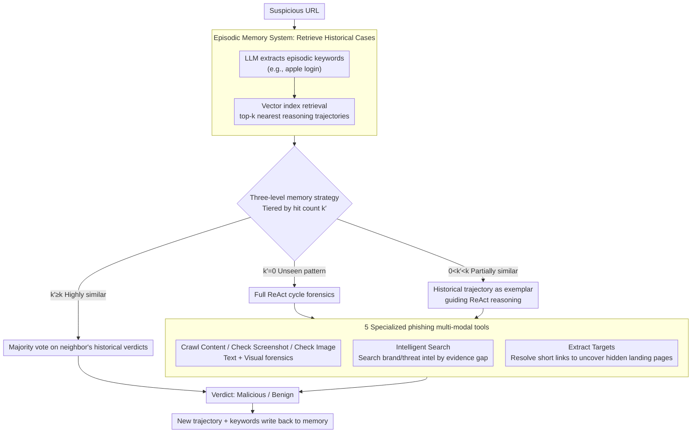

# MemoPhishAgent: Memory-Augmented Multi-Modal LLM Agent for Phishing URL Detection

**Conference**: ACL 2026  
**arXiv**: [2602.21394](https://arxiv.org/abs/2602.21394)  
**Code**: [GitHub](https://github.com/XuanChen-xc/MemoPhishAgent)  
**Area**: Security AI  
**Keywords**: Phishing Detection, LLM Agents, Episodic Memory, Multi-modal Reasoning, Tool Calling

## TL;DR

MemoPhishAgent (MPA) is proposed as the first memory-augmented multi-modal LLM agent specifically designed for phishing URL detection. By dynamically orchestrating five specialized tools and an episodic memory system that reuses historical reasoning trajectories, it achieves a 13.6% improvement in recall on public benchmarks and a 20% improvement on real-world social media data. It has been deployed in a production environment, processing approximately 60,000 high-risk URLs weekly.

## Background & Motivation

**Background**: Phishing attacks are continuously evolving, and traditional defenses (static blacklists, manual heuristic rules) provide insufficient coverage for new domains and techniques. Reference methods based on brand-domain mapping improve robustness but incur high maintenance costs and respond slowly to new brands and subdomains.

**Limitations of Prior Work**: (1) Existing LLM solutions are mostly prompt-based deterministic pipelines that lack adaptive evidence collection capabilities; (2) tools use fixed processes (e.g., OCR first, then brand matching, then domain verification) and cannot dynamically adjust based on the current evidence state; (3) the lack of a memory system prevents the reuse of historical investigation experiences, leading to inefficient repetitive analysis of similar phishing patterns.

**Key Challenge**: Phishing attacks are non-stationary—attackers constantly change strategies, but defense systems are memoryless, analyzing each case from scratch.

**Goal**: Build a phishing detection agent that can dynamically adjust evidence collection strategies, learn from historical investigations, and be suitable for production environments.

**Key Insight**: Model phishing detection as a multi-step reasoning process—simulating the investigative behavior of human experts by dynamically selecting tools to gather evidence.

**Core Idea**: Combination of 5 specialized phishing multi-modal tools, a ReAct reasoning loop, and an episodic memory system (to store/retrieve historical reasoning trajectories) to achieve adaptive and learnable phishing detection.

## Method

### Overall Architecture

MPA receives a list of suspicious URLs, each processed by an Agent: (1) dynamically selects 5 specialized tools to collect multi-modal evidence (text + visual + external knowledge); (2) performs multi-step reasoning in a ReAct loop, deciding the next action based on the current evidence state; (3) utilizes the episodic memory to retrieve similar historical cases to accelerate judgment or provide exemplars for guidance. The final output is a "Malicious" or "Benign" verdict.

### Key Designs

**1. 5 Specialized Phishing Multi-Modal Tools: Decomposing Human Expert Forensics into Schedulable Atomic Actions**

General-purpose agent tools do not fit the phishing scenario—they do not read fake login boxes in full-page screenshots, nor do they follow short links to uncover hidden redirection targets. MPA therefore created 5 tools covering four dimensions: text, vision, external knowledge, and nested attack surfaces. "Crawl Content" extracts page body as Markdown text, "Check Screenshot" performs overall analysis on full-page screenshots, and "Check Image" performs fine-grained image inspection (such as comparing brand logo authenticity); these three constitute multi-modal evidence. "Intelligent Search" does not simply search for a domain but dynamically constructs queries based on currently collected evidence to obtain the latest brand/threat intelligence. "Extract Targets" specifically extracts redirection targets and sub-links to uncover the real landing pages behind URL shorteners or platform-hosted paths like `sites.google.com` for deep inspection.

The tools are segmented this way because phishing evidence is naturally scattered across different modalities: pure text detection misses visual impersonation, while pure vision cannot understand redirection logic. Each of the five tools handles one aspect and complements the others, allowing the agent to fill the corresponding evidence gap based on current clues rather than being stuck in a fixed forensic sequence.

**2. Episodic Memory System: Converting Repetitive Investigations into Reusable Precedents**

A major characteristic of phishing attacks is high repetition—the same attack template is repeatedly applied to different victims, and analyzing each from scratch is both slow and wasteful. The episodic memory system is designed to eliminate this repetition: after processing each page, the LLM compresses it into a set of compact keywords (e.g., "apple login", "wallet connect") as an episodic key, which is then embedded into a vector index alongside the complete reasoning trajectory. When a new URL arrives, the same keywords are extracted to retrieve the top-$k$ nearest neighbors. Hit historical trajectories become ready-made precedents. As the deployment time increases, the memory database grows, and the proportion of old cases that can be directly reused increases, which is why it provides a significant speedup with almost zero additional computational cost.

**3. Three-level Memory Strategy: Using Memory as a Consultant, Not a Judge**

If memory is used too aggressively, it may take over—making decisions directly based on old conclusions might lead to misjudgments when encountering variant attacks. MPA therefore tiers memory usage based on the retrieval hit count $k'$ (the number of truly similar entries in top-$k$): $k'=0$ indicates a new unseen pattern, triggering a full ReAct loop for forensics from scratch; $0 < k' < k$ indicates partial similarity, where retrieved historical trajectories are fed in as in-context exemplars to guide reasoning, but the agent still makes the final conclusion; $k' \ge k$ indicates high similarity, where a majority vote is taken on the historical verdicts of these neighbors to quickly yield a result. The core of this gradient is positioning memory as "contextual guidance" rather than a "thinking substitute," utilizing both the speed dividend of repetitive patterns via voting and the reliability of unseen patterns via full reasoning.

### A Complete Example: How a Short Link Impersonating Apple is Sentenced

Suppose a `bit.ly/xxx` short link arrives. The Agent first calls "Extract Targets" to resolve the short link to the real landing page `apple-id-verify.weebly.com`; then calls "Crawl Content" to extract the body text and finds the page full of "Sign in to Apple ID"; "Check Screenshot" observes that the login box and Apple logo layout are highly simulated; "Check Image" further compares the logo and finds pixel-level flaws that do not match official resources. At this point, the agent uses this evidence to extract keywords "apple login / weebly host / id verify" to query the episodic memory—if the hit count $k' \ge k$ (multiple Apple impersonation precedents with the same template were previously stored), it directly votes "Malicious," saving the "Intelligent Search" external query step; if it only partially hits ($0 < k' < k$), the old trajectory is used as an exemplar, supplemented by once more calling "Intelligent Search" to confirm `weebly.com` is not an official Apple domain before making a judgment; if there is no hit at all ($k'=0$), the full ReAct forensic suite is executed, and this new trajectory along with its keywords is written back to memory for direct reuse by subsequent attacks using the same template.

## Key Experimental Results

### Main Results

| Method | TR-OP Recall | DynaPD Recall | Speed (s/URL) |
|------|------------|-------------|-----------|
| **Ours** (MPA) | **93.4%** | **93.6%** | **4.46** |
| PhishLLM | ~80% | ~88% | 14.2 |
| MLLM | ~82% | ~85% | 5.1 |
| URLTran | ~86% | — | 2.8 (inc. training) |

### Ablation Study

| Configuration | Key Metric | Description |
|------|---------|------|
| Full MPA | 93.4% Recall | All components included |
| - Memory System | -27% Recall | Memory provides the largest contribution |
| - Tool Design | Performance Drop | Specialized tools outperform general tools |
| Prompt-based Baseline | Poor Performance | Fixed processes are inferior to adaptive selection |

### Key Findings
- The episodic memory contributes to a recall improvement of up to 27% without adding extra computational overhead.
- MPA is the fastest among all methods (4.46s/URL) because the memory system skips a large amount of repetitive analysis.
- On real-world social media data (SocPhish), recall improved by 20%, indicating a greater advantage in real scenarios.
- Production deployment processes ~60K high-risk URLs weekly, achieving a 91.44% recall rate.
- URL shorteners and platform-hosted paths (e.g., sites.google.com) are blind spots for traditional methods; MPA overcomes this via multi-modal tools.

## Highlights & Insights
- **Deployed in Production**: Beyond academic work, it has been validated in Amazon's production environment protecting millions of users, providing strong credibility.
- **Surprising Memory Effect**: A 27% recall boost with no added computation—due to direct voting on repetitive patterns, reducing LLM calls.
- **Professional & Complementary Tool Design**: 5 tools collect evidence from text, vision, search, and links.
- **Three-level Memory Strategy Balances Efficiency and Accuracy**: Full analysis for unseen patterns and rapid decision-making for known ones.

## Limitations & Future Work
- **Dependency on External LLM APIs**: Latency and cost associated with Claude-3-Sonnet.
- **Risk of Memory Pollution**: If early incorrect judgments are stored in memory, they may affect subsequent decisions.
- **Focus only on Phishing URLs**: Other security threats (e.g., malware distribution) are not covered.
- Future directions: Memory self-correction mechanisms, extending to more security threat types, and replacement of APIs with lightweight local models.

## Related Work & Insights
- **vs. PhishLLM**: Uses LLMs for brand extraction and intent recognition but remains a fixed process; MPA dynamically selects tools.
- **vs. Cao et al. (2025)**: Multi-modal LLM phishing detection but with a fixed evidence acquisition process and no memory.
- **vs. General Agent Frameworks**: Uses general tools and reasoning; MPA's phishing-specific tools are more effective.

## Rating
- Novelty: ⭐⭐⭐⭐ First memory-augmented LLM Agent specific to phishing, with an exquisitely designed episodic memory system.
- Experimental Thoroughness: ⭐⭐⭐⭐⭐ Two public benchmarks + real social media data + production deployment verification, with comprehensive ablation studies.
- Writing Quality: ⭐⭐⭐⭐ Clearly defined threat model and intuitive system architecture diagram.
- Value: ⭐⭐⭐⭐⭐ Validated in production environments, offering direct application value for Security AI.

<!-- RELATED:START -->

## Related Papers

- [\[ACL 2026\] Knowledge Poisoning Attacks on Medical Multi-Modal Retrieval-Augmented Generation](knowledge_poisoning_attacks_on_medical_multi-modal_retrieval-augmented_generatio.md)
- [\[ACL 2026\] Privacy-R1: Privacy-Aware Multi-LLM Agent Collaboration via Reinforcement Learning](privacy-r1_privacy-aware_multi-llm_agent_collaboration_via_reinforcement_learnin.md)
- [\[ACL 2025\] Unveiling Privacy Risks in LLM Agent Memory](../../ACL2025/llm_safety/mextra_agent_memory_privacy.md)
- [\[ACL 2026\] XMark: Reliable Multi-Bit Watermarking for LLM-Generated Texts](xmark_reliable_multi-bit_watermarking_for_llm-generated_texts.md)
- [\[ACL 2026\] Lying with Truths: Open-Channel Multi-Agent Collusion for Belief Manipulation via Generative Montage](lying_with_truths_open-channel_multi-agent_collusion_for_belief_manipulation_via.md)

<!-- RELATED:END -->
