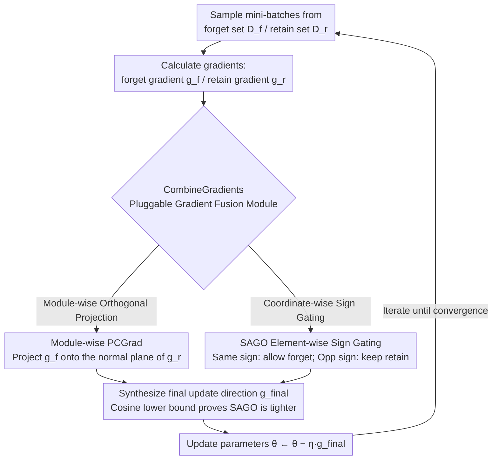

# Modeling LLM Unlearning as an Asymmetric Two-Task Learning Problem

**Conference**: ACL 2026  
**arXiv**: [2604.14808](https://arxiv.org/abs/2604.14808)  
**Code**: https://github.com/sustech-nlp/SAGO  
**Area**: LLM Safety / Machine Unlearning  
**Keywords**: LLM Unlearning, Gradient Conflict, Multi-Task Learning, PCGrad, Sign Alignment

## TL;DR
LLM unlearning is explicitly modeled as an asymmetric two-task problem where "retention is primary and forgetting is auxiliary." The proposed SAGO method applies **element-wise sign alignment gating** to retain/forget gradients, achieving retention performance close to the original model on WMDP and RWKU benchmarks with almost no loss in forgetting effectiveness.

## Background & Motivation

**Background**: The mainstream objective of LLM unlearning is to perform gradient ascent (GA) on a forget set combined with gradient descent (GD) on a retain set—the GradDiff paradigm. Subsequent methods like NPO and SimNPO reformulate the unbounded GA into bounded forms using sigmoid functions to mitigate catastrophic collapse.

**Limitations of Prior Work**: Existing combinations of forget and retain objectives treat the two tasks as "equivalent" multi-task learning by weighting losses. This results in systematic conflicts between forget and retain gradients, leading to a continuous drop in retention. For instance, after running SimNPO+GD on WMDP Bio, the MMLU score drops to 26.7 (from an original 59.8), meaning only 44.6% of retention is preserved.

**Key Challenge**: The unlearning task is inherently **asymmetric**—retention is the "primary task" (do-no-harm), while forgetting is the "auxiliary task." Current methods rely on loss balancing and fail to distinguish priorities from a gradient geometry perspective, leaving the issue of retain gradients being "pulled away" by forget gradients unaddressed.

**Goal**: To explicitly model unlearning as asymmetric two-task learning, treating the retain gradient as the "anchor direction" and allowing forget signals to be injected only in dimensions that do not harm retention.

**Key Insight**: The authors observe that (1) while PCGrad in multi-task learning projects conflicting gradients onto the orthogonal complement, it has not been systematically applied to unlearning; (2) at the parameter level, the signs of forget and retain gradients are sometimes consistent and sometimes opposite. Consistent dimensions are "task-specific" and safe for forgetting, while opposite-sign dimensions carry general knowledge and must prioritize the retain signal.

**Core Idea**: Replace "loss weighting" with "element-wise sign gating." In dimensions where retain and forget signs match, the forget signal is allowed to pass; in dimensions with opposite signs, only the retain signal is kept. This mathematically ensures that the final update direction maintains a strictly non-negative angle with the retain gradient and does not oppose it in any individual coordinate.

## Method

### Overall Architecture
SAGO is a modular iterative training framework (Algorithm 1). In each step, a mini-batch is sampled from the forget set $\mathcal{D}_f$ and the retain set $\mathcal{D}_r$ to calculate the forget gradient $g_f^t$ and retain gradient $g_r^t$, respectively. A pluggable `CombineGradients` module synthesizes these into a final update direction $g_{\text{final}}^t$, and parameters are updated as $\theta^t = \theta^{t-1} - \eta\, g_{\text{final}}^t$ until convergence. The framework is decoupled from specific forget objectives, supporting GA+GD, NPO+GD, and SimNPO+GD. The paper introduces two `CombineGradients` implementations: module-wise PCGrad (an asymmetric adaptation of existing methods) and SAGO (the proposed method), providing theoretical lower bounds for "retention alignment" based on cosine similarity to prove SAGO's tighter structural alignment.

### Key Designs

**1. Module-wise PCGrad: Eliminating conflicting components when gradients clash**
Standard GradDiff weights forget and retain losses. If the angle between the two gradients exceeds 90°, the forget signal pulls the model away from the retain direction, causing retention loss. Module-wise PCGrad addresses this by projecting the forget gradient onto the normal plane of the retain gradient for each module $j$ to remove conflict: $\tilde{g}_f^j = g_f^j - \frac{g_f^j \cdot g_r^j}{\|g_r^j\|^2} g_r^j$, then synthesizing $g_{\text{final}}^j = \alpha g_r^j + \gamma \tilde{g}_f^j$. Applying this module-wise rather than on a global flattened vector provides finer granularity, resulting in higher retention (Table 2: Global PCGrad MMLU 51.0 vs. module-wise 53.0).

**2. SAGO: Element-wise sign alignment gating to prevent coordinate-wise reversal**
PCGrad only ensures the global angle is $\ge 90^\circ$; however, if $|\tilde{g}_f^i| > |g_r^i|$ in a specific dimension, the final update can still oppose the retain direction in that dimension. SAGO increases granularity to the element level by checking the sign of $g_f \odot g_r$. Dimensions with consistent signs are treated as "task-specific," allowing the forget signal: $\tilde{g}_f = g_f \odot \mathbb{I}(g_f \odot g_r \ge 0)$. Dimensions with opposite signs carry general knowledge, so only the retain signal is kept: $\tilde{g}_r = g_r \odot \mathbb{I}(g_f \odot g_r < 0)$. The final update is $g_{\text{final}} = \alpha \tilde{g}_r + \gamma \tilde{g}_f$.

This approach offers two structural advantages: the support sets of the two components are disjoint, ensuring strict orthogonality $\tilde{g}_f^\top \tilde{g}_r = 0$, and no coordinate can ever oppose $g_r$. SAGO thus provides a geometrically more stable retention.

**3. Cosine similarity lower bound: Proving "retention priority" geometrically**
The authors derive a "retention alignment" lower bound for both methods. PCGrad relies on orthogonal projection to achieve $\cos\theta_P = (1 + \|\tilde{g}_f\|^2 / \|g_r\|^2)^{-1/2} \ge 0$. For SAGO, the numerator of $\cos\theta_S$ is $\sum_{i\in C}(g_r^i)^2 + \sum_{i\in S} g_f^i g_r^i$, where the second term is strictly positive on set $S$. Under equal weighting ($\alpha=\gamma=1$), SAGO is theoretically proven to align more tightly with $g_r$ than PCGrad, supporting the empirical results (Comb-Retain cos = 0.57 vs. 0.52).

### Loss & Training
The forget objective $\mathcal{L}_f$ can be GA, NPO, or SimNPO, while the retain objective is fixed as standard cross-entropy GD. Default weights are $\alpha=\gamma=1.0$, with sweeps in $[0.1, 1.0]$ to match baseline forget strength. Experiments ran for 100 steps on WMDP and 2 epochs on RWKU.

## Key Experimental Results

### Main Results
Evaluated on WMDP (Bio + Cyber, Zephyr-7B-beta) and RWKU (50-entity batch unlearning, LLaMA3-8B-Instruct) using various base objectives:

| Configuration | WMDP Bio Forget↓ | WMDP Bio MMLU↑ | WMDP Cyber MMLU↑ | RWKU Neighbor All↑ |
|:---|:---:|:---:|:---:|:---:|
| Target Model | 64.4 | 59.8 | 59.8 | 85.1 |
| SimNPO + GD (naive) | 26.1 | 26.7 | 51.4 | 44.9 |
| SimNPO + GD + PCGrad | 28.7 | 56.4 | 57.9 | 53.5 |
| SimNPO + GD + **SAGO** | 28.2 | **57.4** | **58.3** | **56.9** |
| NPO + GD (naive) | 30.5 | 38.2 | 46.8 | 13.1 |
| NPO + GD + **SAGO** | 30.0 | **56.0** | **58.5** | **41.7** |
| GA + GD (naive) | 24.7 | 25.1 | 55.6 | 15.5 |
| GA + GD + **SAGO** | 26.0 | **54.1** | **59.7** | **32.1** |

SAGO improves SimNPO+GD's MMLU from 26.7 to 57.4, recovering 96.0% of the original model's retention while maintaining forget performance.

### Ablation Study
Comparison of SAGO with existing conflict mitigation methods (Global PCGrad, BLUR) and gradient geometry analysis:

| Configuration (WMDP Bio) | Forget↓ | MMLU↑ | Description |
|:---|:---:|:---:|:---|
| NPO + GD + GRU | 26.2 | 42.1 | Global PCGrad on flattened vectors |
| RMU + BLUR | 27.6 | 53.5 | Bi-level optimization |
| GA + GD + Global PCGrad | 24.8 | 51.0 | Global projection |
| GA + GD + module-wise PCGrad | 24.5 | 53.0 | Module granularity (+2.0 MMLU) |
| GA + GD + **SAGO** | 26.0 | **54.1** | Element granularity (+1.1 MMLU) |

Gradient Geometry (100-step average, WMDP Cyber):

| Method | Forget-Retain cos | Comb-Forget cos | Comb-Retain cos |
|:---|:---:|:---:|:---:|
| GradDiff | −0.40 | **0.50** | 0.42 |
| PCGrad | −0.52 | 0.29 | 0.52 |
| **SAGO** | **−0.35** | 0.17 | **0.57** |

### Key Findings
- **Finer granularity is superior**: Moving from global PCGrad to module-wise and then element-wise (SAGO) leads to monotonically increasing retention, validating the hypothesis that gradient conflicts should be solved at the finest local level.
- **SAGO reduces intrinsic conflict**: The Forget-Retain cosine similarity improves from $-0.52$ (PCGrad) to $-0.35$, suggesting sign alignment implicitly reshapes the parameter space to make tasks less oppositional.
- **Forget signals are "slimmed"**: SAGO's Comb-Forget cos is 0.17 (vs. 0.50 for GradDiff), yet forget metrics remain stable, indicating that the removed components were primarily "noise" conflicting with retention.
- **Pareto frontier shifted**: SAGO significantly pushes the Pareto frontier outward, strictly dominating previous methods on RWKU.

## Highlights & Insights
- **Explicit Asymmetry Modeling**: Unlike prior work treating unlearning as balanced multi-task learning, this work shifts from loss balancing to gradient geometry based on the principle that "retention is the primary task."
- **Evolution from Projection to Gating**: While PCGrad removes conflicting components, it can still fail at individual dimensions. SAGO structurally prevents reversal at the element level, which is geometrically superior.
- **Lightweight and Plug-and-Play**: The algorithm requires only sign comparison and indicator masking, incurring nearly zero additional computational cost while being compatible with any forget objective.
- **Theoretical-Empirical Consistency**: The theoretical proof that $\cos\theta_S > \cos\theta_P$ is validated by real-world measurements (0.57 vs. 0.52).

## Limitations & Future Work
- **Ours**: (1) Validation is limited to two text benchmarks (WMDP/RWKU); multimodal and code models are untested. (2) Storing both gradients doubles memory usage compared to single-objective training.
- **External Observations**: (1) The strict structural guarantee for SAGO requires equal weighting ($\alpha=\gamma=1$), but hyperparameter sweeps may override this in practice. (2) Element-wise sign gating might be sensitive to gradient noise (e.g., in low-rank LoRA training). (3) The effectiveness of SAGO depends on the quality of the retain set estimation; bias here could negatively impact the model.

## Related Work & Insights
- **vs. GRU (ICML'25)**: GRU uses global PCGrad; this work demonstrates that module-wise ($+2$ MMLU) and element-wise (SAGO, $+1.1$ MMLU) approaches are more effective.
- **vs. BLUR (2025)**: BLUR uses bi-level optimization prioritizing the forget task; SAGO prioritizes retention and is simpler to implement while achieving higher scores (54.1 vs. 53.5).
- **vs. NPO/SimNPO**: These focus on bounded forget objectives; SAGO is orthogonal and can be applied on top of them to recover significantly more retention (up to $+30$ MMLU).
- **vs. standard MTL**: Methods like CAGrad/Nash-MTL aim for task fairness, which can preserve forget task progress at the expense of retention—unsuitable for the asymmetric requirements of unlearning.

## Rating
- Novelty: ⭐⭐⭐⭐ Clean perspective shift to asymmetric learning; element-wise gating is a natural but effective extension of PCGrad.
- Experimental Thoroughness: ⭐⭐⭐⭐ Covers 3 objectives across 2 benchmarks with comprehensive baselines and geometric analysis.
- Writing Quality: ⭐⭐⭐⭐ Clear logic from motivation to theory and experiments; formulas and visualizations are well-integrated.
- Value: ⭐⭐⭐⭐ Plug-and-play, low overhead, and significant retention gains make it highly practical for LLM safety and privacy.

<!-- RELATED:START -->

## Related Papers

- [\[AAAI 2026\] ALTER: Asymmetric LoRA for Token-Entropy-Guided Unlearning of LLMs](../../AAAI2026/llm_safety/alter_asymmetric_lora_for_token-entropy-guided_unlearning_of.md)
- [\[ACL 2026\] Unlearners Can Lie: Evaluating and Improving Honesty in LLM Unlearning](unlearners_can_lie_evaluating_and_improving_honesty_in_llm_unlearning.md)
- [\[ACL 2025\] ZJUKLAB at SemEval-2025 Task 4: Unlearning via Model Merging](../../ACL2025/llm_safety/zjuklab_at_semeval-2025_task_4_unlearning_via_model_merging.md)
- [\[ACL 2026\] Privacy-R1: Privacy-Aware Multi-LLM Agent Collaboration via Reinforcement Learning](privacy-r1_privacy-aware_multi-llm_agent_collaboration_via_reinforcement_learnin.md)
- [\[ICLR 2026\] LLM Unlearning with LLM Beliefs](../../ICLR2026/llm_safety/llm_unlearning_with_llm_beliefs.md)

<!-- RELATED:END -->
