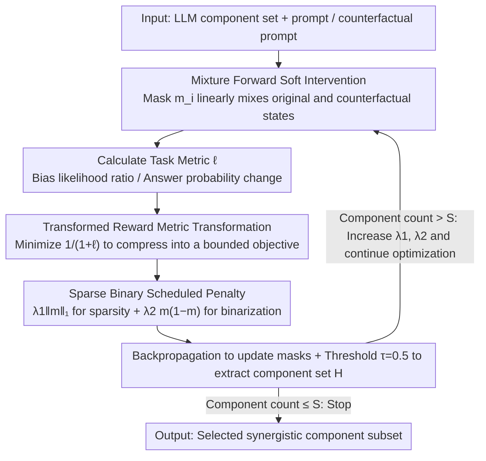

# Multi-component Causal Tracing in Large Language Models

**Conference**: ACL 2026  
**arXiv**: [2606.03085](https://arxiv.org/abs/2606.03085)  
**Code**: https://github.com/ZiruiYan/multi-component-causal-tracing  
**Area**: LLM Safety / Interpretability  
**Keywords**: Causal Tracing, Activation Patching, Multi-component Interaction, Mechanistic Interpretability, Bias Localization  

## TL;DR
This paper extends causal tracing from single-component analysis to multi-component subset searching and proposes PGB-CT, which efficiently identifies attention heads and MLP neurons that collectively influence LLM behavior using soft intervention, metric transformation, and sparse binary penalties.

## Background & Motivation
**Background**: LLM safety and interpretability research often requires locating which internal components of a model affect specific behaviors, such as factual knowledge, gender bias, truthfulness, or jailbreak-related outputs. Causal tracing / activation patching is a vital tool for analyzing internal causal paths by intervening in internal representations and observing changes in target metrics.

**Limitations of Prior Work**: Many causal tracing efforts analyze only a single neuron, a single attention head, or a single layer block. This approach ignores non-linear interactions between components. For instance, mechanisms like induction heads suggest that multiple heads across different layers may collaborate to perform a function; analyzing any single component in isolation would underestimate its role.

**Key Challenge**: To find the most important multi-component combinations, one must select at most $S$ components from $N$, resulting in a search space that grows exponentially with model scale. Conversely, falling back to top-k single-component ranking fails to capture synergistic or antagonistic effects between components.

**Goal**: To formalize the multi-component causal tracing problem, define flexible interventions and metrics, and propose an optimization algorithm more efficient than greedy, random, or top-k methods, maintaining high metric values while reducing runtime.

**Key Insight**: The authors relax discrete subset selection into continuous mask optimization, using soft interventions to make masks differentiable, and then push masks toward sparse, binary solutions through reward transformation and scheduled penalties.

**Core Idea**: Transform the combinatorial optimization problem of "selecting component subsets" into a gradient optimization problem of "learning continuous intervention masks," using specialized penalties to approximate true sparse binary component selection.

## Method
The paper first establishes a unified notation: an LLM consists of a set of components $\mathcal{C}=\{c_i\}_{i=1}^{N}$, where components can be attention heads, MLP neurons, or layer blocks. Given a prompt and a counterfactual prompt, the method replaces the original hidden states with counterfactual hidden states at selected components and observes the change in the target metric. The goal of multi-component causal tracing is to select a subset of at most $S$ components to maximize the average metric $\ell(\mathcal{D},\mathbf{m})$ resulting from the intervention.

### Overall Architecture
The framework consists of three steps. The first step defines the intervention: a mask $m_i$ is set for each component $c_i$; if $m_i=1$, the component's output is replaced with the counterfactual state; if $m_i=0$, the original computation is maintained. The second step defines task metrics, such as the likelihood ratio of stereotypical versus anti-stereotypical continuations in gender bias tasks, or the change in target answer probability in knowledge localization. The third step optimizes the masks to find the component set that contributes most to the metric under sparsity constraints.

### Key Designs

**1. Mixture Forward Soft Intervention: Relaxing discrete selection to differentiable continuous masks**

The fundamental obstacle in multi-component causal tracing is combinatorial explosion—choosing at most $S$ components among $N$ components leads to a discrete subset search that expands exponentially with model size, making methods like greedy search nearly unusable. PGB-CT solves this by assigning a continuous mask $m_i \in [0, 1]$ to each component $c_i$, formulating its output as a linear mixture of the original and counterfactual states: $\bar{h}_i=(1-m_i)f_i(\bar{g}_i)+m_i h'_i$. If $m_i=0$, the original computation is kept; if $m_i=1$, it is fully replaced by the counterfactual state; intermediate values mix the two proportionally. Consequently, the binary selection problem becomes a continuous variable optimization with respect to $m_i$. The subset search reduces to a standard gradient optimization, and runtime no longer explicitly depends on the size of the combinatorial space—this is why it is two orders of magnitude faster than greedy search.

**2. Transformed Reward: Compressing unbounded causal metrics into stable optimization targets**

Target metrics for different tasks vary greatly in scale—gender bias uses likelihood ratios, while knowledge localization uses probability changes. These metrics may be unbounded, making gradients and regularization strengths difficult to calibrate; changing the metric would require retuning. Instead of directly maximizing $\ell(\mathcal{D},\mathbf{m})$, PGB-CT minimizes:

$$\mathcal{L}=\frac{1}{1+\ell(\mathcal{D},\mathbf{m})}+\mathsf{reg}(\mathbf{m}).$$

This transformation monotonically compresses metrics of any range into a bounded interval, allowing a single set of regularization coefficients to work stably across metrics and training stages. While seemingly a small trick, it is crucial for making interpretability tools practical.

**3. Sparse Binary Scheduled Penalty: Forcing continuous masks to converge to clean 0/1 decisions**

Soft relaxation carries a side effect: optimized masks tend to settle at intermediate values around 0.5, causing performance drops once binarized by a threshold. PGB-CT addresses this with a dual-term regularization: $\lambda_1\|\mathbf{m}\|_1 + \lambda_2\mathbf{m}^{\top}(\mathbf{1}-\mathbf{m})$. The first term ($\ell_1$) encourages global sparsity, while the second term $\mathbf{m}^{\top}(\mathbf{1}-\mathbf{m})$ specifically penalizes non-binary values (it is 0 at $m_i \in \{0, 1\}$ and maximum at $m_i=0.5$). During training, $\lambda_1$ and $\lambda_2$ are gradually increased until the target sparsity is reached. Compared to simple sparsity penalties followed by hard truncation, explicitly penalizing binary violations ensures the final subset more closely resembles the result of a true discrete selection.

### Loss & Training
PGB-CT uses gradient descent to update masks: $\mathbf{m}_{t+1}=\mathbf{m}_t-\eta_t\nabla \mathcal{L}_t(\mathcal{D},\mathbf{m}_t)$, with results clipped to $[0, 1]$. After each epoch, a component set $\mathcal{H}=\{c_i:m_i>\tau\}$ is derived using a threshold $\tau=0.5$; optimization stops if $|\mathcal{H}|\leq S$. The paper notes that while DCM also uses soft masks, it uses raw rewards without explicit binary penalties, making it unstable in this setting.

## Key Experimental Results

### Main Results
Experiments cover the GPT-2 family, DistilGPT2, Qwen3-1.7B, and Llama3.2-1B on datasets including WinoGender, WinoBias, Professions, CounterFact, and VBD, focusing on attention heads, MLP neurons, and MLP blocks. The table below summarizes attention-head results for GPT-2 Medium.

| Dataset | Method | 10% | 20% | 30% | 40% | Time |
|:---|:---|:---|:---|:---|:---|:---|
| WinoGender | top-k | 0.191 | 0.201 | 0.203 | 0.205 | 2.76 min |
| WinoGender | greedy | 0.208 | 0.224 | 0.232 | 0.237 | 357.28 min |
| WinoGender | PGB-CT | 0.203 | 0.218 | 0.227 | 0.233 | 1.56 min |
| WinoBias | top-k | 0.374 | 0.378 | 0.389 | 0.388 | 8.18 min |
| WinoBias | greedy | 0.391 | 0.406 | 0.415 | 0.420 | 1001.50 min |
| WinoBias | PGB-CT | 0.381 | 0.394 | 0.401 | 0.404 | 5.32 min |

### Ablation Study

| Analysis Item | Key Metric | Description |
|:---|:---|:---|
| GPT2-medium / WinoGender speedup | PGB-CT 1.56 m vs greedy 357.28 m | Approx. 1.76× faster than top-k, ~229× faster than greedy |
| GPT2-xl / WinoBias | top-k 40%: 0.539; PGB-CT 40%: 0.576 | PGB-CT is more efficient and higher-performing on larger models |
| Selection Similarity | Jaccard(PGB-CT, greedy) = 0.64 | PGB-CT selections are closer to greedy than to top-k ranking |
| LLaMA-13B joint setting | Selected Heads + MLP blocks 5, 6 | Capable of simultaneous analysis of attention heads and MLP blocks |

### Key Findings
- Metrics for PGB-CT are generally close to greedy search and significantly better than top-k, indicating it successfully captures multi-component synergistic effects rather than just replicating single-component importance rankings.
- Greedy search becomes prohibitively slow as the number of components increases; PGB-CT's runtime does not explicitly depend on the combinatorial search space, making it more advantageous for larger models.
- Since the number of MLP neurons far exceeds attention heads, a direct joint analysis causes the algorithm to select almost exclusively MLPs. Pooling MLP neurons into blocks per layer allows for a more balanced joint selection.
- Non-linear component interactions are real: the introduction demonstrates that the joint intervention effect of two attention heads or MLP layers in GPT2-Small does not equal the sum of their individual effects.

## Highlights & Insights
- The paper advances causal tracing from "finding one important component" to "finding a group of components acting together," which better reflects the actual structure of transformer circuits.
- The regularization design of PGB-CT is clean: $\ell_1$ for sparsity, $m(1-m)$ for binarization, and a scheduled penalty for convergence. This combination is more stable than hard thresholds alone.
- Metric transformation is a simple but critical trick for unifying different causal metrics. Interpretability tools are impractical if they require manual recalibration for every new metric.
- Results remind researchers that safety interventions cannot rely solely on top-k neurons/heads. Biases or factual knowledge may be triggered by component combinations, and single-component localization might underestimate risks.

## Limitations & Future Work
- The method requires a pre-specified fixed target metric; it is not yet flexible enough for multi-dimensional or dynamic objectives.
- PGB-CT still requires tuning hyperparameters like learning rate, batch size, and penalty schedules, and gradient descent does not guarantee global optimality.
- Due to computational constraints and baseline inefficiency, experiments focused on English data and specific architectures; cross-lingual tasks and ultra-large models require further validation.
- Joint analysis of attention heads and MLP neurons still needs more refined grouping strategies to prevent the numerical advantage of MLPs from dominating the selection.

## Related Work & Insights
- **vs single-component causal tracing**: Unlike Vig et al. or Meng et al., which locate single heads/neurons but struggle with non-linear combinations, this work directly optimizes component subsets.
- **vs activation patching / interchange intervention**: This work follows the counterfactual intervention paradigm but continuous-izes the intervention mask to make searching differentiable.
- **vs DCM**: DCM also uses soft masking, but this paper points out that DCM's reward and penalty designs are unstable across multiple metrics; PGB-CT improves this with transformed rewards and binary penalties.
- **Insight**: When performing model safety editing or bias mitigation, PGB-CT can be used first to locate a group of synergistic components before deciding on targeted editing, fine-tuning, or activation steering.

## Rating
- Novelty: ⭐⭐⭐⭐☆ Contribution to both the problem definition and the PGB-CT algorithm.
- Experimental Thoroughness: ⭐⭐⭐⭐☆ Covers heads, MLP neurons, and various tasks, though ultra-large models/cross-lingual coverage is limited.
- Writing Quality: ⭐⭐⭐⭐☆ Complete derivations with clear alignment between design and conclusions.
- Value: ⭐⭐⭐⭐☆ Clear practical value for mechanistic interpretability, safety localization, and model editing.

<!-- RELATED:START -->

## Related Papers

- [\[ACL 2026\] CausalDetox: Causal Head Selection and Intervention for Language Model Detoxification](causaldetox_causal_head_selection_and_intervention_for_language_model_detoxifica.md)
- [\[ACL 2026\] TROJail: Trajectory-Level Optimization for Multi-Turn Large Language Model Jailbreaks with Process Rewards](trojail_trajectory-level_optimization_for_multi-turn_large_language_model_jailbr.md)
- [\[ACL 2026\] Reasoning Hijacking: The Fragility of Reasoning Alignment in Large Language Models](reasoning_hijacking_the_fragility_of_reasoning_alignment_in_large_language_model.md)
- [\[AAAI 2026\] AUVIC: Adversarial Unlearning of Visual Concepts for Multi-modal Large Language Models](../../AAAI2026/llm_safety/auvic_adversarial_unlearning_of_visual_concepts_for_multi-mo.md)
- [\[ACL 2026\] Learning Uncertainty from Sequential Internal Dispersion in Large Language Models](learning_uncertainty_from_sequential_internal_dispersion_in_large_language_model.md)

<!-- RELATED:END -->
