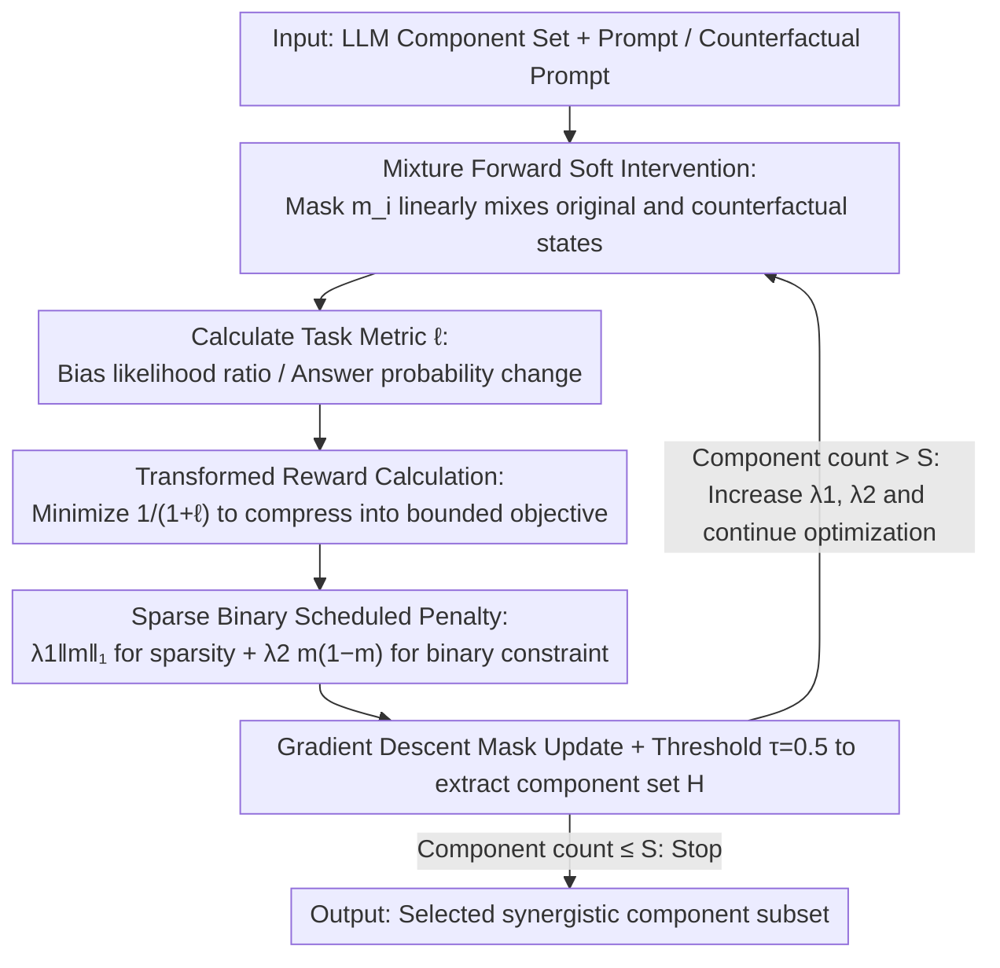

# Multi-component Causal Tracing in Large Language Models

**Conference**: ACL 2026  
**arXiv**: [2606.03085](https://arxiv.org/abs/2606.03085)  
**Code**: https://github.com/ZiruiYan/multi-component-causal-tracing  
**Area**: LLM Safety / Interpretability  
**Keywords**: Causal Tracing, Activation Intervention, Multi-component Interaction, Mechanistic Interpretability, Bias Localization

## TL;DR
This paper extends causal tracing from single-component analysis to multi-component subset search and proposes PGB-CT, which uses soft intervention, metric transformation, and sparse binary penalties to efficiently identify attention heads and MLP neurons that jointly influence LLM behavior.

## Background & Motivation
**Background**: Research in LLM safety and interpretability often requires localizing internal components that influence specific behaviors, such as factual knowledge, gender bias, truthfulness, or jailbreak-related outputs. Causal tracing / activation patching serves as a key tool for analyzing internal causal paths by intervening in internal representations and observing changes in target metrics.

**Limitations of Prior Work**: Many causal tracing studies focus on a single neuron, a single attention head, or a single-layer module. This approach ignores non-linear interactions between components. For instance, mechanisms like induction heads suggest that multiple heads across different layers may jointly perform a function; analyzing any single component in isolation would underestimate its contribution.

**Key Challenge**: Identifying the most significant combination of components requires selecting at most $S$ components from $N$ candidates, where the search space grows exponentially with model scale. Conversely, falling back to top-k single-component ranking fails to capture synergistic or antagonistic effects between components.

**Goal**: Formalize the multi-component causal tracing problem, define flexible interventions and metrics, and propose an optimization algorithm more efficient than greedy, random, or top-k searches to maintain high metric values while reducing runtime.

**Key Insight**: The authors relax discrete subset selection into continuous mask optimization, using soft interventions to make the mask differentiable, followed by a reward transformation and scheduled penalty to push the mask toward a sparse, binary solution.

**Core Idea**: Transform the combinatorial optimization problem of "selecting a subset of components" into a gradient-based optimization problem of "learning continuous intervention masks," utilizing specialized penalty terms to approximate true sparse binary component selection.

## Method
The paper establishes a unified notation: an LLM consists of a set of components $\mathcal{C}=\{c_i\}_{i=1}^{N}$, which can be attention heads, MLP neurons, or layer blocks. Given a prompt and a counterfactual prompt, the method replaces original hidden states with counterfactual hidden states at selected components and measures the change in a target metric. The objective of multi-component causal tracing is to select a subset of at most $S$ components that maximizes the average metric $\ell(\mathcal{D},\mathbf{m})$ resulting from the intervention.

### Overall Architecture
The framework consists of three steps. First, define the intervention: set a mask $m_i$ for each component $c_i$; if $m_i=1$, replace the component output with the counterfactual state; if $m_i=0$, maintain the original computation. Second, define task metrics, such as the likelihood ratio of stereotypical vs. anti-stereotypical continuations in gender bias, or the probability change of target answers in knowledge localization. Third, optimize the mask to find the component subset that contributes most to the metric under a sparsity constraint.

### Key Designs

**1. Mixture Forward Soft Intervention: Relaxing discrete selection to differentiable continuous masks**

The fundamental obstacle of multi-component causal tracing is the combinatorial explosion—selecting at most $S$ components from $N$ leads to a discrete search space that expands exponentially with model size, making greedy methods nearly unusable. PGB-CT addresses this by assigning a continuous mask $m_i \in [0,1]$ to each component $c_i$, formulating its output as a linear mixture of the original and counterfactual states: $\bar{h}_i=(1-m_i)f_i(\bar{g}_i)+m_i h'_i$. If $m_i=0$, the original computation is kept; if $m_i=1$, it is fully replaced by the counterfactual state. This shifts binary selection into a continuous variable differentiable with respect to $m_i$, reducing subset search to standard gradient optimization.

**2. Transformed Reward: Compressing unbounded causal metrics into stable optimization targets**

Target metrics vary significantly across tasks—gender bias uses likelihood ratios, while knowledge localization uses probability changes. These metrics can be unbounded, making gradient and regularization strength difficult to calibrate. PGB-CT does not maximize $\ell(\mathcal{D},\mathbf{m})$ directly but instead minimizes:

$$\mathcal{L}=\frac{1}{1+\ell(\mathcal{D},\mathbf{m})}+\mathsf{reg}(\mathbf{m}).$$

This transformation monotonically maps any metric range into a bounded interval, allowing a single set of regularization coefficients to work stably across different metrics and training stages.

**3. Sparse Binary Scheduled Penalty: Forcing continuous masks to converge to clean 0/1 decisions**

Soft relaxation often results in masks stalling at intermediate values around 0.5, which leads to performance degradation upon binarization. PGB-CT employs a combined regularization term: $\lambda_1\|\mathbf{m}\|_1 + \lambda_2\mathbf{m}^{\top}(\mathbf{1}-\mathbf{m})$. The first term ($\ell_1$) encourages overall sparsity, while the second term specifically penalizes non-binary values near 0.5 (it is 0 when $m_i \in \{0,1\}$ and reaches its maximum at $m_i=0.5$). Increasing $\lambda_1$ and $\lambda_2$ during training ensures the final subset remains close to a discrete selection.

### Loss & Training
PGB-CT updates masks via gradient descent: $\mathbf{m}_{t+1}=\mathbf{m}_t-\eta_t\nabla \mathcal{L}_t(\mathcal{D},\mathbf{m}_t)$, with results clipped to $[0,1]$. After each epoch, a component set $\mathcal{H}=\{c_i:m_i>\tau\}$ is derived using a threshold $\tau=0.5$. Optimization stops when $|\mathcal{H}|\leq S$. The paper notes that while DCM also uses soft masks, it lacks explicit binary penalties and employs raw rewards, leading to relative instability in these settings.

## Key Experimental Results

### Main Results
Experiments cover GPT2 family, DistilGPT2, Qwen3-1.7B, and Llama3.2-1B on datasets including WinoGender, WinoBias, Professions, CounterFact, and VBD. The table below highlights results for attention heads in GPT2-medium.

| Dataset | Method | 10% | 20% | 30% | 40% | Time |
|--------|------|-----|-----|-----|-----|------|
| WinoGender | top-k | 0.191 | 0.201 | 0.203 | 0.205 | 2.76 min |
| WinoGender | greedy | 0.208 | 0.224 | 0.232 | 0.237 | 357.28 min |
| WinoGender | PGB-CT | 0.203 | 0.218 | 0.227 | 0.233 | 1.56 min |
| WinoBias | top-k | 0.374 | 0.378 | 0.389 | 0.388 | 8.18 min |
| WinoBias | greedy | 0.391 | 0.406 | 0.415 | 0.420 | 1001.50 min |
| WinoBias | PGB-CT | 0.381 | 0.394 | 0.401 | 0.404 | 5.32 min |

### Ablation Study

| Analysis Item | Key Metric | Description |
|--------|----------|------|
| GPT2-medium / WinoGender speedup | PGB-CT 1.56 min vs greedy 357.28 min | Approx. 1.76× faster than top-k, 229× faster than greedy |
| GPT2-xl / WinoBias | PGB-CT (40%) 0.576 vs top-k (40%) 0.539 | PGB-CT is more efficient and achieves higher metrics on larger models |
| Component Similarity | Jaccard (PGB-CT, greedy) = 0.64 | PGB-CT selection is closer to greedy than to simple top-k ranking |
| LLaMA-13B Joint Setting | $S=10$ selected Heads 11.11, etc., and MLP blocks 5, 6 | Capable of simultaneous analysis of attention heads and MLP blocks |

### Key Findings
- PGB-CT metrics are generally close to greedy and significantly better than top-k, indicating it successfully captures multi-component combinatorial effects.
- Greedy methods are prohibitively slow as component counts increase; PGB-CT runtime does not explicitly depend on the combinatorial search space.
- Since MLP neurons are far more numerous than attention heads, joint analysis requires grouping MLP neurons into blocks to prevent the MLP count from dominating selection.
- Non-linear component interactions are prevalent: joint intervention effects often differ from the sum of individual effects.

## Highlights & Insights
- The research advances causal tracing from "finding one important component" to "finding a set of co-acting components," aligning more closely with the reality of transformer circuits.
- The regularization design is clean: $\ell_1$ for sparsity and $m(1-m)$ for binary control, with a scheduled penalty pacing convergence.
- Metric transformation is critical for unifying diverse causal metrics, making the interpretability tool more practical.
- Results suggest that safety interventions cannot rely solely on top-k components; bias or harmful behaviors may be triggered by specific combinations.

## Limitations & Future Work
- The method requires a pre-specified fixed target metric; it is less flexible for multi-dimensional or dynamic objectives.
- PGB-CT requires tuning hyperparameters like learning rate and penalty schedules, and gradient descent does not guarantee global optima.
- Experiments focused on English, GPT-based architectures, and medium-scale models; cross-lingual and ultra-large-scale verification is still needed.
- Joint analysis of attention heads and MLP neurons still requires refined grouping strategies to balance the numerical advantage of MLPs.

## Related Work & Insights
- **vs. single-component causal tracing**: Unlike Vig et al. or Meng et al., which locate individual heads or layers, this work optimizes component subsets to account for non-linear combinations.
- **vs. activation patching**: Inherits the counterfactual intervention concept but makes the mask continuous to enable differentiable search.
- **vs. DCM**: Overcomes instabilities in DCM’s reward and penalty design through transformed rewards and binary penalties.

## Rating
- Novelty: ⭐⭐⭐⭐☆ Significant contribution in problem definition and algorithm design.
- Experimental Thoroughness: ⭐⭐⭐⭐☆ Covers various components, models, and tasks, though limited in model scale and language variety.
- Writing Quality: ⭐⭐⭐⭐☆ Clear derivation and direct correspondence between design and results.
- Value: ⭐⭐⭐⭐☆ Practical utility for mechanistic interpretability and model editing.

<!-- RELATED:START -->

## Related Papers

- [\[ACL 2026\] CausalDetox: Causal Head Selection and Intervention for Language Model Detoxification](causaldetox_causal_head_selection_and_intervention_for_language_model_detoxifica.md)
- [\[CVPR 2026\] Multi-Paradigm Collaborative Adversarial Attack Against Multi-Modal Large Language Models](../../CVPR2026/llm_safety/multi-paradigm_collaborative_adversarial_attack_against_multi-modal_large_langua.md)
- [\[ACL 2026\] TROJail: Trajectory-Level Optimization for Multi-Turn Large Language Model Jailbreaks with Process Rewards](trojail_trajectory-level_optimization_for_multi-turn_large_language_model_jailbr.md)
- [\[AAAI 2026\] AUVIC: Adversarial Unlearning of Visual Concepts for Multi-modal Large Language Models](../../AAAI2026/llm_safety/auvic_adversarial_unlearning_of_visual_concepts_for_multi-mo.md)
- [\[ACL 2026\] Reasoning Hijacking: The Fragility of Reasoning Alignment in Large Language Models](reasoning_hijacking_the_fragility_of_reasoning_alignment_in_large_language_model.md)

<!-- RELATED:END -->
