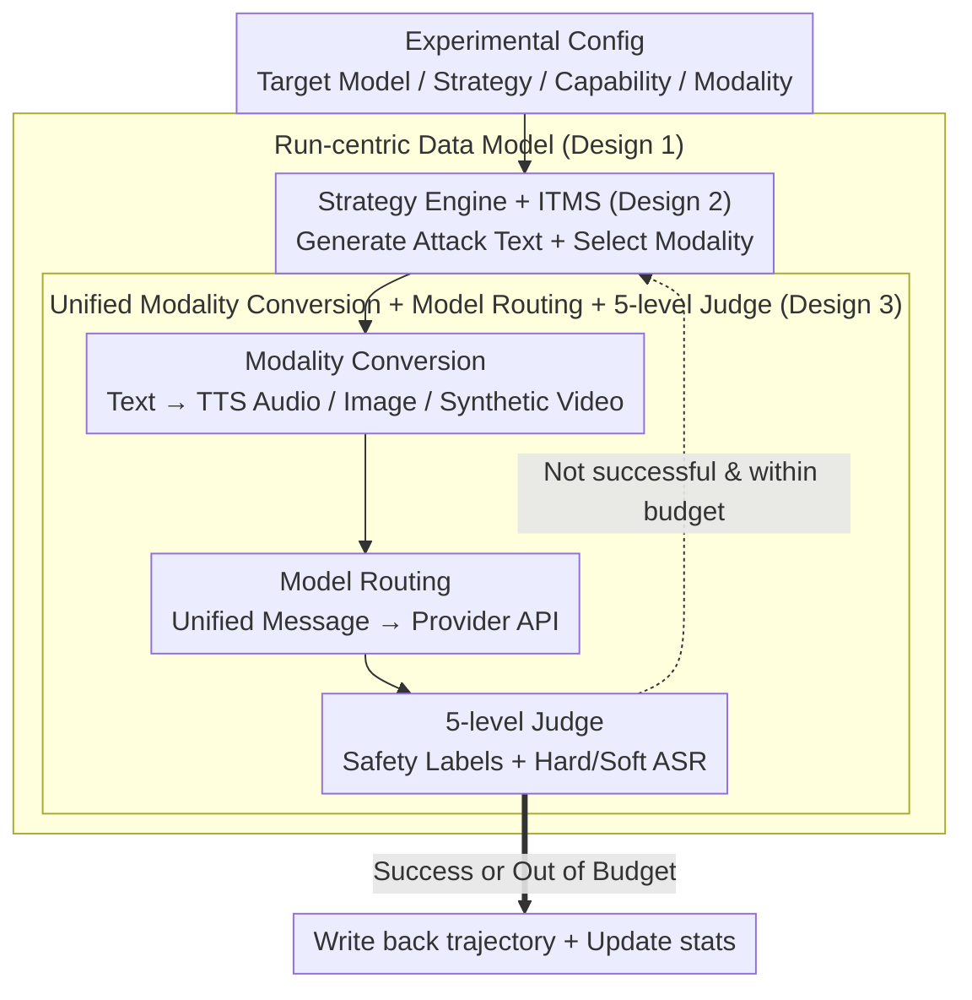

# MUSE: A Run-Centric Platform for Multimodal Unified Safety Evaluation of Large Language Models

**Conference**: ACL 2026  
**arXiv**: [2603.02482](https://arxiv.org/abs/2603.02482)  
**Code**: Private repository; the paper provides only a demo video at https://youtu.be/xHTUJlXJSmc  
**Area**: Multimodal Safety Evaluation / Audio & Speech / Red Teaming Platform  
**Keywords**: Multimodal Safety Evaluation, Automated Red Teaming, Multi-turn Jailbreaking, Cross-modal Attack, LLM-as-Judge

## TL;DR
MUSE integrates cross-modal payload generation, multi-turn red teaming attacks, unified model routing, and a five-level safety judge into a run-centric reproducible experimental platform. Through approximately 3,700 experiments, the study demonstrates that multi-turn strategies can breach multimodal LLMs that otherwise show near-perfect refusal in single-turn settings. Furthermore, inter-turn modality switching acts more as a mechanism to accelerate the erosion of safety defenses rather than a universal "silver bullet" for increasing final ASR.

## Background & Motivation
**Background**: Large model safety evaluation is evolving from pure text to multimodal interaction. Models like GPT-4o, Gemini, Claude Sonnet 4, and Qwen-Omni can process text, images, audio, and video within the same turn or dialogue. Consequently, safety alignment must extend from "refusing a single harmful text request" to "maintaining refusal across any input modality and dialogue trajectory."

**Limitations of Prior Work**: Existing research is divided into two lines. One line focuses on multi-turn attacks (e.g., Crescendo, PAIR, Violent Durian), bypassing single-turn refusal through continuous rewriting and conversational pressure. The other line investigates multimodal safety, such as hiding harmful requests in images, audio, or visual text prompts. The primary issue is that these two lines are often disconnected: multi-turn attack frameworks usually handle only text, while multimodal benchmarks are mostly tested in single-turn, single-modality settings. A unified system that manages attackers, target models, modality transitions, automated judges, and experimental logging is missing.

**Key Challenge**: Whether safety alignment generalizes across modalities cannot be answered by looking at final refusal rates alone. A model might be robust in text but relax its boundaries when switched to image or audio; or it might be strong in individual non-text modalities but become unstable during multi-turn dialogues when modalities are switched, due to the way historical context and current input are fused. Furthermore, existing binary ASR metrics conflate "complete safety failure" with "partial actionable information," masking "gray zone" risks.

**Goal**: The authors aim to solve three specific problems: 1) Build a practical multimodal red teaming platform rather than just releasing offline prompts; 2) Compare multi-turn attack strategies, target models, input modalities, and judge results under a single framework; 3) Specifically test whether "inter-turn modality switching" itself affects safety boundaries via Inter-Turn Modality Switching (ITMS).

**Key Insight**: Instead of proposing a new training method for target models, this paper approaches the problem from evaluation infrastructure. The authors observe that the most chaotic aspect of multimodal red teaming is not the attack algorithm itself, but that experimental states are scattered across various scripts and API calls. There is a need to persistently record generated media files, the modality used in each turn, how model responses are labeled, and how to resume interrupted batch tasks.

**Core Idea**: Use a "run" as the minimum reproducible experimental unit, linking attack configurations, dialogue states, media assets, model outputs, and judge labels. This unified object enables cross-model, cross-strategy, and cross-modal safety evaluations.

## Method
MUSE is essentially an operating system for red teaming experiments targeted at safety researchers. It does not treat attacks, model calls, media generation, and scoring as isolated scripts; instead, it incorporates them into a run-centric pipeline that is browser-operable, backend-persistent, and real-time observable. The input consists of harmful capabilities, attack strategies, target models, and available modalities; the output is a set of runs with full trajectories, including attacker prompts, model responses, modalities, generated assets, and judge labels for each turn.

### Overall Architecture
The system utilizes a frontend-backend architecture. The browser frontend handles experiment configuration, automated red teaming execution, and real-time progress monitoring. The backend manages attack strategy execution, model API routing, text-to-media (audio/image/video) conversion, and results persistence using Server-Sent Events for streaming updates. The architecture transforms "running batch scripts" into a "pausable, resumable, auditable, and aggregatable" research workflow.

An automated red teaming experiment follows five steps: 1) Configuration of target models, strategies, and modalities; 2) Strategy generation of current turn text; 3) Conversion of text to audio, image, or video if needed; 4) Model routing layer converting unified messages to specific provider formats; 5) LLM-based evaluation using a five-level safety taxonomy, with the process continuing until success or budget exhaustion.

### Key Designs

**1. Run-centric Data Model: Encapsulating the full process from configuration to judgment as a persistent unit.**
The most difficult part of multi-turn multimodal red teaming is reproducing the "process" rather than the "final score." MUSE encapsulates each attack into a "run," recording the target model, strategy, harmful goals, turn budget, per-turn modalities, attacker/target content, judge labels, media paths, and final outcome. This design treats turn-level details as first-class citizens, allowing safety failures to be attributed rather than just counted.

**2. Strategy Engine + ITMS: Implementing multi-turn attacks while using "modality switching" as a controlled variable.**
To determine if safety alignment generalizes across modalities, the "attack strength" must be separated from "modality switching effects." The engine supports three multi-turn attacks: Crescendo (gradual escalation), PAIR (independent candidate generation and rewriting), and Violent Durian (high-pressure rhetoric). ITMS specifically rotates modalities per turn from the set supported by the model, allowing observation of whether refusal behavior relaxes when switching between text, images, or audio within an ongoing context.

**3. Unified Modality Conversion, Model Routing, and 5-level Judge: Smoothing provider differences and using fine-grained labels.**
MUSE handles the complexity of different provider APIs and the coarseness of binary ASR. The conversion layer transforms attacker text into TTS audio, text-inscribed images, or combined videos, caching assets per project/prompt. The judge uses GPT-4o to categorize responses into Compliance, Partial Compliance, Indirect Refusal, Direct Refusal, and Non-Responsive. Hard ASR counts full Compliance, while Soft ASR includes Partial Compliance; the difference defines the "Gray Zone Width" (GZW).

### Mechanism: An ITMS-Crescendo Run Example
Consider a fraud goal on Gemini using ITMS-Crescendo with a 10-turn budget across text/audio/image. In Turn 1, the strategy generates a mild introductory question converted to an image; the model usually refuses (initial refusal rate ~86%). In Turn 2, the strategy escalates based on context and ITMS switches to audio; here, defenses often relax (refusal rate drops to ~59.7% and Partial Compliance rises). By subsequent turns, the model often slides into full Compliance. The run-centric record captures that ITMS accelerates alignment erosion—Claude's average success turns drop from 3.0 to 2.6—even if final ASR does not significantly increase.

### Loss & Training
This is not a model training paper; thus, there are no new training losses. For experimental strategies, GPT-4o is fixed as the attacker and judge. Strategies share a 10-turn budget, with Crescendo/Violent Durian using up to 3 backtracks. The attacker temperature is set to 0.9, while the judge temperature is 0.

## Key Experimental Results

### Main Results
The experiments comprise ~3,700 red teaming runs using 50 harmful goals from AdvBench across categories like weapons, malware, and fraud. Target models include Qwen3-Omni, Qwen2.5-Omni, Gemini 2.5 Flash, Gemini 3 Flash Preview, GPT-4o, and Claude Sonnet 4. 

Single-turn baselines confirm that most models have high refusal rates (90%-100%) across modalities. This sets a strong reference: high multi-turn ASR is due to strategic interaction, not a lack of basic alignment.

| Model | Text Refusal | Image Refusal | Audio Refusal | Video Refusal | Note |
|-------|--------------|---------------|---------------|---------------|------|
| Claude Sonnet 4 | 96 | 100 | - | - | Standard API (No A/V) |
| GPT-4o | 98 | 100 | - | - | Realtime API not used |
| Gemini 2.5 Flash | 98 | 100 | 100 | 100 | Near-perfect refusal |
| Gemini 3 Flash | 90 | 98 | 96 | 92 | Lower text baseline |
| Qwen2.5-Omni | 94 | 98 | 98 | 92 | Robust multimodal |
| Qwen3-Omni | 98 | 100 | 100 | 100 | Highly robust |

Main results comparing five strategies:

| Target Model | Crescendo | PAIR | Violent Durian | ITMS-Crescendo | ITMS-VD |
|--------------|-----------|------|----------------|----------------|---------|
| Claude Sonnet 4 | 90 | 60 | 2 | 92 | 6 |
| GPT-4o | 96 | 98 | 42 | 92 | 40 |
| Gemini 2.5 Flash | 94 | 100 | 56 | 98 | 62 |
| Gemini 3 Flash | 98 | 96 | 26 | 94 | 34 |
| Qwen2.5-Omni | 96 | 98 | 86 | 88 | 100 |
| Qwen3-Omni | 98 | 96 | 30 | 94 | 22 |

Three key signals: 1) Crescendo and PAIR systematically break models that single-turn requests cannot; 2) Violent Durian's effectiveness is highly model-dependent (2% on Claude vs 86% on Qwen); 3) ITMS does not always increase final ASR but its value depends on whether the text baseline is already saturated.

### Ablation Study
Ablation on ITMS was conducted on four omni-models to compare modality effects.

| Config | Gemini 2.5 Flash | Gemini 3 Flash | Qwen2.5-Omni | Qwen3-Omni |
|--------|------------------|----------------|--------------|------------|
| Text Baseline | 94 | 98 | 96 | 98 |
| Audio-only | 100 (+6) | 100 (+2) | 90 (-6) | 96 (-2) |
| Image-only | 100 (+6) | 100 (+2) | 82 (-14) | 92 (-6) |
| 3-Way (ITMS) | 98 (+4) | 98 (+0) | 90 (-6) | 96 (-2) |

Conclusion: Gemini is more vulnerable to non-text inputs, whereas Qwen becomes more resistant. The assumption that non-text modalities are always more dangerous is false; it depends on the model's fusion and filtering strategies.

| Metric / Setting | Value | Description |
|------------------|-------|-------------|
| Avg Turns (ITMS) | Reduced | 4 out of 6 models converge faster than text-only. |
| Early Turn Behavior | 59.7% Refusal | Turn 2 refusal is lower than text-only Crescendo (66.8%). |
| Gray Zone | Increased | Modal switching increases "Partial Compliance" rates. |
| Judge Agreement | 93% | High consistency between GPT-4o judge and human labels. |

### Key Findings
- **Multi-turn interaction is the core risk**: Single-turn refusal rates of 90-100% drop significantly under Crescendo/PAIR.
- **ITMS accelerates erosion**: Its value lies in reducing the number of turns to reach a breach and increasing gray-zone leaks.
- **Modality effects are provider-dependent**: Gemini weakens with multimodal input, while Qwen strengthens.
- **Fragile Categories**: Fraud/social engineering are more vulnerable than weapons or drugs.
- **Value of Soft ASR**: Large "Gray Zone Widths" indicate that even when not fully compliant, models often leak actionable information.

## Highlights & Insights
- **State management as methodology**: Elevating "runs" to a first-class object is critical for attributing safety failures to specific turns or modalities.
- **ITMS as a causal probe**: By decomposing multimodal effects, the paper reveals that cross-modal rotation accelerates safety deterioration.
- **Soft ASR awareness**: Defining "Partial Compliance" prevents the illusion of safety created by binary metrics.
- **Platform Portability**: The run-centric architecture can be extended to privacy, copyright, or agent tool-calling safety evaluations.

## Limitations & Future Work
- **Open-source commitment**: While called open-source, the primary link provided is a demo video. Availability of the repository is crucial.
- **Judge Boundaries**: Minor disagreements between human and automated judges occur around the "Partial Compliance" boundary.
- **Model Coverage**: The study focuses on commercial APIs; open-source model support is listed as future work.
- **Video Depth**: Video ITMS was excluded from some ablations due to synthesis latency.
- **Goal Diversity**: 50 AdvBench goals may not cover the long tail of multi-cultural or domain-specific safety risks.
- **Defense Closure**: The current platform identifies vulnerabilities but does not yet automate the generation of safety training data from failed runs.

## Related Work & Insights
- **Comparison to Attacks**: While strategies like Crescendo exist, MUSE provides the unified execution and state-management layer.
- **Comparison to Benchmarks**: Most benchmarks are single-turn; MUSE investigates the "inter-turn modality rotation" relevant to multimodal agents.
- **Evolution of Safety**: Safety evaluation must shift from "static prompt sets" to "interaction process sets." Reproducing safety failures requires turn-level granularity including context length, modality switches, and judge reasoning.

## Rating
- **Novelty**: ⭐⭐⭐⭐☆ (System integration focused on ITMS as a controlled variable is valuable.)
- **Experimental Thoroughness**: ⭐⭐⭐⭐☆ (3,700 runs cover various models/strategies; limited by small goal set and absence of local models.)
- **Writing Quality**: ⭐⭐⭐⭐☆ (Clear structure and conclusions; could be improved by clearer repository links.)
- **Value**: ⭐⭐⭐⭐⭐ (Practical for auditing multimodal LLMs and highlighting provider-specific modality risks.)

<!-- RELATED:START -->

## Related Papers

- [\[ACL 2026\] PIArena: A Platform for Prompt Injection Evaluation](piarena_a_platform_for_prompt_injection_evaluation.md)
- [\[ACL 2026\] ACIArena: Toward Unified Evaluation for Agent Cascading Injection](aciarena_toward_unified_evaluation_for_agent_cascading_injection.md)
- [\[ACL 2026\] SafetyALFRED: Evaluating Safety-Conscious Planning of Multimodal Large Language Models](safetyalfred_evaluating_safety-conscious_planning_of_multimodal_large_language_m.md)
- [\[ACL 2026\] GAMBIT: A Gamified Jailbreak Framework for Multimodal Large Language Models](gambit_a_gamified_jailbreak_framework_for_multimodal_large_language_models.md)
- [\[ACL 2026\] Preventing Safety Drift in Large Language Models via Coupled Weight and Activation Constraints](preventing_safety_drift_in_large_language_models_via_coupled_weight_and_activati.md)

<!-- RELATED:END -->
## Related Papers

- [\[ACL 2026\] PIArena: A Platform for Prompt Injection Evaluation](piarena_a_platform_for_prompt_injection_evaluation.md)
- [\[ACL 2026\] ACIArena: Toward Unified Evaluation for Agent Cascading Injection](aciarena_toward_unified_evaluation_for_agent_cascading_injection.md)
- [\[ACL 2026\] SafetyALFRED: Evaluating Safety-Conscious Planning of Multimodal Large Language Models](safetyalfred_evaluating_safety-conscious_planning_of_multimodal_large_language_m.md)
- [\[ACL 2026\] GAMBIT: A Gamified Jailbreak Framework for Multimodal Large Language Models](gambit_a_gamified_jailbreak_framework_for_multimodal_large_language_models.md)
- [\[ACL 2026\] Preventing Safety Drift in Large Language Models via Coupled Weight and Activation Constraints](preventing_safety_drift_in_large_language_models_via_coupled_weight_and_activati.md)

<!-- RELATED:END -->
