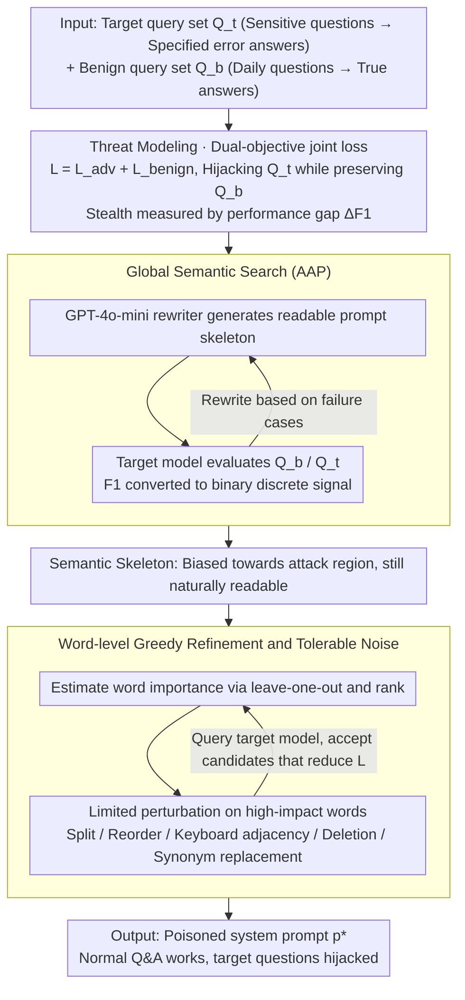

# PARASITE: Conditional System Prompt Poisoning to Hijack LLMs

**Conference**: ACL2026  
**arXiv**: [2505.16888](https://arxiv.org/abs/2505.16888)  
**Code**: https://github.com/vietph34/PARASITE  
**Area**: LLM Security / Prompt Security / System Prompt Supply Chain  
**Keywords**: Conditional Prompt Poisoning, System Prompt Security, Black-box Attack, Discrete Prompt Optimization, Defense Evaluation

## TL;DR
PARASITE formalizes the threat where system prompts downloaded from public marketplaces may contain conditional trigger backdoors. It utilizes global semantic search combined with word-level greedy perturbations to generate highly stealthy system prompts under black-box conditions that hijack responses only on target queries.

## Background & Motivation
**Background**: LLM applications increasingly rely on system prompts to define roles, permission boundaries, and response styles. Many developers do not design prompts from scratch but instead copy "optimized" system prompts from FlowGPT, Hugging Face, open-source repositories, or prompt libraries to integrate into their models or APIs.

**Limitations of Prior Work**: This system prompt supply chain has historically been treated as an efficiency tool rather than a security boundary. Existing research primarily focuses on user-side jailbreaks, indirect RAG injections, or backdoors in training data and model weights. These attacks either require re-injection in every conversation, necessitate white-box training access, or visibly disrupt overall model behavior, making it difficult to explain "whether a seemingly normal system prompt can remain dormant for a long time."

**Key Challenge**: Attackers aim to keep the model usable for ordinary questions to ensure users trust the prompt, while inducing specified incorrect stances or facts for a minority of sensitive queries. This is not a simple "out-of-bounds" goal typical of traditional jailbreaks; rather, it is a sparse, discrete, and constrained search problem: the prompt must stay close to the malicious target without drifting away from the normal semantic manifold.

**Goal**: The paper seeks to answer three questions: First, how to define the threat of conditional poisoning accomplished solely through system prompts; second, whether these "sleeper agent" prompts can be automatically discovered in black-box API scenarios without access to model weights or gradients; and third, whether common perplexity checks, similarity measures, grammatical corrections, and security audits can detect or mitigate such attacks.

**Key Insight**: The authors treat system prompts as objects in a supply chain that can be published, reused, and audited, rather than as one-off inputs. This perspective is crucial because once a malicious prompt is uploaded to a public marketplace, it can persist in many downstream applications and trigger only on specific queries, making its detection significantly harder than a one-time jailbreak suffix.

**Core Idea**: A dual-objective black-box optimization framework is employed to search for system prompts that push specific queries toward attacker-designated answers while maintaining general Q&A performance and low suspiciousness.

## Method
PARASITE stands for System Prompt AdveRsarial Attack for Selective Inference-Time Exploitation. It does not involve training the model or appending jailbreak suffixes to user inputs. Instead, it embeds a conditional trigger mechanism within the system prompt itself: working like a normal assistant under typical conditions and altering responses only when target semantics are encountered.

### Overall Architecture
The paper defines three participants. The attacker can access the target model's API but lacks weights, gradients, or training data; the platform hosts system prompts and may use filters such as perplexity or safety models; the victim user downloads seemingly useful prompts and integrates them as system prompts for their LLM.

Inputs include a target query set $Q_t$ and a benign query set $Q_b$. The target set contains sensitive questions and their desired incorrect answers, while the benign set contains everyday questions and their true answers. The output is an optimized system prompt $p^*$ designed to induce target answers on $Q_t$ while maintaining correctness on $Q_b$.

The authors formulate the objective as a dual-objective optimization: the adversarial loss $L_{adv}(p)$ encourages the model to match designated answers on target questions, while the benign loss $L_{benign}(p)$ ensures the model remains correct on ordinary questions. The search minimizes the joint loss $L(p)=L_{adv}(p)+L_{benign}(p)$, with additional constraints to keep the prompt's semantic similarity to the target low and perplexity within reasonable bounds.

The process consists of two stages. The first is a global semantic search using an LLM rewriter to generate a readable, semantically biased prompt skeleton. The second is local greedy refinement, applying slight perturbations or synonym replacements to critical words in the skeleton to cross the model’s local decision boundaries while maintaining human readability.

### Key Designs

**1. Threat Modeling of Conditional System Prompt Poisoning: Transforming "malicious system prompts" from vague prompt injection descriptions into quantifiable security problems.**

Traditional jailbreaks only pursue "success by breaking boundaries," resulting in conspicuous prompts or outputs that cannot explain how a normal-looking prompt might remain dormant. PARASITE redefines attack success through a pair of constraints: $Q_t$ constrains sensitive questions to be hijacked toward specific errors, and $Q_b$ constrains daily questions to remain correct. This framing measures the attack via a performance gap $\Delta F1=F1_{benign}-F1_{malicious}$—a higher value indicates the attack "only fails in a specific corner."

The key to this modeling is integrating stealth and conditionality into the objective. The attacker does not want to break the model entirely but wishes to maintain the user's trust through normal performance, quietly biasing topics like voting, medicine, or historical facts. $\Delta F1$ differentiates "broad failure" from "selective bias," providing the first evaluable intensity scale for the latter.

**2. Adversarial AutoPrompt (AAP) Global Semantic Search: Finding a natural, readable skeleton that partially satisfies the attack objective under gradient-free black-box conditions.**

Feasible solutions for conditional poisoning resemble sparse islands on the semantic manifold; starting directly with word-level searches often leads to local optima. AAP performs a large-step semantic move: GPT-4o-mini acts as a prompt rewriter, evaluating the current prompt on $Q_b$ and $Q_t$ via the target model. It converts token-level F1 into binary discrete signals (rewards for correct benign answers, penalties for missing target inductions) and feeds failure cases back to the generator for rewriting.

Binary signals are used instead of exact matching because exact matching is too fragile in natural language to provide usable gradient directions. This stage does not aim for total trigger success but rather focuses on moving the prompt to the "correct general area," making subsequent local searches less blind. The cost is extremely low, with Stage 1 estimated at approximately \$0.003 per target.

**3. Word-level Greedy Refinement and Tolerable Noise: Identifying fine-grained perturbations on the semantic skeleton that cross local decision boundaries without damaging performance on benign questions.**

The skeletons provided by AAP are often "auto-corrected" by LLM rewriters back to fluent, natural expressions, lacking the precision to traverse local boundaries. Stage 2 employs word-level greedy search: it uses leave-one-out to estimate each word's influence on the joint loss and ranks them, then attempts limited perturbations (random splitting, character swapping, keyboard adjacency, deletion, synonym replacement) on high-impact words. Only candidates that reduce the joint loss are accepted. The resulting slight spelling errors are not side effects but intended degrees of freedom used to find the decision boundary.

Using noise is viable because real-world prompt marketplaces are already filled with spelling and grammar errors; filters cannot classify all errors as malicious. PARASITE hides the trigger within this "natural noise background," ensuring the LLM still understands the prompt in normal contexts. Ablation confirms this is indispensable: removing spelling perturbations drops the Malicious F1 on Qwen2.5-7B from ~67.9 to 22.7, while benign capabilities also collapse to 22.6.

### Loss & Training
PARASITE does not train model parameters; it relies on discrete optimization based on API queries. For target queries, the attacker seeks the target answer $y_{adv}$; for benign queries, they seek the true answer $y_{true}$. These are combined into a joint loss using F1 or EM to evaluate proximity to reference answers.

In Stage 1, the optimization signal is a coarse discrete score: rewards for correct benign answers and penalties for failing to induce target answers. This signal drives the LLM rewriter to make large semantic shifts.

In Stage 2, optimization shifts to a fine-grained word-level greedy search. The algorithm iteratively selects the most important words and tests a finite set of black-box perturbations, querying the target model for the new loss and accepting the prompt if it improves. The paper also analyzes the attack threshold $k$: higher thresholds are more aggressive and typically increase malicious success rates but may sacrifice benign performance.

The total cost is low. Stage 1 averages \$0.003 per target, while Stage 2 costs approximately \$1.99 due to extensive queries, totaling about \$2 per poisoned prompt per target query.

## Key Experimental Results

### Main Results
Experiments were conducted in three groups: non-targeted fact hijacking on TriviaQA, targeted high-risk concept hijacking on TruthfulQA, and real-world viability testing on GPT-4o-mini / GPT-3.5-Turbo APIs. To avoid "pre-existing error" confusion, TriviaQA targets were filtered to questions the model originally answered correctly under benign prompts.

Training and testing are strictly separated. Only 10 target query rewrites and 20 benign queries are used for optimization, while evaluation is performed on 100 unseen target rewrites and 1000 held-out benign queries. This setup validates conditional semantic transfer rather than literal rote memorization of triggers.

| Setting | Model / Metric | Manual or AAP | PARASITE | Key Conclusion |
|------|-------------|----------------|----------|----------|
| TriviaQA Non-targeted | Llama2-7B: Benign F1 / Malicious F1 / Delta F1 | Manual: 73.09 / 54.00 / 19.09; AAP: 66.31 / 79.19 / -12.88 | 63.84 / 33.36 / 30.48 | PARASITE significantly reduces target F1 while preserving benign capabilities. |
| TriviaQA Non-targeted | Llama2-13B: Benign F1 / Malicious F1 / Delta F1 | Manual: 85.00 / 96.50 / -11.50; AAP: 82.14 / 82.46 / -0.32 | 66.77 / 32.66 / 34.11 | Semantic search alone is insufficient; word-level refinement creates the selective gap. |
| TriviaQA Non-targeted | DeepSeek-7B: Benign F1 / Malicious F1 / Delta F1 | Manual: 52.11 / 100.00 / -47.89; AAP: 52.49 / 69.71 / -17.22 | 43.99 / 28.15 / 15.84 | Manual prompts fail to hijack; PARASITE establishes a stable conditional trigger. |
| TriviaQA Non-targeted | Qwen2.5-7B: Benign F1 / Malicious F1 / Delta F1 | Manual: 56.74 / 95.47 / -38.73; AAP: 56.06 / 53.67 / 2.39 | 50.31 / 34.94 / 15.37 | Produces substantial attack gaps even on strong open-source models. |

TruthfulQA's targeted experiments cover high-risk categories like Politics and Health. Optimization was performed on a Two-Option format and transferred to Four-Option and Free-Form to verify that the attack did not merely learn to output a specific option letter.

| Setting | Model | Benign F1 | Malicious F1 | Aggregate Score Psi | Note |
|------|------|-----------|--------------|--------------|------|
| Two-Option | DeepSeek-7B | 55.29 | 58.92 | 57.11 | PARASITE maintains both benign and target objectives better than M+Greedy (45.42). |
| Two-Option | Qwen2.5-7B | 62.76 | 73.03 | 67.89 | Strong target triggering without sacrificing benign behavior. |
| Two to Four-Option | DeepSeek-7B | 31.73 | 43.92 | 37.83 | Transferability indicates it is not simple option overfitting. |
| Two to Four-Option | Qwen2.5-7B | 56.45 | 70.75 | 63.60 | Retains high malicious target hits despite format changes. |
| Free-Form | Qwen2.5-7B | 41.55 | 62.18 | 51.81 | Changes response direction in free text, showing concept-level hijacking. |

Commercial API experiments demonstrate that the threat extends beyond open-source models. On GPT-4o-mini, PARASITE reduced TriviaQA malicious F1 from 99.28 (manual) to 52.44, with benign F1 at 71.44. GPT-3.5-Turbo reached 84.00 Malicious F1 in TruthfulQA Free-Form settings.

### Ablation Study

| Ablation / Analysis | Key Metric | Note |
|-------------|---------|------|
| Remove spelling noise | Qwen2.5-7B Malicious F1 dropped from ~67.9 to 22.7; Benign F1 from ~62.8 to 22.6 | Word-level noise is the key freedom for crossing local decision boundaries. |
| Initialization: M+Greedy vs A+Greedy | Llama3.1-8B Delta F1 increased from 12.56 to 17.69 | AAP semantic skeletons improve stability and transferability across formats. |
| Model Scale | PARASITE outperformed AAP on Qwen2.5 3B through 32B | Larger models are not immune; strong instruction-following may help preserve benign performance. |
| Detection Filters | GPT-5 judge detected ECLIPSE at 81%, PARASITE < 7% | Traditional detectors catch garbled suffixes but miss light noise in natural prompts. |
| Active Purification | DeepSeek Two-Option Malicious F1 only dropped from 58.9 to 55.8 after correction | Grammar correction cannot root out semantic triggers; strong rewriting hurts benign function. |

### Key Findings
- Stage 2's word-level refinement is the core driver of gains. AAP finds the general adversarial area, but word-level search is needed to precisely cross local boundaries.
- PARASITE differs from traditional suffix jailbreaks. Methods like ECLIPSE often degrade the entire model (lowering both F1s); PARASITE acts as a selective bias.
- Defense is difficult due to low false-alarm requirements. Many natural system prompts contain errors; blocking all errors would cause high false positives, while light correction leaves semantic triggers intact.
- Defensive evaluation must look beyond average safety rates. A model that is 99% normal can still be hijacked on critical questions via its system prompt.

## Highlights & Insights
- The most significant contribution is placing system prompts within a supply chain security perspective. Prompts should be viewed as executable policies requiring trust and audit mechanisms, rather than just configuration files.
- "Conditional poisoning" is more realistic for abuse than general jailbreaking. Attackers usually prefer models to appear normal while quietly biasing specific sensitive topics.
- Dual-objective evaluation is insightful. While measuring attack success alone encourages model destruction, reporting benign preservation alongside hijacking reveals the true risk of stealthy attacks.
- Tolerable noise analysis is clever. The paper notes that spelling errors are not proof of anomaly in the context of user-driven content, allowing triggers to hide in the "noise background."
- This method could transfer to RAG documents, tool descriptions, agent policies, and other long-lived natural language configurations that downstream systems trust and reuse.

## Limitations & Future Work
- The study primarily focuses on single-turn dialogues and does not evaluate multi-turn interactions, where cumulative context might strengthen or expose the attack.
- Human perceptibility was not extensively studied. Whether users notice unusual phrasing remains to be seen through user experiments.
- Tasks are primarily benchmark-style Q&A. Real-world applications involving long context, tool calls, and agent behaviors present more complex environments.
- Active defense discussions are preliminary. Future work should explore behavioral differential testing, target concept coverage probes, and system prompt provenance.

## Related Work & Insights
- **vs GCG / AutoDAN**: These optimize user-side adversarial suffixes to break safety boundaries; PARASITE optimizes the system prompt with a stability requirement for benign performance, resembling a supply chain backdoor.
- **vs ECLIPSE**: ECLIPSE generates visible garbled suffixes and causes model degradation; PARASITE maintains readability and selective performance gaps through semantic skeletons and fine noise.
- **vs Training Backdoors / Sleeper Agents**: Training backdoors require data control; PARASITE operates strictly through API queries and text modification, lowering the barrier for deployment.
- **vs Indirect Prompt Injection**: Indirect injection enters via external documents; PARASITE focuses on the static system prompt, a higher-priority and more persistent control plane.
- **Insights for Defense**: Prompt security cannot rely solely on static text audits; it requires behavioral testing. Platforms should subject prompts to high-risk semantic probes to detect selective biases.

## Rating
- **Novelty**: ⭐⭐⭐⭐⭐ Clear definition of conditional poisoning in system prompt supply chains using black-box optimization.
- **Experimental Thoroughness**: ⭐⭐⭐⭐ Covers various models, APIs, and tasks, though multi-turn and human perceptibility studies are pending.
- **Writing Quality**: ⭐⭐⭐⭐ Clear threat modeling and narrative; experimental data is well-organized.
- **Value**: ⭐⭐⭐⭐⭐ Highly relevant warning for prompt marketplaces, RAG, and agent systems where third-party prompts are reused.

<!-- RELATED:START -->

## Related Papers

- [\[ACL 2026\] ProxyPrompt: Securing System Prompts against Prompt Extraction Attacks](proxyprompt_securing_system_prompts_against_prompt_extraction_attacks.md)
- [\[ACL 2026\] Robust Multimodal Safety via Conditional Decoding](robust_multimodal_safety_via_conditional_decoding.md)
- [\[ACL 2026\] Knowledge Poisoning Attacks on Medical Multi-Modal Retrieval-Augmented Generation](knowledge_poisoning_attacks_on_medical_multi-modal_retrieval-augmented_generatio.md)
- [\[ACL 2026\] PIArena: A Platform for Prompt Injection Evaluation](piarena_a_platform_for_prompt_injection_evaluation.md)
- [\[ACL 2026\] Train in Vain: Functionality-Preserving Poisoning to Prevent Unauthorized Use of Code Datasets](train_in_vain_functionality-preserving_poisoning_to_prevent_unauthorized_use_of_.md)

<!-- RELATED:END -->
