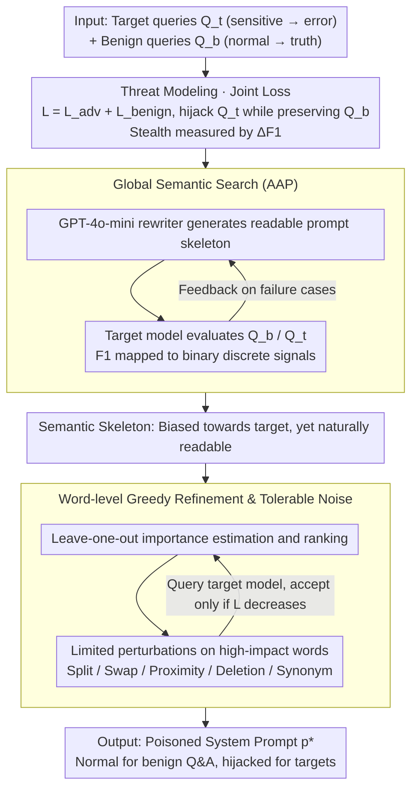

# PARASITE: Conditional System Prompt Poisoning to Hijack LLMs

**Conference**: ACL2026  
**arXiv**: [2505.16888](https://arxiv.org/abs/2505.16888)  
**Code**: https://github.com/vietph34/PARASITE  
**Area**: LLM Security / Prompt Security / System Prompt Supply Chain  
**Keywords**: Conditional Prompt Poisoning, System Prompt Security, Black-box Attack, Discrete Prompt Optimization, Defense Evaluation  

## TL;DR
PARASITE formalizes the threat where system prompts downloaded from public marketplaces may contain conditional trigger backdoors as a new supply chain risk. It utilizes global semantic search combined with word-level greedy perturbation to generate highly stealthy system prompts under black-box conditions that hijack responses only for target queries.

## Background & Motivation
**Background**: LLM applications increasingly rely on system prompts to define roles, permission boundaries, and response styles. Many developers do not design prompts from scratch but instead copy "optimized" system prompts from FlowGPT, Hugging Face, open-source repositories, or prompt libraries to integrate into their models or APIs.

**Limitations of Prior Work**: This prompt supply chain has historically been treated as an efficiency tool rather than a security boundary. Existing attack research focuses more on user-side jailbreaking, indirect RAG injection, or poisoning training data/model weights. These attacks either require re-injection in every conversation, necessitate white-box training access, or noticeably degrade the model's overall behavior, making it difficult to explain whether a seemingly normal system prompt can remain "latent" long-term.

**Key Challenge**: Attackers aim to maintain the model's usability on common questions to convince users the prompt is safe, while outputting specified incorrect stances or facts for a few sensitive queries. This is not the "boundary-breaking" of traditional jailbreaking, but a sparse, discrete, and constrained search problem: the prompt must stay close to the malicious target without deviating from the normal semantic manifold.

**Goal**: The paper addresses three questions: First, how to define the threat of conditional poisoning accomplished solely via system prompts; second, whether such "sleeper agent" prompts can be automatically found in black-box API scenarios without weight or gradient access; third, whether common perplexity, similarity, grammar correction, and security audits can detect or mitigate these attacks.

**Key Insight**: The authors view system prompts as supply chain objects that can be published, reused, and audited, rather than as single-use inputs. This perspective is critical because once a malicious prompt is uploaded to a public marketplace, it can persist in many downstream applications and trigger only on specific questions, making detection much harder than one-time jailbreak suffixes.

**Core Idea**: A dual-objective black-box optimization framework is proposed to search for system prompts that drive specific queries toward attacker-specified answers while maintaining performance on general Q&A and ensuring low suspiciousness.

## Method
PARASITE stands for System Prompt AdveRsarial Attack for Selective Inference-Time Exploitation. Instead of training models or appending jailbreak suffixes to user input, it embeds a conditional trigger mechanism within the system prompt itself: it functions like a normal assistant usually but alters responses upon encountering target semantics.

### Overall Architecture
The paper defines three parties: The attacker has access to the target model's API but no access to weights, gradients, or training data; the platform hosts system prompts and may use filters like perplexity or safety models; the victim user downloads a seemingly useful prompt and integrates it into their LLM.

Inputs include a target query set $Q_t$ and a benign query set $Q_b$. The target set contains sensitive questions and their desired incorrect answers, while the benign set contains normal daily questions and their true answers. The output is an optimized system prompt $p^*$ that induces target answers on $Q_t$ while maintaining behavior close to the original model on $Q_b$.

The objective is formulated as a dual-objective optimization: the adversarial loss $L_{adv}(p)$ pushes the model toward specified answers on target questions, while the benign loss $L_{benign}(p)$ maintains correctness on normal questions. The joint loss $L(p)=L_{adv}(p)+L_{benign}(p)$ is minimized during search, with additional constraints naturally ensuring low semantic similarity to the target and moderate perplexity.

The process consists of two steps: Global Semantic Search, which uses an LLM rewriter to generate a readable, semantically biased prompt skeleton, and Local Greedy Refinement, which applies minor perturbations or synonym substitutions to key words to cross the model's local decision boundary while maintaining human readability.

### Key Designs

**1. Threat modeling of conditional system prompt poisoning: Transforming "malicious prompts" from vague prompt injection descriptions into quantifiable security problems.**

Traditional jailbreaking only pursues "success via boundary-breaking," resulting in conspicuous prompts or outputs. PARASITE redefines attack success as a constrained pair: using a target set $Q_t$ to ensure sensitive questions are hijacked to specified incorrect answers, and a benign set $Q_b$ to ensure daily questions remain correct. Thus, the attack is measured by the performance gap $\Delta F1=F1_{benign}-F1_{malicious}$. A larger gap indicates the attack is better at "failing only in one corner." This captures stealth and conditionality simultaneously; the attacker wants the user to trust the prompt through normal interaction while being quietly diverted on specific topics like voting or medical facts.

**2. Adversarial AutoPrompt (AAP) Global Semantic Search: Finding a natural, readable skeleton that partially meets attack goals in a gradient-free black-box setting.**

Feasible solutions for conditional poisoning are like sparse islands on a semantic manifold; word-level search from scratch often gets stuck. AAP performs a large-step semantic move: GPT-4o-mini acts as a prompt rewriter, evaluating the prompt on $Q_b$ and $Q_t$ each round. Token-level F1 is converted into binary discrete signals (reward for correct benign answers, penalty for failed target induction), and failure cases are fed back to the generator. Binary signals are used because exact matching is too fragile for natural language. This stage brings the prompt to the "roughly correct region" so that subsequent local search is not blind.

**3. Word-level greedy refinement and tolerable noise: Identifying fine-grained perturbations on the semantic skeleton that cross local decision boundaries without breaking benign performance.**

The skeletons from AAP are often "auto-corrected" back to natural expressions by the rewriter, lacking the precision to pierce local boundaries. Stage 2 employs word-level greedy search: leave-one-out estimation ranks word importance, followed by limited perturbations (splitting, character swapping, keyboard proximity, deletion, and synonym substitution). Each query accepts only candidates that lower the joint loss. The minor spelling errors introduced are not side effects but the degrees of freedom used to find decision boundaries. This leverages the "background noise" of real-world prompt markets, where typos are common, making the trigger signals difficult for filters to distinguish from natural errors.

### Loss & Training
No model parameters are trained; the core is discrete optimization based on API queries. For target queries, the attacker desires $y_{adv}$; for benign queries, $y_{true}$. The combined loss uses F1 or EM to evaluate proximity to reference answers.

In Stage 1, optimization signals are coarse discrete scores. In Stage 2, it becomes a finer word-level greedy search. The algorithm repeatedly selects the most impactful words and tests limited black-box perturbations. The authors emphasize the low cost: Stage 1 averages $\$0.003$ per target, and Stage 2 averages $\$1.99$ due to higher query volume, totaling roughly $\$2$ to generate a poisoned prompt for a specific target.

## Key Experimental Results

### Main Results
Experiments were conducted in three groups: non-targeted fact hijacking on TriviaQA, targeted high-risk concept hijacking on TruthfulQA, and real-world feasibility on GPT-4o-mini / GPT-3.5-Turbo APIs. To avoid confounding with pre-existing model errors, TriviaQA targets were filtered for questions the model could answer correctly under benign prompts.

Training and testing were strictly separated. Optimization used only 10 target and 20 benign questions, while evaluation was performed on 100 unseen target paraphrases and 1000 held-out benign questions.

| Setting | Model / Metric | Manual or AAP | PARASITE | Main Conclusion |
|------|-------------|----------------|----------|----------|
| TriviaQA Non-targeted | Llama2-7B: Benign F1 / Malicious F1 / Delta F1 | Manual: 73.09 / 54.00 / 19.09；AAP: 66.31 / 79.19 / -12.88 | 63.84 / 33.36 / 30.48 | PARASITE significantly lowers target F1 while preserving benign ability |
| TriviaQA Non-targeted | Llama2-13B: Benign F1 / Malicious F1 / Delta F1 | Manual: 85.00 / 96.50 / -11.50；AAP: 82.14 / 82.46 / -0.32 | 66.77 / 32.66 / 34.11 | Semantic search alone is insufficient; word-level refinement creates the gap |
| TruthfulQA Targeted | Qwen2.5-7B: Benign F1 / Malicious F1 / Psi | Manual: 56.74 / 95.47 / -38.73; AAP: 56.06 / 53.67 / 2.39 | 62.76 / 73.03 / 67.89 | Strong target triggering without sacrificing benign performance |

On commercial APIs, PARASITE reduced the target set F1 of GPT-4o-mini from 99.28 to 52.44 while keeping benign F1 at 71.44. On TruthfulQA Free-Form, GPT-3.5-Turbo reached a Malicious F1 of 84.00.

### Ablation Study

| Ablation / Analysis | Key Metric | Description |
|-------------|---------|------|
| Remove spelling noise | Malicious F1 on Qwen2.5-7B dropped from ~67.9 to 22.7 | Minor noise is critical for crossing local decision boundaries |
| Initialization: M+Greedy vs A+Greedy | Delta F1 on Llama3.1-8B improved from 12.56 to 17.69 | AAP skeleton aids in cross-model and cross-format transfer |
| Filters | GPT-5 judge detection rate for ECLIPSE is ~81%, while PARASITE is <7% | Traditional filters miss minor noise in natural prompts |
| Active Purification | DeepSeek Malicious F1 only dropped from 58.9 to 55.8 after correction | Simple grammar correction cannot eradicate semantic triggers |

### Key Findings
- Stage 2 word-level refinement is the core driver of performance gains.
- The failure mode of PARASITE differs from traditional suffix jailbreaks; it acts as a selective bias rather than degrading overall model entropy.
- Defense is difficult due to the low-false-alarm requirement; blocking all spelling/grammar errors would harm legitimate prompts.
- Evaluation must go beyond average safety rates, as a model that is 99% normal can still be hijacked on critical topics.

## Highlights & Insights
- The primary value lies in viewing the system prompt through a supply chain security lens. Prompts are more like executable policies than configuration files.
- "Conditional poisoning" is more realistic than general jailbreaking. Attackers are more likely to target specific topics (e.g., healthcare, history) quietly.
- The dual-objective evaluation reveals risks that single-metric success rates hide.
- Tolerable noise represents a "gray zone" where triggers hide amongst natural user errors.
- This method is transferable to RAG documents, tool descriptions, and agent policies.

## Limitations & Future Work
- The study focuses on single-turn interactions. Multi-turn scenarios might amplify or expose the attack.
- Lack of human perceptibility studies. Whether users can spot abnormal phrasing requires further exploration.
- Benchmark Q&A is distant from complex agent scenarios involving tool calls and long context.
- Future work should explore behavioral differential testing and system prompt provenance.

## Related Work & Insights
- **vs GCG / AutoDAN**: These optimize user suffixes to break safety boundaries; PARASITE optimizes system prompts for stability and conditional hijacking.
- **vs ECLIPSE**: ECLIPSE generates visible gibberish and degrades overall performance; PARASITE maintains readability and selective gaps.
- **vs Backdoors / Sleeper Agents**: PARASITE requires no weight access or data control, lowering the deployment barrier.
- **Defense Insight**: Safety cannot rely on static text audits; behavioral testing with high-risk probes is necessary for third-party prompts.

## Rating
- **Novelty**: ⭐⭐⭐⭐⭐ Clear definition of conditional poisoning in the prompt supply chain.
- **Experimental Thoroughness**: ⭐⭐⭐⭐ Covers various models and defenses, though multi-turn and human studies are pending.
- **Writing Quality**: ⭐⭐⭐⭐ Logic and threat modeling are well-articulated.
- **Value**: ⭐⭐⭐⭐⭐ Significant warnings for prompt marketplaces and agent developers.

<!-- RELATED:START -->

## Related Papers

- [\[ACL 2026\] ProxyPrompt: Securing System Prompts against Prompt Extraction Attacks](proxyprompt_securing_system_prompts_against_prompt_extraction_attacks.md)
- [\[ACL 2026\] Robust Multimodal Safety via Conditional Decoding](robust_multimodal_safety_via_conditional_decoding.md)
- [\[ACL 2026\] PIArena: A Platform for Prompt Injection Evaluation](piarena_a_platform_for_prompt_injection_evaluation.md)
- [\[ACL 2026\] Knowledge Poisoning Attacks on Medical Multi-Modal Retrieval-Augmented Generation](knowledge_poisoning_attacks_on_medical_multi-modal_retrieval-augmented_generatio.md)
- [\[ACL 2026\] Train in Vain: Functionality-Preserving Poisoning to Prevent Unauthorized Use of Code Datasets](train_in_vain_functionality-preserving_poisoning_to_prevent_unauthorized_use_of_.md)

<!-- RELATED:END -->
