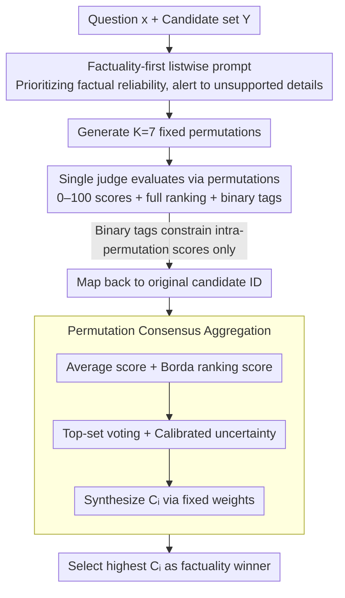

# Permutation-Consensus Listwise Judging for Robust Factuality Evaluation

**Conference**: ACL 2026  
**arXiv**: [2603.20562](https://arxiv.org/abs/2603.20562)  
**Code**: None  
**Area**: LLM Evaluation  
**Keywords**: LLM-as-a-Judge, Factuality Evaluation, Position Bias, Ranking Robustness, Consensus Aggregation

## TL;DR
PCFJudge treats candidate answer order as a nuisance variable in listwise factuality evaluation. By running 7 permutations of the same candidate set and aggregating scores, rankings, top-set votes, and calibrated uncertainty, it improves performance on RewardBench 2 Factuality by up to 7 percentage points compared to single direct judging.

## Background & Motivation

**Background**: LLM-as-a-Judge has become a common component in open-ended generation evaluation, best-of-N selection, reward model substitution, and post-training feedback. Many systems present multiple candidate answers to a strong model, instructing it to select the best answer based on preference, correctness, or factuality.

**Limitations of Prior Work**: These judges are inherently unstable. Research has shown that the same judge can be influenced by candidate positioning, rubric phrasing, scoring scales, and output formats. In listwise scenarios, the presentation order is particularly hazardous because several answers may be fluent, though only one or two are reliable regarding factual details.

**Key Challenge**: Factuality evaluation should theoretically be insensitive to candidate order. However, in practice, LLM judges often conflate order, presentation style, and preconceived attention biases with their judgments. Consequently, an evaluation system might appear to select factually reliable answers while actually only selecting responses that are more prominent under a specific presentation order.

**Goal**: The authors aim to enhance the robustness of listwise factuality judging without training new judges, accessing retrievers, or performing additional external fact-verification. The core question is: if candidate order is merely a nuisance variation, can it be marginalized—as in statistical estimation—to extract stable preferences from multiple permutations?

**Key Insight**: The paper treats a single judge call as a noisy measurement. While the output of a single canonical order may be biased, a candidate is more likely to be truly factually superior if it consistently receives high scores, high rankings, and top votes across various permutations.

**Core Idea**: Use the same factuality-first listwise prompt to perform multiple permutation-based evaluations on a candidate set, map each evaluation back to the original candidate IDs, and select the order-robust winner using a lightweight consensus score.

## Method

### Overall Architecture
The input to PCFJudge is a user question $x$ and a set of candidate answers $Y=\{y_1,\dots,y_n\}$, and the output is the most factually reliable candidate. It does not modify the judge backbone or train extra models; instead, it modifies the evaluation protocol during the inference phase.

The workflow consists of four steps.

First, a factuality-first listwise prompt is constructed. The prompt requires the judge to prioritize factual reliability over general helpfulness or fluency, specifically alerting it to major factual errors and specific details lacking evidence.

Second, $K$ permutations are generated for the same candidate set. In the final RewardBench 2 experiments, $K=7$ is used with fixed permutations to ensure reproducibility.

Third, the same judge is called for each permutation. Each call provides a 0–100 score for each candidate, a full ranking, brief reasoning, and several binary tags—such as whether there are major factual errors, hallucinated specificity, or demonstrated calibrated uncertainty.

Fourth, the results of each run are mapped back to the original candidate IDs. Cross-permutation consensus features are calculated and combined into a final score $C_i$ using fixed weights. The final winner is the candidate with the highest $C_i$; if the top scores are within a tolerance threshold, ties are preserved.

The key to this framework is not providing the model with more knowledge, but rather allowing the same judge to repeatedly express its stance under different presentation orders. Answers that only appear better in specific positions are averaged out, while answers that are consistently superior across orders are amplified.

### Key Designs

**1. Factuality-first listwise judging prompt: Redirecting judge attention back to factual reliability**

The difficulty of RewardBench 2 Factuality lies in the fact that multiple candidates appear credible and fluent on the surface; the true risk is hidden in "unsupported specificity"—details stated with certainty but lacking evidence. If use a general helpfulness prompt, the judge easily favors answers that are longer, more confident, or better formatted, mistaking fluency for factuality. PCFJudge explicitly rewrites the prompt to be "factuality-first": each evaluation requires a 0–100 numerical score, a full ranking, and brief reasoning, while simultaneously flagging three types of binary signals—major factual errors, hallucinated specificity, and calibrated uncertainty.

The weights of these three tags are asymmetrical. Major errors and unsupported details are strong negative signals that directly depress scores, while calibrated uncertainty is a weak positive signal only when it represents "reasonable caution" rather than "evasion." Explicitly requiring the judge to identify these details helps correct the systemic bias of "confusing confidence with correctness" within each permutation.

**2. Permutation consensus aggregation: Treating candidate order as a marginalizable noise variable**

Factuality evaluation should theoretically be insensitive to the order in which candidates are presented, but practical judges mix position, style, and attention biases into their judgment. PCFJudge treats a single judge call as a noisy measurement: it generates $K=7$ fixed permutations for the same candidate set, runs the same factuality-first prompt for each, and maps results back to the original IDs. For candidate $i$, it aggregates four statistics on a 0–100 scale—average score $\bar{s}_i=\frac{1}{K}\sum_r s_i^{(r)}$, Borda-style ranking score $B_i=\frac{100}{K(n-1)}\sum_r(n-rank_i^{(r)})$, top-set voting $v_i=\frac{1}{K}\sum_r \frac{\mathbf{1}[i\in T^{(r)}]}{|T^{(r)}|}$, and calibrated uncertainty proportion $u_i$. Finally, these are synthesized using fixed weights:

$$C_i=0.50\bar{s}_i+0.25B_i+0.20(100v_i)+0.05(100u_i)$$

Each of the four terms serves a purpose: the average score preserves the judge's fine-grained judgment, the Borda score utilizes full ranking information, top-set voting emphasizes "who is frequently chosen as first," and the small weight for uncertainty compensates cautious but factually reliable answers. Answers that only look better in certain positions are averaged out, while those consistently superior across orders are amplified—embodying the marginalization of order noise.

**3. Avoiding excessive external penalties and arbitration layers: Maintaining a lightweight and interpretable method**

A natural temptation is to apply extra penalties in the final aggregation since major errors and hallucinated specificity have already been flagged. However, the authors found during development that this double-counts the same signal, excessively punishing cautious but incomplete answers. Thus, these tags are only used to constrain scores within each permutation and do not appear as independent penalties in the cross-permutation aggregation.

More importantly, development ablations showed that more complex "robust overlays," "panel arbitration," or "evidence-backed overrides" are not necessarily better than simple consensus—in an early 50-case experiment, panel arbitration only improved performance from 79% to 81%, while evidence-backed override even caused a regression from 78% to 77%. These failures support a restrained design decision: the primary repairable error in listwise factuality judging is the unaddressed noise of candidate order, not the lack of a better arbitrating judge. Therefore, the method intentionally stops at the consensus layer without stacking meta-judges.

### Loss & Training
This paper involves no training loss and is a purely inference-time method. The "training strategy" can be understood as the choice of evaluation protocol: using $K=7$ fixed permutations for the same candidate set, reusing the same factuality-first prompt and judge backbone, and aggregating with fixed weights.

The authors also provide a simple theoretical explanation. If the probability $q$ of the judge ranking the true best candidate first under any random permutation is $q > 1/2$, and the top-choice events across permutations are approximately independent, the error probability of a majority vote over $K$ trials can be bounded by the Hoeffding inequality: $\Pr(\sum_r Z_r\le K/2)\le \exp(-2K(q-1/2)^2)$. While PCFJudge is richer than majority voting, this proposition demonstrates that as long as each permutation contains a weakly stable signal, multi-permutation consensus can depress order noise.

## Key Experimental Results

### Main Results
The main experiments utilize the Factuality subset of RewardBench 2. Each sample contains 4 candidate answers, perfectly fitting listwise factuality selection. Due to API budget constraints, the authors did not run the full split but used a fixed 300-case slice for each backbone, comparing a "direct judge" (single canonical order) against PCFJudge with $K=7$.

| Model | Samples | Direct | PCFJudge | Gain | Improvement/Regression |
|------|------:|------:|------:|------:|------:|
| GPT-5.4 | 300 | 84.17 | **89.33** | +5.17 | 30 / 14 |
| Claude Sonnet 4.6 | 300 | 78.00 | **85.00** | +7.00 | 39 / 15 |
| Weighted Average | 600 | 81.09 | **87.17** | +6.08 | 69 / 29 |

Two points are particularly noteworthy. First, the improvement appears across both GPT and Claude backbones, suggesting the gain isn't an artifact of a specific model family. Second, the paired improvement/regression is clearly asymmetric: 30 improvements vs 14 regressions for GPT-5.4, and 39 vs 15 for Claude. The combined sign test yielded $p < 10^{-4}$.

Claude showed a larger absolute gain, aligning with the intuition that "the more unstable the single judge, the more useful the permutation consensus." However, GPT-5.4 still saw a +5.17 point gain despite its strong baseline, indicating that order noise is not a problem exclusive to weaker models.

### Ablation Study
The authors compared several designs using a fixed 100-case GPT-5.4 slice from RewardBench 2 Factuality. The core conclusion is that gains primarily stem from the permutation consensus itself rather than heavier arbitration layers.

| Configuration | Performance (100 dev samples) | Description |
|------|------|------|
| Direct judge | Baseline | Single canonical order, most susceptible to candidate order |
| Robust overlay | Significantly better than direct | Added complex external logic, recovering some errors |
| Simple permutation-consensus ranker | Best | Trusts multi-permutation consensus; more effective than stacking overlays |
| Synthetic anchor ladders | Worst (dropped to ~66%) | Synthetic anchors failed to provide stable signals and disrupted judgment |
| Panel arbitration / evidence-backed override | Small gain or regression | More judging stages do not equal more reliable signals |

The paper also notes that in early 50-case experiments, panel arbitration only moved 79% to 81%, and evidence-backed override regressed from 78% to 77%. These failures are valuable: they suggest the primary fixable error in factuality judging is not the quality of the judge's arbitration, but the unaddressed noise source of candidate order.

### Key Findings
- Candidate order is a significant noise source in listwise factuality evaluation; a single direct judge call often mistakes order artifacts for factual differences.
- Permutation consensus consistently improves performance across two strong proprietary backbones, showing it is an improvement to the evaluation protocol itself rather than a patch for weak judges.
- The primary gain comes from simple permutation marginalization, not from heavier meta-judge, panel, or evidence-override logic.
- PCFJudge most frequently corrects cases of "unsupported specificity": where a direct judge might favor a more confident and detailed answer, the consensus aggregation favors cautious answers that are stable across permutations.
- When candidates are nearly homogeneous or all lack factual support, multi-permutation provides limited new signals; gains are thus concentrated on samples where the original judge is unstable and candidates have varying factual risks.

## Highlights & Insights
- **Treating candidate order as marginalizable noise** is the clearest contribution. While many LLM judge papers try to swap for stronger models or add verifiers, this work reminds us that stochastic presentation factors alone cause significant errors; averaging these out significantly improves robustness.
- **The combination of four signal types (Score, Rank, Top-set, Uncertainty) is practical**. Relying only on average scores might preserve scale drift, while top-votes alone are too coarse; Borda rank and top-set votes provide relative ranking information, and the small uncertainty weight prevents "cautious but correct" answers from being penalized.
- **The "failed paths" in ablation are insightful**. The paper does not package the method as an increasingly complex judge pipeline, acknowledging that anchors, panels, and overrides do not necessarily add independent information—this is crucial for building real-world evaluation systems where more calls often mean higher costs and uncontrollable biases.
- **The method aligns with best-of-N production scenarios**. Real systems often generate multiple candidates and let a judge pick one; if the judge is sensitive to order, the product output will drift with random permutations. PCFJudge targets this exact decision point.

## Limitations & Future Work
- Main experiments used a fixed 300-case slice rather than the full RewardBench 2 Factuality; full-scale data would better estimate variance.
- The method requires $K=7$ judge calls, making the API cost and latency approximately 7 times that of direct judging—a tradeoff required for large-scale auto-eval or online reranking.
- PCFJudge only addresses presentation-order instability; it cannot resolve benchmark label noise, hidden contamination, lack of external knowledge in the judge, or insufficient fact-verification capabilities.
- Aggregation weights are currently heuristic settings from development; while effective, different tasks, candidate counts, and judge backbones may require retuning.
- Rewarding calibrated uncertainty is a double-edged sword: while it encourages caution, poor deployment might cause judges to favor overly conservative, brief, or uninformative answers.

## Related Work & Insights
- **vs G-Eval / PandaLM / MT-Bench**: These proved LLMs can be general judges; PCFJudge focuses on reducing inference-time order bias in strong fixed judges.
- **vs RewardBench / RewardBench 2**: RewardBench provides difficult data for reward models and judges; this paper uses RewardBench 2 Factuality as a perfectly matched listwise scenario, showing the evaluation protocol significantly impacts scores.
- **vs JudgeBench**: JudgeBench covers objective pairwise correctness; the smaller migration gain observed with APOCJudge suggests that order robustness has boundaries and is not a universal solution for all verification tasks.
- **vs Position Bias Research**: While existing work diagnoses position bias, PCFJudge moves further by converting diagnosis into a training-free, test-time fix.
- **vs PoLL / Multi-judge Ensembles**: PoLL reduces single-model bias via a cross-model jury; PCFJudge reduces presentation bias via cross-candidate permutations. The two are complementary but address different noise sources.

## Rating
- Novelty: ⭐⭐⭐⭐ Permutation marginalization for listwise factuality is straightforward but hits a key pain point; its strength lies in problem definition and practical protocol.
- Experimental Thoroughness: ⭐⭐⭐⭐ Includes dual backbones, paired sign tests, migration experiments, and development ablations, though main experiments are on large slices rather than the full benchmark.
- Writing Quality: ⭐⭐⭐⭐ Logical clarity, thorough explanation of formulas/boundaries, and honest recording of failed ablations. Minor limitation in reproducibility due to API-budget-dependent slices.
- Value: ⭐⭐⭐⭐⭐ Highly relevant for any system using LLM judges for best-of-N, reranking, or factuality filtering; predictable cost and low engineering barriers to entry.

<!-- RELATED:START -->

## Related Papers

- [\[ACL 2025\] Chinese SimpleQA: A Chinese Factuality Evaluation for Large Language Models](../../ACL2025/llm_safety/chinese_simpleqa_a_chinese_factuality_evaluation_for_large_language_models.md)
- [\[ACL 2026\] PIArena: A Platform for Prompt Injection Evaluation](piarena_a_platform_for_prompt_injection_evaluation.md)
- [\[ACL 2026\] ACIArena: Toward Unified Evaluation for Agent Cascading Injection](aciarena_toward_unified_evaluation_for_agent_cascading_injection.md)
- [\[ACL 2026\] Subject-level Inference for Realistic Text Anonymization Evaluation](subject-level_inference_for_realistic_text_anonymization_evaluation.md)
- [\[ACL 2026\] FAITH: Factuality Alignment through Integrating Trustworthiness and Honestness](faith_factuality_alignment_through_integrating_trustworthiness_and_honestness.md)

<!-- RELATED:END -->
