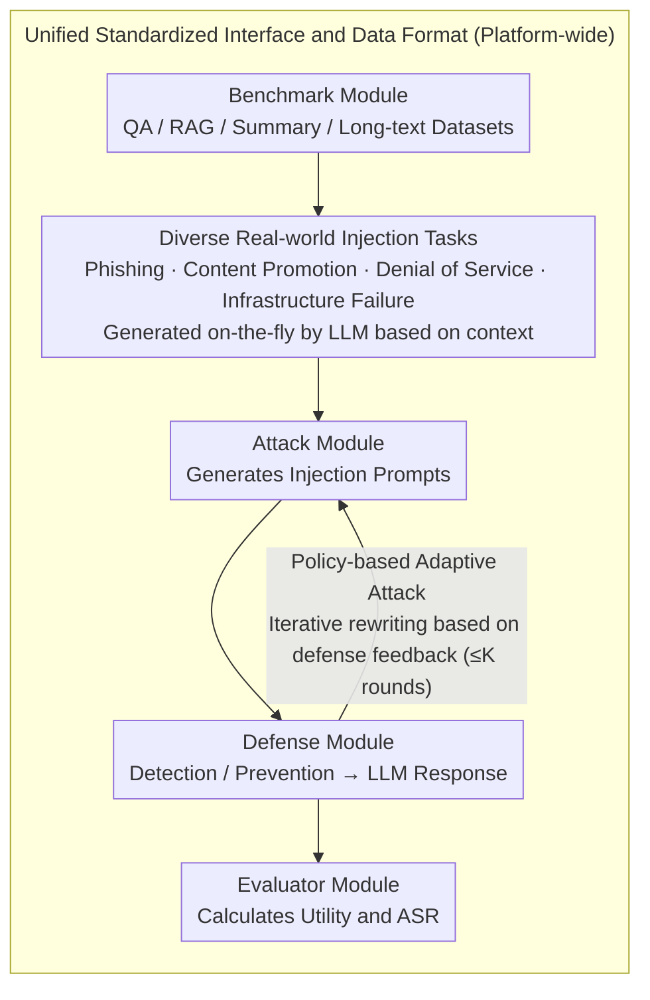

# PIArena: A Platform for Prompt Injection Evaluation

**Conference**: ACL 2026  
**arXiv**: [2604.08499](https://arxiv.org/abs/2604.08499)  
**Code**: [https://github.com/sleeepeer/PIArena](https://github.com/sleeepeer/PIArena)  
**Area**: LLM Evaluation  
**Keywords**: Prompt Injection Attack, Defense Evaluation Platform, Adaptive Attack, LLM Security, Benchmark Unification

## TL;DR
This paper proposes PIArena, a unified and extensible evaluation platform for Prompt Injection. It integrates multiple SOTA attack and defense methods, supports plug-and-play evaluation, and introduces a policy-based adaptive attack method. It systematically reveals key limitations of existing defenses in terms of generalization, adaptive attacks, and task alignment scenarios.

## Background & Motivation

**Background**: Prompt injection attacks are ranked by OWASP as the top security risk for LLM applications. Attackers inject malicious instructions into the context (e.g., webpages, documents) to manipulate the backend LLM into executing the attacker's desired tasks rather than the user's intended tasks. Existing research has proposed various attack (heuristic/optimization-based) and defense (detection-based/prevention-based) methods.

**Limitations of Prior Work**: (1) Lack of a unified platform—different attacks, defenses, and benchmarks have varying implementations and configurations, making fair comparison difficult; (2) Incomplete evaluation—many defenses are only evaluated under specific benchmarks and attacks, later proving to have limited effectiveness in other settings; (3) Static attacks—almost all existing benchmarks use fixed template attacks, failing to reflect real-world scenarios where attackers iteratively optimize based on defense feedback.

**Key Challenge**: The lack of a unified evaluation ecosystem leads to an overestimation of the true robustness of defense methods—high performance reported under "favorable" evaluation conditions fails to generalize to more diverse tasks and adaptive attack scenarios.

**Goal**: (1) Build a unified platform to achieve plug-and-play evaluation of attacks/defenses/benchmarks; (2) Design adaptive attack methods to test the true robustness of defenses; (3) Comprehensively reveal the limitations of existing defenses.

**Key Insight**: Upgrade evaluation from "individual experiments" to a "platform ecosystem," providing standardized data formats, unified interfaces, and an extensible architecture to lower the barrier for researchers to integrate and compare methods.

**Core Idea**: Unified Platform + Adaptive Attacks + Diverse Real-world Injection Tasks = Comprehensive stress testing of defense robustness.

## Method

### Overall Architecture
PIArena consists of four modules: (1) Benchmark module provides diverse datasets (QA, RAG, Summary, Long-text, etc.); (2) Attack module integrates multiple attack methods and generates injection prompts; (3) Defense module integrates detection-based and prevention-based defenses; (4) Evaluator module calculates Utility (task performance) and ASR (Attack Success Rate). All modules interact via unified APIs, supporting both independent and combined evaluations.

### Key Designs

**1. Unified Standardized Interface and Data Format: Enabling plug-and-play combination of attacks, defenses, and benchmarks**

The greatest engineering hurdle in prompt injection research is the inconsistency across benchmark formats and interfaces, necessitating rewrites for defenses and preventing fair comparisons. PIArena fixes the data sample structure—target_inst, context, injected_task, target_task_answer, injected_task_answer, category—and defines an attack interface as "input sample, output injection prompt," while the defense interface uniformly outputs LLM responses: detection defenses decide whether to intercept or pass the context, and prevention defenses generate safe responses directly.

With these unified interfaces, the evaluator applies the same metrics (Utility and ASR) across all defenses, allowing new methods to be "implemented once, evaluated everywhere." This layer provides the foundation for subsequent adaptive attacks and horizontal stress testing.

**2. Policy-based Adaptive Attack: Iterative rewriting of injection prompts based on black-box feedback to expose defense weaknesses**

Existing benchmarks rely on fixed template attacks, which may cause defenses to report overestimated robustness. PIArena's adaptive attack operates in two stages: Stage 1 involves candidate generation, using 10 rewriting strategies (e.g., masquerading as "Author's Note" or "System Update") to turn a base injection prompt into multiple candidates. Stage 2 involves feedback-guided optimization, iterating through three scenarios based on the defense's response—increasing stealth if detected, increasing command authority if ignored, or general optimization otherwise—for up to $K$ rounds.

Crucially, it uses "strategic semantic rewriting" rather than gradient optimization to achieve a cold start. Masquerades like "System Update" provide semantically plausible warm-start points that are more efficient than random perturbations and naturally ensure candidate diversity. The impact is significant: against PISanitizer on SQuAD, a static Combined attack yields an ASR of only 0.01, whereas the Strategy attack immediately surges to 0.85.

**3. Real-world Diverse Injection Task Design: Shifting attack goals from toy tasks to realistic abuse scenarios**

Existing benchmarks often use simple injection tasks detached from the context. However, real attackers design content that blends into the context, presenting a different level of defensive difficulty. PIArena designs four categories of realistic injection tasks: Phishing (inserting malicious links), Content Promotion (embedding ads or product recommendations), Denial of Service (disguising as exhausted API quotas or expired accounts), and Infrastructure Failure (disguising as memory overflows, database timeouts, or other system errors).

Each injection task is generated on-the-fly by an LLM based on the target context to ensure contextual relevance. This context-aware design reveals the paper's sharpest finding: when the injection task is of the same type as the target task (e.g., both are QA), the attack degenerates into a "misinformation" problem, where distinguishing legal instructions from malicious injections is fundamentally ambiguous for current defenses.

### Loss & Training
PIArena itself does not involve training. The adaptive attack uses an LLM as a rewriting engine, performing non-gradient, purely black-box operations.

## Key Experimental Results

### Main Results (SQuAD v2, GPT-4o Backend)

| Defense Method | Type | Utility (No Attack) | Combined ASR | Strategy ASR |
|---------|------|-------------|-------------|-------------|
| No Defense | - | 1.0 | 0.97 | 1.00 |
| PISanitizer | Prevention | 0.99 | 0.01 | 0.85 |
| SecAlign++ | Prevention | 0.84 | 0.01 | 0.09 |
| DataFilter | Prevention | 0.99 | 0.24 | 0.93 |
| PromptArmor | Prevention | 1.0 | 0.60 | 1.00 |
| PIGuard | Detection | 1.0 | 0.0 | 0.71 |
| Attn.Tracker | Detection | 0.61 | 0.0 | 0.0 |

### Ablation Study (Comparison of Attack Types)

| Attack Type | Characteristics | ASR (No Defense) | ASR (PISanitizer) |
|---------|------|-----------------|------------------|
| Direct | Direct command injection | 0.86 | 0.04 |
| Combined | Hybrid of multiple attacks | 0.97 | 0.01 |
| Strategy | Adaptive policy attack | 1.00 | 0.85 |

### Key Findings
- **Poor Generalization**: PISanitizer performs excellently on SQuAD with static attacks (ASR 0.01) but is extremely vulnerable to Strategy attacks where ASR surges to 0.85.
- **Closed-source Models are Vulnerable**: Models like GPT-5, Claude-Sonnet-4.5, and Gemini-3-Pro still exhibit high ASR under prompt injection.
- **Task Alignment is a Fundamental Challenge**: When the injected task type matches the target task (e.g., both are QA), current defenses struggle to distinguish between legitimate instructions and malicious injections.
- While the Attn.Tracker detection defense achieves ASR=0 across all attacks, its Utility is severely compromised (only 0.61) due to a high rate of false positives.

## Highlights & Insights
- **"Platform Thinking"** over "Method Thinking" is the primary contribution. Instead of proposing a single new defense, this work builds an ecosystem for fair and comprehensive evaluation. Such infrastructure is vital for the field's development.
- The **"Strategic Semantic Rewriting"** in adaptive attacks elegantly solves the cold-start problem for black-box optimization. Rewriting injection prompts into plausible context (e.g., "Editor's Note") is much more effective than random perturbations.
- The insight that **"Task-aligned scenarios are undefendable"** has profound implications—it highlights a fundamental ambiguity in distinguishing malicious intent when the injection mimics the expected input format.

## Limitations & Future Work
- Adaptive attacks still require LLMs as rewriting engines, which introduces cost considerations in large-scale evaluations.
- The current benchmark primarily covers text-based tasks; multimodal scenarios (e.g., injections embedded in images) are not yet addressed.
- While the defense of task-aligned scenarios is identified as a fundamental difficulty, the paper does not propose a specific solution.
- Evaluations are primarily based on the GPT-4o backend; further exploration of defense performance across different backend LLMs is needed.

## Related Work & Insights
- **vs BIPIA (Yi et al. 2025)**: BIPIA provides benchmark datasets and evaluates defenses but uses static attacks and lacks a unified interface; PIArena supports adaptive attacks and provides a plug-and-play toolkit.
- **vs AgentDojo (Debenedetti et al. 2024)**: AgentDojo targets Agent scenarios with complex configurations and lacks support for defense evaluation; PIArena covers general LLM tasks with a concise interface.

## Rating
- Novelty: ⭐⭐⭐⭐ The platform contribution model is innovative, and the adaptive attack design is clever.
- Experimental Thoroughness: ⭐⭐⭐⭐⭐ Extremely comprehensive, covering 7 defenses × multiple attacks × multiple benchmarks × closed-source models.
- Writing Quality: ⭐⭐⭐⭐ Clear structure and rigorous threat model definition, though the density of tables is slightly high.

<!-- RELATED:START -->

## Related Papers

- [\[ACL 2026\] ACIArena: Toward Unified Evaluation for Agent Cascading Injection](aciarena_toward_unified_evaluation_for_agent_cascading_injection.md)
- [\[ACL 2026\] MUSE: A Run-Centric Platform for Multimodal Unified Safety Evaluation of Large Language Models](muse_a_run-centric_platform_for_multimodal_unified_safety_evaluation_of_large_la.md)
- [\[ACL 2026\] Robustness via Referencing: Defending against Prompt Injection Attacks by Referencing the Executed Instruction](robustness_via_referencing_defending_against_prompt_injection_attacks_by_referen.md)
- [\[ACL 2026\] Know Thy Enemy: Securing LLMs Against Prompt Injection via Diverse Data Synthesis and Instruction-Level Chain-of-Thought Learning](know_thy_enemy_securing_llms_against_prompt_injection_via_diverse_data_synthesis.md)
- [\[ACL 2025\] Can Indirect Prompt Injection Attacks Be Detected and Removed?](../../ACL2025/llm_safety/indirect_prompt_injection_detection.md)

<!-- RELATED:END -->
