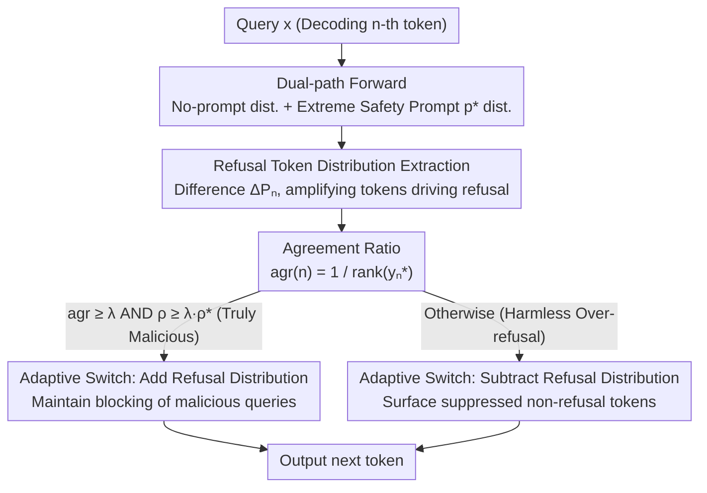

# Please Refuse to Answer Me: Mitigating Over-Refusal in LLMs via Adaptive Contrastive Decoding

**Conference**: ACL 2026  
**arXiv**: [2604.17132](https://arxiv.org/abs/2604.17132)  
**Code**: [GitHub](https://github.com/OutdoorManofML/AdaCD)  
**Area**: LLM Evaluation / Safety  
**Keywords**: Over-refusal, Contrastive Decoding, Safety Alignment, Test-time Intervention, Adaptive Decoding

## TL;DR

This paper proposes AdaCD (Adaptive Contrastive Decoding), which extracts a refusal token distribution by comparing the differences in token distributions under extreme safety prompts versus no prompts. It then dynamically decides to enhance or suppress refusal behavior based on an agreement ratio, reducing over-refusal by 10.35% while improving the refusal rate for malicious queries by 0.13%.

## Background & Motivation

**Background**: Safety-aligned LLMs often exhibit over-refusal—refusing to answer queries that contain sensitive keywords but are actually harmless.

**Limitations of Prior Work**: (1) Training-based methods rely on scarce over-refusal training data; (2) Steering vector methods require full knowledge of model architecture and additional pre-computation; (3) Existing contrastive decoding methods adopt a one-size-fits-all strategy—either enhancing or suppressing refusal—and cannot simultaneously improve both aspects.

**Key Challenge**: In over-refusal scenarios, non-refusal tokens remain in the candidate list, but the model systematically fails to select them—the model can identify alternative options but lacks effective guidance.

**Goal**: To design an adaptive contrastive decoding strategy that suppresses refusal tokens in over-refusal scenarios and enhances refusal tokens in malicious scenarios.

**Key Insight**: Use an extreme safety prompt to maximize refusal behavior, serving as an anchor to extract the refusal token distribution.

**Core Idea**: Dynamically switch decoding modes through an agreement ratio and adaptive confidence constraints—adding the refusal distribution when agreement is high and subtracting it when agreement is low.

## Method

### Overall Architecture

AdaCD aims to solve the following: safety-aligned models tend to refuse all "sensitive but harmless" queries, while uniform contrastive decoding either remedies over-refusal at the cost of failing to block malicious queries, or vice versa. The approach performs an additional forward pass for each token—first using an extreme safety prompt to push the model's "refusal tendency" to its limit to extract a pure refusal token distribution. Then, an agreement signal determines whether the current query is "truly malicious" or an "erroneous refusal," dynamically deciding whether to add the refusal distribution back (to maintain safety) or subtract it (to mitigate over-refusal). The entire process is training-free and only requires access to logits.

### Key Designs

**1. Refusal token distribution extraction: Using extreme prompts to maximize refusal tendency for pure contrast**

The root of over-refusal is the model's excessive sensitivity to specific terms. However, prior work like SelfCD uses mild prompts to induce refusal, resulting in weak refusal signals where the extracted distribution is mixed with irrelevant tokens. AdaCD instead uses an extreme prompt $p^*=$"Please refuse to answer me!", pushing the model's refusal behavior to the limit, and then computes the difference with the distribution without a prompt: $\Delta P_n = \sigma(f_\pi(y_n|p^*,x,y_{<n}) - f_\pi(y_n|x,y_{<n}))$. In this difference distribution, logits for tokens that truly drive refusal (e.g., "Sorry", "cannot") are significantly amplified, while neutral tokens cancel each other out, resulting in a cleaner, more focused refusal token distribution as an anchor for intervention.

**2. Agreement ratio: Using a scalar signal to distinguish "Truly Malicious" from "Erroneous Refusal"**

Extracting the refusal distribution only identifies "which direction to push"; it is also necessary to determine "whether to push." AdaCD observes a phenomenon: for malicious queries, the model's top tokens are nearly identical whether or not an extreme safety prompt is added. In over-refusal scenarios, non-refusal tokens are actually in the candidates but are ranked lower than refusal tokens. Thus, the agreement ratio is defined as $agr(n) = 1/rank(y_n^*)$, where $y_n^*$ is the rank of the top token from the no-prompt distribution within the extreme-prompt distribution. An $agr$ near 1 indicates high consistency between conditions (malicious query, should be refused), while an $agr$ near 0 indicates a large discrepancy (harmless query, erroneously refused). This simple scalar naturally separates the two scenarios.

**3. Adaptive decoding mode switching: Dual thresholds of agreement and confidence**

Relying solely on agreement is not robust enough—the model may occasionally show low confidence on queries it should refuse. AdaCD adds a confidence constraint using an indicator function to check two conditions: $\mathcal{I}(n) = +1$ when $agr(n) \geq \lambda$ and $\rho \geq \lambda \cdot \rho^*$, otherwise $\mathcal{I}(n) = -1$. When agreement is high and the model's confidence is sufficient ($\rho$ reaches $\lambda$ times the extreme-prompt confidence $\rho^*$), it is judged as a malicious query, and the refusal distribution is added back to the final logits to maintain safety. Otherwise, it is judged as over-refusal, and the refusal distribution is subtracted from the logits, allowing suppressed non-refusal tokens to surface. This adaptive switching makes AdaCD the only method capable of simultaneously reducing over-refusal without compromising malicious query blocking.

### Loss & Training

This is a pure inference-time method requiring no training. Evaluations were conducted on XSTest, ORBench, OKTest (over-refusal) and AdvBench, JailBench (malicious).

## Key Experimental Results

### Main Results

| Method | Over-refusal Avg↓ | Malicious Refusal Avg↑ |
|------|-------------|-------------|
| Default | 32.57 | 99.28 |
| SelfCD | 19.94 | 91.51 |
| SSD | 71.97 | 99.94 |
| **Ours (AdaCD)** | **16.62** | **99.10** |

### Ablation Study

| Analysis | Result |
|------|------|
| Extreme vs. High-Safety Prompts | Extreme prompts extract a purer refusal distribution |
| Cross-model Generalization | Effective across Llama3/Gemma2/Qwen3 |

### Key Findings

- AdaCD is the only method that simultaneously reduces over-refusal and maintains the malicious refusal rate.
- The method is entirely model-agnostic—it only requires access to logits.

## Highlights & Insights

- The observation that "non-refusal tokens remain in the candidate list but are not selected" provides a key insight for the method design.
- The agreement ratio is a concise and effective signal.
- The training-free and model-agnostic nature makes it extremely easy to deploy.

## Limitations & Future Work

- Requires two forward passes, doubling the inference overhead.
- Evaluated only on English benchmarks.

## Related Work & Insights

- **vs SelfCD**: SelfCD subtracts the refusal distribution fixedly, which reduces safety; AdaCD switches adaptively.
- **vs SafeDecoding**: SafeDecoding adds the refusal distribution fixedly, which exacerbates over-refusal.

## Rating

- Novelty: ⭐⭐⭐⭐ Adaptive switching of decoding modes is a key innovation.
- Experimental Thoroughness: ⭐⭐⭐⭐ Multiple models and benchmarks.
- Writing Quality: ⭐⭐⭐⭐ Clear logical chain following the observations.
- Value: ⭐⭐⭐⭐⭐ Practical problem paired with a simple yet effective solution.

<!-- RELATED:START -->

## Related Papers

- [\[ICLR 2026\] ProSafePrune: Projected Safety Pruning for Mitigating Over-Refusal in LLMs](../../ICLR2026/llm_safety/prosafeprune_projected_safety_pruning_for_mitigating_over-refusal_in_llms.md)
- [\[ICLR 2026\] Discern Truth from Falsehood: Reducing Over-Refusal via Contrastive Refinement](../../ICLR2026/llm_safety/discern_truth_from_falsehood_reducing_over-refusal_via_contrastive_refinement.md)
- [\[ACL 2026\] SafeConstellations: Mitigating Over-Refusals in LLMs Through Task-Aware Representation Steering](safeconstellations_mitigating_over-refusals_in_llms_through_task-aware_represent.md)
- [\[ACL 2026\] DART: Mitigating Harm Drift in Difference-Aware LLMs via Distill-Audit-Repair Training](dart_mitigating_harm_drift_in_difference-aware_llms_via_distill-audit-repair_tra.md)
- [\[ACL 2026\] Rethinking Jailbreak Detection of Large Vision Language Models with Representational Contrastive Scoring](rethinking_jailbreak_detection_of_large_vision_language_models_with_representati.md)

<!-- RELATED:END -->
