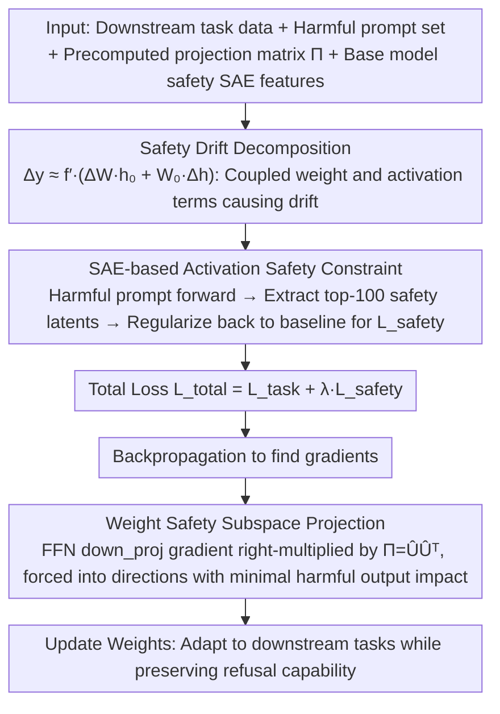

# Preventing Safety Drift in Large Language Models via Coupled Weight and Activation Constraints

**Conference**: ACL 2026  
**arXiv**: [2604.12384](https://arxiv.org/abs/2604.12384)  
**Code**: No public code  
**Area**: Model Compression / LLM Safety  
**Keywords**: safety drift, harmful fine-tuning, sparse autoencoder, weight subspace, activation constraints

## TL;DR

Ours proposes CWAC, which simultaneously constrains weight update directions and safety-critical activation features during fine-tuning, demonstrating theoretically and experimentally that constraining weights or activations alone is insufficient to prevent LLM safety drift.

## Background & Motivation

**Background**: Safety-aligned models are fragile during downstream fine-tuning. Even when fine-tuning data appears to be benign tasks like sentiment classification, news categorization, or mathematical reasoning, the original refusal capability can be undermined. Existing defenses include freezing safety layers, adding safety samples, limiting weight drift, activation steering, or post-finetuning repair.

**Limitations of Prior Work**: Many methods focus on only one level: either limiting parameter updates to keep the model close to the original weights, or constraining activations to keep internal representations safe on harmful inputs. This paper argues that such single-point constraints have vulnerabilities, as the model can create bypasses through the unconstrained side.

**Key Challenge**: Safety behavior results from the coupling of weights and activations. Minimal weight change does not guarantee that activations will not be shifted by the fine-tuned task distribution; similarly, stable activations on reference samples do not guarantee that weights will not produce dangerous outputs on unseen harmful inputs.

**Goal**: Construct a defense mechanism during fine-tuning that maintains downstream task accuracy while preserving the original model's refusal capability for harmful prompts, remaining robust across multiple models, tasks, and scenarios containing harmful samples.

**Key Insight**: The authors first decompose layer output drift into a weight drift term and an activation drift term using a first-order approximation, subsequently designing a dual protection of "weight safety subspace + activation safety constraints."

**Core Idea**: Project weight gradients into a safety subspace that does not affect refusal outputs for harmful prompts, while using a Sparse Autoencoder (SAE) to lock safety-related sparse activation features, ensuring fine-tuning occurs only within regions that do not destroy safety representations.

## Method

### Overall Architecture

The input for CWAC includes downstream task data, a set of harmful prompts, precomputed weight projection matrices for each layer, and safety-critical SAE features of the base model on harmful prompts. During fine-tuning, the model minimizes task loss while re-performing forward passes on harmful prompts to extract safety features, pulling current safety features back to the base model features. Simultaneously, gradients of specific FFN output projection layers are right-multiplied by a projection matrix to ensure weight updates fall within the safety subspace.

### Key Designs

**1. Safety Drift Decomposition: Formalizing "Why single constraints fail" into two error terms**

Many defenses focus only on weights or activations; this paper clarifies why this is insufficient. It uses a first-order approximation of a layer's output $y=f(Wh)$ to decompose the fine-tuned output drift into two terms: $\Delta y\approx f'(W_0h_0)\odot(W_0\Delta h+\Delta W h_0)$. Here, $\Delta W h_0$ represents drift caused by weight changes, while $W_0\Delta h$ represents drift caused by activation changes. This decomposition exposes the vulnerability of single-point constraints—if only $\Delta W$ is suppressed, activations can still be shifted by the task distribution; if only $\Delta h$ on reference samples is suppressed, weights can still cause dangerous outputs on unseen harmful inputs. Since both terms jointly determine safety behavior, both must be controlled—forming the theoretical basis for CWAC’s dual constraints.

**2. SAE-based Activation Safety Constraint: Locking refusal-related sparse dimensions without freezing entire activations**

To preserve safety representations at the activation level during fine-tuning, directly constraining the entire activation vector would likely hinder downstream task learning. CWAC uses a Sparse Autoencoder for precise localization: it first trains a TopK SAE to decompose residual stream activations into sparse interpretable features (SAE corpus includes ~100M tokens, 30% from OpenWebText2, 70% from harmful prompts correctly refused by the base model). Before fine-tuning, it records the base model's safety-critical features $z^{baseline}$ on harmful prompts. During fine-tuning, a regularization term pulls current features back to the baseline:

$$L_{safety}=\frac{1}{B}\sum_b\|z_b^{current}-z_b^{baseline}\|^2$$

Crucially, this term only constrains the top safety-critical latents (defaulting to the top 100) rather than the entire activation. By compressing "safety preservation" into a few refusal-related dimensions, the task learning can still adapt freely in other dimensions, decoupling safety preservation and task adaptation.

**3. Weight Safety Subspace Projection: Squeezing gradient updates into directions with minimal impact on harmful prompt outputs**

While activation constraints manage reference samples, the weight side must also be secured to prevent drift on unseen inputs. CWAC collects the input matrix $X_l$ for each FFN output projection layer when the base model processes harmful prompts. The goal is for updates to satisfy $\Delta W_lX_l\approx0$, meaning weight changes should not occur in directions that alter safety outputs for harmful prompts. Operating directly on $X_l$ is computationally expensive, so the method instead computes the covariance $C_l=X_lX_l^T$. After SVD, the directions corresponding to small eigenvalues form $\hat U_l$. Defining the projection matrix as $\Pi_l=\hat U_l\hat U_l^T$, gradients are right-multiplied during training: $\Delta W_l\leftarrow\Delta W_l\Pi_l$. The subspace of small eigenvalues has the least impact on safety outputs for harmful prompts. Limiting updates to this space preserves learning capacity for downstream tasks while avoiding the destruction of refusal behavior. Selecting the FFN down_proj for projection is intentional—it acts as the bottleneck for writing back to the residual stream, making it more direct than gate/up projections and more efficient than full-layer projection.

### Loss & Training

The total objective is $L_{total}=L_{task}+\lambda L_{safety}$, with safety subspace projection applied to FFN down_proj gradients before updates. Default experiments use full-parameter fine-tuning, AdamW, 3 epochs, batch size of 1, max sequence length of 512, and a learning rate of $2\times10^{-5}$, with 5,000 samples per benign task. Activation constraints retain the top 100 safety-critical latents with $\lambda=0.5$. Offline costs include ~6.5 hours for SAE training and ~18 minutes for SVD precomputation on Llama-2-7B. Fine-tuning takes ~44-46 minutes per epoch, representing less than a 10% overhead compared to standard SFT (~42 minutes).

## Key Experimental Results

### Main Results

**Average performance across SST-2 / AGNEWS / GSM8K: Higher FA is better, Lower HS is safer**

| Model | Method | Avg FA↑ | Avg HS↓ |
|------|------|----------|----------|
| Llama-2-7B | SFT | 85.04 | 52.45 |
| Llama-2-7B | ASFT | 78.12 | 18.88 |
| Llama-2-7B | CWAC | 85.12 | 10.81 |
| Llama-3-8B | SFT | 87.16 | 66.03 |
| Llama-3-8B | ASFT | 73.75 | 17.64 |
| Llama-3-8B | CWAC | 87.78 | 9.77 |
| Mistral-7B | SFT | 85.75 | 64.45 |
| Mistral-7B | ASFT | 74.28 | 33.70 |
| Mistral-7B | CWAC | 85.61 | 24.22 |
| Gemma-2-9B | SFT | 90.74 | 42.23 |
| Gemma-2-9B | ASFT | 86.43 | 29.49 |
| Gemma-2-9B | CWAC | 91.59 | 10.05 |

**Generalization on PubMedQA and AlpacaEval**

| Model | Method | FA↑ | HS↓ | AE↑ |
|------|------|-----|-----|-----|
| Llama-2-7B | SFT | 93.81 | 46.75 | 34.51 |
| Llama-2-7B | CWAC | 94.52 | 7.24 | 34.37 |
| Llama-3-8B | SFT | 95.24 | 53.10 | 38.07 |
| Llama-3-8B | CWAC | 95.52 | 8.65 | 36.75 |
| Mistral-7B | SFT | 64.53 | 60.72 | 28.63 |
| Mistral-7B | CWAC | 90.72 | 15.39 | 30.64 |
| Gemma-2-9B | SFT | 93.45 | 48.97 | 42.53 |
| Gemma-2-9B | CWAC | 95.20 | 12.55 | 43.57 |

### Ablation Study

**Robustness under different harmful sample injection ratios in SST-2, Llama-2-7B**

| Method | p=0.05 HS↓ | p=0.1 HS↓ | p=0.2 HS↓ | p=0.5 HS↓ | Avg HS↓ | Avg FA↑ |
|------|------------|-----------|-----------|-----------|----------|----------|
| SFT | 72.70 | 78.92 | 74.90 | 82.02 | 73.17 | 94.07 |
| ASFT | 38.50 | 39.90 | 43.60 | 45.82 | 38.22 | 93.22 |
| CWAC | 10.50 | 20.03 | 22.57 | 30.78 | 18.73 | 94.35 |

**Component ablation of weight and activation constraints, Average results**

| Model | Method | Avg FA↑ | Avg HS↓ |
|------|------|----------|----------|
| Llama-2-7B | Weight-only | 80.11 | 17.82 |
| Llama-2-7B | Activation-only | 82.91 | 19.57 |
| Llama-2-7B | CWAC | 84.39 | 12.75 |
| Llama-3-8B | Weight-only | 81.04 | 17.11 |
| Llama-3-8B | Activation-only | 80.45 | 19.02 |
| Llama-3-8B | CWAC | 85.89 | 10.89 |
| Gemma-2-9B | Weight-only | 82.79 | 17.01 |
| Gemma-2-9B | Activation-only | 82.51 | 19.97 |
| Gemma-2-9B | CWAC | 87.67 | 10.07 |

### Key Findings
- CWAC maintains or improves downstream FA across four 7B-9B models while significantly reducing HS. Most notably, on Llama-3-8B, the average HS drops from 66.03 (SFT) to 9.77.
- Compared to defenses like ASFT, SafeInstr, and SPPFT, CWAC’s advantage lies in its balance between safety and task performance rather than just safety alone.
- When the ratio of harmful samples increases to 0.5, CWAC maintains an HS of 30.78, remaining lower than ASFT’s 45.82 while keeping FA around 94.06.
- Component ablation shows that while both weight-only and activation-only constraints are effective, the full CWAC is required to consistently achieve the lowest HS, supporting the core argument that coupled constraints are necessary.

## Highlights & Insights
- The most valuable part of the paper is the safety drift decomposition: it explains why weight-only and activation-only approaches fail individually, ensuring CWAC is more than just an empirical combination.
- The use of SAE constraints to lock only safety-critical latents instead of the entire activation vector is critical; otherwise, safety regularization would likely stifle downstream task learning.
- Selecting the FFN down_proj for projection is justifiable, as it is the bottleneck for writing back to the residual stream, offering a more direct intervention than gate/up projections and being more efficient than full-layer projection.
- The design of CWAC is well-suited for integration with PEFT: although the paper defaults to full-parameter fine-tuning, the concept of "projection update + activation regularization" can be transferred to LoRA subspaces or adapter updates.

## Limitations & Future Work
- The method requires white-box access to weights, gradients, and intermediate activations, making it inapplicable to closed-source API models.
- Activation constraints depend on SAE quality; poor reconstruction or uninterpretable safety features will affect protection when choosing top latents.
- Experiments primarily cover 7B-9B instruction-tuned models and have yet to verify stability on larger models, MoE architectures, or different alignment pipelines.
- Current safety evaluations focus on explicit harmful prompts and refusal capabilities, with insufficient coverage of indirect jailbreaks, stealthy violations, or safety drift in agentic toolchains.

## Related Work & Insights
- **vs ASFT**: ASFT limits fine-tuning drift via safety direction anchoring. Ours further adds activation-level SAE regularization, covering activation bypasses that weight constraints alone cannot handle.
- **vs SPPFT / Safety Layer Freezing**: Freezing safety layers is simple but may lose task adaptability. CWAC allows updates but projects them into directions with minimal impact on safety prompts.
- **vs Activation Steering**: Many steering methods modify activations during inference. CWAC uses activation regularization during training to preserve refusal features, making it more suitable for scenarios requiring fine-tuned deployment.
- **Insight**: If properties like privacy, honesty, and copyright compliance can be mapped to interpretable SAE features, the "weight subspace + activation locking" framework could be extended to more alignment attributes.

## Rating
- Novelty: ⭐⭐⭐⭐ Theoretical decomposition combined with dual-level constraints is solid; while borrowing from SAE and subspace projection, the combined goal is clear.
- Experimental Thoroughness: ⭐⭐⭐⭐⭐ Comprehensive across four models, multiple downstream tasks, generalization tasks, harmful ratios, learning rates, and component ablations.
- Writing Quality: ⭐⭐⭐⭐ The methodological chain is clear and the derivations serve the design, though some experimental details and table explanations are dense.
- Value: ⭐⭐⭐⭐ Direct value for safe fine-tuning of open-source models, especially for those needing to retain refusal capabilities in enterprise or research deployments.

<!-- RELATED:START -->

## Related Papers

- [\[ACL 2026\] Compiling Activation Steering into Weights via Null-Space Constraints for Stealthy Backdoors](compiling_activation_steering_into_weights_via_null-space_constraints_for_stealt.md)
- [\[ICML 2025\] Learning Safety Constraints for Large Language Models](../../ICML2025/llm_safety/learning_safety_constraints_for_large_language_models.md)
- [\[ACL 2026\] MUSE: A Run-Centric Platform for Multimodal Unified Safety Evaluation of Large Language Models](muse_a_run-centric_platform_for_multimodal_unified_safety_evaluation_of_large_la.md)
- [\[ACL 2026\] AutoRAN: Automated Hijacking of Safety Reasoning in Large Reasoning Models](autoran_automated_hijacking_of_safety_reasoning_in_large_reasoning_models.md)
- [\[ACL 2026\] Seeing No Evil: Blinding Large Vision-Language Models to Safety Instructions via Adversarial Attention Hijacking](seeing_no_evil_blinding_large_vision-language_models_to_safety_instructions_via_.md)

<!-- RELATED:END -->
## Related Papers

- [\[ACL 2026\] Compiling Activation Steering into Weights via Null-Space Constraints for Stealthy Backdoors](compiling_activation_steering_into_weights_via_null-space_constraints_for_stealt.md)
- [\[ICML 2025\] Learning Safety Constraints for Large Language Models](../../ICML2025/llm_safety/learning_safety_constraints_for_large_language_models.md)
- [\[ACL 2026\] MUSE: A Run-Centric Platform for Multimodal Unified Safety Evaluation of Large Language Models](muse_a_run-centric_platform_for_multimodal_unified_safety_evaluation_of_large_la.md)
- [\[ACL 2026\] AutoRAN: Automated Hijacking of Safety Reasoning in Large Reasoning Models](autoran_automated_hijacking_of_safety_reasoning_in_large_reasoning_models.md)
- [\[ACL 2026\] Seeing No Evil: Blinding Large Vision-Language Models to Safety Instructions via Adversarial Attention Hijacking](seeing_no_evil_blinding_large_vision-language_models_to_safety_instructions_via_.md)

<!-- RELATED:END -->
