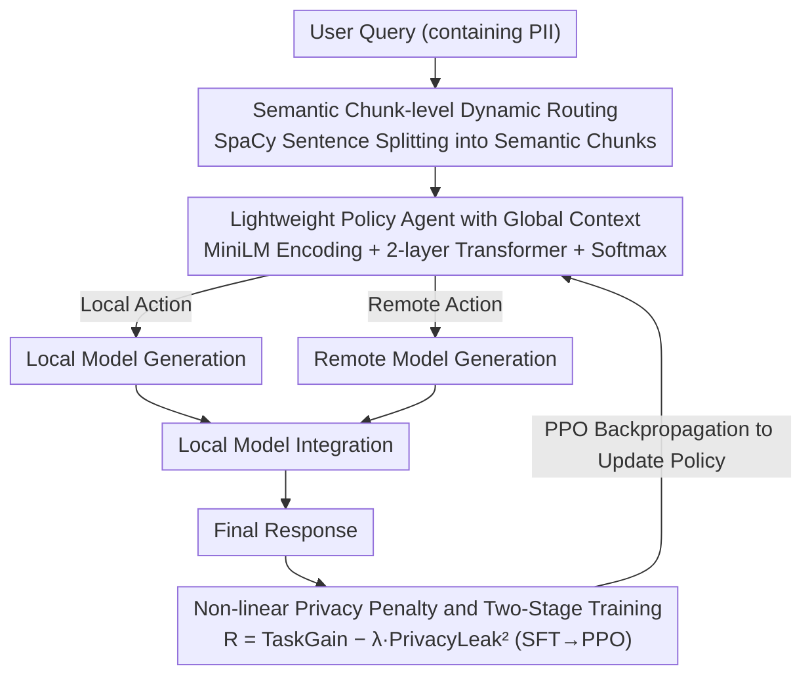

# Privacy-R1: Privacy-Aware Multi-LLM Agent Collaboration via Reinforcement Learning

**Conference**: ACL 2026  
**arXiv**: [2510.16054](https://arxiv.org/abs/2510.16054)  
**Code**: [GitHub](https://github.com/zackhuiiiii/Privacy-R1)  
**Area**: LLM Security / Privacy Protection / Multi-LLM Collaboration  
**Keywords**: Privacy Delegation, PII Leakage, Dynamic Routing, Reinforcement Learning, Multi-LLM Collaboration

## TL;DR
Privacy-R1 models the local/remote model delegation for privacy-sensitive queries as a sentence-level sequential decision task. Using a lightweight Transformer policy optimized via PPO, it learns a dynamic trade-off between privacy and task quality, achieving a superior quality-leakage frontier on both PUPA and the high-PII-density Med-PCD datasets compared to static rewriting methods.

## Background & Motivation

**Background**: Many practical LLM applications require choosing between a small local model and a powerful remote model. Remote models are highly capable, but user prompts may contain Personal Identifiable Information (PII) such as names, hospitals, dates, and medical record numbers. Local models are more controllable but less capable, often leading to reduced response quality.

**Limitations of Prior Work**: Existing Privacy-Conscious Delegation methods mostly employ static prompt rewriting, where PII in the entire user query is generalized or deleted before being sent to the remote model. This approach faces two issues: first, it disrupts coreference relations and discourse coherence; second, it may remove critical information required for the task, preventing the remote model from completing it.

**Key Challenge**: Not all PII serves the same purpose. Some identity information is merely a replaceable privacy burden that should remain local; however, other information directly determines task semantics, and complete masking causes a collapse in utility. Static rewriting cannot distinguish between these two types of information.

**Goal**: To train a lightweight policy agent that decides at the sub-prompt/sentence granularity which content is processed by the local model and which can be delegated to the remote model, thereby simultaneously controlling privacy leakage and response quality.

**Key Insight**: The authors view the delegation process as sequential decision-making rather than a one-time text transformation. After reading the context of the entire query, the policy model selects "local" or "remote" for each semantic chunk, optimized by both task success rewards and privacy leakage penalties.

**Core Idea**: Use RL to learn a dynamic routing policy that determines "when it is worth incurring a privacy cost," allowing the model to implicitly identify replaceable PII versus task-critical PII within the context.

## Method

### Overall Architecture
Privacy-R1 takes a user query potentially containing PII as input and produces a final response. The system first segments the query into semantically complete chunks using SpaCy sentence splitting. A policy agent then selects either the local or remote model for each chunk. The assigned models generate intermediate outputs, which are finally integrated by the local model to produce the final answer. The process does not aim for complete anonymization but rather focuses on the decision of "which information should remain on which model side." During training, the routing policy is pushed toward a better privacy-quality frontier using a two-stage approach (SFT and PPO) with a quadratic privacy leakage penalty.

### Key Designs

**1. Semantic chunk-level dynamic routing: Replacing full rewriting with sentence-level "keep local or send remote" decisions**

The fundamental problem with static rewriting is its coarse granularity. In medical or financial scenarios, PII is densely distributed and cross-referenced; whole-paragraph generalization easily breaks critical logic chains. Privacy-R1 switches to fine-grained routing: using SpaCy to segment queries into sentence-level chunks, where each chunk has only two actions—assigned to the secure but weaker local model, or the strong but untrusted remote model. For example, in the sentence "Patient Zhang, ID 12345, complains of chest pain for three days," the part containing replaceable identity burdens can stay local, while the description "chest pain for three days," which determines task semantics, is worth sending to the remote model. This allows the system to manage local trade-offs of "whether this sentence should be sent" while preserving the utility of task-critical context.

**2. Lightweight policy agent with global context: Allowing each chunk decision to see the entire query**

Sentence-level decisions cannot be made in isolation. Whether an entity is indispensable to a task often depends on cross-sentence relationships—a pronoun later in the text might refer to a patient or location mentioned earlier. An MLP router without context cannot make these judgments. The policy agent first extracts embeddings for each chunk using a frozen MiniLM, adds positional encodings, and feeds them into a 2-layer Transformer encoder to obtain contextualized representations $h_t$. Categorical probabilities for local/remote are then output via a shared linear layer and softmax. This lightweight Transformer layer upgrades routing from "looking at sentences in isolation" to "judging the task value of information within a global context."

**3. Non-linear privacy penalty and two-stage training: Using quadratic penalties to suppress tail risks of catastrophic leakage**

The reward function must express the competition between "quality gain" and "privacy risk" without focusing solely on averages. Privacy-R1 designs the reward as:

$$R = TaskGain - \lambda \cdot PrivacyLeak^2$$

Where $TaskGain$ is determined by an LLM-as-a-judge checking if the final response matches the target quality of using the full query with the remote model, and $PrivacyLeak$ is the proportion of PII actually sent to the remote model. The key is the quadratic term: under a linear penalty, the model might look good on average metrics while allowing massive leakage in a few samples. The quadratic term ensures high-leakage samples receive disproportionately heavier penalties, thereby lowering the probability of catastrophic leakage (reducing Catastrophic Leaks from 16.2 to 1.1 in ablations). Training is split into two stages: SFT warm-up using heuristic labels (PII chunks go local, others go remote) to provide a reasonable initialization, followed by PPO fine-tuning to push the policy toward the optimal privacy-quality frontier.

### Loss & Training
During the SFT stage, the policy agent is trained as a binary classifier, optimizing a per-chunk BCE loss. In the RL stage, PPO is employed with the routing policy as the actor and a feed-forward value network as the critic. Episodic rewards are calculated after each rollout of a complete query, and the policy is updated using the advantage. The default $\lambda=5.0$, SFT learning rate is $3\times10^{-4}$, PPO learning rate is $1\times10^{-5}$, with a maximum of 256 steps. Experiments were conducted on H200 GPUs.

## Key Experimental Results

### Main Results
The authors evaluated Quality Preservation and Privacy Leakage on PUPA-TNB and the self-constructed Med-PCD. The remote model was fixed as GPT-4o-mini, while local models ranged from 1B to 8B parameters.

| Local Model | Dataset | PAPILLON Quality / Leakage | Privacy-R1 Quality / Leakage | Change vs. PAPILLON |
|-------------|---------|---------------------------|------------------------------|---------------------|
| Llama-3.2-1B| PUPA-TNB| 58.0 / 39.3               | 62.5 / 25.0                  | Quality +4.5, Leakage -14.3 |
| Llama-3.2-1B| Med-PCD | 45.1 / 42.5               | 75.3 / 18.2                  | Quality +30.2, Leakage -24.3 |
| Llama-3.2-3B| Med-PCD | 58.5 / 28.1               | 81.0 / 15.4                  | Quality +22.5, Leakage -12.7 |
| Llama-3.1-8B| Med-PCD | 82.0 / 9.2                | 89.5 / 5.1                   | Quality +7.5, Leakage -4.1  |
| Mistral-7B  | Med-PCD | 74.5 / 14.0               | 87.9 / 9.5                   | Quality +13.4, Leakage -4.5 |
| Qwen2-7B    | Med-PCD | 76.2 / 18.5               | 88.4 / 12.0                  | Quality +12.2, Leakage -6.5 |

### Ablation Study
Ablations focused on Med-PCD with the Qwen2-7B local model, verifying the importance of state modeling and non-linear rewards.

| Configuration | Quality (%) ↑ | Leakage / Catastrophic Leaks ↓ | Description |
|---------------|---------------|--------------------------------|-------------|
| Stateless Router (MLP) | 75.2 | Leakage 11.5 | Views chunks independently; lacks cross-sentence context |
| Stateful Router | 88.4 | Leakage 12.0 | Transformer policy significantly improves quality |
| Linear Penalty | 88.1 | Catastrophic Leaks 16.2 | Similar average quality, but many high-leakage samples |
| Quadratic Penalty | 88.4 | Catastrophic Leaks 1.1 | Dramatically reduces catastrophic leakage |

### Privacy-Utility Trade-off

| $\lambda$ | Quality (%) ↑ | Leakage (%) ↓ | Interpretation |
|-----------|---------------|----------------|----------------|
| 1.0       | 90.1          | 15.5           | Biased toward utility; higher leakage |
| 2.0       | 89.6          | 13.8           | Slight quality drop; better privacy |
| 5.0       | 88.4          | 12.0           | Default trade-off point |
| 10.0      | 84.7          | 5.3            | Clearly conservative |
| 20.0      | 79.2          | 1.2            | Near-zero leakage; significant quality loss |

### Key Findings
- Privacy-R1 outperforms PAPILLON across all local model settings, with even greater improvements on Med-PCD, indicating that high-PII-density scenarios necessitate dynamic policies.
- The weaker the local model, the more critical the routing policy; the 1B local model quality improved from 45.1% with PAPILLON to 75.3% on Med-PCD.
- The improvement from the Stateful Transformer primarily stems from modeling cross-sentence dependencies, especially useful for handling coreferences and contextual constraints in medical narratives.
- The value of the quadratic privacy penalty is not just in lowering average leakage, but in significantly reducing the tail risk where "a few samples leak too much."

## Highlights & Insights
- Explicitly modeling privacy delegation as a sequential decision task is natural and avoids the static "rewrite then call" pipeline. This perspective is also suitable for expansion to model selection, cost control, and latency management.
- The construction of Med-PCD is highly targeted: starting from MedDialog and injecting synthetic PII resulted in 1020 high-density medical privacy samples, with a 98.8% pass rate and 0.89 Fleiss' Kappa via human validation of 240 samples.
- $\lambda$ serves as a practical risk-preference knob. It is not just a parameter to tune but allows system developers to choose conservative or aggressive strategies based on the sensitivity of the scenario.
- The paper honestly acknowledges that Privacy-R1 is a risk mitigation framework rather than a formal privacy guarantee. This is crucial for high-risk deployment decisions.

## Limitations & Future Work
- Current experiments involve single-turn queries; policy state is not maintained across multi-turn dialogues. In real medical or legal consultations, the cumulative privacy risk of multi-turn context is more complex.
- The action space consists of only one local and one remote model, without considering differences in capability, cost, latency, and privacy levels among multiple remote/local models.
- Med-PCD uses synthetically injected PII; while human-validated, it may still differ from the privacy distribution in real institutional texts.
- TaskGain relies on an LLM judge and may inherit the judge's biases; if the target response itself contains unnecessary sensitive information, the reward will encourage the policy to mimic that behavior.
- The method reduces leakage risk but cannot guarantee zero leakage; scenarios requiring absolute non-disclosure still need rule-based constraints or formal safety boundaries.

## Related Work & Insights
- **vs. PAPILLON**: PAPILLON statically rewrites the entire query, whereas Privacy-R1 uses chunk-level dynamic routing; the former is secure but prone to semantic damage, while the latter preserves task-critical context.
- **vs. NER/redaction systems**: Traditional NER only determines if an entity is sensitive; Privacy-R1 further determines if a sensitive entity is useful for the task.
- **vs. Multi-LLM collaboration systems**: Common collaboration systems strive for complementary capabilities; this work integrates privacy costs into collaboration goals, providing a clear paradigm for "secure agent dispatchers."

## Rating
- Novelty: ⭐⭐⭐⭐ Mapping privacy delegation to an RL routing problem is inspiring, and the reward design fits the risk profile.
- Experimental Thoroughness: ⭐⭐⭐⭐ Two datasets, various local models, and complete ablations on state/reward/risk preference, although multi-turn and multi-model action spaces are not yet covered.
- Writing Quality: ⭐⭐⭐⭐ Clear motivation and direct table organization; minor layout issues in some formulas and naming.
- Value: ⭐⭐⭐⭐⭐ Highly practical reference for privacy trade-offs in hybrid local-cloud LLM systems.

<!-- RELATED:START -->

## Related Papers

- [\[AAAI 2026\] PRISM: Privacy-Aware Routing for Adaptive Cloud-Edge LLM Inference via Semantic Sketch Collaboration](../../AAAI2026/llm_safety/prism_privacy-aware_routing_for_adaptive_cloud-edge_llm_inference_via_semantic_s.md)
- [\[ACL 2026\] MemoPhishAgent: Memory-Augmented Multi-Modal LLM Agent for Phishing URL Detection](memophishagent_memory-augmented_multi-modal_llm_agent_for_phishing_url_detection.md)
- [\[ICLR 2026\] A2ASecBench: A Protocol-Aware Security Benchmark for Agent-to-Agent Multi-Agent Systems](../../ICLR2026/llm_safety/a2asecbench_a_protocol-aware_security_benchmark_for_agent-to-agent_multi-agent_s.md)
- [\[ACL 2026\] Privacy Collapse: Benign Fine-Tuning Can Break Contextual Privacy in Language Models](privacy_collapse_benign_fine-tuning_can_break_contextual_privacy_in_language_mod.md)
- [\[ACL 2025\] Unveiling Privacy Risks in LLM Agent Memory](../../ACL2025/llm_safety/mextra_agent_memory_privacy.md)

<!-- RELATED:END -->
