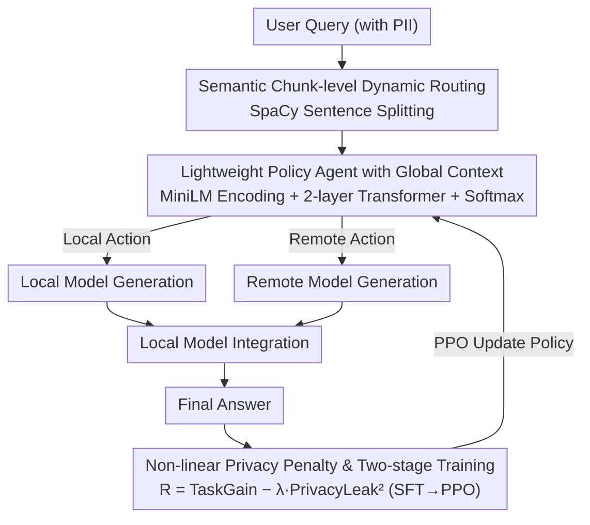

# Privacy-R1: Privacy-Aware Multi-LLM Agent Collaboration via Reinforcement Learning

**Conference**: ACL 2026  
**arXiv**: [2510.16054](https://arxiv.org/abs/2510.16054)  
**Code**: [GitHub](https://github.com/zackhuiiiii/Privacy-R1)  
**Area**: LLM Safety / Privacy Protection / Multi-Model Collaboration  
**Keywords**: Privacy Delegation, PII Leakage, Dynamic Routing, Reinforcement Learning, Multi-LLM Collaboration

## TL;DR
Privacy-R1 models the delegation problem between local and remote models for privacy-sensitive queries as a sentence-by-sentence sequential decision-making task. By utilizing a lightweight Transformer policy optimized via PPO, it learns a dynamic trade-off between privacy and task quality. It achieves a superior quality-leakage frontier compared to static rewriting methods on both PUPA and the high-PII-density Med-PCD datasets.

## Background & Motivation

**Background**: Many practical LLM applications require choosing between local small models and remote powerful models. Remote models offer superior capabilities, but user prompts may contain Personal Identifiable Information (PII) such as names, hospitals, dates, and medical record numbers. Local models are more controllable but weaker in capability, often leading to reduced response quality.

**Limitations of Prior Work**: Existing Privacy-Conscious Delegation methods mostly adopt static prompt rewriting, where PII in the entire user query is generalized or redacted before being sent to the remote model. This approach has two main issues: first, it breaks coreference relationships and discourse coherence; second, it often removes critical information necessary for the task, preventing the remote model from completing it effectively.

**Key Challenge**: Not all PII is of equal utility. Some identity information is merely a replaceable privacy burden that should remain local, while other information directly determines the task semantics, where complete masking leads to utility collapse. Static rewriting fails to distinguish between these two categories.

**Goal**: To train a lightweight policy agent that decides at the sub-prompt or sentence level which content should be processed by the local model and which can be delegated to the remote model, thereby controlling both privacy leakage and response quality simultaneously.

**Key Insight**: The authors view the delegation process as a sequential decision-making task rather than a one-time text transformation. The policy model reads the global context of the query and selects either local or remote for each semantic chunk, optimized by both task success rewards and privacy leakage penalties.

**Core Idea**: Use RL to learn a dynamic routing strategy that determines "when it is worth incurring a privacy cost," allowing the model to implicitly identify replaceable PII versus task-critical PII within context.

## Method

### Overall Architecture
Privacy-R1 takes a user query potentially containing PII as input and produces a final response. The system first segments the query into semantically complete chunks using SpaCy sentence splitting. A policy agent then selects either a local or remote model for each chunk. The assigned models generate intermediate outputs, which are finally integrated by the local model to produce the final answer. The process focuses on deciding "where information should reside" rather than full anonymization. The routing strategy is optimized through SFT and PPO to reach a better privacy-quality frontier using a reward function with a quadratic privacy leakage penalty.

### Key Designs

**1. Semantic Chunk-level Dynamic Routing: Replacing global rewriting with sentence-by-sentence "local vs. remote" decisions**

The fundamental problem with static rewriting is coarse granularity—in medical and financial scenarios, PII is dense and interconnected. Global generalization often breaks critical information chains. Privacy-R1 employs fine-grained routing: dividing the query into sentence-level chunks, each with two possible actions—delegating to a secure but weaker local model or an untrusted but powerful remote model. For example, in the sentence "Patient Zhang, ID 12345, complains of persistent chest pain for three days," the part containing replaceable identity burdens stays local, while the "chest pain" description, which determines task semantics, is sent to the remote model.

**2. Lightweight Policy Agent with Global Context: Allowing each chunk decision to see the entire query**

Sentence-by-sentence decisions cannot be made in isolation because the importance of an entity often depends on cross-sentence relationships. A context-free MLP router cannot determine if a pronoun refers to a previously mentioned patient or location. The policy agent uses a frozen MiniLM to extract embeddings for each chunk, adds positional encodings, and feeds them into a 2-layer Transformer encoder to obtain contextualized representations $h_t$. Each $h_t$ passes through a shared linear layer and softmax to output local/remote probabilities. This lightweight Transformer enables the router to judge the task value of information within a global context.

**3. Non-linear Privacy Penalty and Two-stage Training: Using quadratic penalties to suppress catastrophic leakage risks**

The reward function must express the competition between "quality gain" and "privacy risk." Privacy-R1 designs the reward as:

$$R=TaskGain-\lambda \cdot PrivacyLeak^2$$

Where $TaskGain$ is determined by LLM-as-a-judge (comparing the final response to a baseline using the full original query), and $PrivacyLeak$ is the proportion of PII sent to the remote model. The key is the quadratic term: under a linear penalty, a model might perform well on average but allow massive leakage in a few samples. The quadratic term penalizes high-leakage samples disproportionately, reducing the probability of catastrophic leaks (dropping from 16.2% to 1.1% in ablations). Training occurs in two stages: SFT warm-up using heuristic labels (PII chunks to local, others to remote) to initialize the policy, followed by PPO fine-tuning.

### Loss & Training
During the SFT stage, the policy agent is trained as a binary classifier optimizing the BCE loss per chunk. In the RL stage, PPO is employed where the actor is the routing policy and the critic is a feed-forward value network. The episodic reward is calculated after each full query rollout. Hyperparameters include $\lambda=5.0$, SFT learning rate $3\times10^{-4}$, PPO learning rate $1\times10^{-5}$, and a maximum of 256 steps. Experiments were conducted on H200 GPUs.

## Key Experimental Results

### Main Results
The authors evaluate Quality Preservation and Privacy Leakage on PUPA-TNB and the self-constructed Med-PCD dataset. The remote model is GPT-4o-mini, while local models range from 1B to 8B.

| Local Model | Dataset | Prev. SOTA (PAPILLON) Quality / Leakage | Ours (Privacy-R1) Quality / Leakage | Gain (vs. PAPILLON) |
|----------|--------|----------------------|--------------------------|------------------------|
| Llama-3.2-1B | PUPA-TNB | 58.0 / 39.3 | 62.5 / 25.0 | Quality +4.5, Leakage -14.3 |
| Llama-3.2-1B | Med-PCD | 45.1 / 42.5 | 75.3 / 18.2 | Quality +30.2, Leakage -24.3 |
| Llama-3.2-3B | Med-PCD | 58.5 / 28.1 | 81.0 / 15.4 | Quality +22.5, Leakage -12.7 |
| Llama-3.1-8B | Med-PCD | 82.0 / 9.2 | 89.5 / 5.1 | Quality +7.5, Leakage -4.1 |
| Mistral-7B | Med-PCD | 74.5 / 14.0 | 87.9 / 9.5 | Quality +13.4, Leakage -4.5 |
| Qwen2-7B | Med-PCD | 76.2 / 18.5 | 88.4 / 12.0 | Quality +12.2, Leakage -6.5 |

### Ablation Study
Ablations on Med-PCD with Qwen2-7B verify the importance of state modeling and non-linear rewards.

| Configuration | Quality (%) ↑ | Leakage / Catastrophic Leaks ↓ | Description |
|------|---------------|----------------------------------|------|
| Stateless Router (MLP) | 75.2 | Leakage 11.5 | Views each chunk independently; lacks context |
| Stateful Router | 88.4 | Leakage 12.0 | Transformer policy significantly improves quality |
| Linear Penalty | 88.1 | Catastrophic Leaks 16.2 | Similar average, but many high-leakage samples |
| Quadratic Penalty | 88.4 | Catastrophic Leaks 1.1 | Dramatically reduces catastrophic leaks |

### Privacy-Utility Trade-off

| $\lambda$ | Quality (%) ↑ | Leakage (%) ↓ | Interpretation |
|-----------|---------------|----------------|------|
| 1.0 | 90.1 | 15.5 | Biased towards utility, higher leakage |
| 2.0 | 89.6 | 13.8 | Slight quality drop, better privacy |
| 5.0 | 88.4 | 12.0 | Default trade-off point |
| 10.0 | 84.7 | 5.3 | More conservative |
| 20.0 | 79.2 | 1.2 | Near-zero leakage, but significant quality loss |

### Key Findings
- Privacy-R1 outperforms PAPILLON across all local model settings, with the largest gains on Med-PCD, indicating that high PII density scenarios benefit more from dynamic strategies.
- The weaker the local model, the more critical the routing strategy; the 1B local model quality improved from 45.1% (PAPILLON) to 75.3%.
- Improvements from the Stateful Transformer stem from cross-sentence dependency modeling, which is particularly suited for references and medical narrative constraints.
- The value of the quadratic privacy penalty lies in mitigating tail risks—reducing instances where a few samples leak excessive amounts of PII.

## Highlights & Insights
- Explicitly modeling privacy delegation as a sequential decision problem avoids the pitfalls of static "rewrite-then-call" pipelines. This perspective is extensible to multi-model selection, cost, and latency control.
- Med-PCD is specifically constructed by injecting synthetic PII into MedDialog, resulting in 1020 high-density medical privacy samples, validated by human experts with a 98.8% pass rate and 0.89 Fleiss' Kappa.
- Using $\lambda$ as a risk preference knob is practical, allowing developers to choose conservative or aggressive strategies based on the sensitivity of the scenario.
- The paper acknowledges that Privacy-R1 is a risk mitigation framework rather than a formal privacy guarantee, which is an important distinction for high-risk deployments.

## Limitations & Future Work
- Current experiments focus on single-turn queries; policy states are not preserved across multi-turn dialogues, where cumulative privacy risks are more complex.
- The action space is limited to one local and one remote model, without considering differences in capability, cost, latency, or privacy levels across multiple models.
- Med-PCD uses synthetic PII injection, which may differ from the distribution of privacy in real institutional texts.
- TaskGain relies on an LLM judge and may inherit its biases; if the target answer contains unnecessary sensitive info, the reward may encourage the policy to replicate it.
- The method reduces leakage risk but cannot guarantee zero leakage; scenarios requiring absolute protection still need rule-based constraints or formal safety boundaries.

## Related Work & Insights
- **vs. PAPILLON**: PAPILLON statically rewrites the entire query, while Privacy-R1 uses chunk-level dynamic routing; the former is safe but damages semantics, while the latter preserves task-critical context.
- **vs. NER/redaction systems**: Traditional NER only identifies if an entity is sensitive; Privacy-R1 further evaluates if that sensitive entity is useful for the task.
- **vs. Multi-LLM Collaboration**: Common collaboration systems focus on capability complementarity; this work incorporates privacy costs into the collaboration objective, providing a paradigm for "secure agent dispatchers."

## Rating
- Novelty: ⭐⭐⭐⭐ Mapping privacy delegation to an RL routing problem is inspiring, and the reward design fits the risk profile well.
- Experimental Thoroughness: ⭐⭐⭐⭐ Comprehensive evaluation across datasets, models, and ablations, though multi-turn and multi-model spaces are yet to be explored.
- Writing Quality: ⭐⭐⭐⭐ Clear motivation and organized tables; minor formatting issues in some formulas.
- Value: ⭐⭐⭐⭐⭐ Highly practical reference for privacy trade-offs in hybrid local-cloud LLM systems.

<!-- RELATED:START -->

## Related Papers

- [\[AAAI 2026\] PRISM: Privacy-Aware Routing for Adaptive Cloud-Edge LLM Inference via Semantic Sketch Collaboration](../../AAAI2026/llm_safety/prism_privacy-aware_routing_for_adaptive_cloud-edge_llm_inference_via_semantic_s.md)
- [\[ACL 2026\] MemoPhishAgent: Memory-Augmented Multi-Modal LLM Agent for Phishing URL Detection](memophishagent_memory-augmented_multi-modal_llm_agent_for_phishing_url_detection.md)
- [\[ACL 2026\] Privacy Collapse: Benign Fine-Tuning Can Break Contextual Privacy in Language Models](privacy_collapse_benign_fine-tuning_can_break_contextual_privacy_in_language_mod.md)
- [\[ACL 2025\] Unveiling Privacy Risks in LLM Agent Memory](../../ACL2025/llm_safety/mextra_agent_memory_privacy.md)
- [\[ACL 2026\] SharedRequest: Privacy-Preserving Model-Agnostic Inference for Large Language Models](sharedrequest_privacy-preserving_model-agnostic_inference_for_large_language_mod.md)

<!-- RELATED:END -->
