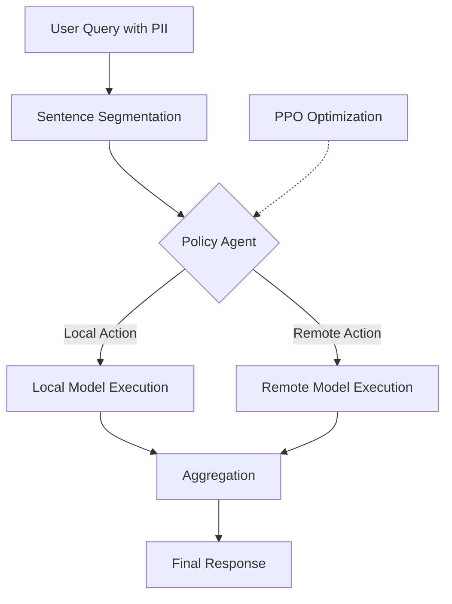

# Privacy-R1: Privacy-Aware Multi-LLM Agent Collaboration via Reinforcement Learning

**Conference**: ACL 2026  
**arXiv**: [2510.16054](https://arxiv.org/abs/2510.16054)  
**Code**: [GitHub](https://github.com/zackhuiiiii/Privacy-R1)  
**Area**: LLM Security / Privacy Protection / Multi-LLM Collaboration  
**Keywords**: Privacy Delegation, PII Leakage, Dynamic Routing, Reinforcement Learning, Multi-LLM Collaboration

## TL;DR
Privacy-R1 models the local/remote model delegation problem for privacy-sensitive queries as a sentence-by-sentence sequential decision task. By utilizing a lightweight Transformer policy and PPO, it learns a dynamic trade-off between privacy and task quality. On both PUPA and the high-PII density Med-PCD, it achieves a superior quality-leakage frontier compared to static rewriting methods.

## Background & Motivation

**Background**: Many practical LLM applications require choosing between a local small model and a remote powerful model. Remote models possess strong capabilities, but user prompts may contain Personal Identifiable Information (PII) such as names, hospitals, dates, and medical record numbers. Local models are more controllable but weaker, often leading to lower response quality.

**Limitations of Prior Work**: Existing Privacy-Conscious Delegation methods mostly employ static prompt rewriting, which generalizes or deletes PII in the entire user query before sending it to a remote model. This approach faces two issues: first, it disrupts coreference relations and discourse coherence; second, it may erase critical information required for the task, preventing the remote model from completing it successfully.

**Key Challenge**: Not all PII is of equal utility. Some identity information is merely a privacy burden that should remain local, while other information directly determines task semantics—complete masking of which causes utility collapse. Static rewriting cannot distinguish between these two types of information.

**Goal**: Train a lightweight policy agent to decide at the sub-prompt or sentence granularity which content should be processed by the local model and which can be delegated to the remote model, thereby controlling both privacy leakage and response quality.

**Key Insight**: The authors view the delegation process as sequential decision-making rather than a one-time text transformation. The policy model reads the context of the entire query and selects "local" or "remote" for each semantic chunk, optimized by both task success rewards and privacy leakage penalties.

**Core Idea**: Use RL to learn a dynamic routing policy that determines "when it is worth incurring a privacy cost," allowing the model to implicitly identify replaceable PII versus task-critical PII within context.

## Method

### Overall Architecture
The input to Privacy-R1 is a user query potentially containing PII, and the output is the final answer. The system first uses SpaCy for sentence segmentation to divide the query into semantically complete chunks. Then, a policy agent selects either a local or remote model for each chunk. The dispatched models generate intermediate outputs, which are finally integrated by the local model to produce the result. The process prioritizes identifying which model side information should reside on rather than complete anonymization.

### Key Designs

1.  **Semantic Chunk-level Dynamic Routing**:
    - **Function**: Transitions privacy delegation from whole-prompt rewriting to fine-grained, sentence-by-sentence routing.
    - **Mechanism**: Queries are split into sentence-level chunks, each assigned one of two actions: stay with a secure but weaker local model, or go to a powerful but untrusted remote model. This preserves the utility of non-sensitive or task-critical context while keeping high-risk information local.
    - **Design Motivation**: PII in medical or financial scenarios is often densely distributed with mutual references; whole-prompt rewriting easily severs critical chains. Sentence-level decisions allow for more natural local trade-offs regarding whether a specific sentence should be sent externally.

2.  **Lightweight Policy Agent with Global Context**:
    - **Function**: Enables routing decisions for each chunk to depend on the entire query rather than just the current sentence.
    - **Mechanism**: A frozen MiniLM extracts chunk embeddings, followed by positional encoding and a 2-layer Transformer encoder to obtain a contextualized representation $h_t$. Each $h_t$ passes through a shared linear layer and softmax to output local/remote probabilities.
    - **Design Motivation**: The task value of PII often depends on cross-sentence relationships. For example, a pronoun later in the text might point to a patient or location mentioned earlier; an MLP router without context cannot judge if an entity is indispensable for the final answer.

3.  **Non-linear Privacy Penalty and Two-stage Training**:
    - **Function**: Uses a reward function to explicitly express the competition between "quality gain" and "privacy risk."
    - **Mechanism**: The reward is defined as $R = TaskGain - \lambda \cdot PrivacyLeak^2$. TaskGain is determined via LLM-as-a-judge to see if the final answer matches the quality of the remote model using the full original query. PrivacyLeak is the proportion of PII sent to the remote model. Training begins with SFT warm-up using heuristic labels (PII chunks go local, non-PII chunks go remote), followed by PPO fine-tuning.
    - **Design Motivation**: Linear penalties might result in good average metrics while allowing massive leaks in a few samples. The quadratic term penalizes high-leakage samples more heavily, reducing the probability of catastrophic leaks.

### Loss & Training
During the SFT phase, the policy agent is trained as a binary classifier optimizing per-chunk BCE loss. In the RL phase, PPO is employed with the policy as the actor and a feed-forward value network as the critic. Episodic rewards are calculated after each full query rollout, and the policy is updated using advantages. Default parameters include $\lambda = 5.0$, SFT learning rate of $3 \times 10^{-4}$, PPO learning rate of $1 \times 10^{-5}$, and a maximum of 256 steps. Experiments were conducted on H200 GPUs.

## Key Experimental Results

### Main Results
The authors evaluated Quality Preservation and Privacy Leakage on PUPA-TNB and the self-constructed Med-PCD. The remote model was fixed as GPT-4o-mini, while local models ranged from 1B to 8B parameters.

| Local Model | Dataset | PAPILLON Quality / Leakage | Privacy-R1 Quality / Leakage | Gain over PAPILLON |
| :--- | :--- | :--- | :--- | :--- |
| Llama-3.2-1B | PUPA-TNB | 58.0 / 39.3 | 62.5 / 25.0 | Quality +4.5, Leakage -14.3 |
| Llama-3.2-1B | Med-PCD | 45.1 / 42.5 | 75.3 / 18.2 | Quality +30.2, Leakage -24.3 |
| Llama-3.2-3B | Med-PCD | 58.5 / 28.1 | 81.0 / 15.4 | Quality +22.5, Leakage -12.7 |
| Llama-3.1-8B | Med-PCD | 82.0 / 9.2 | 89.5 / 5.1 | Quality +7.5, Leakage -4.1 |
| Mistral-7B | Med-PCD | 74.5 / 14.0 | 87.9 / 9.5 | Quality +13.4, Leakage -4.5 |
| Qwen2-7B | Med-PCD | 76.2 / 18.5 | 88.4 / 12.0 | Quality +12.2, Leakage -6.5 |

### Ablation Study
Ablations focused on Med-PCD with the Qwen2-7B local model to verify state modeling and non-linear rewards.

| Configuration | Quality (%) ↑ | Leakage / Catastrophic Leaks ↓ | Explanation |
| :--- | :--- | :--- | :--- |
| Stateless Router (MLP) | 75.2 | Leakage 11.5 | Views chunks independently; lacks cross-sentence context. |
| Stateful Router | 88.4 | Leakage 12.0 | Transformer policy significantly improves quality. |
| Linear Penalty | 88.1 | Catastrophic Leaks 16.2 | Average quality similar, but many high-leakage samples. |
| Quadratic Penalty | 88.4 | Catastrophic Leaks 1.1 | Substantially reduces catastrophic leakage. |

### Key Findings
- Privacy-R1 outperforms PAPILLON across all local model settings, showing greater improvements on Med-PCD, indicating that high-PII density scenarios benefit more from dynamic policies.
- The weaker the local model, the more critical the routing policy; the 1B local model improved quality from 45.1% (PAPILLON) to 75.3% on Med-PCD.
- The improvement from the Stateful Transformer stems from modeling cross-sentence dependencies, which is particularly suited for managing coreferences and contextual constraints in medical narratives.
- The value of the quadratic privacy penalty lies not just in reducing average leakage, but in significantly mitigating the tail risk of "excessive leakage in a few samples."

## Highlights & Insights
- Explicitly modeling privacy delegation as a sequential decision is natural and avoids the static "rewrite then call" pipeline. this perspective is also extensible to model selection, cost control, and latency management.
- The construction of Med-PCD is highly targeted: starting from MedDialog, it injects synthetic PII to create 1,020 high-density medical privacy samples, with a 98.8% pass rate and 0.89 Fleiss' Kappa via human verification.
- $\lambda$ serves as a practical risk-appetite knob. It allows developers to choose conservative or aggressive strategies based on the sensitivity of the scenario.
- The paper honestly acknowledges that Privacy-R1 is a risk mitigation framework rather than a formal privacy guarantee, which is crucial for high-risk deployment judgments.

## Limitations & Future Work
- Current experiments are single-turn; the policy state is not maintained across multi-turn dialogues. In real medical or legal consultations, the cumulative privacy risk in multi-turn contexts is more complex.
- The action space is limited to one local and one remote model, not yet considering differences in capability, cost, latency, and privacy levels among multiple models.
- Med-PCD PII is synthetically injected; while validated, it may still differ from the distribution of privacy in real institutional texts.
- TaskGain relies on an LLM judge and may inherit its biases; if the target response itself contains unnecessary sensitive info, the reward would encourage the policy to replicate it.
- This method reduces leakage risks but does not guarantee zero leakage; rule-based constraints or formal security boundaries are still needed for scenarios where no external transmission is permitted.

## Related Work & Insights
- **vs PAPILLON**: PAPILLON statically rewrites the full query, whereas Privacy-R1 uses chunk-level dynamic routing; the former is secure but prone to semantic damage, while the latter preserves task-critical context.
- **vs NER/redaction systems**: Traditional NER only judges whether an entity is sensitive; Privacy-R1 further evaluates whether a sensitive entity is useful for the task.
- **vs Multi-model collaboration systems**: Common collaboration systems seek complementary capabilities; this work incorporates privacy costs into collaboration goals, providing a clear paradigm for "secure proxy schedulers."

## Rating
- Novelty: ⭐⭐⭐⭐ Transforming privacy delegation into an RL routing problem is inspiring, and the reward design fits the risk profile.
- Experimental Thoroughness: ⭐⭐⭐⭐ Two datasets, multiple local models, and complete ablations on state/reward/risk appetite, though multi-turn and multi-model action spaces are not covered.
- Writing Quality: ⭐⭐⭐⭐ Clear motivation and direct table organization; minor formatting inconsistencies in some formulas and naming.
- Value: ⭐⭐⭐⭐⭐ Highly practical reference for privacy trade-offs in hybrid local-cloud LLM systems.

<!-- RELATED:START -->

## Related Papers

- [\[AAAI 2026\] PRISM: Privacy-Aware Routing for Adaptive Cloud-Edge LLM Inference via Semantic Sketch Collaboration](../../AAAI2026/llm_safety/prism_privacy-aware_routing_for_adaptive_cloud-edge_llm_inference_via_semantic_s.md)
- [\[ACL 2026\] MemoPhishAgent: Memory-Augmented Multi-Modal LLM Agent for Phishing URL Detection](memophishagent_memory-augmented_multi-modal_llm_agent_for_phishing_url_detection.md)
- [\[ACL 2026\] Privacy Collapse: Benign Fine-Tuning Can Break Contextual Privacy in Language Models](privacy_collapse_benign_fine-tuning_can_break_contextual_privacy_in_language_mod.md)
- [\[ACL 2026\] Adaptive Text Anonymization: Learning Privacy-Utility Trade-offs via Prompt Optimization](adaptive_text_anonymization_learning_privacy-utility_trade-offs_via_prompt_optim.md)
- [\[ACL 2026\] SharedRequest: Privacy-Preserving Model-Agnostic Inference for Large Language Models](sharedrequest_privacy-preserving_model-agnostic_inference_for_large_language_mod.md)

<!-- RELATED:END -->
