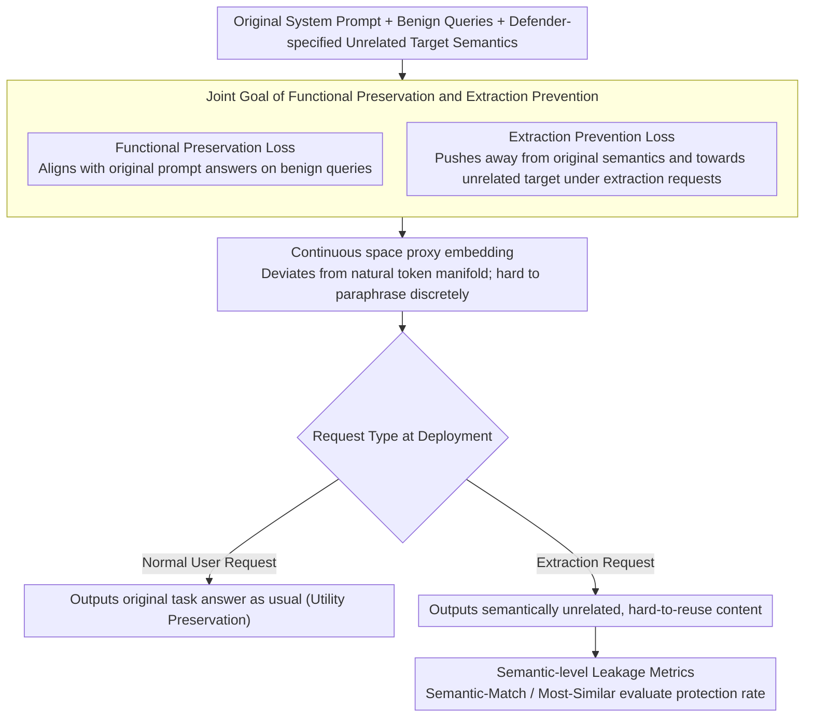

# ProxyPrompt: Securing System Prompts against Prompt Extraction Attacks

**Conference**: ACL 2026 Findings  
**arXiv**: [2505.11459](https://arxiv.org/abs/2505.11459)  
**Code**: [GitHub](https://github.com/boschresearch/proxyprompt)  
**Area**: LLM Security / Prompt Protection / System Prompt Privacy  
**Keywords**: System Prompt Protection, Prompt Extraction, Soft Prompt, Semantic Leakage Detection, LLM Security

## TL;DR
Instead of instructing the model "not to leak the system prompt," ProxyPrompt replaces the original prompt with a functionally equivalent but semantically obfuscated proxy prompt. This maintains task utility while ensuring that extracted prompts are difficult to use for replicating the original task, achieving a 94.70% protection rate across 264 configurations, significantly higher than filter-based and instruction-based defenses.

## Background & Motivation

**Background**: System prompts are core assets of many LLM applications, potentially containing task instructions, filtering criteria, business strategies, tool-calling rules, or domain expertise. Compared to fine-tuning, system prompts are cost-effective and iterate quickly, making them widely used in GPT Store, HuggingChat assistants, and various applications.

**Limitations of Prior Work**: System prompts are vulnerable to adversarial user prompts designed to extract them. Existing defenses generally fall into two categories: prompt-based methods, which instruct the model not to leak or provide fake prompts; and filter-based methods, which detect if the output has n-gram overlap with the original prompt. Neither is robust: the former relies on the model following system instructions, while the latter easily misses semantically equivalent paraphrases.

**Key Challenge**: Merely preventing output leakage is insufficient because if the model outputs content semantically equivalent to the original prompt, an attacker can still reuse the task rules. A more fundamental goal is to ensure that "even if the model outputs some kind of prompt," that content cannot recover the true semantics and task utility of the original system instruction.

**Goal**: Construct a proxy prompt that maintains original task performance on benign user requests but presents content semantically unrelated to the original prompt with low utility when extracted.

**Key Insight**: The authors utilize soft prompt / embedding-space optimization to replace the original system prompt with a proxy representation in continuous space. Under normal input, the proxy produces similar answers to the original prompt; in extraction scenarios, the proxy is optimized to lean towards an unrelated target semantic.

**Core Idea**: Shift prompt protection from "output filtering" to "semantic obfuscation of the protected object itself," and use semantic-level metrics to detect paraphrased leakage.

## Method

### Overall Architecture
ProxyPrompt assumes the defender has the original system prompt and access to the model's embedding layer. The defender first prepares a set of benign queries representing normal usage and distills the functionality of the original prompt into a proxy prompt embedding. Simultaneously, the optimization goal requires the model to output a fixed target with different semantics from the original prompt when asked to reveal system instructions. During deployment, the original system prompt is no longer placed in the context and is replaced by the proxy prompt embedding.

### Key Designs

**1. Joint Goal of Functional Preservation and Extraction Prevention: Making proxy useful for normal users but stripped of semantic value when extracted**

Simple soft prompt optimization only focuses on task utility, which might result in the proxy still carrying the original task intent that an attacker could reuse. ProxyPrompt decomposes the goal into two items within the same embedding-space optimization problem: the first minimizes the difference between the original and proxy prompt answers on a set of benign queries to ensure daily request performance; the second specifically targets extraction requests "asking to reveal system instructions," pushing the proxy away from the original semantics and toward a defender-specified unrelated target. Joint optimization ensures the proxy is a functional equivalent while actively deviating semantically during extraction.

**2. Continuous Space Proxy and Discrete Decoding Loss: Leveraging the gap between continuous representation and discrete tokens to naturally weaken reproducibility**

Traditional system prompts are human-readable text; once paraphrased, the entire set of task rules can be migrated directly. ProxyPrompt replaces the protected object with continuous embeddings that do not necessarily fall on the natural language token manifold. When the model attempts to "speak it out," it must undergo a lossy continuous-to-discrete mapping. Even if the extracted text hits some neighboring tokens, it loses significant task structure at this step, making it difficult to reconstruct the original functionality. In other words, protection comes not only from the optimization goal but also from the unreadability of the representation form itself.

**3. Semantic-level Leakage Metrics: Catching paraphrased leakage invisible to word-level overlap**

Evaluating security based only on string overlap like Exact-Match or Approx-Match overestimates filter-based defenses—a paraphrase with no shared n-grams can still leak actual task rules. The paper introduces two sentence-level semantic metrics: Semantic-Match (SM), which checks for the presence of sentences in the extracted content semantically substituted for the original prompt, and Most-Similar (MS), which measures the similarity of the closest segment. With semantic-level metrics, "saying it differently but with the same meaning" is counted as leakage, and security assessment is no longer deceived by string matching.

### Loss & Training
The training objective consists of two parts: the loss for maintaining answers on normal queries and the loss for converging toward an unrelated target semantic in extraction scenarios. In the experiments, 100 representative queries are used for each victim-task configuration, and the proxy with the lowest validation loss is selected from the validation split. This description focuses on high-level academic mechanisms and does not involve executable attack or bypass processes.

## Key Experimental Results

### Main Results
The experiments cover three victim LLMs (Phi-3.5-mini-instruct, Llama-3.1-8B-Instruct, Llama-3.1-70B-Instruct) and five task categories (GSM8K, Roles, CoLA, SST-2, QNLI), totaling 264 system prompt configurations.

| Defense Method | Task Utility | Approx-Match | Semantic-Match | Protection Conclusion |
|----------------|--------------|--------------|----------------|-----------------------|
| No Defense | UR ~ 1.00 | Mostly near 1.00 | Mostly near 1.00 | Original prompt is easily reproduced semantically |
| FILTER | Significant utility drop in some tasks (e.g., L-8B GSM8K UR 0.05) | Still significant leakage | 42.80% protection rate | String filtering harms utility and is unstable |
| FAKE / DIRECT / GUARD | UR mostly near 1.00 | Mostly still near 1.00 | Mostly still near 1.00 | Relies on model obedience or detectors; limited protection |
| OURS† | UR near 1.00 | AM mostly 0 | 81.06% protection rate | Single-target proxy helps, but inferior to full objective |
| ProxyPrompt | UR mostly 0.94-1.01 | AM=0 for all tasks/models | Only 14/264 configs leaked SM | 94.70% prompt protection |

### Ablation Study

| Analysis Item | Key Metric | Explanation |
|---------------|------------|-------------|
| L-70B + ProxyPrompt | SM=0 for GSM8K/Roles/CoLA/QNLI; SM=0.25 for SST-2 | Maintains low semantic leakage on large models |
| L-8B + ProxyPrompt | SM=0 for GSM8K/Roles; SM=0.05-0.10 for others | Classification tasks may still leak high-level task intent |
| P-3.8B + ProxyPrompt | SM=0 for most; SM=0.25 for SST-2 | Small models also benefit |
| Continuous-to-discrete gap | Avg cosine similarity between proxy and nearest token: ~0.11-0.12 | Proxy is far from natural manifold; extracted utility drops |
| HuggingChat Case | UR 1.00, AM 0, SM 0, MS 0.45 | Protects sensitive instructions in real assistant-style prompts |

### Key Findings
- ProxyPrompt achieves AM=0 across all tasks and models, but more importantly, SM is significantly reduced, showing it does not just evade string matching.
- Successful leakage occurs mainly in classification tasks and usually involves high-level task intent rather than detailed system rules; this represents semantics that may be necessary to retain for task utility.
- Filter-based methods sacrifice utility heavily in some tasks, indicating that output-layer filtering struggles to balance security and usability.
- Low AM and SM are maintained even with fewer representative queries; increasing the number of queries primarily improves UR stability.
- ProxyPrompt can be concatenated with non-sensitive prompts, allowing protection of only sensitive parts while retaining flexibility to extend system functionality.

## Highlights & Insights
- The research direction is clever: instead of trying to make the model keep a secret, it makes the secret itself an unreadable, hard-to-reuse continuous representation.
- Semantic-level leakage metrics are a necessary supplement. Security evaluations using only n-grams overestimate filter-based defenses and are insensitive to paraphrased leakage.
- The combination of a 94.70% protection rate and UR near 1.0 shows that embedding-space prompt protection has practical potential for open-source models.
- The paper clearly distinguishes between "leaking the original text" and "leaking reusable task functionality." The latter more accurately reflects the real risk of system prompts as intellectual property.

## Limitations & Future Work
- ProxyPrompt requires access to internal model embeddings, so it cannot be directly used by application developers for closed-source models that only provide APIs, unless the provider offers such an interface.
- The set of representative queries affects utility preservation; if the distribution of normal usage changes significantly, the proxy may need re-optimization.
- High-level task intent must sometimes be preserved to maintain utility, leading to occasional limited semantic leakage in classification tasks.
- The method does not constitute a formal security proof; adaptive adversaries, model updates, and more complex system prompt combinations still require ongoing evaluation.
- Soft prompts have low interpretability, making debugging and auditing more difficult than natural language prompts.

## Related Work & Insights
- **vs prompt-based defense**: Instructing the model not to leak is fragile; ProxyPrompt does not rely on the model obeying natural language prohibitions under adversarial input.
- **vs filter-based defense**: Filters focus on output, whereas ProxyPrompt protects the system prompt representation itself; semantic metrics can also detect paraphrased leakage missed by filters.
- **vs soft prompt tuning**: Traditional soft prompting pursues task performance; ProxyPrompt adds a semantic obfuscation goal for extraction scenarios, repurposing soft prompting for security.

## Rating
- Novelty: ⭐⭐⭐⭐⭐ Using proxy soft prompts to protect system prompts is a very novel perspective that captures the asset nature of system prompts.
- Experimental Thoroughness: ⭐⭐⭐⭐ 264 configurations across multiple models and tasks, plus real assistant and ALFWorld cases; experiments on closed-source API scenarios are still missing.
- Writing Quality: ⭐⭐⭐⭐ Threat models, metrics, and experimental organization are clear; security boundaries are well-explained.
- Value: ⭐⭐⭐⭐ Highly valuable for open-source models and platform-level prompt protection, though deployment depends on internal model access.

<!-- RELATED:START -->

## Related Papers

- [\[ACL 2026\] Robustness via Referencing: Defending against Prompt Injection Attacks by Referencing the Executed Instruction](robustness_via_referencing_defending_against_prompt_injection_attacks_by_referen.md)
- [\[ACL 2026\] Know Thy Enemy: Securing LLMs Against Prompt Injection via Diverse Data Synthesis and Instruction-Level Chain-of-Thought Learning](know_thy_enemy_securing_llms_against_prompt_injection_via_diverse_data_synthesis.md)
- [\[ACL 2026\] PARASITE: Conditional System Prompt Poisoning to Hijack LLMs](parasite_conditional_system_prompt_poisoning_to_hijack_llms.md)
- [\[ACL 2025\] TIP of the Iceberg: Task-in-Prompt Adversarial Attacks on LLMs](../../ACL2025/llm_safety/tip_iceberg_adversarial_attacks.md)
- [\[ACL 2026\] ATAAT: Adaptive Threat-Aware Adversarial Tuning Framework against Backdoor Attacks on Vision-Language-Action Models](ataat_adaptive_threat-aware_adversarial_tuning_framework_against_backdoor_attack.md)

<!-- RELATED:END -->
