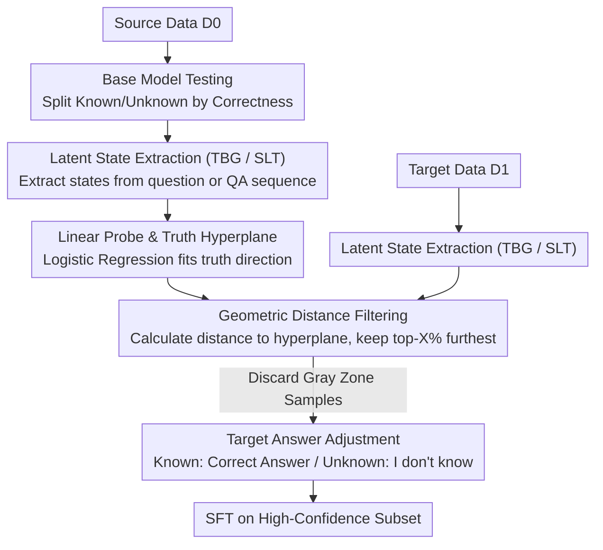

# Purging the Gray Zone: Latent-Geometric Denoising for Precise Knowledge Boundary Awareness

**Conference**: ACL 2026 Findings  
**arXiv**: [2604.14324](https://arxiv.org/abs/2604.14324)  
**Code**: [GitHub](https://github.com/Notbesidemoon/GeoDe)  
**Area**: Image Restoration  
**Keywords**: Knowledge boundary awareness, abstention fine-tuning, latent space probe, geometric denoising, hallucination mitigation

## TL;DR
This paper proposes the GeoDe framework, which constructs a truth hyperplane by training linear probes in the LLM latent space. Using the geometric distance from samples to the hyperplane as a confidence signal, it filters high-quality abstention fine-tuning data, effectively eliminating "gray zone" noise near decision boundaries to significantly enhance model truthfulness and reliability.

## Background & Motivation

**Background**: LLMs frequently generate hallucinations (factually inaccurate responses). A practical mitigation method is abstention fine-tuning: training the model to provide correct answers for known questions and respond with "I don't know" for unknown ones.

**Limitations of Prior Work**: Existing abstention fine-tuning methods (e.g., R-Tuning) partition data into "known" and "unknown" sets based on response correctness. However, this accuracy-based partitioning introduces significant label noise—including "lucky guesses" (internal uncertainty but correct by chance) and "formatting failures" (internal knowledge but incorrect output format).

**Key Challenge**: A "gray zone" exists near the decision boundary in the latent space, where representations of known and unknown samples overlap heavily and internal beliefs are ambiguous. Forcing positive/negative labels in this region leads the model to learn contradictory decision rules, resulting in over-refusal or persistent hallucinations.

**Goal**: Design a data filtering method based on internal model representations to discard noisy samples near the decision boundary, retaining only high-confidence data for fine-tuning.

**Key Insight**: The linear representation hypothesis suggests a "truthfulness direction" exists in the LLM latent space, which can be captured by a truth hyperplane via linear probes. Samples far from the hyperplane have high confidence and reliable labels, while those nearby reside in the ambiguous region.

**Core Idea**: Replace hard partitioning based on response accuracy with geometric distance. Filter out gray zone samples using a distance threshold and perform abstention fine-tuning only on high-confidence subsets.

## Method

### Overall Architecture
GeoDe consists of three steps: (1) Testing the base model on source data $D0$, partitioning it into known $D0_{ik}$ and unknown $D0_{idk}$ sets by correctness to train a linear probe; (2) Calculating the geometric distance of each sample in target data $D1$ to the probe hyperplane, selecting the top-X% furthest samples; (3) Adjusting target answers (retaining correct answers for known and replacing with "I don't know" for unknown) and performing Supervised Fine-Tuning (SFT) on the filtered subset. The overall structure follows a "D0 trains probe, D1 is filtered" branch-and-merge approach.

### Key Designs

**1. Linear Probe and Truth Hyperplane: Defining the "Known/Unknown" boundary via internal representations instead of noisy responses**

The primary difficulty in abstention fine-tuning is label noise—partitioning by correctness includes "lucky guesses" and "formatting failures." GeoDe searches for a more reliable truthfulness signal in the LLM latent space: extracting the hidden state $\mathbf{x} = f_{LLM}(q)$ and training a logistic regression probe $f_{probe}(\mathbf{x}) = \sigma(\mathbf{w}^\top \mathbf{x} + b)$ using correctness as a binary label. The weight $\mathbf{w}$ and bias $b$ define a truth hyperplane. This relies on the linear representation hypothesis—LLMs possess a linearly separable "truthfulness direction," making a simple linear probe efficient and capable of directly reading internal judgments without being misled by external response noise.

**2. Geometric Denoising: Using distance to the hyperplane as confidence to purge the "Gray Zone"**

The area near the hyperplane is a fuzzy zone where known and unknown representations overlap most heavily and label noise is densest. Hard assignments here teach contradictory rules. GeoDe calculates a signed distance for each sample:

$$d(\mathbf{x}) = \frac{|\mathbf{w}^\top \mathbf{x} + b|}{\|\mathbf{w}\|_2}$$

Larger distances indicate firmer internal beliefs. By setting a threshold $\theta$ at the X-th percentile (default X=25%), only samples with $|d(\mathbf{x})| > \theta$ are retained, where $d(\mathbf{x}) > 0$ is classified as known and $d(\mathbf{x}) < 0$ as unknown. Removing boundary samples leaves high-fidelity training signals, replacing hard correctness partitioning with a soft geometric metric.

**3. Dual Latent State Extraction (TBG and SLT): Complementary routes for feature acquisition**

Probe effectiveness depends on the input latent states. TBG (Token Before Generation) inputs the question and takes the last token's hidden state, which is faster as it bypasses generation. SLT (Second Last Token) allows the model to generate an answer, then re-inputs the concatenated question-answer sequence to take the second-to-last token's state, capturing the full context. TBG offers speed while SLT provides richer signals (answer info often improves probe accuracy); both are shown to be effective in different scenarios.

### Loss & Training
Supervised fine-tuning is performed on the filtered subset using standard cross-entropy loss. Known samples use the correct answer as the target, while target answers for unknown samples are replaced with "I don't know." The AdamW optimizer is used with a learning rate of 1e-5, batch size of 16, for 3 epochs. The probe is a logistic regression model with L2 regularization.

## Key Experimental Results

### Main Results

| Method | TriviaQA F1_rel | NQ F1_rel | SciQ F1_rel | SimpleQA F1_rel |
|------|----------------|-----------|-------------|-----------------|
| R-Tuning | 74.4 | 58.7 | 63.5 | 25.4 |
| Probe-Tuning TBG | 75.7 | 62.5 | 64.5 | 22.6 |
| **GeoDe TBG** | **77.1** | **64.0** | **68.3** | **30.7** |
| Probe-Tuning SLT | 73.4 | 56.9 | 66.1 | 30.9 |
| **GeoDe SLT** | **77.0** | **64.9** | **68.9** | **34.9** |

### Ablation Study

| Configuration | TriviaQA F1_rel | Description |
|------|----------------|------|
| R-Tuning (baseline) | 74.4 | No probe, no filtering |
| R-Tuning-01 (strict) | 75.1 | Multi-sample filtering for ambiguity |
| Probe-Tuning | 75.7 | Probe prediction instead of accuracy split |
| GeoDe (X=25%) | **77.1** | Probe + Distance filtering |

### Key Findings
- GeoDe outperforms baselines across all four datasets, particularly in OOD scenarios (NQ, SciQ, SimpleQA), suggesting geometric denoising enhances generalization.
- The SLT variant generally outperforms TBG, especially on SimpleQA (34.9 vs 30.7), indicating answer information aids probe performance.
- A filtering ratio of X=25% is optimal; too many samples introduce noise, while too few cause data scarcity.
- GeoDe improves both F1_ans (helpfulness) and F1_abs (truthfulness), breaking the typical trade-off between the two.

## Highlights & Insights
- The "Gray Zone" concept is intuitive and powerful: latent space visualization clearly demonstrates label noise near decision boundaries, providing a geometric explanation for the struggles of abstention fine-tuning.
- The method is remarkably simple—requiring only a logistic regression probe and a distance threshold to significantly improve fine-tuning quality. This "less is more" data filtering approach is broadly applicable to other fine-tuning scenarios requiring high-quality data.
- Geometric distance serves as a more stable and computationally efficient confidence proxy compared to uncertainty measures like semantic entropy.

## Limitations & Future Work
- Probe training depends on an independent source dataset $D0$, which must be distributionally similar to target data.
- Dependence on linear probes may lack expressive power for more complex knowledge boundaries.
- Discarding up to 75% of data may be unsuitable for data-scarce settings.
- Evaluations are limited to open-domain QA; effects on other tasks (e.g., summarization, translation) are unverified.
- Future work could explore non-linear probes, adaptive threshold selection, and curriculum learning to gradually introduce boundary samples.

## Related Work & Insights
- **vs R-Tuning**: R-Tuning partitions data solely by response accuracy without considering internal confidence. GeoDe introduces geometric distance filtering to eliminate gray zone noise.
- **vs Probe-Tuning**: Probe-Tuning uses probe predictions instead of accuracy labels but still uses the entire dataset for training. GeoDe adds distance filtering to retain only high-confidence samples.

## Rating
- Novelty: ⭐⭐⭐⭐ The Gray Zone concept and geometric denoising are innovative, though linear probing has existing precedents.
- Experimental Thoroughness: ⭐⭐⭐⭐ Four datasets, two models, multiple baselines, and detailed ablations.
- Writing Quality: ⭐⭐⭐⭐⭐ Visualizations are clear and intuitive; the narrative is coherent.
- Value: ⭐⭐⭐⭐ Simple and practical method with clear guidance for the abstention fine-tuning community.

<!-- RELATED:START -->

## Related Papers

- [\[ACL 2026\] Into the Gray Zone: Domain Contexts Can Blur LLM Safety Boundaries](into_the_gray_zone_domain_contexts_can_blur_llm_safety_boundaries.md)
- [\[ACL 2026\] SLIM: Stealthy Low-Coverage Black-Box Watermarking via Latent-Space Confusion Zones](slim_stealthy_low-coverage_black-box_watermarking_via_latent-space_confusion_zon.md)
- [\[ACL 2026\] CURaTE: Continual Unlearning in Real Time with Ensured Preservation of LLM Knowledge](curate_continual_unlearning_in_real_time_with_ensured_preservation_of_llm_knowle.md)
- [\[ICLR 2026\] Obfuscated Activations Bypass LLM Latent-Space Defenses](../../ICLR2026/llm_safety/obfuscated_activations_bypass_llm_latent-space_defenses.md)
- [\[ACL 2026\] Knowledge Poisoning Attacks on Medical Multi-Modal Retrieval-Augmented Generation](knowledge_poisoning_attacks_on_medical_multi-modal_retrieval-augmented_generatio.md)

<!-- RELATED:END -->
