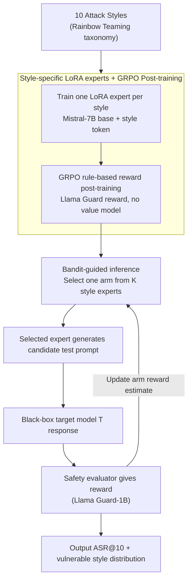

# Red-Bandit: Test-Time Adaptation for LLM Red-Teaming via Bandit-Guided LoRA Experts

**Conference**: ACL2026  
**arXiv**: [2510.07239](https://arxiv.org/abs/2510.07239)  
**Code**: Not provided in cache  
**Area**: LLM Safety / Automated Red-Teaming / Test-time Adaptation  
**Keywords**: LLM Red-Teaming, Multi-Armed Bandit, LoRA Experts, GRPO, Safety Evaluation  

## TL;DR
Red-Bandit models automated LLM red-teaming as an online adaptation problem involving "multiple attack-style LoRA experts + test-time bandit routing." It demonstrates the effectiveness of style-level adaptive red-teaming with higher ASR@10 and lower perplexity across several open-source and closed-source target models.

## Background & Motivation
**Background**: Red-teaming is typically required for LLM deployment to identify safety vulnerabilities. Existing automated methods include prompt optimization based on gradients or log-probs, black-box iterative search, genetic or fuzzing-style mutations, and RL-trained attack generators.

**Limitations of Prior Work**: Offline prompt optimization relies on source model or gray-box information and fails to adjust strategies in real-time for closed-source targets. Black-box iterative search can adapt to targets but incurs high query costs. RL generators produce more readable text but are prone to mode collapse on limited styles.

**Key Challenge**: Red-teaming methods must cover diverse risk styles while quickly identifying the most vulnerable style for a specific target during testing. A single unified generator struggles to simultaneously maintain style diversity, readability, and online adaptation capabilities.

**Goal**: Train a set of lightweight LoRA style experts and use a multi-armed bandit to dynamically select among them during inference to discover style-level weaknesses of target models within a limited query budget.

**Key Insight**: Different attack styles are treated as bandit arms. Each selection of a LoRA expert generates a test prompt, and the reward estimate for that arm is updated based on the safety evaluation of the target model's response.

**Core Idea**: Transform red-teaming generation from "one model learning all styles at once" to "parallel training of multiple style experts with bandit-based selection of the most effective expert during testing," making the exploration-exploitation trade-off explicit.

## Method
Red-Bandit is divided into training and inference phases. During training, the system trains a LoRA attacker expert for each attack style. During inference, the target model is fixed as a black box, and a bandit policy selects the next style expert based on external safety rewards. This note discusses the framework and evaluation without reproducing specific attack samples.

### Overall Architecture
Given a target LLM $\mathcal{T}$ and a prompt space $\mathcal{P}$, the goal of automated red-teaming is to find test prompts that expose unsafe responses. Red-Bandit does not directly search in the token space; instead, it selects from a set of style experts $\mathcal{A}=\{1,\dots,K\}$. Each arm corresponds to a LoRA expert, such as role-playing, technical jargon, hypothetical scenarios, or emotional manipulation styles. Once an arm is selected, the corresponding expert generates a candidate test prompt. The target model responds, and a safety evaluator provides a binary or scalar reward, which the bandit uses to update its strategy.

### Key Designs
**1. Style-specific LoRA experts: Offloading "diversity" to specialized experts**

Expecting a single uniform generator to master all attack styles simultaneously often results in a "mixed yet monotonous" distribution with compromised diversity and readability. Red-Bandit adopts a division of labor: using Mistral-7B as a base, it trains one LoRA adapter for each of the 10 style categories defined by Rainbow Teaming. Each expert receives an input with a style token and uses in-context conditioning to generate safety test prompts for that specific style. This significantly reduces the learning difficulty for each expert and provides scalability—adding a new style or domain only requires training one adapter rather than retraining the entire generator.

**2. GRPO post-training and rule rewards: Training experts to trigger safety evaluations more efficiently**

Simply generating style-consistent text is insufficient; experts must produce candidates that trigger safety evaluations. The authors use a GRPO variant for post-training: they do not train a separate value model but instead construct the advantage $\hat{A}$ using the group reward mean. The loss is the clipped policy-gradient:

$$\mathcal{L}_\theta = -\mathbb{E}\big[\min(r_\theta \hat{A},\ \mathrm{clip}(r_\theta, 1-\epsilon, 1+\epsilon)\hat{A})\big]$$

where $r_\theta$ is the ratio of new to old policy probabilities. Compared to PPO, omitting the value model fits the cost budget of lightweight LoRA training. Training rewards are derived from rule-based safety models (Llama Guard) judging the prompt itself, avoiding frequent queries to target models during training.

**3. Bandit-guided inference: Test-time online exploration-exploitation**

Different target models have different vulnerable styles; a static strategy wastes query budget. Red-Bandit treats each style expert as a bandit arm. During inference, an arm is selected to generate a prompt. The target's response is assessed by a safety evaluator to provide a reward, which updates the reward estimate for that arm. The paper evaluates $\epsilon$-greedy and UCB strategies—the former maintains a fixed ratio of random exploration, while the latter uses an optimistic upper confidence bound to encourage trying under-explored arms. This online selection increases ASR@10 and provides a diagnostic signal by revealing which styles the target model is most susceptible to.

### Loss & Training
Training uses Mistral-7B as the prompt generator base and Llama Guard-8B as the training reward model. A Llama Guard-1B model is used in the bandit to evaluate target responses during inference. Each style expert is trained for 1 epoch, generating 8 candidates per step using LoRA parameter-efficient fine-tuning. Inference strategies include $\epsilon$-greedy ($\epsilon=0.1$) and UCB ($c=\sqrt{2}$).

## Key Experimental Results

### Main Results
| Dataset / Target | Metric | Red-Bandit | Strong Baseline | Remarks |
|---------------|------|------------|--------|------|
| AdvBench / Mistral-7B | ASR@10 | 100.0% | Atoxia 99.2% | UCB PPL 2.31, lower than Atoxia 54.42 |
| AdvBench / Vicuna-7B | ASR@10 | 100.0% | Atoxia 92.3% | $\epsilon$-greedy PPL 1.85 |
| AdvBench / Llama2-7B | ASR@10 | 99.0% UCB / 96.2% $\epsilon$-greedy | AdvPrompter-warmstart 46.1% / Atoxia 41.4% | Significant gain on safer models |
| GPT-4o Black-box | ASR@10 | 93.3% UCB | Atoxia 82.4% | Test-time adaptation outperforms transfer methods |
| GPT-3.5-turbo Black-box | ASR@10 | 98.1% UCB | Atoxia 92.7% | Atoxia higher on single ASR@1 |

### Ablation Study
| Target Model | Configuration | ASR@1 | Hnorm | PPL |
|----------|------|-------|-------|-----|
| Llama3.1-8B | Baseline, no RL / no Bandit | 38.5 | 0.98 | 2.45 |
| Llama3.1-8B | Red-Bandit, no RL | 50.9 | 0.65 | 2.22 |
| Llama3.1-8B | Red-Bandit, no Bandit | 55.8 | 0.98 | 2.65 |
| Llama3.1-8B | RL + Bandit | 58.7 | 0.67 | 2.62 |

### Key Findings
- Red-Bandit's advantage is primarily reflected in ASR@10 / ASR@20 under multi-attempt budgets; for strict ASR@1, Atoxia remains stronger on some targets.
- UCB is more suitable for multi-attempt budgets as it maintains balanced exploration; $\epsilon$-greedy leans more toward exploitation in single- or few-attempt settings.
- Style distributions clarify model weaknesses: different targets are hit by different styles, making Red-Bandit both an attack tool and a diagnostic tool.

## Highlights & Insights
- The most interesting aspect is elevating prompt attacks from token-level search to style-level routing. This is both more efficient and provides diagnostic results on "which style is effective."
- Multiple LoRA experts offer more modularity than a single RL generator. Adding new styles or domains only requires training an adapter rather than retraining the full generator.
- The paper uses independent metrics for evaluation: training rewards come from Llama Guard, AdvBench uses keyword matching, and HarmBench uses HarmBench-cls. This reduces concerns about overfitting to a single reward model.

## Limitations & Future Work
- The method requires an external rule-based safety evaluator during inference, increasing overhead compared to offline transferred prompts.
- Each style requires separate LoRA post-training; the total training complexity increases with the number of styles.
- When query budgets are strictly limited, the bandit may not have enough time to identify the optimal arm, potentially performing worse than static or transfer methods.
- The method could be misused; its practical value is best suited for controlled safety evaluations, pre-launch auditing, and defense diagnostics. Future work should integrate access control and responsible disclosure mechanisms.

## Related Work & Insights
- **vs GCG / AutoDAN**: These methods focus on token or prompt-level optimization, relying on gradients, log-probs, or search; Red-Bandit performs adaptive style-level routing on black-box targets.
- **vs AdvPrompter / Atoxia**: These RL or auxiliary generation methods produce readable prompts, but their strategies are mostly trained offline; Red-Bandit updates style selection based on target responses at test-time.
- **vs PAIR / TAP**: Iterative black-box search adapts to targets but has high query overhead; Red-Bandit uses pre-trained experts to reduce the generation cost per search.
- **Insight**: Safety evaluation tools should output "vulnerable style distributions" in addition to "success rates" to facilitate subsequent defense and behavioral analysis.

## Rating
- Novelty: ⭐⭐⭐⭐☆ The combination of style experts and bandits is simple yet powerful, representing a clear system innovation.
- Experimental Thoroughness: ⭐⭐⭐⭐☆ Coverage includes AdvBench, HarmBench, and both open/closed-source targets; defense-side analysis and real red-teaming workflow costs could be further explored.
- Writing Quality: ⭐⭐⭐⭐☆ Method and experimental tables are clear, though discussion of safety risks could be more localized and systematic.
- Value: ⭐⭐⭐⭐☆ Valuable for automated safety evaluation and diagnostics, but application must be strictly limited to authorized red-teaming and defense auditing scenarios.

<!-- RELATED:START -->

## Related Papers

- [\[ACL 2026\] STAR-Teaming: A Strategy-Response Multiplex Network Approach to Automated LLM Red Teaming](star-teaming_a_strategy-response_multiplex_network_approach_to_automated_llm_red.md)
- [\[ICML 2026\] Stable-GFlowNet: Toward Diverse and Robust LLM Red-Teaming via Contrastive Trajectory Balance](../../ICML2026/llm_safety/stable-gflownet_toward_diverse_and_robust_llm_red-teaming_via_contrastive_trajec.md)
- [\[ICLR 2026\] Tree-based Dialogue Reinforced Policy Optimization for Red-Teaming Attacks (DialTree)](../../ICLR2026/llm_safety/tree-based_dialogue_reinforced_policy_optimization_for_red-teaming_attacks.md)
- [\[ICML 2026\] FoeGlass: Simple In-Context Learning Is Enough for Red Teaming Audio Deepfake Detectors](../../ICML2026/llm_safety/foeglass_simple_in-context_learning_is_enough_for_red_teaming_audio_deepfake_det.md)
- [\[NeurIPS 2025\] Buffer Layers for Test-Time Adaptation](../../NeurIPS2025/llm_safety/buffer_layers_for_test-time_adaptation.md)

<!-- RELATED:END -->
